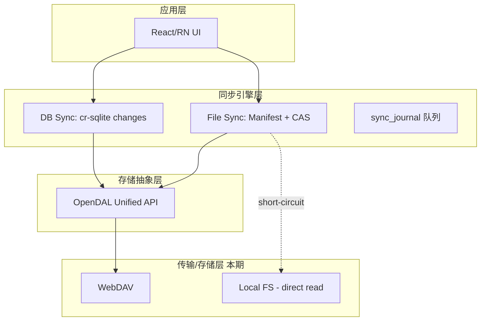

# MyReader 同步技术选型方案（去除 SMB）

## 一、最终选型


| 层         | 技术                                                                                                                             | 许可         | 理由                                                                       |
| --------- | ------------------------------------------------------------------------------------------------------------------------------ | ---------- | ------------------------------------------------------------------------ |
| 存储抽象      | **Apache OpenDAL**                                                                                                             | Apache-2.0 | 一套 API 本期启用 `services-webdav` + `services-fs` 两 feature；未来再加 S3/OneDrive |
| DB 同步     | **cr-sqlite** (vlcn.io)                                                                                                        | Apache-2.0 | SQLite 扩展 CRDT，离线双向合并，无中心服务器                                             |
| 桌面 SQLite | `tauri-plugin-sql` 加载 cr-sqlite 扩展                                                                                             | Apache-2.0 | —                                                                        |
| 移动 SQLite | **op-sqlite** (margelo)                                                                                                        | MIT        | 支持 loadable extension，替代 `expo-sqlite`                                   |
| 哈希        | **blake3**                                                                                                                     | Apache/MIT | 快、强                                                                      |
| 文件监听（桌面）  | **notify-rs**                                                                                                                  | MIT        | —                                                                        |
| 桌面凭据      | `**keyring` crate**（已在用，见 [my-reader/src-tauri/src/commands.rs](my-reader/src-tauri/src/commands.rs) `WEBDAV_KEYRING_SERVICE`） | Apache/MIT | 复用现有，不引入 stronghold                                                      |
| 移动凭据      | `expo-secure-store`                                                                                                            | MIT        | —                                                                        |
| 传输        | `reqwest` (Rust) / `fetch` + `expo-file-system` (RN)                                                                           | —          | 走 OpenDAL / webdav-js 内部实现                                               |


## 二、分层架构




> 注：S3 / OneDrive / Calibre 远端镜像在 OpenDAL 抽象内预留接口，本期不启用。

## 三、数据库同步

### MyReader DB（两个情况都适用）

- **表模型**：将现有 MyReader 业务表用 `SELECT crsql_as_crr('<table>')` 转为 CRR
- **推**：定时 / 手动 `SELECT * FROM crsql_changes WHERE db_version > ?` 序列化为 `changes/<device_id>/<seq>.bin` → OpenDAL 上传
- **拉**：列 `changes/` 下其他 device 目录 → 拉新文件 → `INSERT INTO crsql_changes` apply
- **并发冲突**：CRDT 自动合并（column-level LWW）

### Calibre metadata.db（情况 1）

- **本期仅支持本地直读**：沿用 [my-reader/src-tauri/src/calibre.rs](my-reader/src-tauri/src/calibre.rs) 的直读路径
- 若数据源为 WebDAV 上 Calibre 库：本期作为"普通文件"通过 Manifest 按需下载 `metadata.db`（整文件拉取，无 delta 优化）；按需读；不做 fast_rsync delta
- 远端 Calibre 的 delta 镜像、HTTP 专属 Calibre server 等延后

## 四、文件同步

### Manifest 结构（云端 `.myreader/manifest.json`）

```jsonc
{
  "version": 1,
  "updated_at": 1730000000,
  "device": "<uuid>",
  "entries": [
    {
      "path": "books/123/book.epub",
      "size": 8123456,
      "blake3": "ab12...",
      "mtime": 1729999000,
      "required": false,      // 封面=true，书/媒体=false
      "source_of_truth": "cloud"
    }
  ]
}
```

### 本地状态表（各端私有 sqlite 表 `file_state`）

```sql
CREATE TABLE file_state (
  path        TEXT PRIMARY KEY,
  local_state TEXT NOT NULL,  -- 'remote_only' | 'present' | 'local_only' | 'dirty_push'
  local_blake3 TEXT,
  local_size  INTEGER,
  local_mtime INTEGER
);
```

### 行为矩阵

下表适用于**远端 backend**（WebDAV/S3/OneDrive/HTTP）。**本地直读（LocalDirect）**见第十三节，所有"推送/拉取"项均为 no-op，仅保留 list/stat/delete。


| 对象                  | required | 推送策略      | 拉取策略          | 删除 UI                                 |
| ------------------- | -------- | --------- | ------------- | ------------------------------------- |
| Calibre metadata.db | true     | — (只读)    | 全量镜像          | 系统管理                                  |
| Calibre 封面          | true     | — (只读)    | 全量镜像          | "清理全部封面缓存"                            |
| Calibre 图书文件        | false    | — (只读)    | **用户点击下载整文件** | `evictLocal`；`deleteEverywhere` 需二次确认 |
| MyReader DB         | —        | cr-sqlite | cr-sqlite     | 不暴露                                   |
| MyReader 封面         | true     | 生成即推      | 全量镜像          | 同上                                    |
| MyReader 图书/媒体      | false    | 生成即推      | **用户点击下载整文件** | `evictLocal` + `deleteEverywhere`     |


## 五、同步引擎对外 API

```ts
interface SyncEngine {
  // 文件
  download(path: string, onProgress?: (p: number) => void): Promise<void>  // 整文件
  evictLocal(path: string): Promise<void>                                   // 仅删本地
  deleteEverywhere(path: string): Promise<void>                             // 本地+云+manifest
  stat(path: string): Promise<FileEntry>
  list(prefix: string, filter?: StateFilter): Promise<FileEntry[]>
  pushLocal(path: string): Promise<void>                                    // 上传 dirty_push

  // DB
  pushDbChanges(): Promise<void>
  pullDbChanges(): Promise<void>

  // 后端
  registerBackend(cfg: BackendConfig): Promise<void>  // 本期：WebDAV | LocalDirect
  testBackend(cfg: BackendConfig): Promise<void>

  // 事件
  on(event: 'progress'|'state-changed'|'error', cb): void
}
```

## 六、代码落地位置

### 桌面 Tauri (`my-reader/src-tauri/`)

新增 crate 模块：

- `my-reader/src-tauri/src/sync/mod.rs` - 引擎入口
- `my-reader/src-tauri/src/sync/backend.rs` - OpenDAL 封装 + `BackendConfig` 枚举
- `my-reader/src-tauri/src/sync/manifest.rs` - Manifest 读写/diff
- `my-reader/src-tauri/src/sync/file_state.rs` - 本地三态表
- `my-reader/src-tauri/src/sync/db_sync.rs` - cr-sqlite changes 导入导出
- `my-reader/src-tauri/src/sync/journal.rs` - `sync_journal` 队列与重试
- `my-reader/src-tauri/src/sync/commands.rs` - `#[tauri::command]` 暴露给前端

修改 [my-reader/src-tauri/src/lib.rs](my-reader/src-tauri/src/lib.rs)：

- 加 `mod sync;`
- `invoke_handler!` 追加 sync commands
- 启动时加载 cr-sqlite 扩展到现有 SQLite 连接

前端 hook：

- `my-reader/src/hooks/sync/useFileSyncState.ts` - 订阅 `state-changed` 事件
- `my-reader/src/hooks/sync/useSyncActions.ts` - 封装 download/evict/delete
- `my-reader/src/components/library/DownloadButton.tsx` - 三态按钮（未下载/下载中/已下载）

### 移动 Expo RN (`my-reader-mobile/`)

新增模块：

- `my-reader-mobile/src/sync/backend.ts` - 后端抽象（本期 WebDAV 用 `webdav` npm；LocalDirect 用 `expo-file-system` + security-scoped bookmarks）
- `my-reader-mobile/src/sync/manifest.ts` - Manifest 处理
- `my-reader-mobile/src/sync/file-state.ts` - op-sqlite 管理本地状态
- `my-reader-mobile/src/sync/db-sync.ts` - cr-sqlite over op-sqlite
- `my-reader-mobile/src/sync/engine.ts` - 统一 API
- `my-reader-mobile/src/sync/hooks/useFileSync.ts` - React hook
- `my-reader-mobile/src/components/library/DownloadButton.tsx`

替换：[my-reader-mobile/package.json](my-reader-mobile/package.json) 的 `expo-sqlite` 改为 `@op-engineering/op-sqlite`（cr-sqlite 扩展需求）。现有 [my-reader-mobile/src/data/webdav.ts](my-reader-mobile/src/data/webdav.ts) 纳入新 backend 抽象。

## 七、凭据存储

桌面：复用现有 `**keyring` crate v3**。WebDAV 密码已存在 service `com.myreader.webdav`、account `webdav-password-<data_source_id>` 下（见 [my-reader/src-tauri/src/commands.rs](my-reader/src-tauri/src/commands.rs) 中 `WEBDAV_KEYRING_SERVICE`、`webdav_password_account`、`save_webdav_password`、`delete_webdav_password`）。

重构动作：把这些当前 `fn`（私有）迁到新文件 `my-reader/src-tauri/src/sync/credentials.rs` 并改为 `pub(crate)`，供新同步引擎与既有 commands 共同调用，避免重复实现与不一致。现有 commands 改为薄封装。

不引入 `tauri-plugin-stronghold`。

移动：复用 [my-reader-mobile/src/store/secure-credential-store.ts](my-reader-mobile/src/store/secure-credential-store.ts)（基于 `expo-secure-store`）。

## 八、调度与冲突

### 触发时机


| 事件     | 桌面                  | 移动                 |
| ------ | ------------------- | ------------------ |
| 启动     | pull DB + manifest  | pull DB + manifest |
| 文件变更   | `notify-rs` 触发 push | 无自动，应用前台 + 手动      |
| 用户点击下载 | `download(path)`    | `download(path)`   |
| 周期     | 5 min               | 进入前台时              |


### 冲突策略

- DB：cr-sqlite column-level LWW（自动）
- 文件：
  - `blake3` 相同 → 无操作
  - 两端都变（`dirty_push` + 云端新哈希）→ 保留本地为 `foo.epub.conflict-<device>-<ts>`，UI 红点提示
  - 仅单边变 → 按 LWW by mtime

## 九、分期实施

### 阶段 1：WebDAV + LocalDirect（MVP）

- OpenDAL 接入 Tauri（远端路径）
- `BackendKind::LocalDirect` 分支 + FS 快照替代 manifest
- `BackendConfig` / `registerBackend` / `testBackend`（含 LocalDirect 校验）
- cr-sqlite 加载 + MyReader 业务表 CRR 化（仅远端启用）
- DB push/pull 最小闭环
- Manifest 读写 + `file_state` 表（远端模式）
- 整文件 `download` / `evictLocal` / `deleteEverywhere`；LocalDirect 下 `download`/`evictLocal` 短路
- 桌面 UI：下载按钮 + 释放空间 + 删除确认；LocalDirect 时隐藏下载/释放按钮
- Calibre 本地直读沿用现有 [my-reader/src-tauri/src/calibre.rs](my-reader/src-tauri/src/calibre.rs) 路径，不走新引擎

### 阶段 2：移动端对齐

- `expo-sqlite` → `op-sqlite` 迁移（影响 [my-reader-mobile/src/data/cache.ts](my-reader-mobile/src/data/cache.ts) 等 SQLite 使用点）
- 移动端多后端 JS 客户端
- 移动端 UI 对齐桌面
- 前台触发的调度器

### 阶段 3：增强（本期内可选）

- 冲突文件 UI
- 断点续传（HTTP Range 用于恢复未完成下载）
- 后台队列重试指数退避

### 延后（不在本期）

- S3 / OneDrive backend（OpenDAL features 预留，需要时打开）
- OAuth2 PKCE 流程
- Calibre `metadata.db` fast_rsync delta 镜像
- HTTP-only Calibre server 特化路径

## 十、需移除/调整的既有代码

- [my-reader-mobile/src/data/webdav.ts](my-reader-mobile/src/data/webdav.ts) - 纳入新 backend 抽象
- [my-reader-mobile/src/store/data-source-store.ts](my-reader-mobile/src/store/data-source-store.ts) - `BackendConfig` 类型对齐
- [my-reader/src/stores/dataSourceStore.ts](my-reader/src/stores/dataSourceStore.ts) - 同上
- [my-reader-mobile/app/(tabs)/settings/webdav/[dataSourceId].tsx](my-reader-mobile/app/(tabs)/settings/webdav/[dataSourceId].tsx) - 扩展为通用"数据源配置"页

## 十一、关键风险与对策


| 风险                                | 对策                                          |
| --------------------------------- | ------------------------------------------- |
| cr-sqlite 扩展在 iOS 不能动态加载          | op-sqlite 支持静态链接 cr-sqlite；需自建 iOS pod      |
| WebDAV 服务器不支持 If-Match/ETag       | 降级为 LWW + 读回校验；manifest 以 blake3 为准         |
| Calibre metadata.db 大（WebDAV 远端时） | 本期整文件下载，用户手动触发；延后做 delta                    |
| 移动后台同步受限（iOS）                     | 前台触发 + 应用内"立即同步"按钮，不承诺后台                    |
| manifest 竞态（两端同时写）                | 写前 If-Match ETag；不支持时写临时文件 + 原子 move + 读回比对 |
| 桌面凭据跨主机迁移                         | keyring 为本机绑定，用户换机需重输密码（文档提示）               |


## 十二、依赖清单（新增）

### Rust [my-reader/src-tauri/Cargo.toml](my-reader/src-tauri/Cargo.toml) 新增

- `opendal = { version = "*", features = ["services-webdav", "services-fs"] }`
- `rusqlite` + cr-sqlite 动态库（若 `tauri-plugin-sql` 内已带 rusqlite 可复用）
- `blake3`
- `notify`

### Rust 复用（已存在）

- `keyring = "3"` — 凭据
- `reqwest` — OpenDAL webdav 依赖

### RN [my-reader-mobile/package.json](my-reader-mobile/package.json) 新增

- `@op-engineering/op-sqlite`（替换 `expo-sqlite`）
- `webdav`（若 [my-reader-mobile/src/data/webdav.ts](my-reader-mobile/src/data/webdav.ts) 已用则复用）
- `@noble/hashes`（blake3 JS 实现）
- `expo-file-system`（已有）

## 十三、Local 直读数据源（本地磁盘书库）

用户可能选择"直接读取本机磁盘上的 Calibre 库或 MyReader 库"，这种数据源既是存储也是"远端"，无网络同步对端。引擎需识别并走短路径。

### 识别

`BackendConfig` 加判别字段：

```rust
pub enum BackendKind {
    LocalDirect { root: PathBuf },   // 本地直读，root 就是书库根
    WebDav { base_url: String, account: String },  // 本期唯一远端
    // 未来扩展：S3 / OneDrive / HTTP
}
```

前端/Tauri 两端均据此分支。

### 各能力在 LocalDirect 下的行为


| API                               | LocalDirect 行为                                                     |
| --------------------------------- | ------------------------------------------------------------------ |
| `registerBackend`                 | 校验 root 可读（或可写，若是 MyReader 库），OAuth 流程跳过                           |
| `testBackend`                     | `fs::metadata(root)` 通过即 OK                                        |
| `list(prefix)`                    | 直接 `fs::read_dir` + 递归扫描；**不读 manifest**，manifest 即时从 FS 计算        |
| `stat(path)`                      | `fs::metadata`                                                     |
| `download(path)`                  | **no-op**，立即 resolve；`local_state` 始终视作 `present`                  |
| `evictLocal(path)`                | **禁用/隐藏**，本地即唯一副本，避免误删；UI 上灰化并提示"本地直读模式不支持释放"                      |
| `deleteEverywhere(path)`          | 仅 `fs::remove_file` 本地（这就是彻底删除）                                    |
| `pushLocal(path)`                 | no-op                                                              |
| `pushDbChanges` / `pullDbChanges` | 单设备场景默认禁用；多设备通过其他同步（如 iCloud 盘）间接共享时仍单机直读，不启用 cr-sqlite changes 上传 |
| Manifest 上传                       | 跳过；只保留内存中的 FS 快照供 UI 查询                                            |


### Calibre 本地直读

沿用现有实现 [my-reader/src-tauri/src/calibre.rs](my-reader/src-tauri/src/calibre.rs)：直读 `metadata.db` + 路径拼书文件。新同步引擎**不拦截**此路径，仅在"远端 Calibre（WebDAV/HTTP）"分支启用 metadata.db delta 镜像。

等效说明：

- Calibre 本地 → 复用 [my-reader/src-tauri/src/lib.rs](my-reader/src-tauri/src/lib.rs) 中 `bookcover://` 与 `bookfile://` 协议直出文件
- Calibre 远端 → 走 OpenDAL + download 落盘 → 再由同一协议读本地 cache

### MyReader 本地直读

`BackendKind::LocalDirect` + MyReader 库。此时：

- 数据库走本地 SQLite，**不启用** cr-sqlite CRR 转换（除非用户显式开启多设备同步并指定云端 backend）
- 所有写直接落 root 下对应目录，文件系统就是事实

### 多设备场景

如果用户在两台设备上都"本地直读"同一个云盘挂载（例如 iCloud Drive、坚果云客户端本地挂载点），**不建议**把它当成 LocalDirect；应让用户把该路径配成 WebDAV/S3 或使用 OS 级同步 + 单设备模式。文档需明确提示。

### 代码影响

- `my-reader/src-tauri/src/sync/backend.rs` - `BackendKind::LocalDirect` 分支跳过 OpenDAL fs 的 manifest 流程，直接暴露 FS 快照
- `my-reader/src-tauri/src/sync/file_state.rs` - LocalDirect 模式下 `local_state` 恒为 `present`
- `my-reader/src-tauri/src/sync/commands.rs` - `download`/`evictLocal` 对 LocalDirect 提前短路返回
- 前端 `DownloadButton.tsx` - 读取 backend kind，LocalDirect 时隐藏"下载"与"释放空间"，仅保留"删除"
- [my-reader-mobile/src/data/calibre.ts](my-reader-mobile/src/data/calibre.ts) 与 [my-reader-mobile/src/store/data-source-slice.ts](my-reader-mobile/src/store/data-source-slice.ts) - 增加 LocalDirect 分支（iOS 用 security-scoped bookmark，参见 [my-reader-mobile/src/data/security-scoped-bookmarks.ts](my-reader-mobile/src/data/security-scoped-bookmarks.ts)）

### iOS 本地直读注意

iOS 沙盒限制，应用本体只能读 app 私有目录与用户通过 Files app 授权的目录。通过 `DocumentPicker` + security-scoped bookmark 拿持续访问权，已在 [my-reader-mobile/src/data/security-scoped-bookmarks.ts](my-reader-mobile/src/data/security-scoped-bookmarks.ts) 实现。LocalDirect backend 在 iOS/Android 须先 resolve 这些 bookmark。

## 十四、验收标准

- 桌面与移动在同一 WebDAV 下，任意一端改标签/进度，5 min 内另一端可见
- 桌面下载一本 50MB epub，进度条流畅，失败可重试
- 移动端"释放空间"后文件显示"未下载"，再次点击可重新下载
- "彻底删除"后所有已同步端下次同步确认文件消失
- 离线修改 → 联网后自动 push，且与远端并发修改走 CRDT 合并不丢数据
- **Local 直读**：选本地 Calibre 库路径后，无网络访问、无 manifest 生成；书列表与封面直出，下载按钮隐藏，仅"删除"可用；禁用 evictLocal

