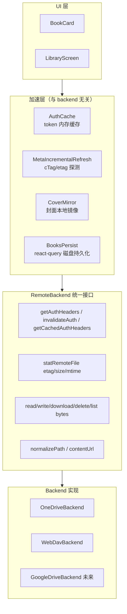

# 远程书库通用加速层

## 目标

1. **秒加载**：进应用立即看到书单与封面
2. **离线浏览**：无网络时书单 + 封面 + 已下载的书全部可用
3. **架构统一**：OneDrive / WebDAV / 未来 Google Drive 共享同一套加速层

正文文件保持「按需手动下载」，不在范围。

## 总体架构



**关键原则**：

- **每个 backend 只实现原子文件操作**，零优化逻辑
- **每条优化只写一次**，所有 backend 自动受益
- **DataSource 配置层统一**：所有 OAuth backend 共享 `accessTokenExpiresAt` 字段命名

---

## Phase 1：统一 RemoteBackend 抽象

### 1.1 设计接口

**新文件**：`my-reader-mobile/src/remote/backend.ts`

```ts
export type RemoteFileStat = {
  etag: string;       // OneDrive cTag / WebDAV Last-Modified+Size
  size: number;
  mtimeMs: number;
};

export interface RemoteBackend {
  readonly kind: "onedrive" | "webdav";
  readonly dataSourceId: string;

  // -- Auth --
  getAuthHeaders(): Promise<Record<string, string>>;
  getCachedAuthHeaders(): Record<string, string> | null;
  invalidateAuth(): void;

  // -- Stat --
  statRemoteFile(remotePath: string): Promise<RemoteFileStat | null>;

  // -- Transfer --
  readBytes(remotePath: string): Promise<Uint8Array>;
  writeBytes(remotePath: string, bytes: Uint8Array): Promise<void>;
  deleteRemote(remotePath: string): Promise<void>;
  listRemote(prefix: string): Promise<string[]>;
  downloadToCache(remotePath: string, localName: string): Promise<File>;

  // -- Path / URL --
  normalizePath(path: string): string;
  /** 用于 expo-image 直链（如封面回退）。仍需 caller 拼 headers。 */
  contentUrl(remotePath: string): string;

  // -- Browse --
  listDirectory(path: string): Promise<RemoteDirEntry[]>;
}
```

### 1.2 工厂

**新文件**：`my-reader-mobile/src/remote/factory.ts`

```ts
export async function createRemoteBackend(
  dataSource: DataSource,
  library: Library,
): Promise<RemoteBackend | null>
```

按 `dataSource.type` 分发；OneDrive 工厂从 Keychain 读 token，WebDAV 工厂读 password。

### 1.3 迁移 OneDrive

将以下文件合并到新的 `my-reader-mobile/src/remote/onedrive/backend.ts`：
- `data/onedrive.ts`（除了 UI 层的 listDirectory）
- `sync/backend/onedrive.ts`

保留向后兼容 shim：旧的 `createOneDriveOps` 改成 wrapper，内部用新 backend。

### 1.4 迁移 WebDAV

同上：`my-reader-mobile/src/remote/webdav/backend.ts` 合并 `data/webdav.ts` + `sync/backend/webdav.ts`。

### 1.5 清理

- 删除 `RemoteFileOps`（合并进 `RemoteBackend`）
- 删除 `RemoteBackendAdapter`（合并进 `RemoteBackend`）
- 保留 `RemoteLibraryOps` 作为面向 UI 的薄壳，内部全部委托给 `RemoteBackend`
- 更新所有引用点：`use-book-loader.ts`、`useLibraryQuery.ts`、`sync/scheduler.ts`、`sync/db_sync.ts` 等

---

## Phase 2：通用 AuthCache（Step A 泛化）

### 2.1 DataSource 字段

**改动**：`packages/tools/src/types/data-source.ts`

```ts
export type DataSourceOnedrive = {
  // ... 原有字段
  accessTokenExpiresAt?: number;  // 新增，ms epoch
}
```

未来 Google Drive 加 OAuth 类型时复用同名字段。

WebDAV 不需要过期，Basic Auth 不变。

### 2.2 AuthCache 模块

**新文件**：`my-reader-mobile/src/remote/auth-cache.ts`

```ts
type Entry = { headers: Record<string, string>; expiresAt: number };
const cache = new Map<string, Entry>();

export function getCached(dataSourceId: string): Record<string, string> | null
export function set(dataSourceId: string, headers, expiresAt: number): void
export function invalidate(dataSourceId: string): void
export function isExpired(dataSourceId: string): boolean
```

模块级 Map，进程生命周期内有效。

### 2.3 OneDrive 接入

`OneDriveBackend.getAuthHeaders()`：
1. 查 AuthCache，命中且未过期 → 返回
2. 否则读 `dataSource.accessTokenExpiresAt`：
   - 未来 → 从 Keychain 拿 token，写 AuthCache，返回
   - 已过期或不存在 → 调 `refreshAccessToken`
3. `refreshAccessToken` 成功后：
   - Keychain 写 token
   - **store 写 `accessTokenExpiresAt = result.accessTokenExpirationDate - 5min`**（这里要拿到 zustand 的 update 函数）
   - AuthCache 写 headers
4. 删除现有的 `/me/drive` 探测

`OneDriveBackend.fetchWithAuth` 收到 401 → 调 `invalidateAuth()` → 重新走流程。

### 2.4 WebDAV 接入

`WebDavBackend.getAuthHeaders()`：基本上是把 `WebDavUrlBuilder.authHeaders` 写进 AuthCache（expiresAt = `Infinity`），后续都同步命中。等价于"零开销"。

### 2.5 同步版

`getCachedAuthHeaders()`：直接 `AuthCache.getCached(dataSourceId)`。给 Phase 5 渲染层用。

### 2.6 验证

单测：
- 命中：第二次调用 0 网络
- 过期：触发 refresh，新 expiry 写入 store
- 401：invalidate 后下次调用走 refresh
- WebDAV：第二次调用 0 异步开销

---

## Phase 3：通用 metadata.db 增量探测（Layer1 泛化）

### 3.1 statRemoteFile 实现

**OneDriveBackend.statRemoteFile**：`GET /me/drive/root:{path}` 不带 `:/content`，返回 `{ etag: cTag, size, mtimeMs: lastModifiedDateTime }`。404 / 网络错误返回 `null`。

**WebDavBackend.statRemoteFile**：PROPFIND depth=0 单文件，从 `getlastmodified` + `getcontentlength` 组合成 `etag = "{mtime}-{size}"`。

### 3.2 Library 字段

**改动**：`packages/tools/src/types/library.ts` 加 `metadataEtag?: string`，持久化到 zustand store（已有 libraries 持久化）。

### 3.3 通用刷新函数

**新文件**：`my-reader-mobile/src/remote/metadata-refresh.ts`

```ts
export async function refreshMetadataIfStale(
  library: Library,
  backend: RemoteBackend,
): Promise<{ refreshed: boolean; newEtag?: string }>
```

逻辑：
1. `stat = await backend.statRemoteFile(metadataRemotePath)`
2. `stat == null`（离线）→ 静默返回 `{ refreshed: false }`
3. `stat.etag === library.metadataEtag` → 返回 `{ refreshed: false }`
4. `stat.etag` 不同 → 重新下载 metadata.db，写 store `metadataEtag`，返回 `{ refreshed: true, newEtag }`

### 3.4 触发时机

**两种触发路径**：

- **A. 启动自动**：受 `settings.syncEnabled` 控制（现有设置，已 gate `runSync`，标签 = 「应用启动时同步」）。
  - 开启时：`useSyncLifecycle` startup 流程并行启动 `refreshMetadataIfStale`
  - 首屏先从持久化缓存秒开（Phase 5 保证），探测在后台跑
  - **etag 变化时**：重下 metadata.db → 写入新 `metadataEtag` 到 store → 调 `queryClient.invalidateQueries(["books", libraryId])` 触发 UI 自动刷新
  - **etag 未变 / 离线 / 网络失败**：静默退出，UI 不动
  - 关闭时：跳过自动探测，UI 仅显示持久化书单
- **B. 用户主动刷新**：现有的「同步当前书库」按钮（`useRefreshLibraryMutation`）增加 `refreshMetadataIfStale` 调用，复用现有 `refreshBooks()` 触发 UI 刷新。**不受 `syncEnabled` 限制**。

**关于 UI 抖动**：
- 启动后 5 秒内 etag 变化触发的刷新会有一次"列表轻微跳动"。可接受，因为这是用户授权的「自动更新数据」行为。
- 若想抑制，可在 invalidate 前比较 books 数量/标题是否有实质变化，无变化则跳过 invalidate。**本期先不做**，简单实现为主。

**关于设置命名**：本期沿用 `syncEnabled`，UI 文案为「应用启动时同步」即可覆盖语义（包含读进度 + 书库元数据 + 文件清单）。若产品后续要分离控制，再拆为独立的 `autoRefreshLibraryOnStartup`。

---

## Phase 4：通用封面镜像（Layer2 泛化）

### 4.1 CoverMirror 模块

**新文件**：`my-reader-mobile/src/remote/cover-mirror.ts`

```ts
export function localCoverPath(libraryId: string, bookPath: string): string
export function hasLocalCover(libraryId: string, bookPath: string): boolean
export async function downloadCover(
  libraryId: string,
  bookPath: string,
  backend: RemoteBackend,
  remoteCoverPath: string,
): Promise<void>
```

本地路径：`{cacheDir}/library-covers/{libraryId}/{escape(bookPath)}/cover.jpg`。

### 4.2 buildCoverUri 改造

每个 backend 的 `buildCoverUri`（保留在 UI 数据层）：
```ts
function buildCoverUri(library, bookPath, hasCover) {
  if (!hasCover) return undefined;
  if (hasLocalCover(library.id, bookPath)) {
    return localFileUri(library.id, bookPath);  // file://，无 headers
  }
  // 回退：远端直链
  return {
    uri: backend.contentUrl(remoteCoverPathFor(library, bookPath)),
    headers: backend.getCachedAuthHeaders() ?? undefined,
  };
}
```

注意：现在是同步函数（拿 cached headers），所以 `readBooks` 的 `Promise.all + await buildCoverUri` 改成同步 map，**进一步消除等待**。

### 4.3 后台补齐队列

**改动**：`sync/scheduler.ts` 在每个 library 的 sync 收尾处加：

```ts
if (isRemoteSourceType(library.sourceType)) {
  void mirrorMissingCovers(library, backend, books).catch(...);
}
```

`mirrorMissingCovers`：
- 遍历 books，过滤出 `hasCover && !hasLocalCover`
- 并发 3 个下载（`p-limit` 风格简单实现）
- 每张之间 `yieldToEventLoop`
- 失败安静吞掉（下次 runSync 重试）
- 不阻塞 runSync 本身

封面变化检测：**本期不做**。极端情况用户可清缓存强制重镜像。

---

## Phase 5：书单磁盘持久化（Step C 泛化）

### 5.1 依赖

```
@tanstack/react-query-persist-client
@tanstack/query-async-storage-persister
@react-native-async-storage/async-storage
```

### 5.2 持久化配置

**改动**：`my-reader-mobile/src/hooks/queries/queryClient.ts`

```ts
const persister = createAsyncStoragePersister({
  storage: AsyncStorage,
  key: "myreader-rq-v1",
});

persistQueryClient({
  queryClient,
  persister,
  maxAge: 7 * 24 * 60 * 60 * 1000,
  buster: APP_VERSION,
});
```

### 5.3 coverUri 序列化

由于 Phase 4 后 `coverUri` 不再带过期 token（要么 `file://`，要么 `{ uri: graphUrl, headers: cachedHeaders }`），持久化前需要：

**dehydrate**：将 `BookItem.coverUri` 中的 `{uri, headers}` 拍扁成 `uri` string。

**hydrate / 渲染时 inflate**：`BookCard` / `BookRow` 在拿到 `coverUri: string` 后，若是 `https://graph.microsoft.com/...` 这类需要鉴权的 URL，调 `getCachedAuthHeaders` 补 headers。

实现位置：在 `useBooks` 的 `select` 里做 inflate，集中处理。

### 5.4 预热

**改动**：`my-reader-mobile/src/sync/useSyncLifecycle.ts` startup 入口最前面：

```ts
for (const ds of dataSources) {
  if (ds.type === "onedrive") {
    void getValidAccessToken(ds.id).catch(() => {});  // 暖 AuthCache
  }
  if (ds.type === "webdav") {
    // WebDavBackend 构造即填充，这里 noop
  }
}
```

确保渲染第一帧时 AuthCache 已就绪。

---

## Phase 6：startup sync 延迟

**改动**：`my-reader-mobile/src/sync/useSyncLifecycle.ts`

`runSync("startup")` 包到 `InteractionManager.runAfterInteractions`，让首屏书单/封面 hydrate 抢先。

---

## 不在范围

- 正文文件预下载
- delta API 订阅（架构预留，本期不实现）
- 封面变化主动检测

## 验证

- **OneDrive 冷启动**：弱网 5-10s → < 500ms
- **WebDAV 冷启动**：同样受益
- **飞行模式**：书单 + 封面完整显示
- **远端加书**：下次启动或下拉刷新可见
- **架构**：模拟"新增 Google Drive backend"流程，验证只需 1 个新文件 + 工厂分支即可全功能

## 实施顺序

Phase 1 → Phase 2 → Phase 3 → Phase 4 → Phase 5 → Phase 6

Phase 1 是基础，必须先完成。Phase 2-6 之间 Phase 5 依赖 Phase 4（同步 buildCoverUri），其余相对独立。可以 Phase 2 完成后立即看到第一波加速。

每个 Phase 完成后保持可运行，便于阶段性 commit。
