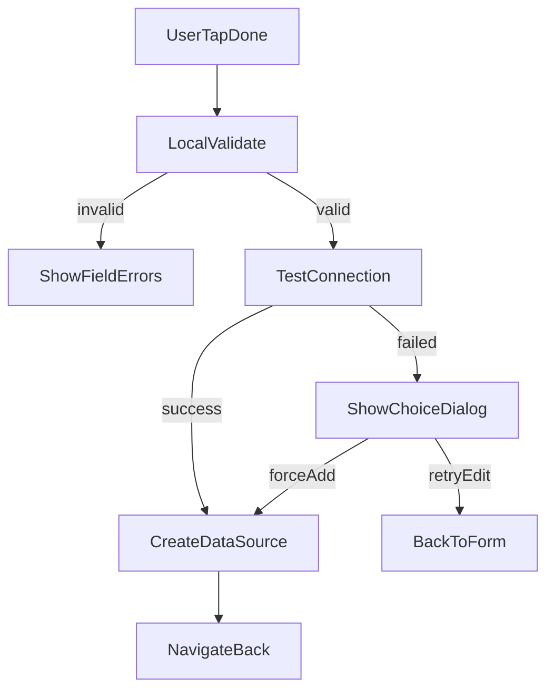

# WebDAV 新增页 UX 优化计划

## 目标与验收
- 在 [`/Users/wen/Projects/MyReader/my-reader-mobile/src/screen/add-webdav-data-source-screen.tsx`](/Users/wen/Projects/MyReader/my-reader-mobile/src/screen/add-webdav-data-source-screen.tsx) 完成以下行为：
- 必填字段（服务器地址、用户名、密码）显示红色 `*`。
- 字段错误在字段下显示，但仅在“已触达或提交后”展示，减少初始噪音。
- 移除“测试连接”按钮，点击“完成”时自动执行“校验 + 连接测试 + 创建”。
- 测试失败时弹出选择：`重新填写`（留在页内修正）或 `仍然添加`（跳过测试直接创建）。
- 增加键盘提交链路：字段间 `Next`，最后密码字段 `Done` 直接触发保存流程。
- iOS 顶栏“完成”按钮改为主操作视觉（主题色背景 + 浅色图标/文字）。

## 变更范围
- 主要改动文件：
  - [`/Users/wen/Projects/MyReader/my-reader-mobile/src/screen/add-webdav-data-source-screen.tsx`](/Users/wen/Projects/MyReader/my-reader-mobile/src/screen/add-webdav-data-source-screen.tsx)
- 可能需要的支撑改动（按实现需要择一）：
  - [`/Users/wen/Projects/MyReader/my-reader-mobile/src/components/ui/header-toolbar.android.tsx`](/Users/wen/Projects/MyReader/my-reader-mobile/src/components/ui/header-toolbar.android.tsx)
  - [`/Users/wen/Projects/MyReader/my-reader-mobile/src/components/ui/header-toolbar.ios.tsx`](/Users/wen/Projects/MyReader/my-reader-mobile/src/components/ui/header-toolbar.ios.tsx)
  - [`/Users/wen/Projects/MyReader/my-reader-mobile/src/components/ui/button.tsx`](/Users/wen/Projects/MyReader/my-reader-mobile/src/components/ui/button.tsx)（若需新增轻量 header 主按钮样式）

## 实施步骤
1. 调整表单标签与错误显示时机
- 给必填项 label 拼接红色 `*`（不改 schema）。
- 将当前 `!isValid` 的错误显示条件改为“字段 touched 或 submitCount > 0 时再展示”。
- 保留现有字段级错误文案结构，避免改动校验规则本身。

2. 合并测试与保存流程
- 删除 `testing/testOk/handleTest` 及对应 toolbar action。
- 将 `handleSave` 拆成：
  - `validateAndBuildDraft`（本地校验）
  - `testConnectionWithTimeout`（网络测试）
  - `persistDataSource`（真正创建）
- `handleSave` 在测试失败时弹窗二选一：
  - 重新填写：仅关闭弹窗
  - 仍然添加：调用 `persistDataSource`，并在成功后返回上一页

3. 增加键盘 Next/Done 链路
- 为每个输入框配置 `returnKeyType`（中间字段 `next`，最后密码字段 `done`）。
- 使用输入框 ref 串联 `onSubmitEditing` 聚焦下一个字段。
- 在密码字段 `onSubmitEditing` 里调用 `handleSave`。

4. 优化 iOS 顶栏完成按钮样式
- 仅保留右上角一个“完成”操作。
- iOS 端将 `iconOnly` 调整为带文字/符号组合，优先使用 `tintColor` 与可读标签提升可点性。
- 若原生 `Stack.Toolbar.Button` 无法实现背景胶囊，则在 `headerRight` 自定义 React 按钮（复用现有 `Button/RoundIconButton` 体系）做主题底色主按钮。

5. 回归验证
- 手动验证：
  - 空表单点击完成 -> 仅显示必填错误。
  - 错误地址/账号 -> 连接失败弹窗出现。
  - 失败后选“仍然添加” -> 数据源可创建并可在列表看到。
  - iOS/Android 键盘 Next/Done 链路顺畅。
- 运行 lint 检查最近改动文件，确保无新增诊断。

## 风险与控制
- 风险：`仍然添加` 可能带入无效连接配置。
- 控制：在弹窗文案中明确“该数据源可能暂不可用，可稍后在详情页修改并重试连接”。

