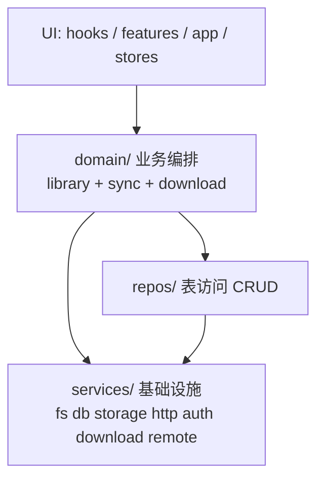

## 目标分层



**铁律**：
1. 只允许向下依赖（含跨层下穿）：`UI → domain → repos|services`、`repos → services`。
2. `services/` 不 import 任何上层；`repos/` 不 import `domain/` 或 UI；`domain/` 不 import UI。
3. `domain/` 内部 3 个子目录 `library/`、`sync/`、`download/` **同层可互调**——靠约定与 review 维持，不强制。
4. 表结构定义在 `@my-reader/db`（已存在）；`repos/` 是这些表的访问门面，文件名贴表名。

---

## 新目录布局

```
my-reader-mobile/src/
├── services/                    基础设施（无业务、无 React）
│   ├── db/{sqlite,library-db,calibre-db}.ts
│   ├── fs/{path,cache,bookmarks}.ts
│   ├── http/auth.ts
│   ├── storage/{credentials,json-storage}.ts
│   ├── auth/onedrive.ts
│   ├── download/native.ts
│   ├── webdav/url-builder.ts
│   └── remote/                  ← 原 my-reader-mobile/src/remote/
│       ├── backend.ts           接口 + 类型
│       ├── factory.ts           按 DataSource 实例化
│       ├── auth-cache.ts
│       ├── cover-url.ts         ← 从原 remote/cover-mirror.ts 拆出 URI 部分
│       ├── webdav/
│       │   ├── backend.ts
│       │   └── probe.ts         ← 原 data/webdav.ts 残留的 testConnection
│       └── onedrive/backend.ts
│
├── repos/                       表访问 CRUD（无 React、无 fetch、无编排）
│   ├── file_state.ts            ← 原 data/file_state.ts 的 CRUD 部分
│   ├── sync_meta.ts             ← 原 data/sync_meta.ts
│   ├── reading_progress.ts      ← 原 data/reading-progress.ts
│   └── calibre_metadata.ts      ← 从 data/calibre.ts 抽出的本地 metadata.db 只读查询
│
├── domain/                      业务编排
│   ├── library/                 书目领域
│   │   ├── book-formats.ts      ← 原 data/book-formats.ts
│   │   ├── calibre.ts           ← 原 data/calibre.ts 的"构建 Library / 编排"部分
│   │   ├── reader-cache.ts      ← 原 data/calibre.ts 的阅读器解压缓存
│   │   ├── cover-mirror.ts      ← 原 remote/cover-mirror.ts 的下载部分
│   │   ├── metadata.ts          ← 原 remote/metadata-check.ts(去 Zustand)
│   │   ├── remote-library.ts    ← 原 data/remote-library.ts(createRemoteOps，唯一存活 factory)
│   │   └── remote-library-shared.ts  ← 原 data/remote-library-shared.ts
│   │
│   ├── sync/                    同步编排
│   │   ├── scheduler.ts
│   │   ├── transfer.ts
│   │   ├── reconcile.ts
│   │   ├── manifest.ts
│   │   ├── db-sync.ts           ← 原 sync/db_sync.ts(连字符化)
│   │   ├── device.ts
│   │   ├── book-diff.ts
│   │   ├── refresh-library.ts
│   │   ├── resolve.ts           瘦身后直接调 services/remote/factory
│   │   ├── connectivity.ts
│   │   ├── context.ts
│   │   └── actions.ts
│   │
│   └── download/                下载领域
│       ├── download-service.ts
│       └── download-store.ts    含 React 订阅(本次保留就地)
│
├── hooks/
│   ├── useFileState.ts          ← 原 data/file_state.ts 中的 useSyncExternalStore 部分
│   ├── useSyncActions.ts        ← 原 sync/useSyncActions.ts
│   └── useSyncLifecycle.ts      ← 原 sync/useSyncLifecycle.ts
│
├── features/  app/  stores/     原状，但 import 路径全部指向 domain/*
```

**已删除目录**：`data/`、根级 `remote/`、根级 `sync/`。

---

## 反向依赖与混乱修正清单

| # | 当前问题 | 修正落点 |
|---|---------|---------|
| 1 | `remote/metadata-check.ts` → `data/remote-library-shared` | 整体上移到 `domain/library/metadata.ts`，不再写 Zustand |
| 2 | `remote/cover-mirror.ts` 写本地 FS | URI 部分留 `services/remote/cover-url.ts`，下载部分上移至 `domain/library/cover-mirror.ts` |
| 3 | `services/library-db.ts` import `data/types` | 改 import `@my-reader/tools` |
| 4 | `services/fs/bookmarks.ts` import `data/types` | 同上 |
| 5 | `services/webdav/url-builder.ts` import `data/types` | 同上 |
| 6 | `data/{webdav,onedrive,remote-library}.ts` 三份"重复" factory（实为仅 `createRemoteOps` 在用，另两份死代码） | 删 `data/onedrive.ts` 整文件、删 `data/webdav.ts` 中 `createWebDavOps`/`WebDavOps` 类型；`createRemoteOps` 迁为 `domain/library/remote-library.ts` |
| 7 | `data/webdav.ts` 中 `testConnection`（WebDAV 探活）现仍被 `hooks/use-data-source-actions.ts` 使用 | 迁到 `services/remote/webdav/probe.ts` 之类，归协议层 |
| 8 | `sync/resolve.ts` 重复 `remote/factory.ts` | resolve 直接调 `services/remote/factory.ts` |
| 9 | `data/file_state.ts` DB CRUD + React 订阅混合 | DB 入 `repos/`，订阅入 `hooks/useFileState.ts` |
| 10 | `data/calibre.ts` 800+ 行混杂 DB/FS/UI alert | 拆为 `repos/calibre_metadata.ts` + `domain/library/{calibre,reader-cache}.ts` |
| 11 | `features/*-browser-screen` 直调 `remote/factory` 绕过 data | 统一改走 `domain/library/remote-library.ts` |
| 12 | `data/types.ts` 仅做 re-export | 删除，调用方直 import `@my-reader/tools` |
| 13 | `sync/backend/index.ts` 整包 re-export `remote/*` | 删除该 barrel |

---

## 实施步骤（每步独立可编译、可提交）

1. **修反向 types 依赖**：`services/{db/library-db, fs/bookmarks, webdav/url-builder}.ts` 改 import `@my-reader/tools`。最小变更。
2. **删死代码**（grep 验证 0 引用后整批删）：
   - 整个 `data/onedrive.ts`（`createOneDriveOps`、`refreshOneDriveToken`、`OneDriveOps` 全无引用）
   - `data/webdav.ts` 中的 `createWebDavOps` 函数与 `WebDavOps` 类型（保留 `testConnection`）
   - `remote/index.ts` barrel（无人 import）
3. **搬 remote 进 services**：`mv my-reader-mobile/src/remote my-reader-mobile/src/services/remote`，全仓库 `from '@/remote/*'` / `from '../remote/*'` 等批量改路径。这一步纯位移，零逻辑修改。
4. **建 repos/**：
   - `data/file_state.ts` 拆：CRUD 入 `repos/file_state.ts`；listener + `useSyncExternalStore` 入 `hooks/useFileState.ts`，对外 hook API 保持不变。
   - `data/sync_meta.ts` → `repos/sync_meta.ts`
   - `data/reading-progress.ts` → `repos/reading_progress.ts`
   - 从 `data/calibre.ts` 抽出对本地 Calibre `metadata.db` 的只读 SQL → `repos/calibre_metadata.ts`
   - 批量改 import。
5. **建 domain/library/**：
   - 迁 `data/book-formats.ts` → `domain/library/book-formats.ts`
   - 拆 `data/calibre.ts` 余下逻辑为 `domain/library/calibre.ts`（构建 Library）+ `domain/library/reader-cache.ts`（解压缓存）
   - 迁 `data/remote-library-shared.ts` → `domain/library/remote-library-shared.ts`
   - 迁 `data/remote-library.ts`（实际只剩 `createRemoteOps` 一份在用）→ `domain/library/remote-library.ts`
   - 把 `data/webdav.ts` 残留的 `testConnection` 迁到 `services/remote/webdav/probe.ts`（或合入 backend.ts 作为方法）；更新 `hooks/use-data-source-actions.ts` 的 import 路径
   - features 的 `*-browser-screen` 直调 `remote/factory` 的地方改走 `domain/library/remote-library.ts`
6. **解 data↔remote 环 + 拆 cover-mirror**：
   - `remote/metadata-check.ts` → `domain/library/metadata.ts`，移除 `useAppStore` 写入；store 更新副作用提到调用方（多为 `domain/sync/refresh-library.ts` 与 hooks）。
   - `remote/cover-mirror.ts` 拆为 `services/remote/cover-url.ts`（纯 URI）+ `domain/library/cover-mirror.ts`（FS 下载）。
7. **建 domain/sync/ 与 domain/download/**：
   - 整体迁 `sync/` 下文件到 `domain/sync/`，下载相关 `download-service.ts`、`download-store.ts` 迁到 `domain/download/`。
   - 文件名规范连字符：`db_sync.ts` → `db-sync.ts`（其余原本就是连字符的不动；表名相关的下划线在 `repos/` 中保留以贴表名）。
   - `sync/resolve.ts` 删除自建 backend 创建分支，统一调 `services/remote/factory.ts`。
   - 删除 `sync/backend/index.ts` 中对 remote 的 re-export。
   - React 钩子 `useSyncActions.ts` / `useSyncLifecycle.ts` 迁 `hooks/`。
8. **删除旧目录**：清空并删除 `my-reader-mobile/src/data/`、`my-reader-mobile/src/sync/`、`my-reader-mobile/src/remote/`（前面步骤迁完后应只剩空目录）。
9. **加 ESLint 边界（可选）**：在根 ESLint 配置中加 `import/no-restricted-paths` 或 `eslint-plugin-boundaries`，规则：
   - `services/**` 禁止 import `repos|domain|hooks|features|app|stores`
   - `repos/**` 禁止 import `domain|hooks|features|app|stores`
   - `domain/**` 禁止 import `hooks|features|app|stores`
   - domain 子目录之间不约束。

---

## 验收标准

- `madge --circular my-reader-mobile/src` 无环
- 旧 `data/`、根级 `remote/`、根级 `sync/` 三个目录被删除
- `tsc --noEmit` 通过；`pnpm test` 全绿
- `repos/*.ts` 全部不 import `react`、`expo-*`、`domain/*`、`services/remote/*`
- `services/**/*.ts` 全部不 import `repos/*`、`domain/*`、`hooks/*`、`features/*`、`stores/*`
- 所有 `features/*-browser-screen` 通过 `domain/library/remote-library.ts` 访问远程书目
- 外部 hook API（如使用 `useSyncExternalStore` 订阅 file_state 的组件）行为不变

---

## 风险与注意

- **零行为变更目标**：本次仅移动、拆分、合并，不修业务逻辑；每步小提交，便于回退。
- **Zustand store 写入位置迁移**（step 6）：原 `remote/metadata-check.ts` 直接写 `useAppStore` 的副作用要迁到调用方。需先 grep 所有 metadata 刷新触发点，确保新位置补齐对应 store 写入。
- **`file_state` 订阅 API 兼容**（step 4）：被多个 hooks/components 引用；`hooks/useFileState.ts` 要原样导出与现有 hook 同名同签名。
- **测试文件路径**：`remote/auth-cache.test.ts`、`sync/{backend/index,download-store}.test.ts`、`services/download/native.test.ts` 随文件迁移同步更新。
- **domain 内部纪律**：3 层模型无法机械校验 `domain/library` 不被 `domain/sync` 反向 import，靠人和 review。如出现 library→sync 调用，多半说明 library 这一块代码应该升到 sync 编排里。
- **`download-store.ts` 含 React 订阅**：本次保留就地（在 `domain/download/` 下），不强行拆成纯逻辑+hooks 两层。若未来要严格化，再单独处理。
