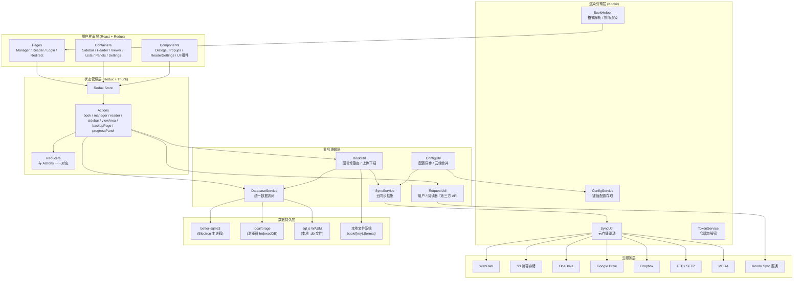
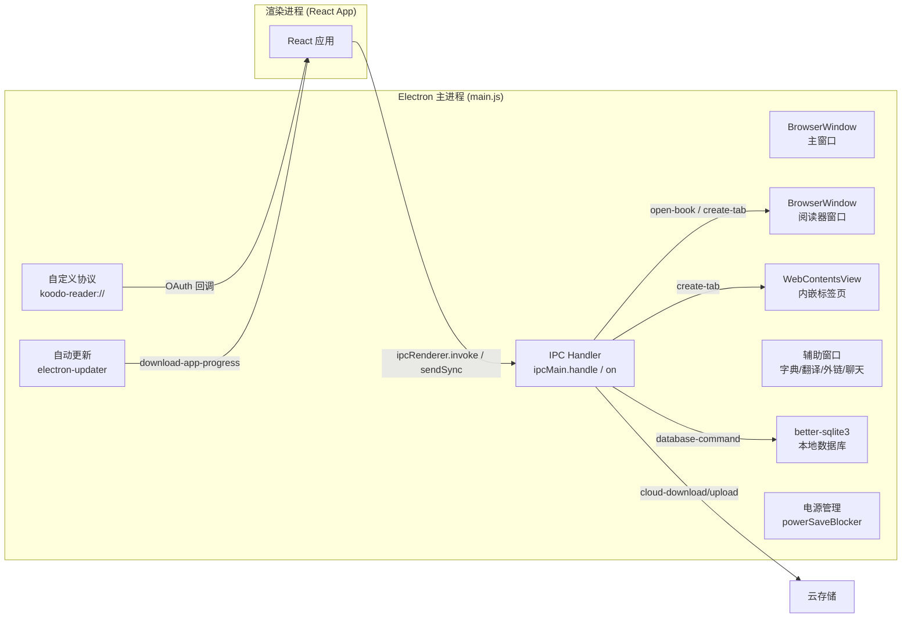
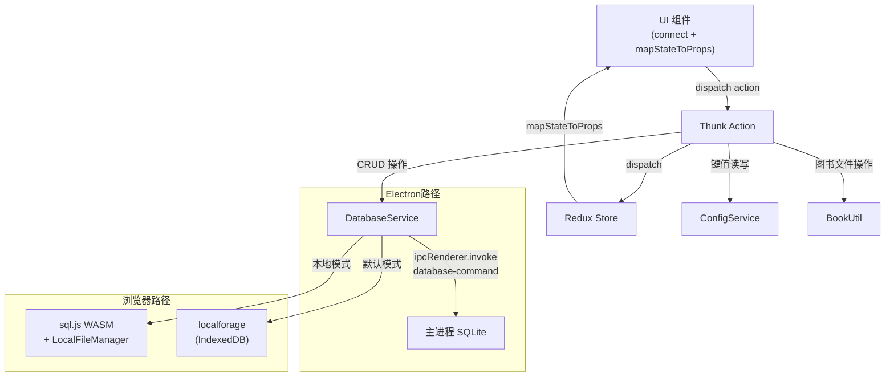
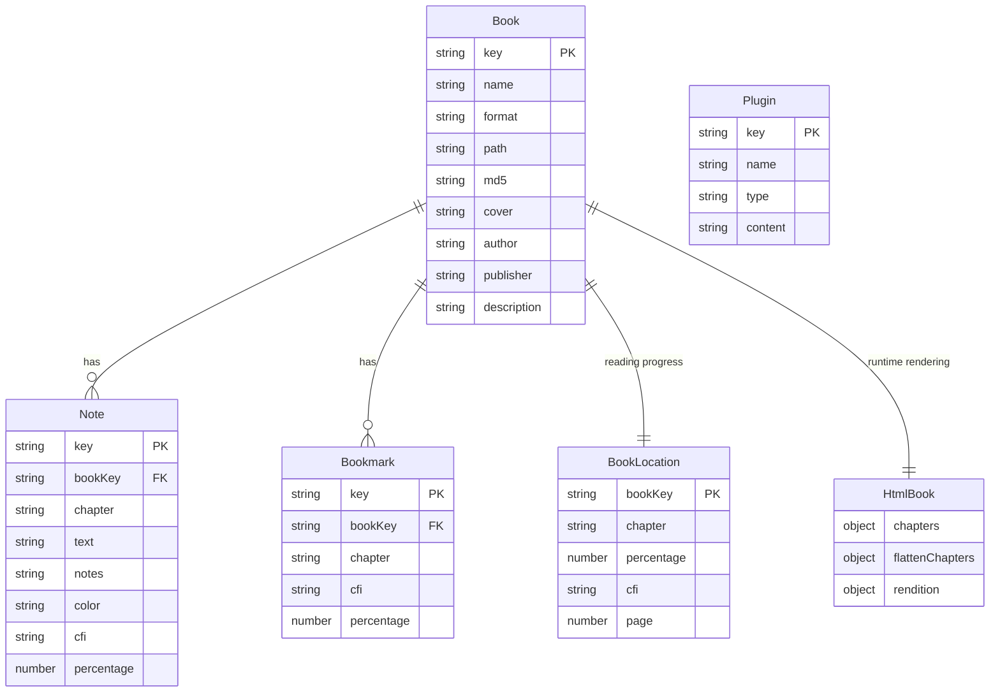
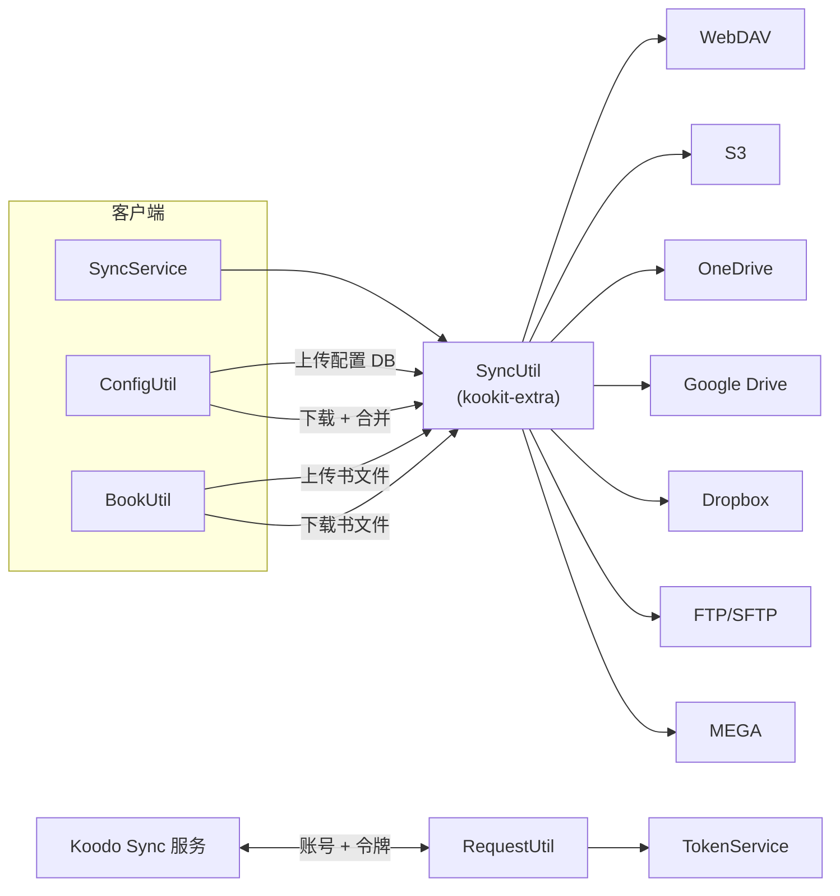
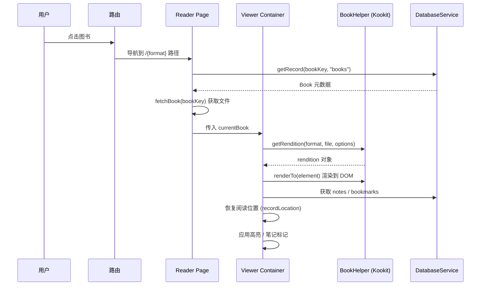
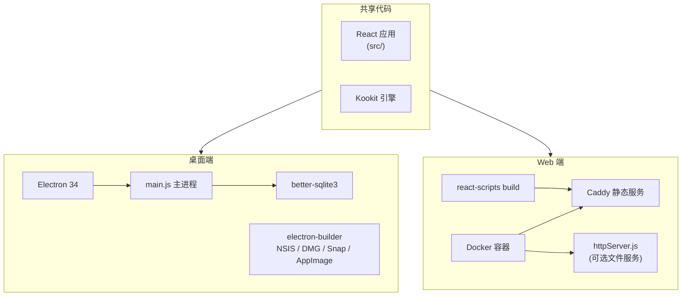
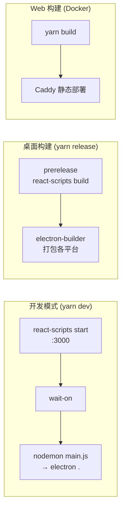

# Koodo Reader 架构文档（阅读器架构参考）

> 版本：2.3.1 | 更新日期：2026-03-26

## 一、项目概述

Koodo Reader 是一款开源的跨平台电子书阅读器，支持桌面端（Windows / macOS / Linux）和 Web 端部署（Docker / 静态站点）。支持 EPUB、PDF、MOBI、AZW3、TXT、DOCX、Markdown、FB2、CBZ/CBR/CBT/CB7 等多种格式，内置笔记、高亮、书签、TTS 朗读、字典翻译、AI 辅助阅读等功能，并提供多种云同步方案。

---

## 二、整体架构



---

## 三、技术栈

### 3.1 前端（渲染进程）

| 类别 | 技术 | 版本 |
|------|------|------|
| UI 框架 | React | 17.x |
| 语言 | TypeScript | 5.9 |
| 状态管理 | Redux + redux-thunk | - |
| 路由 | react-router-dom | 5.x |
| 国际化 | i18next + react-i18next | - |
| 构建工具 | Create React App (react-scripts 5) | 5.x |
| CSS 方案 | 全局 CSS + 组件级 CSS 文件 | - |

### 3.2 桌面端（Electron）

| 类别 | 技术 | 版本 |
|------|------|------|
| 桌面框架 | Electron | 34.x |
| 本地数据库 | better-sqlite3 | - |
| 配置存储 | electron-store | - |
| 日志 | electron-log | - |
| 打包 | electron-builder | - |
| 原生重编译 | electron-rebuild | - |

### 3.3 渲染引擎与浏览器端库

| 类别 | 技术 |
|------|------|
| 电子书解析/渲染 | Kookit（自研打包库） |
| PDF 渲染 | PDF.js |
| SQL 处理 | sql.js (WASM) |
| 压缩解压 | 7z WASM、libunrar |
| OCR | Tesseract.js / onnxruntime-web |
| 文档转换 | Mammoth (DOCX)、Marked (MD) |
| PDF 导出 | jspdf |

### 3.4 云同步与网络

| 类别 | 技术 |
|------|------|
| WebDAV | webdav (npm) |
| S3 兼容 | @aws-sdk/client-s3 |
| FTP/SFTP | basic-ftp / ssh2-sftp-client |
| MEGA | megajs |
| OAuth | OneDrive / Google / Dropbox API |

### 3.5 部署

| 方式 | 技术 |
|------|------|
| Web 静态部署 | Caddy + Docker |
| 文件服务 | httpServer.js (可选 Node HTTP) |
| 容器化 | Dockerfile + docker-compose |

---

## 四、目录结构

```
koodo-reader/
├── main.js                    # Electron 主进程（单文件）
├── httpServer.js              # 可选 HTTP 文件服务（Docker 场景）
├── package.json               # 依赖 + electron-builder 配置
├── webpack.config.js          # 主进程可选 webpack 配置
├── tsconfig.json              # TypeScript 配置
├── Dockerfile / docker-compose.yml
├── assets/                    # 打包资源（图标、entitlements）
├── public/                    # HTML 模板 + 浏览器端库（PDF.js、sql.js 等）
│   ├── index.html
│   ├── lib/                   # 7z-wasm、pdfjs、sql-wasm、tesseract 等
│   └── assets/styles/         # 主题 CSS（default、dark 等）
├── types/                     # 全局类型声明
└── src/
    ├── index.tsx              # 应用入口
    ├── i18n.tsx               # 国际化配置
    ├── router/                # 路由定义
    │   ├── index.tsx          # HashRouter + Switch
    │   └── routes.tsx         # Manager 子路由
    ├── store/                 # Redux 状态管理
    │   ├── index.tsx          # createStore + combineReducers
    │   ├── actions/           # Thunk 与同步 Action
    │   └── reducers/          # Reducer 实现
    ├── pages/                 # 页面级组件
    │   ├── manager/           # 书库主界面
    │   ├── reader/            # 阅读器
    │   ├── login/             # 登录
    │   └── redirect/          # 重定向与 OAuth 回调
    ├── containers/            # 布局容器组件
    │   ├── sidebar/
    │   ├── header/
    │   ├── viewer/            # 阅读区核心
    │   ├── lists/             # bookList / noteList / cardList 等
    │   ├── panels/            # navigation / operation / progress / setting
    │   └── settings/          # account / general / plugin / sync
    ├── components/            # 可复用 UI 组件
    │   ├── dialogs/           # ~20 种模态框
    │   ├── popups/            # 字典 / 翻译 / 笔记 / AI 辅助等弹层
    │   └── readerSettings/    # 阅读器设置控件
    ├── models/                # 数据模型
    │   ├── Book.ts
    │   ├── Note.ts / Bookmark.ts
    │   ├── HtmlBook.ts
    │   ├── Plugin.ts / DictHistory.ts
    │   └── BookLocation.ts
    ├── utils/                 # 工具模块
    │   ├── common.ts
    │   ├── file/              # bookUtil / sqlUtil / backup / restore / configUtil 等
    │   ├── reader/            # styleUtil / themeUtil / launchUtil / ttsUtil 等
    │   ├── request/           # user / reader / thirdparty API 封装
    │   └── storage/           # databaseService / syncService
    ├── constants/             # 常量定义
    └── assets/
        ├── locales/           # 多语言翻译文件
        ├── styles/            # 全局样式
        ├── images/
        ├── lotties/
        └── lib/               # kookit.min / kookit-extra-browser.min（核心引擎）
```

---

## 五、核心架构详解

### 5.1 Electron 主进程架构



**关键特征：**
- `nodeIntegration: true`、`contextIsolation: false`，渲染进程可直接调用 Node API
- 无 preload 脚本，采用传统宽松安全模型
- IPC 通信覆盖：数据库操作、云同步、文件对话框、窗口管理、TTS、更新检查等
- 支持自定义协议 `koodo-reader://` 处理 OAuth 回调和深链

### 5.2 数据流架构



### 5.3 数据模型



### 5.4 路由结构

```mermaid
graph TD
    Root["/"] --> Redirect["Redirect<br/>OAuth / 深链 / 默认跳转"]
    Redirect -->|"默认"| ManagerHome["/manager/home"]

    Manager["/manager"] --> Home["/manager/home<br/>BookList"]
    Manager --> Shelf["/manager/shelf<br/>BookList"]
    Manager --> Favorite["/manager/favorite<br/>BookList"]
    Manager --> NoteList["/manager/note<br/>NoteList"]
    Manager --> Highlight["/manager/highlight<br/>NoteList"]
    Manager --> Trash["/manager/trash<br/>DeletedBookList"]
    Manager --> Empty["/manager/empty<br/>EmptyPage"]

    Login["/login"]

    ReaderEPUB["/epub"] --> HtmlReader["HtmlReader"]
    ReaderPDF["/pdf"] --> HtmlReader
    ReaderTXT["/txt"] --> HtmlReader
    ReaderMOBI["/mobi"] --> HtmlReader
    ReaderMD["/md"] --> HtmlReader
    ReaderDOCX["/docx"] --> HtmlReader
    ReaderFB2["/fb2"] --> HtmlReader
    ReaderCBx["/cbz /cbr /cbt /cb7"] --> HtmlReader
    ReaderHTML["/html /htm"] --> HtmlReader
    ReaderXML["/xml"] --> HtmlReader
    ReaderAZW3["/azw3"] --> HtmlReader
```



### 5.5 云同步架构



### 5.6 图书渲染流程



---

## 六、Redux 状态切片

| Slice | 职责 |
|-------|------|
| `book` | 当前图书渲染函数、renderBookFunc |
| `manager` | 书库列表、排序方式、筛选条件 |
| `reader` | 当前阅读图书、HtmlBook、章节、笔记、书签、缩放、UI 开关 |
| `viewArea` | 阅读区域尺寸、布局模式 |
| `sidebar` | 侧边栏展开状态、当前选中菜单 |
| `backupPage` | 备份/恢复状态 |
| `progressPanel` | 阅读进度面板状态 |

---

## 七、组件组织模式

每个功能模块通常遵循统一的三文件模式：

```
componentName/
├── index.tsx        # Redux connect + withTranslation HOC 包装
├── component.tsx    # 类组件，包含 UI 与业务逻辑
└── interface.tsx    # Props/State 类型定义
```

以 `connect(mapStateToProps, actionCreators)(withTranslation()(Component))` 连接 Redux 与 i18n。

---

## 八、多平台部署架构



---

## 九、关键设计决策

### 9.1 双环境数据持久化

`DatabaseService` 根据运行环境自动选择存储后端：
- **Electron**：通过 IPC 调用主进程的 better-sqlite3
- **浏览器本地模式**：sql.js WASM + File System Access API 操作本地 `.db` 文件
- **浏览器默认模式**：localforage (IndexedDB) 存储 JSON 数组

### 9.2 渲染引擎解耦

图书解析与排版渲染封装在 Kookit 引擎中（预编译的 `kookit.min` / `kookit-extra-browser.min`），`src` 仅负责参数传递、事件处理和 UI 编排，降低了格式处理复杂度对业务层的侵入。

### 9.3 安全模型（Electron）

采用 `nodeIntegration: true` + `contextIsolation: false` 的传统模式，渲染进程可直接访问 Node API。虽降低了安全隔离程度，但简化了 IPC 通信代码复杂度。

### 9.4 统一阅读路由

所有格式共用同一个 `HtmlReader` 组件，通过路由路径（`/epub`、`/pdf` 等）区分格式类型，由 `BookHelper` 内部按格式分支处理渲染逻辑。

---

## 十、构建与开发流程



| 命令 | 用途 |
|------|------|
| `yarn start` | Web 开发服务器 |
| `yarn dev` | 桌面开发（CRA + Electron 热重载） |
| `yarn build` | 前端生产构建 |
| `yarn release` | 桌面端打包发布 |
| `yarn rebuild` | 重编译 better-sqlite3 原生模块 |
| `yarn analyze` | 分析构建产物体积 |
