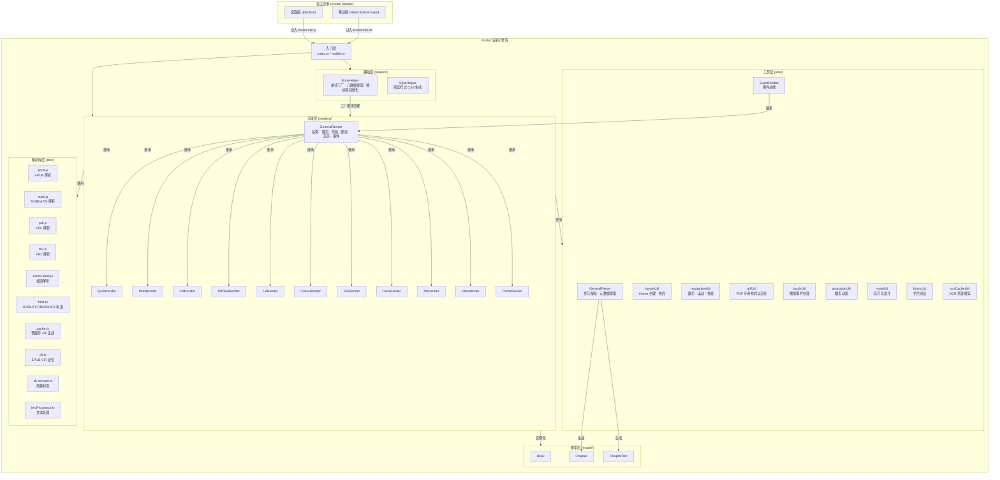
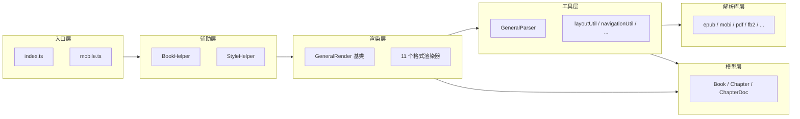
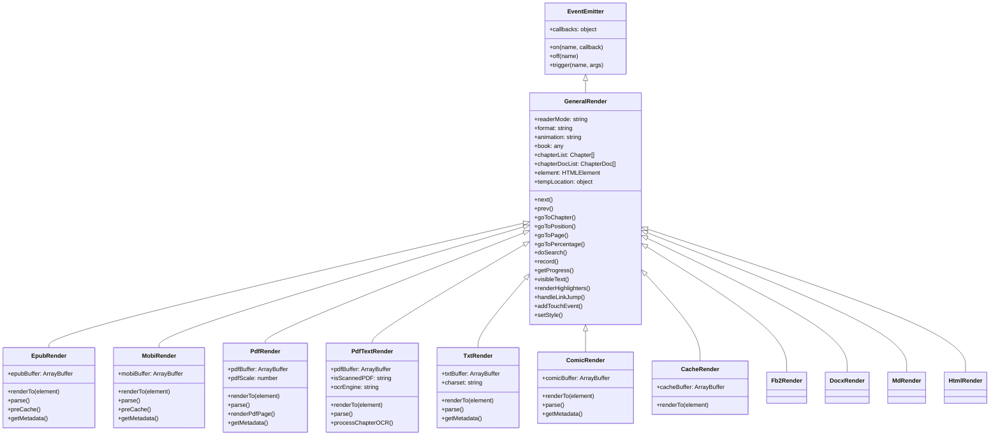
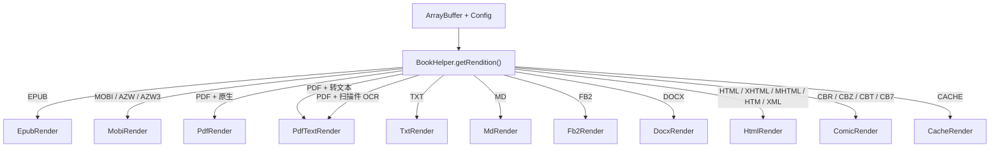
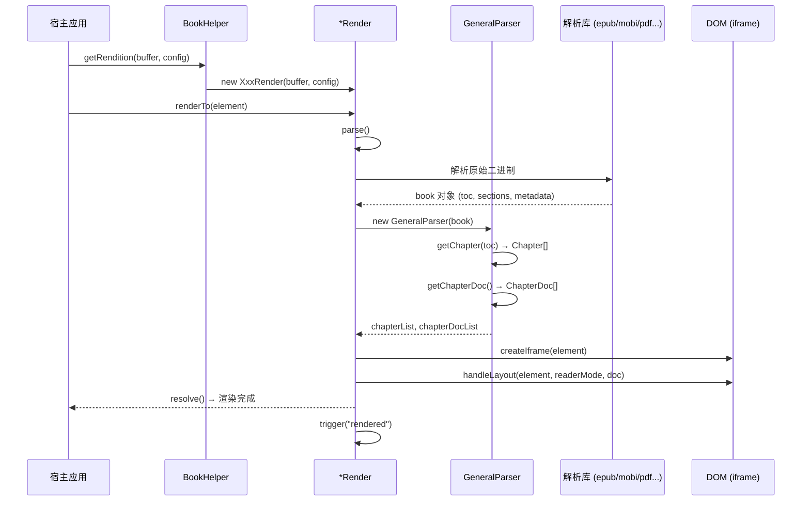
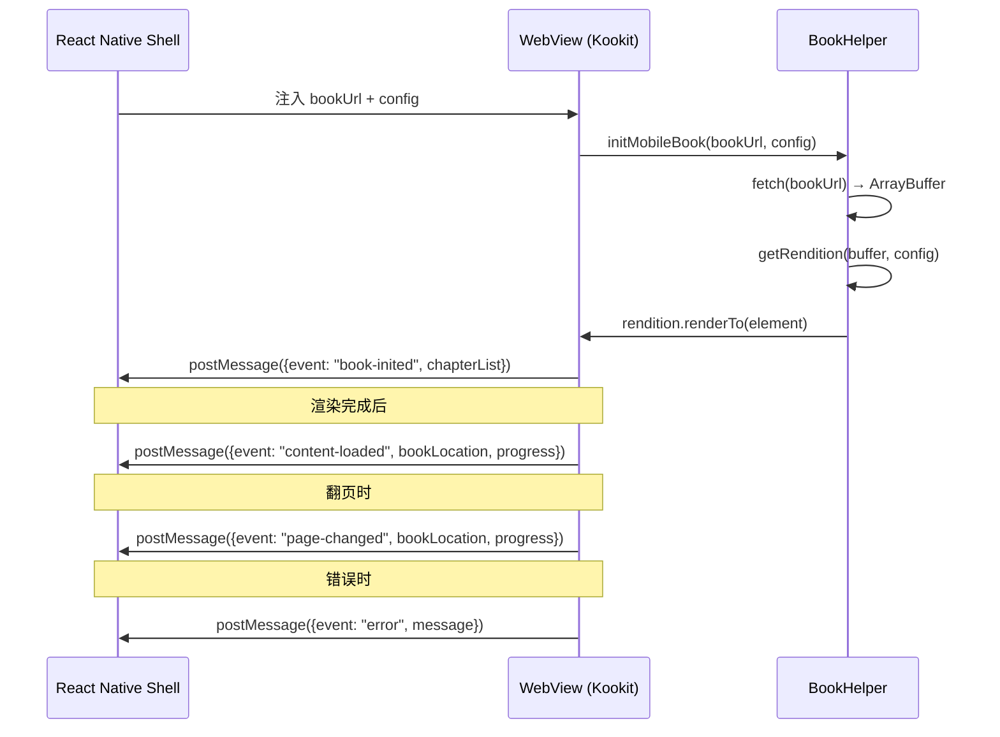
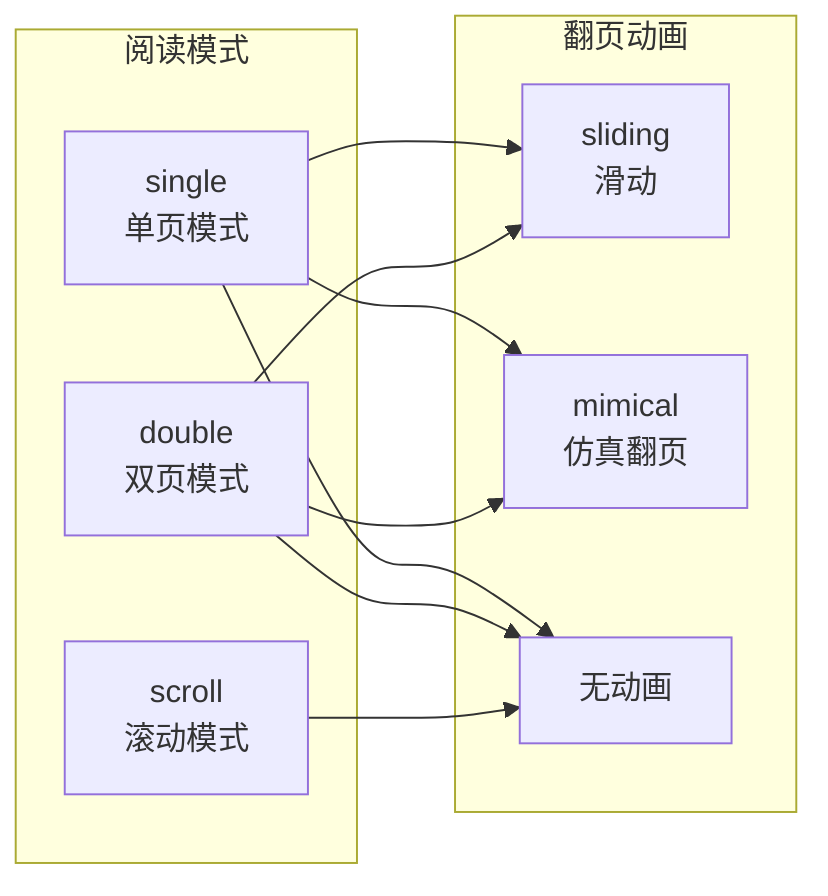
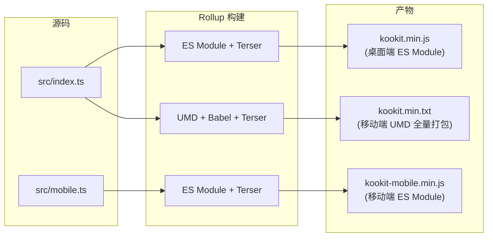
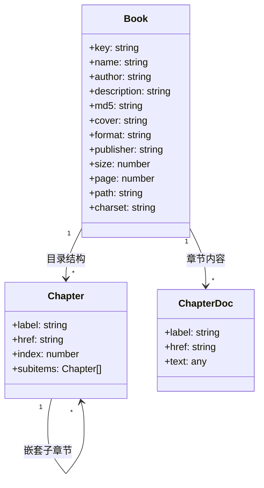

# Kookit 项目架构文档（渲染器架构参考）

## 1. 项目概述

Kookit 是 [Koodo Reader](https://github.com/koodo-reader/koodo-reader) 生态的**核心电子书渲染引擎库**，使用 TypeScript 编写，通过 Rollup 打包为可在浏览器和 React Native WebView 中运行的 JavaScript 模块。

该库不是一个独立应用，而是作为 npm 包被 Koodo Reader 桌面版和移动版（Expo）引用，负责多种电子书格式的解析、渲染、导航和交互。


| 属性   | 值                                     |
| ---- | ------------------------------------- |
| 语言   | TypeScript + JavaScript               |
| 打包工具 | Rollup 2                              |
| 许可证  | AGPL-3.0-or-later                     |
| 产物格式 | ES Module（桌面）、UMD（移动端，经 Babel 降级）     |
| 运行环境 | 浏览器 / Electron / React Native WebView |


---

## 2. 总体架构图




---

## 3. 目录结构

```
kookit/
├── src/
│   ├── index.ts                 # 桌面端主入口，导出所有 Render 和 Helper
│   ├── mobile.ts                # 移动端精简入口，仅导出 StyleHelper
│   ├── renders/                 # 各格式渲染器
│   │   ├── GeneralRender.ts     # 渲染器基类（继承 EventEmitter）
│   │   ├── EpubRender.ts        # EPUB 格式
│   │   ├── MobiRender.ts        # MOBI/AZW/AZW3 格式
│   │   ├── PdfRender.ts         # PDF 原生渲染
│   │   ├── PdfTextRender.ts     # PDF 转文本渲染（含 OCR）
│   │   ├── TxtRender.ts         # TXT 纯文本
│   │   ├── ComicRender.ts       # CBR/CBZ/CBT/CB7 漫画
│   │   ├── Fb2Render.ts         # FB2 格式
│   │   ├── DocxRender.ts        # DOCX 格式
│   │   ├── MdRender.ts          # Markdown 格式
│   │   ├── HtmlRender.ts        # HTML/XHTML/MHTML 格式
│   │   └── CacheRender.ts       # 预缓存格式（ZIP 包）
│   ├── helpers/
│   │   ├── bookHelper.ts        # 渲染器工厂 + 元数据提取 + 移动端桥接
│   │   └── styleHelper.ts       # 阅读器 CSS 样式生成
│   ├── model/
│   │   ├── Book.ts              # 书籍元数据模型
│   │   ├── chapter.ts           # 目录章节模型（支持嵌套）
│   │   └── chapterDoc.ts        # 章节文档内容模型
│   ├── utils/
│   │   ├── generalParser.ts     # 通用章节/元数据解析器
│   │   ├── layoutUtil.ts        # iframe 创建与布局管理
│   │   ├── navigationUtil.ts    # 翻页、滚动、搜索、定位
│   │   ├── pdfUtil.ts           # PDF 专用渲染与布局
│   │   ├── touchUtil.ts         # Android/iOS 触摸事件
│   │   ├── animationUtil.ts     # 仿真翻页动画
│   │   ├── noteUtil.ts          # 高亮批注渲染
│   │   ├── bionicUtil.ts        # 仿生阅读模式
│   │   ├── ocrCacheUtil.ts      # OCR 资源 IndexedDB 缓存
│   │   ├── EventEmitter.ts      # 自定义事件发射器
│   │   ├── mimetype.ts          # MIME 类型映射
│   │   └── generalParser.ts     # 章节解析工具
│   └── libs/
│       ├── epub.js              # EPUB 解析（基于 foliate-js）
│       ├── mobi.js              # MOBI/AZW 解析
│       ├── pdf.js               # PDF 解析（基于 pdf.js）
│       ├── fb2.js               # FB2 XML 解析
│       ├── comic-book.js        # 漫画图片解析
│       ├── html.ts              # HTML 书籍对象构造
│       ├── cache.ts             # 预缓存 ZIP 打包
│       ├── cache-mobile.ts      # 移动端缓存
│       ├── cfi.ts               # EPUB CFI 规范实现
│       ├── epubcfi.js           # CFI 辅助
│       ├── zh-convert.ts        # 中文简繁体转换
│       └── textProcessor.ts     # 文本预处理
├── types/                       # 自定义类型声明
├── test/                        # 本地调试页（index.html）
├── package.json
├── tsconfig.json
├── rollup.config.js
└── README.md
```

---

## 4. 核心架构设计

### 4.1 分层架构




项目采用**五层架构**：


| 层级       | 职责              | 关键特点                 |
| -------- | --------------- | -------------------- |
| **入口层**  | 统一导出 API        | 桌面/移动分离入口            |
| **辅助层**  | 工厂创建、样式生成       | BookHelper 是整个库的入口门面 |
| **渲染层**  | 格式渲染与阅读交互       | 基于继承的策略模式            |
| **工具层**  | 通用功能（布局、导航、触摸等） | 纯函数风格，无状态            |
| **解析库层** | 底层格式解析          | 封装/移植第三方解析器          |


### 4.2 渲染器继承体系




### 4.3 工厂模式（BookHelper.getRendition）




---

## 5. 核心流程

### 5.1 电子书渲染流程




### 5.2 翻页与位置记录流程

```mermaid
PrevChapter
加载新章节 HTML 内容
record()
handleRecord(element, readerMode, ...)sequenceDiagram
    participant User as 用户操作
    participant Render as GeneralRender
    participant NavUtil as navigationUtil
    participant DOM as iframe Document

    User->>Render: next() / prev()
    alt 当前页面内滚动
        Render->>NavUtil: handleScrollPage(element, animation, direction, doc)
        NavUtil->>DOM: scrollTo / scrollBy
    else 需要切换章节
        Render->>NavUtil: handleNextChapter / handlePrevChapter
        NavUtil->>DOM: 加载新章节 HTML 内容
    end
    Render->>Render: record()
    Render->>NavUtil: handleRecord(element, readerMode, ...)
    NavUtil-->>Render: 更新 tempLocation（位置信息）
    Render->>Render: trigger("page-changed")
```


### 5.3 移动端通信流程




---

## 6. 支持的文件格式


| 格式                    | 渲染器             | 解析依赖                                          | 说明                   |
| --------------------- | --------------- | --------------------------------------------- | -------------------- |
| EPUB                  | `EpubRender`    | `epub.js` (foliate-js) + JSZip/fflate/@zip.js | 三级 ZIP 解压降级策略        |
| MOBI / AZW / AZW3     | `MobiRender`    | `mobi.js` + fflate                            | Kindle 格式支持          |
| PDF（原生）               | `PdfRender`     | `pdf.js` (pdf.js)                             | 逐页 iframe 渲染，按需加载/卸载 |
| PDF（转文本）              | `PdfTextRender` | `pdf.js` + OCR 引擎                             | 支持扫描件 OCR 识别         |
| TXT                   | `TxtRender`     | `html.ts` + chardet                           | 自动字符编码检测             |
| Markdown              | `MdRender`      | `html.ts` + marked                            | Markdown 转 HTML 后渲染  |
| DOCX                  | `DocxRender`    | `html.ts` + mammoth                           | DOCX 转 HTML 后渲染      |
| FB2                   | `Fb2Render`     | `fb2.js`                                      | 俄罗斯电子书格式             |
| HTML / XHTML / MHTML  | `HtmlRender`    | `html.ts` + mhtml2html                        | 含 MHTML 解码           |
| CBR / CBZ / CBT / CB7 | `ComicRender`   | `comic-book.js` + JSZip/js-untar/7z-wasm      | 多种压缩格式               |
| CACHE                 | `CacheRender`   | `cache.ts`                                    | 预处理后的 ZIP 缓存包        |


---

## 7. 关键设计模式

### 7.1 策略模式（Strategy Pattern）

通过 `BookHelper.getRendition()` 工厂方法，根据文件格式动态选择对应的渲染器，所有渲染器共享 `GeneralRender` 基类定义的统一接口（`renderTo`、`next`、`prev`、`goToChapter` 等）。

### 7.2 模板方法模式（Template Method）

`GeneralRender` 基类定义了渲染流程骨架（`parse → getChapter → getChapterDoc → createIframe → handleLayout`），各子类只需覆写 `parse()` 和 `renderTo()` 来实现格式特有的解析逻辑。

### 7.3 观察者模式（Observer Pattern）

自定义 `EventEmitter` 提供 `on`/`off`/`trigger` 机制，`GeneralRender` 继承它并触发以下事件：

- `"rendered"` — 章节渲染完成
- `"page-changed"` — 页面/位置变更

### 7.4 适配器模式（Adapter Pattern）

各格式解析器（`epub.js`、`mobi.js`、`pdf.js` 等）产出的原始数据结构不同，`GeneralParser` 将它们统一适配为 `Chapter[]` + `ChapterDoc[]` 的标准模型。

### 7.5 降级容错策略

`EpubRender.parse()` 依次尝试三种 ZIP 解压方案（JSZip → @zip.js → fflate），任一失败自动降级到下一方案，提升兼容性。

---

## 8. 阅读模式

Kookit 支持三种阅读模式，由 `readerMode` 参数控制：




| 模式       | 滚动方向           | 翻页触发            | 章节切换      |
| -------- | -------------- | --------------- | --------- |
| `single` | 水平（默认）/ 垂直（竖排） | `scrollTo` body | 到达边界自动跳转  |
| `double` | 水平             | 双倍宽度翻页          | 同上        |
| `scroll` | 垂直             | `scrollBy` 容器   | 滚动到底部自动跳转 |


---

## 9. 构建与产物




| 产物                     | 格式        | 目标                          | 外部依赖处理                              |
| ---------------------- | --------- | --------------------------- | ----------------------------------- |
| `kookit.min.js`        | ES Module | Koodo Reader 桌面版 (Electron) | mammoth/jszip/marked 等标记为 external  |
| `kookit.min.txt`       | UMD       | Koodo Reader 移动版 WebView    | 全量打包，Babel 降级到 iOS 11+ / Android 5+ |
| `kookit-mobile.min.js` | ES Module | 移动端样式辅助                     | 全量打包                                |


---

## 10. 核心依赖


| 依赖               | 用途                    |
| ---------------- | --------------------- |
| `jszip`          | EPUB/CBZ 等 ZIP 格式解压   |
| `fflate`         | 高性能 ZIP/ZLIB 解压（降级方案） |
| `@zip.js/zip.js` | ZIP 解压（第二降级方案）        |
| `mammoth`        | DOCX 转 HTML           |
| `marked`         | Markdown 转 HTML       |
| `mhtml2html`     | MHTML 格式解码            |
| `chardet`        | TXT 字符编码自动检测          |
| `rangy`          | 跨浏览器文本选区处理（高亮/批注）     |
| `7z-wasm`        | CB7 (7z) 格式 WASM 解压   |
| `js-untar`       | CBT (tar) 格式解压        |


---

## 11. 与宿主应用的集成方式

### 桌面端（Electron）

- 通过 `<script type="module">` 引入 `kookit.min.js`
- 挂载到 `window.Kookit` 全局命名空间
- 宿主通过 `BookHelper.getRendition()` 创建渲染器实例
- 通过 `rendition.on("rendered", callback)` 监听事件

### 移动端（React Native WebView）

- 将 `kookit.min.txt`（UMD）注入 WebView
- 宿主通过 `BookHelper.initMobileBook(bookUrl, config)` 初始化
- 双向通信基于 `window.ReactNativeWebView.postMessage()`
- 事件类型：`book-inited`、`content-loaded`、`page-changed`、`finish-download`、`error`、`cache`、`metadata`

---

## 12. 数据模型




- **Book**：书籍元信息，由 `BookHelper.generateBook()` 创建
- **Chapter**：目录树节点，支持递归嵌套（`subitems`）
- **ChapterDoc**：章节文档，`text` 字段为解析器返回的可加载内容对象

---

## 13. 特色功能


| 功能           | 实现位置                             | 说明                                   |
| ------------ | -------------------------------- | ------------------------------------ |
| **仿生阅读**     | `bionicUtil.ts`                  | 加粗单词前半部分，辅助速读                        |
| **简繁转换**     | `zh-convert.ts`                  | 中文简体/繁体/日文汉字互转                       |
| **仿真翻页**     | `animationUtil.ts`               | 模拟纸质书翻页效果（`mimical` 模式）              |
| **竖排排版**     | `GeneralRender`                  | `textOrientation: "vertical"` 支持竖排阅读 |
| **OCR 识别**   | `PdfTextRender` + `ocrCacheUtil` | 扫描件 PDF 文字识别，结果缓存到 IndexedDB         |
| **预缓存**      | `cache.ts`                       | 将解析后的书籍打包为 ZIP，加速二次加载                |
| **自动滚动**     | `GeneralRender.autoScroll()`     | 基于 `requestAnimationFrame` 的平滑自动滚动   |
| **PDF 按需渲染** | `PdfRender.renderPdfPage()`      | 仅渲染可见页 ±3 页，超出范围自动卸载释放内存             |
| **多触控适配**    | `touchUtil.ts`                   | 区分 Android/iOS 触摸行为，支持自定义触控区域规则      |
| **脚注弹窗**     | `GeneralRender.handleLinkJump()` | 识别脚注链接，弹窗展示而非跳转                      |


