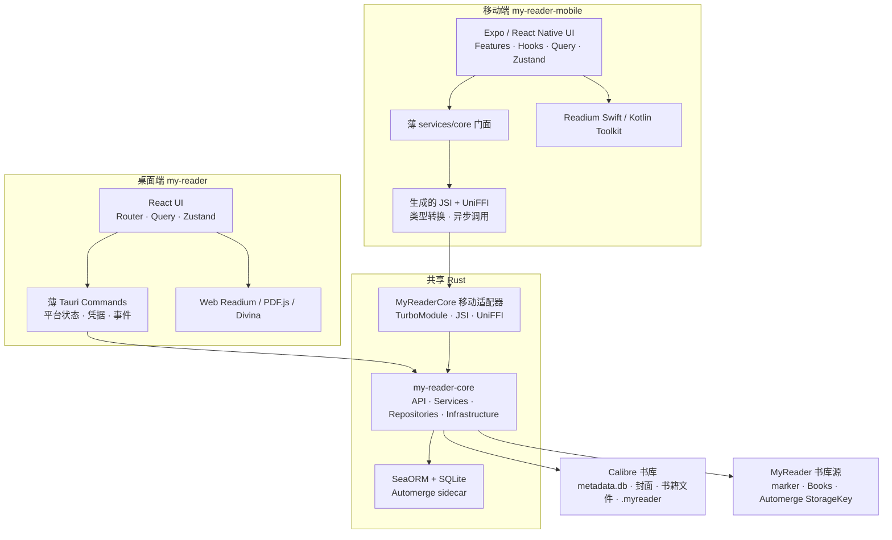

# MyReader 架构现状

> 文档日期：2026-08-02
>
> 本文件只描述当前已落地实现。历史方案和后续决策见 `docs/adr/`。

## 1. 架构摘要

MyReader 是一个同时支持 Calibre 与 MyReader 自有书库的 Local-First 跨平台阅读器：

- Calibre 拥有外部 `metadata.db`、封面和书籍文件；MyReader 对 Calibre 书库始终只读。
- MyReader 自有书库以 marker 标识所有权，以 Automerge catalog 为书目逻辑权威，并把 catalog
  投影到设备本地的 Calibre-shaped 查询表；它不生成或维护 `metadata.db`。
- 每个书库拥有独立的设备本地 SQLite sidecar 和 Automerge document。Calibre document 包含六个
  阅读数据 root；MyReader document 还包含 catalog root。
- desktop、iOS 和 Android 共同使用 Rust `my-reader-core` 处理数据库、书库、书目、阅读数据与
  sidecar 同步业务。
- Tauri Commands 与移动 UniFFI/JSI binding 是平台 adapter，不再维护第二套数据库或业务规则。
- UI、Readium Navigator、系统授权、凭据、目录句柄、生命周期和后台调度触发仍由平台实现。
- 当前数据源为本地目录、WebDAV 和 OneDrive；当前可读格式为 EPUB、PDF 和 CBZ。



## 2. Monorepo 与所有权

pnpm workspace：

| Workspace | 所有权 |
|---|---|
| `my-reader` | 桌面 UI、Tauri adapter、桌面 Readium、桌面平台能力 |
| `my-reader-mobile` | 移动 UI、Core binding adapter、移动 Readium、移动平台能力 |
| `packages/fonts` | 跨端阅读字体目录和资产来源 |
| `packages/i18n` | 跨端共享文案、平台专属翻译资源和国际化契约 |
| `packages/tools` | 跨端 TypeScript 类型、Reader 纯算法和产品语义 |

Cargo workspace 中与共享后端相关的 crate：

| Crate | 所有权 |
|---|---|
| `my-reader-core` | 跨端业务 API、SeaORM 数据访问、统一书目查询、Automerge 与同步规则 |
| `my-reader-core-ffi`（位于 `my-reader-mobile/modules/my-reader-core/rust`） | typed UniFFI 导出、FFI 数据转换和移动原生产物 |

移动端另有应用内原生模块：

- `my-reader-mobile/modules/my-reader-core`：通过生成的 JSI/TurboModule 把 UniFFI 产物接入 React Native。
- `my-reader-mobile/modules/readium`：应用自有 Readium Swift/Kotlin 集成。
- `my-reader-mobile/modules/book-transition`：阅读器原生转场。

React/React Native UI 和 Navigator Surface 不跨端共享。共享边界由稳定语义决定，不为了复用而
建立空 package、crate 或抽象层。

## 3. `my-reader-core`

### 3.1 分层

```text
api/                跨端粗粒度 use-case API
    ↓
services/           业务校验、事务和用例编排
    ↓
repositories/       MyReader catalog projection 与 Calibre 只读访问
    ↓
database.rs
entities/
migration.rs

infrastructure/     registry 与对象存储实现
sync/               Automerge document、持久化、传输和调度规则
models/             跨层稳定业务 DTO
```

`services`、`repositories` 和 `infrastructure` 是 crate 内部实现。平台通过 `api` 和必要的稳定
合同调用 core；平台 adapter 不复制 SQL、CRDT 合并或业务事务。

### 3.2 当前业务范围

`my-reader-core` 已拥有：

- 设备本地的数据源与书库 registry。
- `calibre` / `myreader` 书库所有权、marker 身份校验与向后兼容的只读默认值。
- 本地、WebDAV 和 OneDrive 数据源校验、远程目录、两类书库添加/打开与刷新。
- Calibre 与 MyReader 共用的书目数量、分页、搜索、详情、系列、格式和文件相对路径查询。
- MyReader 单格式图书导入、删除、书名/作者修改及 catalog projection。
- 阅读格式选择、文件状态和封面缩略图 manifest。
- 下载任务去重、并发限制、取消、状态转换及 MyReader 正文 SHA-256 校验。
- 收藏、阅读位置与冲突候选、书签、高亮和笔记。
- 阅读 session、完成记录和当前书库统计。
- Automerge change、projection、outbox、远端交换、pull freshness、retry/suspend 和
  single-flight 规则。

不进入 core 的平台能力包括 UI 状态、Readium Navigator、窗口、系统目录授权、secure storage、
OAuth UI、通知、计时器和应用生命周期。

## 4. 桌面端

### 4.1 运行时边界

```text
React/WebView
  ├─ TanStack Router 页面与组件
  ├─ React Query 后端状态
  ├─ Zustand UI 状态
  └─ 桌面 Reader 适配
          │
          │ tauri-specta 类型 IPC
          ▼
Tauri adapter
  ├─ Commands 与 DTO 转换
  ├─ config / 系统凭据
  ├─ 窗口、protocol 和 streamer
  └─ 平台同步 trigger
          │
          ▼
my-reader-core
```

前端通过 `my-reader/src/lib/tauri-api.ts` 调用生成的类型 IPC。Tauri 现存 service 负责平台协作和
向 core 转换数据；已经迁入 core 的业务不在 Tauri repository 中重复实现。

WebDAV 密码与 OneDrive token 存在系统凭据存储中，不写入前端持久 DTO 或 sidecar。

### 4.2 桌面 Reader

| 格式 | 实现 |
|---|---|
| EPUB | `@readium/navigator` |
| PDF | `pdfjs-dist` + MyReader Readium Locator/Navigator 适配 |
| CBZ | MyReader Divina manifest 与 fixed-layout 适配 |

桌面 Reader、资源 protocol、HTTP streamer 和窗口生命周期是桌面平台实现，不进入 core。

## 5. 移动端

### 5.1 分层

```text
app/ + features/ + domain/ + hooks/
        UI、交互、React Query、Zustand、平台流程
                    ↓
services/core/
        路径/凭据准备、DTO 转换、查询失效和 UniFFI 调用
                    ↓
modules/my-reader-core/
        generated TurboModule + JSI + UniFFI
                    ↓
my-reader-core
```

移动端不再拥有 `repos/`、`services/db/`、Drizzle 或 OP-SQLite 数据库后端。`services/core` 是
FFI 门面，不实现 SQL、合并策略或第二套业务规则。

保留在 TypeScript 的内容应当确实依赖移动平台，例如：

- Expo Router、React Query、Zustand 和 UI 状态。
- 文件 URI、security-scoped bookmark、移动下载和缓存文件操作。
- iOS/Android 系统分享入口；分享文件与文件选择器进入同一导入用例。
- Android SAF `content://` 授权、外部 MyReader 目录与应用私有镜像间的逐文件复制。
- SecureStore、OAuth token 刷新和短期凭据注入。
- 网络、前后台、当前书库和阅读器关闭等同步 trigger。
- Readium View、选择菜单、Decoration、手势和系统交互。

`domain/` 只容纳仍需跨多个移动 feature 复用的 UI/平台流程。单纯转发 core API 的兼容层不保留。

### 5.2 原生 Reader

`my-reader-mobile/modules/readium` 负责 Publication handle、Streamer、Search、Locator、
Selection、Decoration 和原生 View 转换。iOS 使用 Readium Swift Toolkit，Android 使用 Readium
Kotlin Toolkit。Reader bridge 与 `my-reader-core` 的业务 binding 是两个独立平台边界。

## 6. 数据与持久化

### 6.1 Calibre 数据

Calibre `metadata.db` 是外部只读数据库：

- 本地书库直接查询。
- 远程书库先下载到设备缓存，再由 core 查询。
- MyReader 不迁移、不增加字段、不写入 Calibre 表。
- `my-reader-core/src/entities/calibre` 是受支持 Calibre 表的只读 SeaORM 映射。

### 6.2 MyReader 自有书库

MyReader 自有书库源包含 `.myreader/library.json`、
`Books/<storage-name> (<book-uuid 前 6 位>)/<storage-name>.<format>` 和按
[ADR-0020](./docs/adr/0020-adopt-automerge-repo-storage-model.md) 存放的 Automerge StorageKey
对象。正文路径在导入时确定，后续修改书名或作者不会移动文件；旧版
`Books/<book-uuid>/book.<format>` 路径继续原样使用。marker、Automerge document 和设备本地
`library_id` projection 使用同一个稳定 `libraryUuid`。

Automerge catalog 是规范书目；`myreader.db` 中的 `library_id`、`books`、`authors`、
`books_authors_link` 和 `data` 只是可重建的 Calibre-shaped projection。每本书只有一个 EPUB、
PDF 或 CBZ 正文，稳定 `book_id` 和 `books.uuid` 同时供统一查询、Reader 与现有阅读数据引用。
MyReader 不生成、同步或写入 `metadata.db`，也不与 Calibre 书库互相转换。

Android SAF 外部书库将用户授权的 `content://` 目录记录为源位置，并在应用私有容器保留可供 Rust、
SQLite 和 Reader 使用的镜像。marker、Automerge StorageKey 和正文按文件在两端收敛；活动
`myreader.db`、WAL 与 SHM 始终只存在于应用私有容器。

### 6.3 每书库 sidecar

每个书库拥有逻辑独立的 `.myreader/myreader.db`。远程书库在设备容器中维护本地 sidecar，
多设备通过 Automerge StorageKey 对象交换数据，不直接共享活动 SQLite/WAL/SHM。

业务表：

| 表 | 用途 |
|---|---|
| `library_id`、`books`、`authors`、`books_authors_link`、`data` | MyReader catalog 的本地查询 projection；Calibre 书库继续查询外部 `metadata.db` |
| `reading_progress` | Locator、展示进度、冲突投影和更新时间 |
| `favorite_books` | 收藏状态 |
| `bookmarks` | 书签 Locator、稳定位置键和 tombstone |
| `annotations` | 高亮、颜色、可选笔记和 tombstone |
| `reading_sessions` | 阅读时长区间 |
| `reading_completions` | 阅读完成记录 |
| `book_reading_format` | 设备选择的阅读格式 |
| `file_state` | 书籍/封面文件本地缓存状态 |
| `pending_book_imports` | 设备本地的远程正文待上传意图；上传成功后才允许对应 catalog outbox 发布 |
| `book_cover_thumbnail_cache` | 移动封面缩略图 manifest |

同步表：

| 表 | 用途 |
|---|---|
| `sync_local_meta` | 当前书库 Automerge 本地身份与协议元数据 |
| `sync_automerge_state` | Automerge document 快照 |
| `sync_automerge_outbox` | 待保存到远端的本地 incremental chunk |
| `sync_automerge_projection_meta` | document 到业务表的投影状态 |
| `sync_errors` | 可诊断同步错误 |
| `sync_schedule_state` | pull freshness、retry 和 suspension 持久状态 |

设备设置、Reader 偏好、凭据、下载临时任务和书库 registry 不进入 sidecar 同步。

MyReader 自有书库的 Automerge document 同时承载 catalog 与以上六个阅读数据 domain；Calibre
书库的 document 只承载六个阅读数据 domain。两类书库共用同一 state、outbox、projection 和
调度实现。

### 6.4 Schema 权威

MyReader 自有数据库由 `my-reader-core` 的有序 SeaORM Migrator 唯一拥有：

```text
my-reader-core/migrations/legacy/*.sql
        既有不可变迁移历史
                    ↓
my-reader-core/src/migration.rs
        运行时有序 Migrator
                    ↓
.myreader/myreader.db
                    ↓
my-reader-core/src/entities/app
        SeaORM 查询映射
```

旧移动数据库第一次由 core 打开时，会把已有 Drizzle migration 记录一次性接管为等价的 SeaORM
状态并删除旧 metadata 表；新安装不加载 TypeScript migrator。

`pnpm db:generate` 通过同一个 Rust Migrator 创建临时数据库，再生成 SeaORM entities。migration
是 schema/升级历史的权威，entities 不是 Entity-First schema 来源。

## 7. 数据源、文件与同步

### 7.1 数据源与文件

当前数据源为 Local、WebDAV 和 OneDrive。书库所有权与存储位置正交：`libraryType` 决定 catalog
权威和可用 command，`sourceType` / `dataSourceId` 决定对象所在后端。

远程 Calibre 书库继续先把外部只读 `metadata.db` 刷新到设备缓存，再查询书目并按需取得封面和
正文。远程 MyReader 书库不传输 `metadata.db`：创建或打开时读取 marker，并通过 Automerge
StorageKey 交换 catalog 与阅读数据。

MyReader 正文与 Automerge 是同一 DataSource 上的 content plane 与 control plane：

1. 导入先复制到设备暂存文件并由 core 计算 `size + sha256`。
2. 远程导入把正文和 catalog projection 先落到设备本地，`pending_book_imports` 保存稳定
   `book_id + books.uuid`，`file_state` 标记为 `dirty_push`；只要正文尚未上传并确认远端 size，
   既有 Automerge outbox 就保持不可发布。
3. 独立的 core `BookTransferService` 在后台重试正文上传，不占用 sidecar 同步任务。上传与 stat
   成功后将文件标记为 `present`、移除待上传意图，再调度一次短 push 发布原有 catalog change；
   待上传表不参与合并，也不是第二个 catalog。缺失的本地待上传文件只进入 `source_missing`，
   不会使 sidecar/Automerge 同步失败。
4. 其他设备合并 catalog 后将正文标记为 `remote_only`，打开或显式下载时写入同目录 `.part`，
   只有 size 与 SHA-256 都匹配后才原子安装并标记为 `present`。
5. 删除先把 Automerge tombstone 持久化到共享 DataSource，再幂等清理远端正文与各设备缓存。
6. 外部手动删文件只产生 `source_missing`，不会自动生成 catalog tombstone。

OneDrive 大文件写入由 OpenDAL OneDrive backend 使用 upload session 分块完成。设备本地
`file_state` 记录 `dirty_push`、`remote_only`、`present`、`source_missing` 和已验证的
`local_sha256`；正文 bytes 和传输中间状态不进入 Automerge document。

对象存储、Calibre 本体刷新与 Automerge 同步是不同语义；手动“全部同步”按书库类型编排实际需要
的 control-plane 阶段，自动同步由 durable outbox 和事件调度器驱动，正文传输由独立后台任务消费
设备本地传输队列。

### 7.2 Automerge sidecar

[ADR-0016](./docs/adr/0016-adopt-automerge-for-library-sidecar-sync.md) 已落地：

- 每个书库一个 Automerge document。
- Calibre 书库同步收藏、阅读位置、书签、批注、阅读 session 和完成记录六个 domain；MyReader
  书库在同一 document 中再同步 catalog root。
- core 负责 change 因果关系、去重、冲突候选、SQLite projection、outbox 和收敛。
- 阅读位置真并发时保留候选；用户选择后写入因果上更新的 change。
- 同步完成后平台只负责刷新可见查询。

[ADR-0020](./docs/adr/0020-adopt-automerge-repo-storage-model.md) 进一步规定：

- 远端采用 automerge-repo `StorageSubsystem` 的 snapshot/incremental `StorageKey`，直接映射到
  `.myreader/automerge/<document_id>/<kind>/<hash>`；`document_id` 是 Calibre `library_id.uuid`
  或 MyReader marker 中的 `libraryUuid`。
- core 负责 snapshot-first 加载、内容寻址增量和只删除 covered chunks 的并发安全压缩。

自动同步遵循 [ADR-0017](./docs/adr/0017-event-driven-library-sidecar-sync-scheduling.md)：业务写入通知
平台 trigger，core 负责 debounce/max-wait、single-flight、pull freshness、retry/backoff、
suspend 和恢复规则；平台提供前后台、网络、书库切换、Reader 关闭和计时器事件。

旧 JSONL/HLC、自研 join、CR-SQLite 和 v4 临时远端数据不会进入当前产品路径。

## 8. 阅读位置与格式能力

跨端统一 `Publication`、`Link`、`Locator` 等稳定语义。Locator 是可恢复内容位置，不是视觉
页码；持久化保留 `href`、`type`、`locations` 和必要文本/DOM 锚点。

| 格式 | 桌面端 | 移动端 |
|---|---|---|
| EPUB | Web Readium | Readium Swift/Kotlin EPUB Navigator |
| PDF | PDF.js 适配 | Readium PDF Navigator |
| CBZ | Divina/fixed-layout 适配 | Readium fixed-layout/CBZ Navigator |

书签可围绕 Locator 跨格式工作；Selection、Decoration、高亮、搜索、重排和设置能力必须按实际
Navigator/格式显式判断，不能假设三种格式完全相同。

## 9. 关键约束

1. **Calibre 只读**：不把 MyReader 字段写进 `metadata.db`，不把 Calibre 书库升级为可写书库。
2. **MyReader 独立所有权**：marker + Automerge catalog 定义 MyReader 书库；复用表形状不等于
   Calibre 兼容，也不提供两类书库转换。
3. **每书库数据域**：业务数据随书库隔离，不建立中央 Profile 数据库。
4. **共享业务，不共享渲染**：core 统一后端；UI、Navigator 和系统能力归平台。
5. **单一数据库 writer**：desktop/mobile 通过 core 访问 MyReader SQLite。
6. **Rust migration 权威**：不恢复 TypeScript/Drizzle schema 链或 Entity-First schema sync。
7. **凭据设备本地化**：secret 不进入 sidecar、Automerge 或可持久前端 DTO。
8. **远端交换 change，不共享 SQLite**。
9. **不预想功能**：评分、书架、账户、中心 Profile、跨书库统计等不存在的能力不进入当前架构。

## 10. 验证入口

```bash
# 共享 Rust
cargo test -p my-reader-core -p my-reader-core-ffi

# Core 高频路径基线
cargo run -p my-reader-core --release --example runtime_baseline -- 1000

# 共享 TypeScript
pnpm --filter @my-reader/fonts test
pnpm --filter @my-reader/i18n test
pnpm --filter @my-reader/tools test

# 桌面
pnpm --filter my-reader run test:unit
(cd my-reader/src-tauri && cargo test)

# 移动
pnpm --filter my-reader-mobile exec jest --runInBand
pnpm core:build-bindings:ios
pnpm core:build-bindings:android

# 从 core Migrator 重新生成 app entities
pnpm db:generate
```

本机构建、E2E 和平台测试见 [DEVELOPMENT.md](./DEVELOPMENT.md)。Core 的本机构建、原生产物和
高频查询参考值见 [my-reader-core 运行基线](./docs/my-reader-core-runtime-baseline.md)。

## 11. 相关 ADR

| ADR | 当前关系 |
|---|---|
| [ADR-0005](./docs/adr/0005-adopt-readium-reader-architecture.md) | 当前 Reader 架构基础 |
| [ADR-0006](./docs/adr/0006-desktop-typed-ipc-and-layered-backend.md) | 桌面类型 IPC 与后端分层基础 |
| [ADR-0007](./docs/adr/0007-pnpm-monorepo-and-shared-code-ownership.md) | monorepo 与语义共享原则 |
| [ADR-0008](./docs/adr/0008-shared-database-schema-authority.md) | 已由 ADR-0019 取代，保留历史 |
| [ADR-0013](./docs/adr/0013-maintain-mobile-readium-integration.md) | 移动 Readium 集成所有权 |
| [ADR-0016](./docs/adr/0016-adopt-automerge-for-library-sidecar-sync.md) | 当前 Automerge 同步内核 |
| [ADR-0017](./docs/adr/0017-event-driven-library-sidecar-sync-scheduling.md) | 当前自动同步调度语义 |
| [ADR-0018](./docs/adr/0018-shared-rust-components.md) | 共享 Rust/UniFFI 试点，crate 组织由 ADR-0019 部分取代 |
| [ADR-0019](./docs/adr/0019-adopt-modular-my-reader-core.md) | 当前共享后端和数据库权威 |
| [ADR-0020](./docs/adr/0020-adopt-automerge-repo-storage-model.md) | 当前 Automerge 远端存储、压缩和故障恢复模型 |
| [ADR-0021](./docs/adr/0021-support-myreader-managed-libraries.md) | 当前 MyReader 自有书库、catalog projection 与正文同步模型 |
