# MyReader 架构文档

> 版本：0.1.0 | 更新日期：2026-03-26

## 一、项目概述

MyReader 是一款 Local-First 的跨平台电子书阅读器，基于 Calibre 书库直接浏览管理藏书，内置多格式阅读引擎与 TTS 语音朗读，并集成 ComfyUI 实现图像/视频创意生成。

桌面端基于 Tauri 2（Rust + WebView），移动端基于 React Native / Expo，核心阅读引擎与 UI 组件在多端共享，确保一致的阅读体验。

---

## 二、整体架构

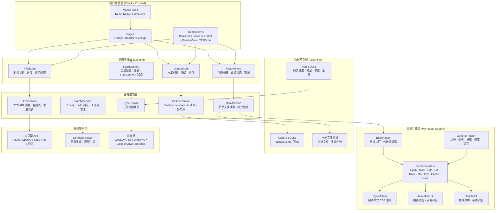

---

## 三、技术栈

### 3.1 前端 (共享层)

| 类别 | 技术 | 说明 |
|------|------|------|
| UI 框架 | React 19 | 函数组件 + Hooks |
| 语言 | TypeScript 5.x | 严格模式 |
| UI 组件库 | shadcn/ui | 基于 Radix UI 的可定制组件集 |
| 样式方案 | Tailwind CSS 4 | 实用优先，shadcn/ui 默认集成 |
| 状态管理 | Zustand | 轻量级，支持 persist 中间件 |
| 构建工具 | Vite 6 | 快速 HMR |
| E2E 测试 | Playwright | 跨浏览器端到端测试 |
| 国际化 | i18next | 多语言支持 |

### 3.2 桌面端

| 类别 | 技术 | 说明 |
|------|------|------|
| 桌面框架 | Tauri 2 | Rust 后端，系统 WebView 渲染 |
| 后端语言 | Rust | 文件系统访问、SQLite 操作、性能关键路径 |
| 本地数据库 | SQLite (sqlx) | Rust 侧直接操作 |
| Calibre 集成 | SQLite 只读连接 | 读取 metadata.db |
| 打包 | tauri-bundler | NSIS (Win) / DMG (Mac) / AppImage (Linux) |

### 3.3 移动端

| 类别 | 技术 | 说明 |
|------|------|------|
| 移动框架 | React Native + Expo | 跨 Android / iOS |
| 阅读器渲染 | Readium Swift/Kotlin Toolkit | 通过应用自有 Expo Module bridge 承载原生 Navigator |
| 本地数据库 | expo-sqlite | SQLite 本地持久化 |
| 手势处理 | react-native-gesture-handler | 高性能原生手势 |
| 动画 | react-native-reanimated | 60fps 翻页动画 |
| 文件访问 | expo-file-system | 本地书库读取 |

### 3.4 阅读引擎

EPUB、PDF、CBZ 的当前阅读架构以 Readium 的 Publication、Navigator 和 Locator 为共同语义；
桌面与移动保留各自的平台适配和渲染实现。迁移原因与边界见
[ADR-0005](./docs/adr/0005-adopt-readium-reader-architecture.md)，移动原生集成层的所有权见
[ADR-0013](./docs/adr/0013-maintain-mobile-readium-integration.md)。

| 类别 | 技术 | 说明 |
|------|------|------|
| EPUB | 桌面 `@readium/navigator`；移动 Readium Swift/Kotlin Toolkit | reflowable/fixed-layout Navigator 与 Locator |
| PDF | 桌面 PDF.js 适配；移动 Readium PDF Navigator | page/position Locator 与按需渲染 |
| CBZ | 桌面 Divina 适配；移动 Readium fixed-layout Navigator | 阅读顺序、页位置、缩放与 RTL |
| 跨端位置 | Readium Locator | 进度、书签、批注和同步的可恢复内容位置 |
| 应用集成层 | Tauri adapter + Expo Module bridge | 资源打开、产品 UI、持久化和平台交互 |

### 3.5 外部服务集成

| 类别 | 技术 | 说明 |
|------|------|------|
| TTS | REST API 客户端 | 可配置多种 TTS 后端 |
| 图像/视频生成 | ComfyUI WebSocket + REST | 工作流执行与结果拉取 |
| 云同步 | webdav / @aws-sdk/client-s3 / OAuth | 多云存储驱动 |

---

## 四、目录结构

```
MyReader/
├── apps/
│   ├── desktop/                    # Tauri 2 桌面端应用
│   │   ├── src-tauri/              # Rust 后端
│   │   │   ├── src/
│   │   │   │   ├── main.rs         # Tauri 入口
│   │   │   │   ├── calibre/        # Calibre metadata.db 读取
│   │   │   │   ├── database/       # 应用数据 SQLite 操作
│   │   │   │   ├── tts/            # TTS API 调用代理
│   │   │   │   ├── comfy/          # ComfyUI API 代理
│   │   │   │   ├── sync/           # 云同步后端逻辑
│   │   │   │   └── commands/       # Tauri IPC 命令定义
│   │   │   ├── Cargo.toml
│   │   │   └── tauri.conf.json
│   │   └── src/                    # 桌面端前端入口
│   │       └── main.tsx
│   │
│   └── mobile/                     # React Native / Expo 移动端应用
│       ├── app/                    # Expo Router 页面
│       ├── components/             # 移动端专属组件
│       ├── native/                 # 原生模块桥接
│       ├── app.json
│       └── package.json
│
├── packages/
│   ├── ui/                         # 共享 UI 组件库 (shadcn/ui + Tailwind CSS)
│   │   ├── components/
│   │   │   ├── ui/                 # shadcn/ui 基础组件
│   │   │   │   ├── button.tsx
│   │   │   │   ├── dialog.tsx
│   │   │   │   ├── dropdown-menu.tsx
│   │   │   │   ├── input.tsx
│   │   │   │   ├── slider.tsx
│   │   │   │   ├── sheet.tsx
│   │   │   │   ├── tabs.tsx
│   │   │   │   └── ...
│   │   │   ├── library/            # 书库浏览组件
│   │   │   │   ├── BookGrid/       # 封面网格视图
│   │   │   │   ├── BookList/       # 列表视图
│   │   │   │   ├── BookShelf/      # 书架视图
│   │   │   │   ├── FilterBar/      # 筛选栏
│   │   │   │   └── SearchBar/      # 搜索栏
│   │   │   ├── reader/             # 阅读器 UI 组件
│   │   │   │   ├── ReaderView/     # 阅读主区域
│   │   │   │   ├── TOCPanel/       # 目录面板
│   │   │   │   ├── NotePanel/      # 笔记面板
│   │   │   │   ├── ProgressBar/    # 阅读进度条
│   │   │   │   └── SettingsPanel/  # 阅读器设置面板
│   │   │   ├── tts/                # TTS 控制组件
│   │   │   │   ├── TTSPlayer/      # 播放控制栏
│   │   │   │   ├── TTSHighlight/   # 朗读文本高亮
│   │   │   │   └── TTSSettings/    # 语音设置
│   │   │   └── comfy/              # ComfyUI 相关组件
│   │   │       ├── GeneratePanel/  # 生成面板
│   │   │       ├── WorkflowPicker/ # 工作流选择器
│   │   │       └── Gallery/        # 生成结果画廊
│   │   ├── lib/
│   │   │   └── utils.ts            # shadcn/ui cn() 工具函数
│   │   ├── styles/
│   │   │   └── globals.css         # Tailwind 指令 + CSS 变量主题
│   │   ├── components.json         # shadcn/ui 配置
│   │   └── tailwind.config.ts      # Tailwind CSS 配置
│   │
│   ├── engine/                     # MyReader 阅读引擎
│   │   ├── src/
│   │   │   ├── index.ts            # 桌面端入口
│   │   │   ├── mobile.ts           # 移动端入口
│   │   │   ├── renders/            # 格式渲染器
│   │   │   │   ├── GeneralRender.ts
│   │   │   │   ├── EpubRender.ts
│   │   │   │   ├── MobiRender.ts
│   │   │   │   ├── PdfRender.ts
│   │   │   │   ├── TxtRender.ts
│   │   │   │   ├── DocxRender.ts
│   │   │   │   ├── MdRender.ts
│   │   │   │   ├── Fb2Render.ts
│   │   │   │   ├── ComicRender.ts
│   │   │   │   └── HtmlRender.ts
│   │   │   ├── helpers/
│   │   │   │   ├── bookHelper.ts   # 渲染器工厂
│   │   │   │   └── styleHelper.ts  # 样式生成
│   │   │   ├── utils/
│   │   │   │   ├── layoutUtil.ts   # iframe 布局
│   │   │   │   ├── navigationUtil.ts # 翻页导航
│   │   │   │   ├── touchUtil.ts    # 触摸事件
│   │   │   │   ├── animationUtil.ts # 翻页动画
│   │   │   │   ├── noteUtil.ts     # 高亮批注
│   │   │   │   └── EventEmitter.ts # 事件总线
│   │   │   ├── model/
│   │   │   │   ├── Book.ts
│   │   │   │   ├── Chapter.ts
│   │   │   │   └── ChapterDoc.ts
│   │   │   └── libs/               # 底层格式解析库
│   │   ├── rollup.config.js
│   │   └── package.json
│   │
│   ├── store/                      # 共享状态管理
│   │   ├── libraryStore.ts
│   │   ├── readerStore.ts
│   │   ├── ttsStore.ts
│   │   └── settingsStore.ts
│   │
│   └── services/                   # 共享业务逻辑
│       ├── calibreService.ts       # Calibre 书库读取
│       ├── bookService.ts          # 图书文件操作
│       ├── ttsService.ts           # TTS 引擎调用
│       ├── comfyService.ts         # ComfyUI API
│       ├── syncService.ts          # 云同步抽象
│       └── drivers/                # 云存储驱动
│           ├── webdav.ts
│           ├── s3.ts
│           ├── onedrive.ts
│           ├── googledrive.ts
│           └── dropbox.ts
│
├── e2e/                            # Playwright E2E 测试
│   ├── tests/
│   │   ├── library.spec.ts         # 书库浏览测试
│   │   ├── reader.spec.ts          # 阅读器测试
│   │   ├── tts.spec.ts             # TTS 朗读测试
│   │   └── settings.spec.ts        # 设置页测试
│   └── playwright.config.ts        # Playwright 配置
│
├── pnpm-workspace.yaml
├── package.json
├── tsconfig.json
├── ARCHITECTURE.md
└── README.md
```

---

## 五、核心架构详解

### 5.1 Calibre 书库集成

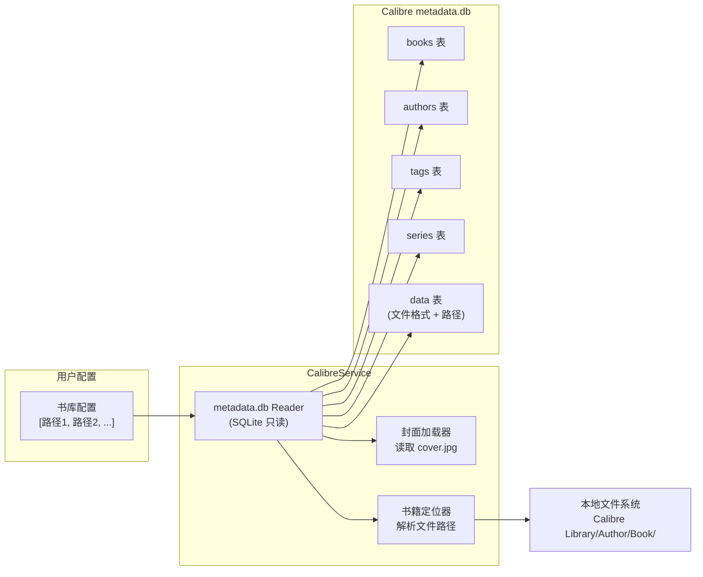

**设计要点：**
- 以**只读方式**连接 Calibre 的 `metadata.db`，不修改用户的 Calibre 数据
- 支持配置多个书库路径，通过 `CalibreService` 统一管理
- 书籍封面从 Calibre 目录结构 (`Author Name/Book Title/cover.jpg`) 中直接读取
- 桌面端由 Rust 侧（Tauri 命令）执行 SQLite 查询，高性能且无阻塞

### 5.2 阅读引擎架构

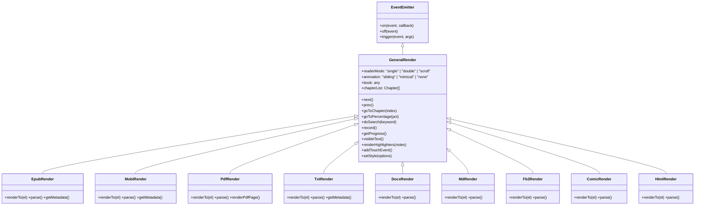

渲染器通过 `BookHelper.getRendition()` 工厂方法，根据文件格式动态创建对应实例。所有渲染器共享 `GeneralRender` 定义的统一接口。

### 5.3 TTS 语音朗读架构

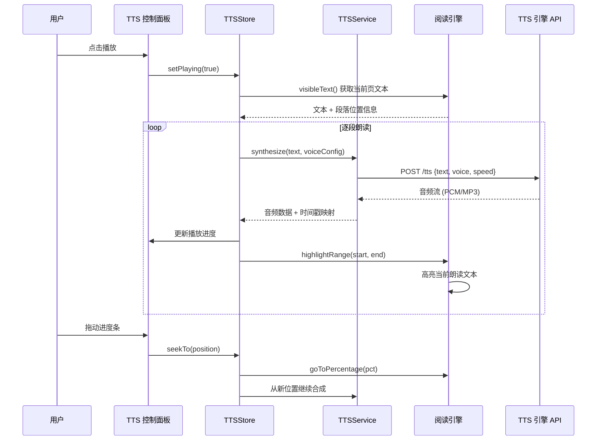

**设计要点：**
- TTS 引擎作为**可配置的外部 API**，通过 `SettingsStore` 存储端点与认证信息
- 支持多种 TTS 后端：Azure Cognitive Services、OpenAI TTS、Edge TTS、本地 TTS 服务
- 音频播放与文本高亮通过时间戳映射实现**精确同步**
- 进度条拖动时，先调整阅读引擎位置，再从新位置获取文本重新合成

### 5.4 数据流架构

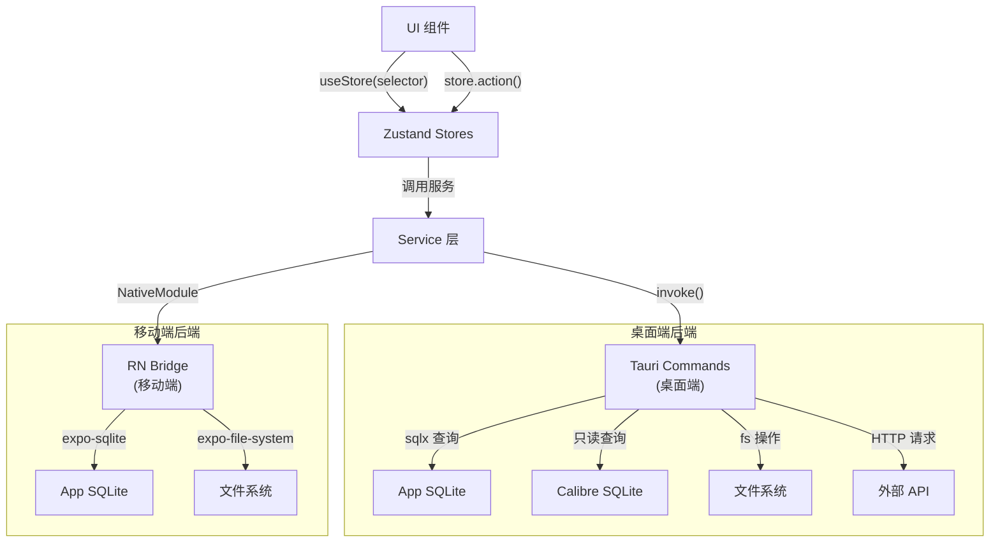

### 5.5 云同步架构

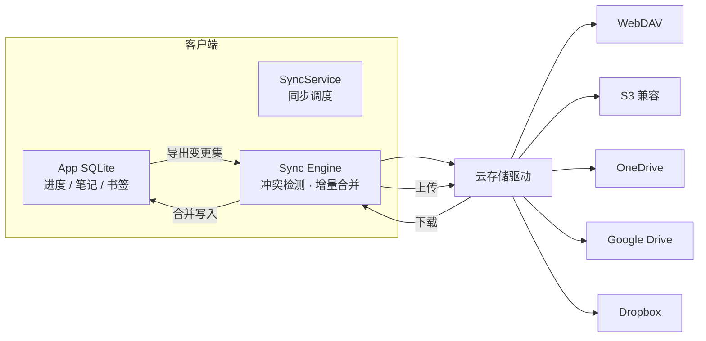

**设计要点：**
- 同步基于**变更集**（changeset）而非全量覆盖，减少传输量
- 冲突解决策略：last-write-wins + 用户可选手动合并
- 同步文件为加密的 SQLite 快照或 JSON 增量包
- 用户可自由选择同步目标，数据不经过任何第三方服务器

### 5.6 ComfyUI 集成架构

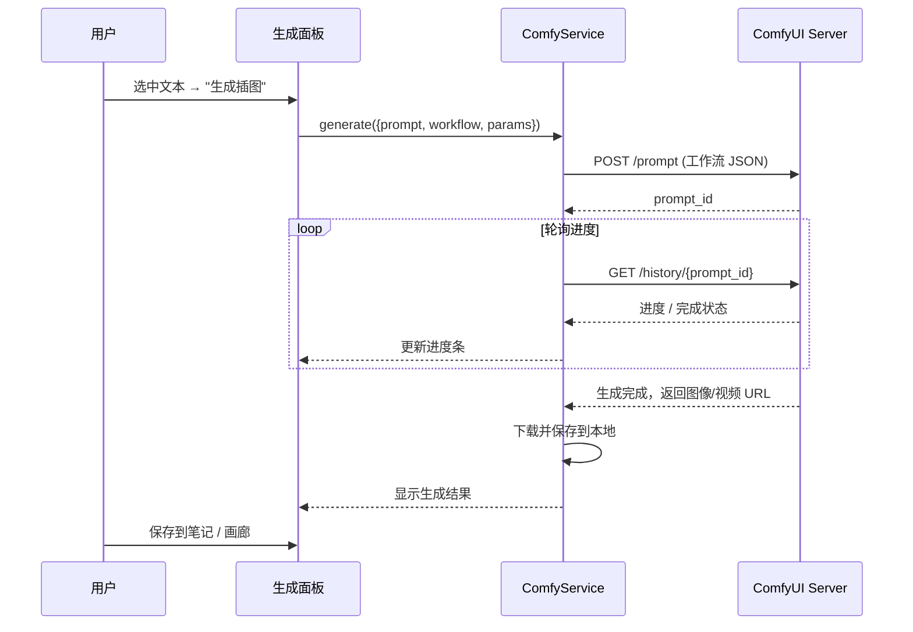

**设计要点：**
- ComfyUI 作为可选外部服务，通过 `SettingsStore` 配置 API 地址
- 内置常用工作流模板（文生图、图生图、文生视频），同时支持导入自定义工作流 JSON
- 生成结果存储在本地文件系统，关联到对应书籍或章节
- 支持 WebSocket 实时进度推送（可选）和 REST 轮询两种模式

---

## 六、移动端阅读体验设计

### 6.1 手势系统

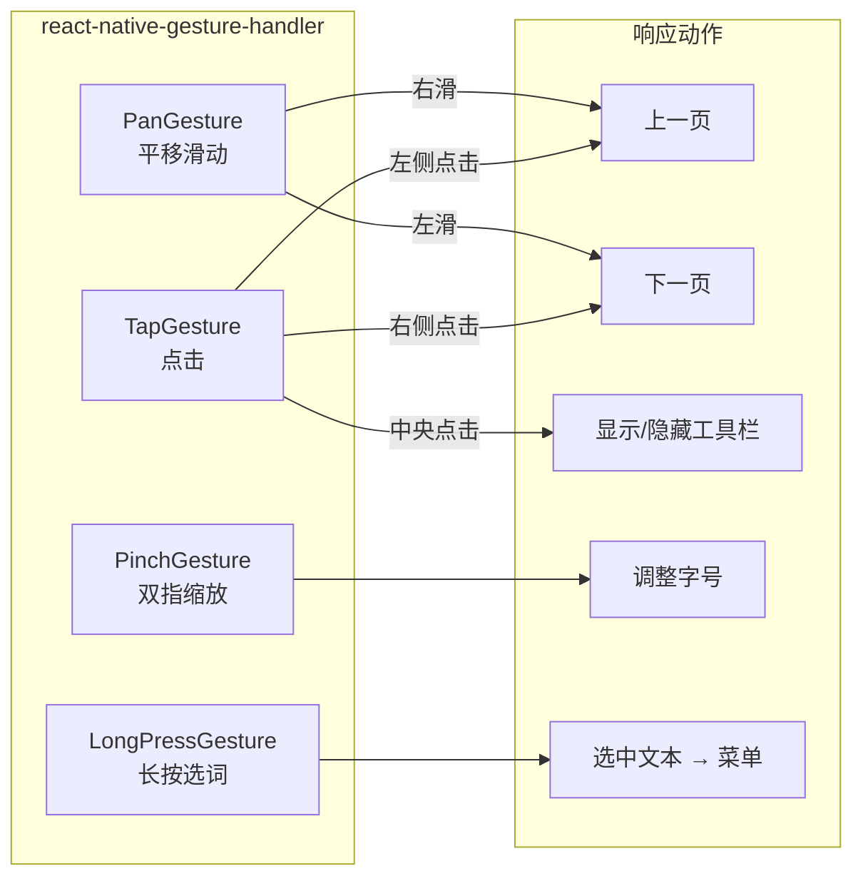

### 6.2 翻页动画

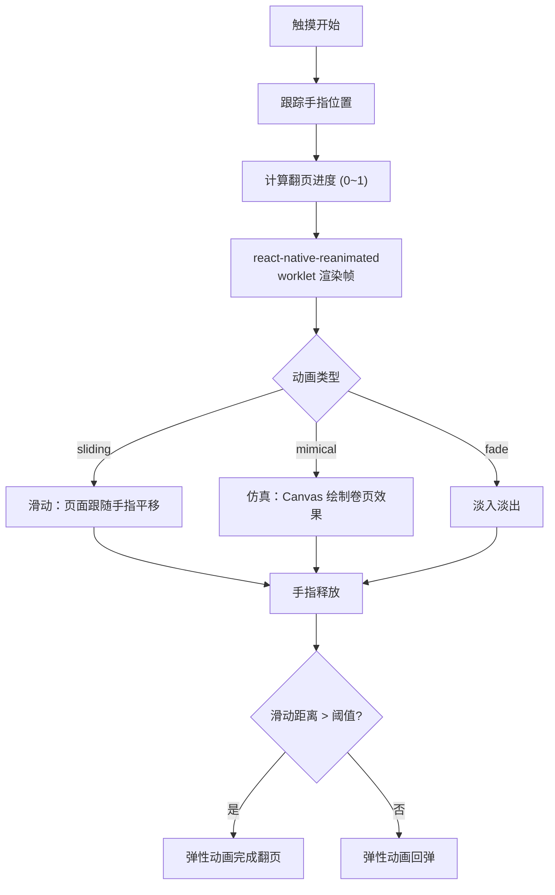

**设计要点：**
- 动画逻辑运行在 UI 线程（reanimated worklet），不阻塞 JS 线程
- 翻页动画与手势实时联动，手指移动时页面实时跟随
- 支持三种动画模式用户可选，默认根据设备性能自动选择
- 平板设备支持双页模式，横屏自动切换

---

## 七、数据模型

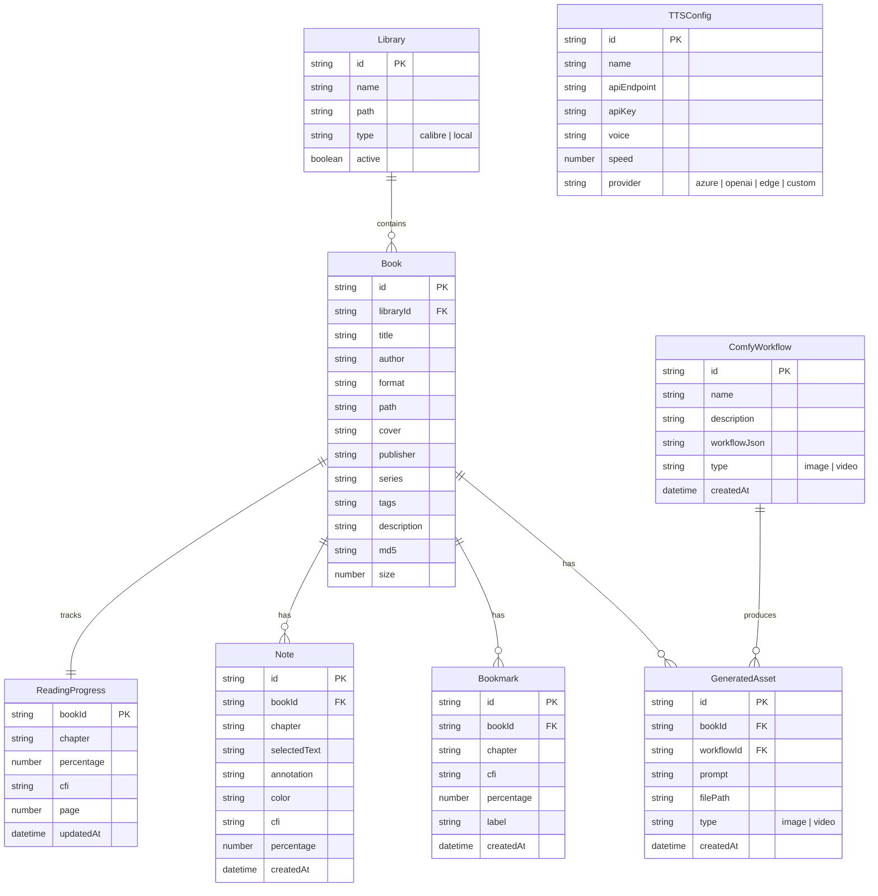

---

## 八、多平台架构

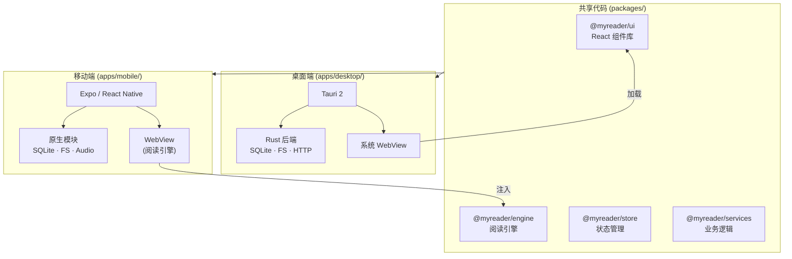

**平台差异处理：**

| 能力 | 桌面端 (Tauri) | 移动端 (React Native) |
|------|----------------|----------------------|
| SQLite 访问 | Rust sqlx (主进程) | expo-sqlite |
| 文件系统 | Rust std::fs | expo-file-system |
| 阅读引擎加载 | `<script>` 标签引入 | WebView 注入 UMD |
| TTS API 调用 | Rust HTTP 客户端 | fetch / RN networking |
| ComfyUI 通信 | Rust WebSocket 客户端 | JS WebSocket |
| 翻页动画 | CSS Transition / Canvas | reanimated worklet |
| 触摸手势 | DOM 事件 | gesture-handler 原生驱动 |

---

## 九、关键设计决策

### 9.1 Local-First 优先

选择 SQLite 作为单一数据源（而非远程数据库），保证离线完全可用。云同步作为可选的辅助功能，采用增量变更集方式同步，避免全量传输。用户数据永远本地持有，云端只是备份副本。

### 9.2 Calibre 只读集成

直接读取 Calibre 的 `metadata.db` 而非重建索引，保持与 Calibre 桌面端的完全兼容。只读模式避免意外修改用户的 Calibre 数据。多书库支持通过配置多个路径实现。

### 9.3 Tauri 而非 Electron

选择 Tauri 2 替代 Electron：安装包体积缩小约 90%（~10MB vs ~100MB+），内存占用更低，Rust 后端保证文件系统操作和 SQLite 查询的高性能。系统 WebView 保证与操作系统的一致集成。

### 9.4 阅读引擎解耦

阅读引擎作为独立 package 开发，通过 Rollup 分别构建桌面端（ES Module）和移动端（UMD）产物。桌面端直接加载，移动端注入 WebView。引擎只关注渲染与交互，不耦合任何平台 API。

### 9.5 TTS 可插拔设计

TTS 不绑定任何特定服务商，通过统一的 `TTSService` 接口抽象，用户自行配置 API 端点与密钥。内置对 Azure、OpenAI、Edge TTS 的协议适配，同时支持自定义 HTTP 接口。

### 9.6 ComfyUI 松耦合

ComfyUI 集成为完全可选的扩展功能，不安装不影响核心阅读体验。通过标准的 ComfyUI REST/WebSocket API 通信，支持用户自建或远程 ComfyUI 实例。

### 9.7 数据归属与同步存储

MyReader 已接受按数据所有权拆分的目标架构：

- 进度、书签、批注和每本书设置属于书库域，继续保存在书库 `.myreader` sidecar。
- 阅读事件、完成历史、目标和全局设置属于用户域，迁移到设备本地 Profile 数据库。
- 缓存、索引和临时状态属于设备本地域，不参与同步。
- 累计时长、连续阅读、热力图等派生统计从原始事件计算，不作为同步源。
- 每台设备使用自己的本地 SQLite；远端保存可幂等合并的逻辑变更，不直接共享活动 SQLite。

当前实现仍以书库数据库和单书库同步入口为主，Profile 数据库、应用级稳定身份与统一同步
协调器尚未完成。完整取舍、删除语义、身份模型和迁移顺序见
[ADR-0014](./docs/adr/0014-data-ownership-and-sync-storage.md)，用户域线协议见
[Profile Sync v1 草案](./docs/sync/profile-v1.md)。

历史提案和实施计划的完整正文统一保存在 [ADR 目录](./docs/adr/README.md)。

---

## 十、构建与开发流程

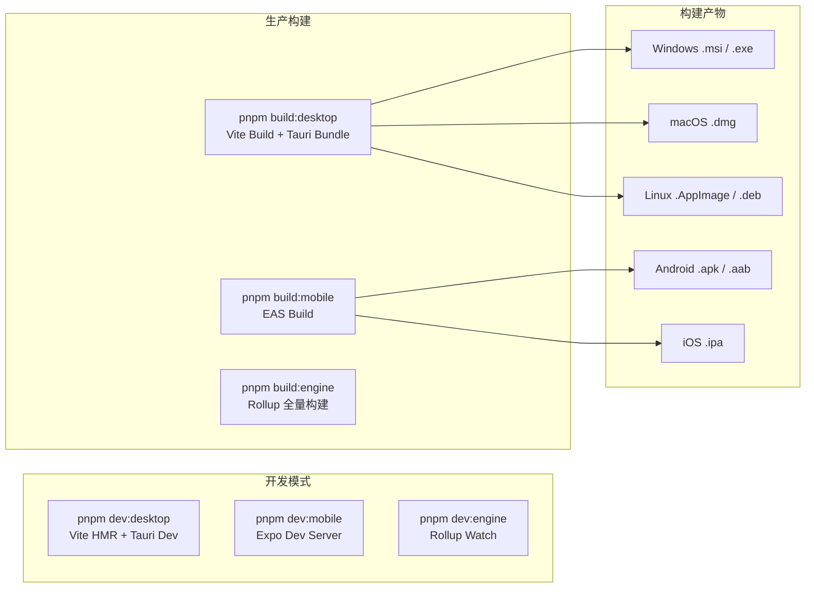

| 命令 | 用途 |
|------|------|
| `pnpm dev:desktop` | 桌面端开发模式 (Vite HMR + Tauri) |
| `pnpm dev:mobile` | 移动端开发模式 (Expo) |
| `pnpm dev:engine` | 阅读引擎开发模式 (Rollup Watch) |
| `pnpm build:desktop` | 桌面端生产构建 |
| `pnpm build:mobile` | 移动端生产构建 |
| `pnpm build:engine` | 阅读引擎全量构建 |
| `pnpm test` | 运行全部测试 |
| `pnpm test:e2e` | 运行 Playwright E2E 测试 |
| `pnpm test:e2e:ui` | Playwright UI 模式（可视化调试） |
| `pnpm lint` | 代码检查 |
