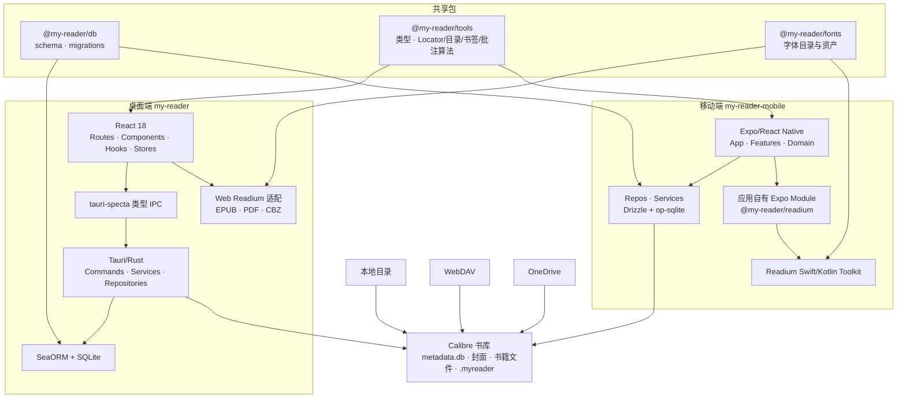

# MyReader 架构现状

> 文档日期：2026-07-23
>
> 适用范围：当前主仓库已经落地的实现。已接受但尚未实施的目标架构会单独标注，历史方案见 `docs/adr/`。

## 1. 架构摘要

MyReader 是一个 pnpm monorepo，包含 Tauri 桌面端、Expo 移动端和三个共享包。产品围绕 Calibre 书库组织：

- Calibre 拥有 `metadata.db`、封面和书籍文件，MyReader 只读查询 Calibre 元数据。
- 每个书库拥有独立的 MyReader sidecar 数据域，用于阅读进度、收藏、书签、批注等应用数据。
- 本地目录、WebDAV 和 OneDrive 是当前已经接入的数据源。
- EPUB、PDF、CBZ 是当前两端可打开的阅读格式。
- 桌面端和移动端不共享渲染内核或 UI；两端共享 Readium `Locator` 等领域语义、数据库 schema、字体目录和纯算法。



## 2. Monorepo 与所有权

根目录 `pnpm-workspace.yaml` 当前注册五个 workspace：

| Workspace | 所有权 |
|---|---|
| `my-reader` | 桌面产品 UI、Tauri IPC、Rust 业务逻辑、桌面 Readium 适配 |
| `my-reader-mobile` | 移动产品 UI、移动业务分层、设备数据访问、iOS/Android Readium 集成 |
| `packages/db` | MyReader 表和 Calibre 查询表的 Drizzle schema、跨端 SQL migrations、共享类型 |
| `packages/fonts` | 跨端阅读字体目录、字体包来源和准备脚本 |
| `packages/tools` | 可跨平台复用的类型、Reader 纯算法和产品语义 |

移动端另有两个应用内本地模块：

- `my-reader-mobile/modules/readium`：`@my-reader/readium`，应用自有的 Expo Module，不是第三方 Toolkit 的 fork。
- `my-reader-mobile/modules/book-transition`：阅读器转场原生模块。

当前没有 `apps/desktop`、`apps/mobile`、`packages/ui`、`packages/engine`、`packages/store` 或 `packages/services` 这些运行包。跨端共享边界按语义决定，不为了代码复用强行共享 React/React Native UI 或 Navigator Surface。

## 3. 桌面端

### 3.1 运行时边界

桌面端是两个主要运行层：

```text
React/WebView
  ├─ TanStack Router 页面与产品组件
  ├─ React Query 后端状态
  ├─ Zustand UI 状态
  └─ 桌面 Readium/PDF/Divina 适配
          │
          │ tauri-specta 生成的类型 IPC
          ▼
Tauri/Rust
  ├─ 配置与凭据
  ├─ Calibre 查询
  ├─ 本地/远程存储
  ├─ sidecar SQLite
  ├─ 下载与缓存
  └─ sidecar 同步
```

前端不直接维护另一套数据库连接。需要 Rust 能力的调用统一经过 `src/lib/tauri-api.ts`；它包装由 Rust 命令生成的 `tauri-specta.ts`，对前端暴露类型化 Promise API。

### 3.2 React 前端

```text
my-reader/src/
├── routes/                   TanStack Router 文件路由
├── components/
│   ├── library/              书库、图书列表与详情
│   ├── reader/
│   │   ├── readium/          EPUB、PDF、Divina/CBZ 适配和面板
│   │   └── shared/           Reader chrome 与格式间共享 UI
│   ├── settings/             数据源、书库、外观设置
│   ├── common/               通用产品组件
│   └── ui/                   桌面 UI primitives
├── hooks/
│   ├── queries/              React Query hooks
│   └── reader/               Reader 生命周期与产品行为
├── lib/
│   ├── readium/              Locator、manifest、搜索、导航、设置适配
│   ├── tauri-api.ts          IPC 门面
│   └── tauri-specta.ts       Rust 生成文件
├── stores/                   Zustand UI stores
├── i18n/                     英文与简体中文
└── main.tsx                  前端入口
```

主要状态分工：

- React Query：书库、图书、文件状态、收藏、阅读进度等后端状态和失效策略。
- Zustand：主题、阅读器 UI 偏好、当前书库和列表视图等客户端状态。
- Reader hooks：把 Navigator 事件、Locator 持久化、搜索、书签、批注和 chrome 行为连接到产品 UI。

### 3.3 Rust 后端

```text
commands/       Tauri IPC 入口
    ↓
services/       书库、图书、阅读、下载、同步等业务编排
    ↓
repositories/   SeaORM 表访问
    ↓
entities/ + db.rs + migration.rs

storage/        Local/WebDAV/OneDrive 的 OpenDAL 基础设施
auth/clients/   凭据与 OneDrive/Microsoft Graph 集成
sync/           当前 sidecar v3 JSONL/LWW 同步实现
protocols.rs    bookcover:// 与 bookfile:// 资源协议
streamer.rs     阅读资源 HTTP streamer
```

配置保存在桌面应用数据目录的 `config.json`，包括书库注册、活动书库、数据源描述和阅读器 UI 偏好。WebDAV 密码与 OneDrive token 通过系统凭据存储管理，不写回前端 DTO。

## 4. 移动端

### 4.1 产品分层

移动端入口位于 `my-reader-mobile/src/app`，使用 Expo Router。当前依赖方向是：

```text
app/ + components/ + store/ + design/
                    ↓
features/           产品页面与流程
domain/             可被多个 feature 复用的业务域
                    ↓
repos/              SQLite/Calibre 表访问
services/           文件、数据库、网络、凭据、下载、远程后端
```

`features/` 和 `domain/` 都可以包含本域的 hooks、components 和纯工具；两者差别是复用范围。`domain/` 不依赖 `features/`，`repos/` 不编排业务，`services/` 不反向依赖产品层。

```text
my-reader-mobile/src/
├── app/                      Expo Router 路由
├── features/
│   ├── home/
│   ├── library/
│   ├── onedrive/
│   ├── reader/
│   ├── settings/
│   └── webdav/
├── domain/
│   ├── library/              书库、Calibre、路径与远程书库
│   ├── sync/                 Calibre 与 MyReader sidecar 同步
│   ├── download/             下载状态与编排
│   └── reading-statistics/   阅读会话和完成记录
├── repos/                    Drizzle/Calibre 表访问
├── services/
│   ├── db/                   op-sqlite 与迁移
│   ├── fs/                   文件、路径、security-scoped bookmark
│   ├── remote/               RemoteBackend、WebDAV、OneDrive
│   ├── storage/              JSON storage 与安全凭据
│   ├── download/             原生下载
│   └── query/                React Query 基础设施
├── store/                    Zustand slices 与持久化
├── components/ui/            移动共享 UI
├── design/                   移动设计 token
├── i18n/                     英文与简体中文
└── tw/                       NativeWind primitives
```

React Query 管理可重新获取的书库/图书/阅读数据；Zustand store 通过应用文档目录中的 JSON 文件保存设置、数据源描述、书库注册和活动书库。WebDAV 密码及 OneDrive access/refresh token 使用 `expo-secure-store`。

### 4.2 原生 Readium 集成

`my-reader-mobile/modules/readium` 是移动端的应用集成层：

```text
React Native 产品层
  ├─ Reader chrome、设置、状态、数据库、同步
  └─ typed props / events / async API
              ↓
@my-reader/readium
  ├─ Expo Module 与原生 View
  ├─ Publication handle、Streamer、Search bridge
  ├─ Locator/Selection/Decoration 类型转换
  └─ iOS UIKit / Android Fragment 系统交互
              ↓
Readium Swift/Kotlin Toolkit
  └─ Publication、Navigator、Locator、Search、Decoration
```

模块源码直接随主仓库演进，通过 Expo autolinking 接入。iOS 使用 Readium Swift Toolkit，Android 使用 Readium Kotlin Toolkit；该模块不服务桌面端或 Web。

## 5. 阅读器架构

### 5.1 当前格式与平台实现

| 格式 | 桌面端 | 移动端 |
|---|---|---|
| EPUB | `@readium/navigator`，支持 reflowable/fixed-layout | Readium Swift/Kotlin EPUB Navigator |
| PDF | `pdfjs-dist` + MyReader 的 Readium Locator/Navigator 适配 | Readium PDF Navigator |
| CBZ | MyReader Divina manifest 与 fixed-layout 适配 | Readium fixed-layout/CBZ Navigator |

MOBI、AZW3、TXT、DOCX、Markdown、FB2、HTML、CBR、CBT、CB7 当前不是应用内可读格式。原生模块保留自定义 parser 扩展点不等于这些格式已经实现。

### 5.2 跨端共同语义

跨端统一的是：

- `Publication`、`Link`、`Locator` 等 Readium 领域契约。
- 阅读进度、书签和批注使用的可序列化 Locator。
- 书签位置键、批注排序、目录定位、搜索结果整理、主题和字体目录等纯产品规则。
- EPUB 重排前后的可见内容锚点策略。

跨端不统一的是：

- Navigator 和渲染 Surface。
- React 与 React Native 组件。
- PDF/CBZ/EPUB 的格式能力。
- 平台原生选择菜单、WebView 生命周期、文件访问和系统交互。

Locator 是可恢复的内容位置，不是视觉页码。持久化时保留 `href`、`type`、`locations` 和必要的文本/DOM 锚点；百分比和页码只作为展示或导航派生值。

### 5.3 能力边界

- 书签围绕 Locator 实现，可用于 EPUB、PDF、CBZ。
- 高亮和笔记依赖 Selection 与 Decoration，仅在当前 Navigator 确实提供这些能力时启用，不能从 EPUB 推断 PDF/CBZ 同样可用。
- 搜索同样按 Publication service 和格式能力运行；移动 bridge 当前明确支持 reflowable EPUB 搜索，并对 fixed-layout EPUB、PDF、CBZ 报告不可用。
- EPUB 的字体、字号、行距、主题和重排设置与 PDF/CBZ 的分页、缩放设置是不同配置面。

## 6. 数据与持久化

### 6.1 Calibre 数据

Calibre 的 `metadata.db` 是外部只读数据库：

- 本地书库直接查询。
- 远程书库将 `metadata.db` 同步到设备缓存后查询。
- MyReader 不迁移或写入 Calibre 表。
- `packages/db/src/schema/calibre` 只为 TypeScript、Drizzle 查询和 SeaORM 实体生成提供类型权威。

### 6.2 每书库 sidecar

MyReader 不使用一个全局业务数据库。每个书库拥有逻辑独立的 SQLite sidecar；根据平台和数据源，物理文件可以位于书库 `.myreader/myreader.db`、设备容器或远程书库的本地镜像中。

当前 schema 包含：

| 表 | 用途 |
|---|---|
| `reading_progress` | Readium Locator、展示进度和更新时间 |
| `bookmarks` | 书签 Locator、稳定位置键和 tombstone |
| `annotations` | 高亮、颜色、可选笔记和 tombstone |
| `favorite_books` | 收藏 |
| `book_reading_format` | 设备选择的默认阅读格式 |
| `reading_sessions` | 阅读会话和时长 |
| `reading_completions` | 每本书的完成记录 |
| `file_state` | 本地文件缓存/同步状态 |
| `book_cover_thumbnail_cache` | 移动封面缩略图缓存元数据 |
| `sync_meta` | 设备 ID、cursor 和同步元数据 |

设备本地设置与凭据不属于 sidecar 业务表，也不随当前 sidecar 协议同步。

### 6.3 Schema 权威与生成链

```text
packages/db/src/schema
        │
        ├─ drizzle-kit
        ▼
packages/db/drizzle/*.sql
        │
        ├─ 移动端：Drizzle + op-sqlite 执行
        └─ 桌面端：build.rs 嵌入 SQL，SeaORM migrator 执行

packages/db schema/migrations
        │
        └─ scripts/generate-seaorm-entities.sh
                ▼
my-reader/src-tauri/src/entities
```

修改 MyReader 表时必须修改 Drizzle schema、生成 migration，再生成桌面 SeaORM 实体；生成文件不是手工 schema 权威。

## 7. 数据源、缓存与同步

### 7.1 数据源

当前数据源只有：

- Local：本地目录或移动平台授权的目录。
- WebDAV：用户名/密码访问。
- OneDrive：OAuth 和 Microsoft Graph。

桌面存储基础设施基于 OpenDAL；移动端通过 `services/remote` 的 `RemoteBackend` 接口和 provider 实现。S3、Google Drive、Dropbox 当前没有实现。

### 7.2 远程书库数据流

远程书库不是直接对远端 SQLite 做随机查询。设备侧先获取并缓存 Calibre `metadata.db`，随后：

1. 从本地缓存查询书目。
2. 远程封面按需解析和缓存。
3. 阅读文件按格式下载到设备缓存。
4. `file_state` 记录文件的本地状态。
5. 刷新/同步后让 React Query 和产品 store 更新可见状态。

### 7.3 当前 Automerge sidecar

[ADR-0016](./docs/adr/0016-adopt-automerge-for-library-sidecar-sync.md) 使用 Automerge Core
取代旧 JSONL/HLC 同步内核：

- 每个 Calibre 书库对应一个独立 Automerge document 和一个独立本地 SQLite。
- desktop Rust 与 mobile TypeScript 使用同一 canonical genesis binary、root schema 和
  incremental fixture。
- 远端只交换
  `.myreader/automerge/changes/<actor_id>/<sequence>-<change_hash>.am`
  不可变增量；不上传 SQLite、WAL 或 SHM。
- 本地 Automerge state/change、durable outbox、receipt、projection metadata 与业务
  projection 由 SQLite 事务保护。
- 同步范围固定为收藏、阅读位置、书签、批注、阅读会话和完成记录六个现有 domain。
- 真正并发的阅读位置保留候选，用户选择后产生因果上晚于所有候选的新 change。
- SQLite 列表、详情、reader 和当前书库阅读统计仍使用本地 projection；同步完成后立即刷新相关
  查询。

ADR-0015 的 HLC、普通 JSON segment、自研 join 和旧 prepared/cursor 表已经退出产品路径。
该 breaking change 不解析或迁移旧远端同步数据；遗留远端目录也不会被自动删除。

### 7.4 同步实现边界

- Automerge 负责 change 因果关系、依赖、去重、冲突保留和收敛。
- MyReader 负责 domain command、书库身份、业务校验、SQLite projection、对象存储传输和产品
  冲突 UX。
- OneDrive、WebDAV 与 local-direct 仍是通用数据源适配器；同步协议不得把业务 envelope 重新
  塞进适配器层。
- 阅读偏好、应用设置、凭据、下载状态和缓存不进入 Automerge document。
- 跨书库统计聚合、中心 Profile、账户系统和端到端加密不属于当前实现。

## 8. 关键架构约束

1. **Calibre 只读**：不把 MyReader 业务字段写入 `metadata.db`。
2. **每书库数据域**：阅读数据随书库隔离，不存在中央账户数据库。
3. **共享语义，不共享渲染**：跨端共享 Locator、schema 和纯算法；Navigator 与 UI 归平台所有。
4. **格式能力显式区分**：EPUB、PDF、CBZ 不伪装成完全相同的 Reader API。
5. **生成链单向**：Drizzle schema/migrations 是 MyReader 表权威，SeaORM entities 和平台注入脚本是生成产物。
6. **凭据设备本地化**：WebDAV/OneDrive secret 不进入 sidecar 或前端可持久 DTO。
7. **远端交换文件而非 SQLite**：远程数据源不承载多设备同时打开的活动数据库。
8. **规划不冒充现状**：Roadmap、已接受的后续 ADR 和 bridge 扩展点都不表示功能已经可用。

## 9. 当前未实现的早期设想

以下内容曾出现在旧架构或 README 中，但不属于当前已落地能力：

- 跨平台共享的 `MyReader Engine`、`GeneralRender` 和格式 renderer 继承树。
- 共享的 React/React Native UI 组件包。
- MOBI、AZW3、TXT、DOCX、Markdown、FB2、HTML、CBR、CBT、CB7 阅读。
- 完整 TTS coordinator、语音引擎、后台朗读和逐句高亮产品流程；移动 Readium 模块目前只有内容/接口基础。
- ComfyUI 图像/视频生成。
- S3、Google Drive、Dropbox 同步驱动。
- 所有格式统一的单页、双页、滚动、仿真翻页和相同批注能力。

这些能力若进入实现，应以新的代码和 ADR/feature 文档更新本文件，不能直接恢复旧文档中的描述。

## 10. 开发与验证入口

```bash
# 开发
pnpm dev:desktop
pnpm dev:mobile

# 共享包
pnpm --filter @my-reader/fonts test
pnpm --filter @my-reader/tools test

# 桌面
pnpm --filter my-reader run test:unit
(cd my-reader/src-tauri && cargo test)

# 移动
pnpm --filter my-reader-mobile exec jest --runInBand

# 数据库 schema / SeaORM entities
pnpm db:generate
```

更完整的本机构建、E2E 和生成流程见 [DEVELOPMENT.md](./DEVELOPMENT.md)。

## 11. 相关架构决策

| ADR | 与当前架构的关系 |
|---|---|
| [ADR-0005](./docs/adr/0005-adopt-readium-reader-architecture.md) | 使用 Readium 取代自研 Reader V2 |
| [ADR-0006](./docs/adr/0006-desktop-typed-ipc-and-layered-backend.md) | 桌面类型 IPC 与 Rust 分层 |
| [ADR-0007](./docs/adr/0007-pnpm-monorepo-and-shared-code-ownership.md) | monorepo 与语义共享边界 |
| [ADR-0008](./docs/adr/0008-shared-database-schema-authority.md) | Drizzle schema/migrations 作为跨端权威 |
| [ADR-0010](./docs/adr/0010-remote-library-acceleration.md) | 远程书库的元数据、封面和文件缓存 |
| [ADR-0011](./docs/adr/0011-mobile-layer-refactor.md) | 移动产品分层 |
| [ADR-0012](./docs/adr/0012-mobile-sync-refactor.md) | 移动同步编排 |
| [ADR-0013](./docs/adr/0013-maintain-mobile-readium-integration.md) | 主仓库内维护 Expo Readium 集成层 |
| [ADR-0015](./docs/adr/0015-library-sidecar-crdt-reading-sync.md) | 已接受但尚未实施的 sidecar v4 目标 |
