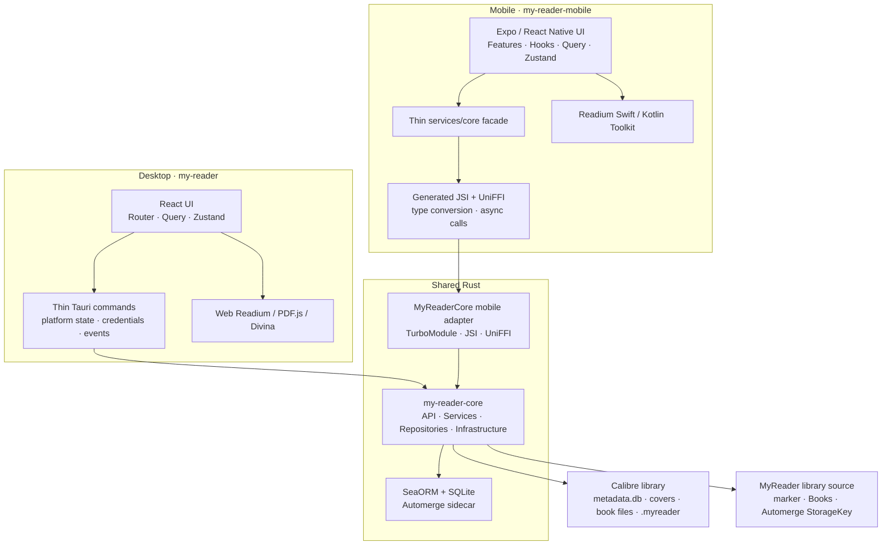

<div align="right"><a href="./ARCHITECTURE.md">简体中文</a></div>

# Current MyReader Architecture

> Document date: 2026-08-02
>
> This document describes only the current implementation. See `docs/adr/` for historical proposals and later decisions.

## 1. Architecture Summary

MyReader is a local-first, cross-platform reader supporting both Calibre and MyReader-managed libraries:

- Calibre owns its external `metadata.db`, covers, and book files. MyReader always treats Calibre libraries as read-only.
- A MyReader-managed library uses a marker to identify ownership, treats its Automerge catalog as the logical catalog authority, and projects that catalog into device-local Calibre-shaped query tables. It neither generates nor maintains `metadata.db`.
- Each library has an independent device-local SQLite sidecar and Automerge document. Calibre documents contain six reading-data roots; MyReader documents additionally contain a catalog root.
- Desktop, iOS, and Android share the Rust `my-reader-core` for database, library, catalog, reading-data, and sidecar-sync business logic.
- Tauri commands and mobile UniFFI/JSI bindings are platform adapters; they do not maintain a second database or duplicate business rules.
- UI, Readium navigators, system authorization, credentials, directory handles, lifecycle events, and background scheduling triggers remain platform-owned.
- Current data sources are local directories, WebDAV, and OneDrive. Current reading formats are EPUB, PDF, and CBZ.



## 2. Monorepo and Ownership

The pnpm workspace contains:

| Workspace | Ownership |
|---|---|
| `my-reader` | Desktop UI, Tauri adapter, desktop Readium, and desktop platform capabilities |
| `my-reader-mobile` | Mobile UI, core binding adapter, mobile Readium, and mobile platform capabilities |
| `packages/fonts` | Cross-platform reading font catalog and asset provenance |
| `packages/i18n` | Shared copy, platform-specific translations, and localization contracts |
| `packages/tools` | Cross-platform TypeScript types, pure reader algorithms, and product semantics |

Shared-backend crates in the Cargo workspace:

| Crate | Ownership |
|---|---|
| `my-reader-core` | Cross-platform business API, SeaORM access, unified catalog queries, Automerge, and sync rules |
| `my-reader-core-ffi` in `my-reader-mobile/modules/my-reader-core/rust` | Typed UniFFI exports, FFI conversion, and mobile native artifacts |

The mobile app also contains these in-app native modules:

- `my-reader-mobile/modules/my-reader-core`: connects generated UniFFI output to React Native through JSI/TurboModule.
- `my-reader-mobile/modules/readium`: MyReader-owned Readium Swift/Kotlin integration.
- `my-reader-mobile/modules/book-transition`: native reader transitions.
- `my-reader-mobile/modules/security-scoped-bookmarks`: persists and restores authorization for external iOS library directories.

React/React Native UI and navigator surfaces are not shared between platforms. Stable semantics define the sharing boundary; empty packages, crates, or abstraction layers are not created merely for reuse.

## 3. `my-reader-core`

### 3.1 Layers

```text
api/                Coarse-grained cross-platform use-case API
    ↓
services/           Business validation, transactions, and use-case orchestration
    ↓
repositories/       MyReader catalog projection and read-only Calibre access
    ↓
database.rs
entities/
migration.rs

infrastructure/     Registry and object-storage implementations
sync/               Automerge documents, persistence, transport, and scheduling rules
models/             Stable cross-layer business DTOs
```

`services`, `repositories`, and `infrastructure` are crate-internal implementations. Platforms call core through `api` and necessary stable contracts. Platform adapters do not duplicate SQL, CRDT merge rules, or business transactions.

### 3.2 Current Business Scope

`my-reader-core` owns:

- the device-local data-source and library registry;
- `calibre` / `myreader` library ownership, marker identity validation, and backward-compatible read-only defaults;
- validation for local, WebDAV, and OneDrive sources, remote directory listing, and adding, opening, and refreshing both library types;
- shared catalog count, pagination, search, details, series, format, and relative-path queries;
- single-format import, deletion, title/author updates, and catalog projection for MyReader books;
- reading-format selection, file state, and cover-thumbnail manifests;
- download deduplication, concurrency limits, cancellation, state transitions, and MyReader content SHA-256 verification;
- favorites, reading positions and conflict candidates, bookmarks, highlights, and notes;
- reading sessions, completion records, and current-library statistics;
- Automerge changes, projection, outbox, remote exchange, pull freshness, retry/suspend, and single-flight rules.

Platform capabilities outside core include UI state, Readium navigators, windows, system directory authorization, secure storage, OAuth UI, notifications, timers, and app lifecycle.

## 4. Desktop

### 4.1 Runtime Boundaries

```text
React/WebView
  ├─ TanStack Router pages and components
  ├─ React Query backend state
  ├─ Zustand UI state
  └─ Desktop reader adapter
          │
          │ typed tauri-specta IPC
          ▼
Tauri adapter
  ├─ Commands and DTO conversion
  ├─ Config and system credentials
  ├─ Windows, protocol, and streamer
  └─ Platform sync triggers
          │
          ▼
my-reader-core
```

The frontend calls generated typed IPC through `my-reader/src/lib/tauri-api.ts`. Remaining Tauri services coordinate platform concerns and convert inputs for core. Business logic already moved into core is not duplicated in Tauri repositories.

WebDAV passwords and OneDrive tokens are stored in the system credential store, not in persistent frontend DTOs or sidecars.

### 4.2 Desktop Reader

| Format | Implementation |
|---|---|
| EPUB | `@readium/navigator` |
| PDF | `pdfjs-dist` plus MyReader Readium Locator/Navigator adapter |
| CBZ | MyReader Divina manifest and fixed-layout adapter |

The desktop reader, resource protocol, HTTP streamer, and window lifecycle are desktop-platform concerns and do not enter core.

## 5. Mobile

### 5.1 Layers

```text
app/ + features/ + domain/ + hooks/
        UI, interaction, React Query, Zustand, and platform flows
                    ↓
services/core/
        Path/credential preparation, DTO conversion, query invalidation, and UniFFI calls
                    ↓
modules/my-reader-core/
        Generated TurboModule + JSI + UniFFI
                    ↓
my-reader-core
```

Mobile no longer owns `repos/`, `services/db/`, Drizzle, or an OP-SQLite database backend. `services/core` is an FFI facade and does not implement SQL, merge policy, or a second set of business rules.

TypeScript code retained on mobile must genuinely depend on the platform, for example:

- Expo Router, React Query, Zustand, and UI state.
- App-container file URIs, single-file picking, iOS external-directory authorization, and mobile download/cache file operations.
- iOS/Android share entry points; shared files and file-picker selections enter the same import use case.
- SecureStore, OAuth token refresh, and short-lived credential injection.
- Sync triggers for connectivity, foreground/background state, current library, and reader closing.
- Readium views, selection menus, decorations, gestures, and system interaction.

`domain/` contains only UI or platform flows reused by multiple mobile features. Compatibility layers that merely forward core APIs are not retained.

### 5.2 Native Reader

`my-reader-mobile/modules/readium` owns publication handles, streaming, search, locators, selections, decorations, and native view conversion. iOS uses Readium Swift Toolkit; Android uses Readium Kotlin Toolkit. The reader bridge and `my-reader-core` business binding are separate platform boundaries.

## 6. Data and Persistence

### 6.1 Calibre Data

Calibre `metadata.db` is an external read-only database:

- Desktop queries a local library directly. iOS can open Calibre libraries through an authorized external directory or a configured remote source. Android supports remote Calibre libraries only.
- Remote databases are downloaded into the device cache before core queries them.
- MyReader never migrates, extends, or writes Calibre tables.
- `my-reader-core/src/entities/calibre` contains read-only SeaORM mappings for supported Calibre tables.

### 6.2 MyReader-Managed Libraries

A MyReader-managed source contains `.myreader/library.json`, `Books/<storage-name> (<first 6 characters of book-uuid>)/<storage-name>.<format>`, and Automerge StorageKey objects stored according to [ADR-0020](./adr/0020-adopt-automerge-repo-storage-model.md). The content path is fixed at import time; changing title or author does not move it. Legacy `Books/<book-uuid>/book.<format>` paths remain unchanged. The marker, Automerge document, and device-local `library_id` projection share one stable `libraryUuid`.

The Automerge catalog is canonical. `library_id`, `books`, `authors`, `books_authors_link`, and `data` in `myreader.db` are rebuildable Calibre-shaped projections. Each book contains one EPUB, PDF, or CBZ file; stable `book_id` and `books.uuid` values are used by unified queries, readers, and existing reading-data references. MyReader does not generate, sync, or write `metadata.db`, nor convert between MyReader and Calibre libraries.

On both iOS and Android, “app storage” creates MyReader libraries under `Documents/libraries/<library-id>/` in the app container. iOS additionally offers “local storage”: a system directory picker and security-scoped bookmark can create or open a MyReader library in a user directory, or open a read-only Calibre library. `Books`, the marker, and Automerge StorageKeys remain in the external source while the active `myreader.db` stays in the app-container sidecar. Android exposes no external-local library entry and creates no private SAF mirror. Remote sources and single-book import are unaffected by this platform difference; desktop local libraries continue to use desktop filesystem capabilities.

### 6.3 Per-Library Sidecar

Each library has a logically independent `.myreader/myreader.db`. Remote libraries and iOS external-local libraries keep a local sidecar in the device container. Devices exchange data through Automerge StorageKey objects rather than sharing an active SQLite/WAL/SHM set.

Business tables:

| Table | Purpose |
|---|---|
| `library_id`, `books`, `authors`, `books_authors_link`, `data` | Local query projection for the MyReader catalog; Calibre libraries continue querying external `metadata.db` |
| `reading_progress` | Locator, display progress, conflict projection, and update time |
| `favorite_books` | Favorite state |
| `bookmarks` | Bookmark locator, stable position key, and tombstone |
| `annotations` | Highlight, color, optional note, and tombstone |
| `reading_sessions` | Reading-time intervals |
| `reading_completions` | Completion records |
| `book_reading_format` | Device-selected reading format |
| `file_state` | Local cache state for book and cover files |
| `pending_book_imports` | Device-local intent to upload remote content; the corresponding catalog outbox cannot publish until upload succeeds |
| `book_cover_thumbnail_cache` | Mobile cover-thumbnail manifest |

Sync tables:

| Table | Purpose |
|---|---|
| `sync_local_meta` | Local Automerge identity and protocol metadata for the current library |
| `sync_automerge_state` | Automerge document snapshot |
| `sync_automerge_outbox` | Local incremental chunks waiting for remote persistence |
| `sync_automerge_projection_meta` | Projection state from the document into business tables |
| `sync_errors` | Diagnostic sync errors |
| `sync_schedule_state` | Persistent pull freshness, retry, and suspension state |

Device settings, reader preferences, credentials, transient download tasks, and the library registry do not enter sidecar sync.

A MyReader document contains the catalog plus the six reading-data domains above. A Calibre document contains only those six reading-data domains. Both library types share the same state, outbox, projection, and scheduling implementation.

### 6.4 Schema Authority

The ordered SeaORM Migrator in `my-reader-core` is the sole owner of MyReader databases:

```text
my-reader-core/migrations/legacy/*.sql
        Immutable migration history
                    ↓
my-reader-core/src/migration.rs
        Ordered runtime Migrator
                    ↓
.myreader/myreader.db
                    ↓
my-reader-core/src/entities/app
        SeaORM query mappings
```

When core first opens a legacy mobile database, it records the existing Drizzle migration state as equivalent SeaORM versions and removes the obsolete metadata table. New installations never load a TypeScript migrator.

`pnpm db:generate` creates a temporary database through the same Rust Migrator, then generates SeaORM entities. Migrations are authoritative for schema and upgrade history; entities are not an Entity-First schema source.

## 7. Data Sources, Files, and Sync

### 7.1 Data Sources and Files

Current data sources are Local, WebDAV, and OneDrive. Library ownership and storage are independent: `libraryType` determines catalog authority and available commands, while `sourceType` / `dataSourceId` determines the object backend.

A remote Calibre library refreshes the external read-only `metadata.db` into the device cache before querying its catalog and fetching covers or books on demand. A remote MyReader library does not transfer `metadata.db`: it reads the marker when created or opened, then exchanges catalog and reading data through Automerge StorageKeys.

MyReader content and Automerge form the content plane and control plane on the same data source:

1. Import first copies content to a device staging file, and core calculates `size + sha256`.
2. A remote import writes content and catalog projection locally. `pending_book_imports` stores stable `book_id + books.uuid`, while `file_state` becomes `dirty_push`. Existing Automerge outbox entries remain unpublished until content is uploaded and its remote size is confirmed.
3. The independent core `BookTransferService` retries content upload in the background without occupying a sidecar sync task. After upload and stat succeed, it marks the file `present`, removes the pending intent, and schedules a short push to publish the original catalog change. The pending table does not participate in merging and is not a second catalog. Missing local upload files become `source_missing` without failing sidecar/Automerge sync.
4. Other devices mark content `remote_only` after merging the catalog. Opening or explicitly downloading writes a `.part` file in the same directory; the file is atomically installed and marked `present` only after both size and SHA-256 match.
5. Deletion persists an Automerge tombstone to the shared data source before idempotently removing remote content and device caches.
6. Manually deleting a source file produces only `source_missing`; it does not create a catalog tombstone.

OpenDAL's OneDrive backend uploads large files in chunks through an upload session. Device-local `file_state` records `dirty_push`, `remote_only`, `present`, `source_missing`, and verified `local_sha256`. Content bytes and intermediate transfer state do not enter the Automerge document.

Object storage, Calibre refresh, and Automerge sync have different semantics. Manual “sync all” orchestrates the control-plane stages required by the library type. Durable outbox events drive automatic sync, while an independent background task consumes the device-local content-transfer queue.

### 7.2 Automerge Sidecar

[ADR-0016](./adr/0016-adopt-automerge-for-library-sidecar-sync.md) is implemented:

- Each library has one Automerge document.
- Calibre libraries sync six domains: favorites, reading position, bookmarks, annotations, reading sessions, and completion records. MyReader libraries add a catalog root to the same document.
- Core owns causal changes, deduplication, conflict candidates, SQLite projection, outbox, and convergence.
- Truly concurrent reading positions remain as candidates; choosing one writes a causally newer change.
- After sync, platforms only refresh visible queries.

[ADR-0020](./adr/0020-adopt-automerge-repo-storage-model.md) additionally specifies:

- Remote storage uses automerge-repo `StorageSubsystem` snapshot/incremental `StorageKey` values mapped directly to `.myreader/automerge/<document_id>/<kind>/<hash>`. `document_id` is the Calibre `library_id.uuid` or the MyReader marker's `libraryUuid`.
- Core owns snapshot-first loading, content-addressed incrementals, and concurrency-safe compaction that deletes only covered chunks.

Automatic sync follows [ADR-0017](./adr/0017-event-driven-library-sidecar-sync-scheduling.md): business writes notify the platform trigger; core owns debounce/max-wait, single-flight, pull freshness, retry/backoff, suspension, and recovery rules. Platforms provide foreground/background, connectivity, library-switch, reader-close, and timer events.

Legacy JSONL/HLC, custom joins, CR-SQLite, and temporary v4 remote data are not part of the current product path.

## 8. Reading Positions and Format Capabilities

Platforms share stable `Publication`, `Link`, and `Locator` semantics. A locator is a recoverable content position, not a visual page number; persistence retains `href`, `type`, `locations`, and necessary text/DOM anchors.

| Format | Desktop | Mobile |
|---|---|---|
| EPUB | Web Readium | Readium Swift/Kotlin EPUB Navigator |
| PDF | PDF.js adapter | Readium PDF Navigator |
| CBZ | Divina/fixed-layout adapter | Readium fixed-layout/CBZ Navigator |

Bookmarks work across formats around locators. Selection, decoration, highlighting, search, reflow, and settings must be gated by the actual navigator and format; the three formats cannot be assumed identical.

## 9. Key Constraints

1. **Calibre is read-only:** never write MyReader fields into `metadata.db` or upgrade a Calibre library into a writable library.
2. **Independent MyReader ownership:** marker plus Automerge catalog defines a MyReader library. Reusing table shapes does not imply Calibre compatibility or library conversion.
3. **Per-library data domains:** business data is isolated by library; there is no central profile database.
4. **Shared business logic, separate rendering:** core unifies the backend; UI, navigators, and system capabilities remain platform-owned.
5. **One database writer:** desktop and mobile access MyReader SQLite through core.
6. **Rust migrations are authoritative:** do not restore a TypeScript/Drizzle schema chain or Entity-First schema sync.
7. **Credentials remain device-local:** secrets never enter sidecars, Automerge, or persistent frontend DTOs.
8. **Remote sync exchanges changes, not SQLite databases.**
9. **No speculative features:** ratings, shelves, accounts, central profiles, cross-library statistics, and other nonexistent capabilities do not enter the current architecture.

## 10. Verification Entry Points

```bash
# Shared Rust
cargo test -p my-reader-core -p my-reader-core-ffi

# Core hot-path baseline
cargo run -p my-reader-core --release --example runtime_baseline -- 1000

# Shared TypeScript
pnpm --filter @my-reader/fonts test
pnpm --filter @my-reader/i18n test
pnpm --filter @my-reader/tools test

# Desktop
pnpm --filter my-reader run test:unit
(cd my-reader/src-tauri && cargo test)

# Mobile
pnpm --filter my-reader-mobile exec jest --runInBand
pnpm core:build-bindings:ios
pnpm core:build-bindings:android

# Regenerate app entities from the core Migrator
pnpm db:generate
```

See the [Development Guide](./DEVELOPMENT_EN.md) for local builds, E2E, and platform tests. See the [my-reader-core runtime baseline](./my-reader-core-runtime-baseline.md) for local core builds, native artifacts, and hot-query reference values.

## 11. Related ADRs

| ADR | Current relationship |
|---|---|
| [ADR-0005](./adr/0005-adopt-readium-reader-architecture.md) | Foundation of the current reader architecture |
| [ADR-0006](./adr/0006-desktop-typed-ipc-and-layered-backend.md) | Foundation of typed desktop IPC and backend layering |
| [ADR-0007](./adr/0007-pnpm-monorepo-and-shared-code-ownership.md) | Monorepo and semantic-sharing principles |
| [ADR-0008](./adr/0008-shared-database-schema-authority.md) | Superseded by ADR-0019; retained as history |
| [ADR-0013](./adr/0013-maintain-mobile-readium-integration.md) | Ownership of the mobile Readium integration |
| [ADR-0016](./adr/0016-adopt-automerge-for-library-sidecar-sync.md) | Current Automerge sync kernel |
| [ADR-0017](./adr/0017-event-driven-library-sidecar-sync-scheduling.md) | Current automatic sync scheduling semantics |
| [ADR-0018](./adr/0018-shared-rust-components.md) | Shared Rust/UniFFI pilot; crate organization partly superseded by ADR-0019 |
| [ADR-0019](./adr/0019-adopt-modular-my-reader-core.md) | Current shared backend and database authority |
| [ADR-0020](./adr/0020-adopt-automerge-repo-storage-model.md) | Current remote Automerge storage, compaction, and recovery model |
| [ADR-0021](./adr/0021-support-myreader-managed-libraries.md) | Current MyReader library, catalog projection, and content sync model |
