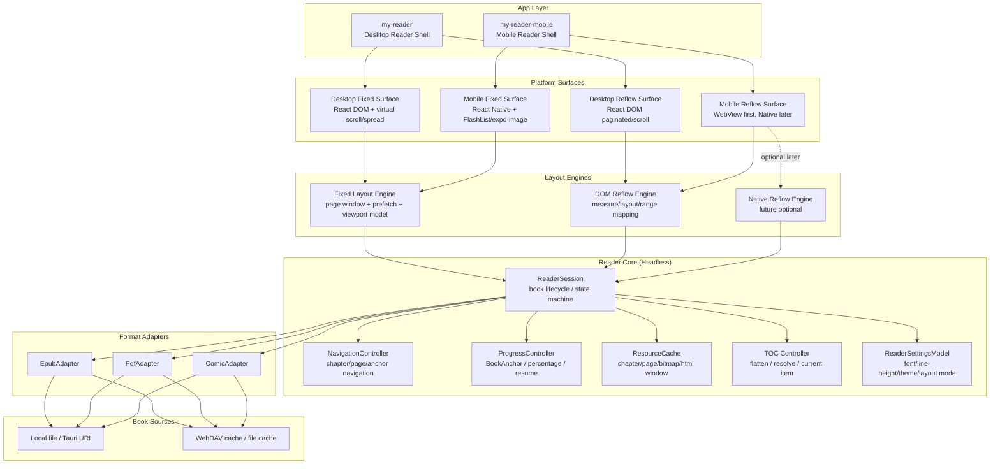
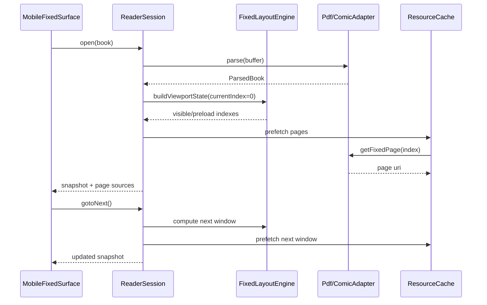
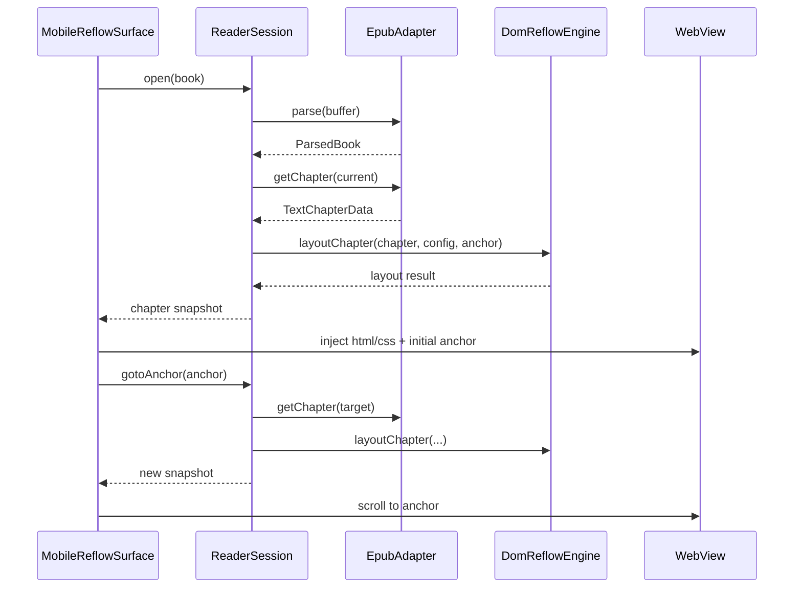

# READER-ARCHITECTURE-V2

## 一、当前版本的主要缺陷

现有阅读器架构的方向是正确的：尝试把解析、分页、渲染从业务 UI 中抽离出来，形成一套可复用的阅读器内核。但从当前桌面端、移动端和 `my-reader-tools` 的实际实现来看，第一版架构仍然存在几个关键问题，已经开始限制移动端性能、跨端一致性和后续演进空间。

### 1. “Headless” 抽象不彻底，核心层仍然强依赖 DOM

第一版文档里，`Reader`、`Parser`、`Paginator`、`Render` 被描述为逻辑与视图解耦。但当前实现中，流式正文分页的核心能力仍然深度依赖浏览器 DOM：

1. `BookReader.layout()` 需要 `measureHost: HTMLDivElement`。
2. `ProgressivePaginator` 使用 `document.createElement`、`Range`、DOM clone、图片预解码等浏览器能力完成分页。
3. `renderTextChapterPage()` 直接基于 DOM 节点和 CSS 作用域输出页面内容。

这意味着当前真正无关平台的只有一部分“导航状态机”和“解析器壳子”，而不是完整的阅读器核心。

### 2. 固定版式与浮动版式共用了一套过于折中的控制层

固定版式和浮动版式在本质上是两种不同的问题：

1. 固定版式的核心问题是页资源调度、预取、缩放、连续滚动和可见窗口管理。
2. 浮动版式的核心问题是 HTML/CSS 排版、章内锚点、分页切片、滚动续读和内部链接。

第一版架构虽然在数据模型里区分了 `ImageChapterData` 与 `TextChapterData`，但在控制器层仍试图用同一套 `Reader + Paginator` 语义覆盖两种模式。这会导致 API 越来越抽象，最终既不利于 fixed layout 性能优化，也不利于 reflowable layout 的平台适配。

### 3. 移动端没有形成独立的原生阅读 Surface

当前桌面端已经实现了较完整的 fixed/reflowable 双路径，但移动端仍然停留在过渡态：

1. 当前移动端阅读器只真正支持固定版式的 PDF / CBZ。
2. EPUB 等浮动版式并未接入移动端阅读路径。
3. 移动端固定版式仍运行在 `expo/dom` 环境中，本质上是 DOM 子运行时里的图片阅读器，而不是 React Native 原生阅读器 Surface。

这导致移动端无法充分利用原生图片缓存、列表虚拟化、页面窗口预取、内存释放和 WebView/原生渲染的各自优势。

### 4. 解析缓存与渲染缓存混在一起，没有统一的资源缓存层

目前 `ComicParser`、`PdfParser` 等解析器内部各自维护了缓存，但这些缓存更像“解析结果缓存”，而不是“会话级资源缓存”。

这带来几个问题：

1. 缓存策略不感知当前视口和阅读模式。
2. 无法统一做页窗口预取。
3. 无法统一做超出窗口资源释放。
4. 无法自然扩展到磁盘缓存与内存缓存的组合。

对于移动端而言，这个缺口会直接表现为：翻页时才开始加载、峰值内存较高、无法建立稳定的邻近页体验。

### 5. 流式正文的滚动模式在桌面端可用，但不适合作为移动端默认实现

当前桌面端滚动模式会把全书章节加载到内存中，以支持全书连续滚动。这对桌面浏览器是一个可接受的折中，但对移动端并不适合：

1. 章节数多时会明显放大内存占用。
2. 加载链路容易拉长首屏时间。
3. JS 线程在连续解析章节时会产生卡顿风险。

因此，第一版架构虽然定义了 `gotoPage`、`gotoNextPage`、`gotoPrevPage` 等通用接口，但没有对“章节窗口化”这一移动端关键能力给出明确建模。

### 6. 架构文档没有区分“逻辑分页”和“测量分页”

第一版文档中的 `Paginator` 同时承担了两种职责：

1. 逻辑层：维护当前页、上一页、下一页、缓存和翻页导航。
2. 测量层：根据视口、字体、样式和内容真实算出分页切片。

这在桌面端实现阶段是方便的，但在跨端演进时会成为问题。因为：

1. 固定版式几乎不需要“文本测量分页”。
2. 浮动版式的测量分页在 DOM、WebView、原生文本引擎之间完全不同。
3. 真正跨端稳定的，应该是逻辑导航模型，而不是具体测量实现。

---

## 二、V2 架构设计

V2 的核心目标是：

1. 真正把跨端共享的能力收敛到 Headless Core。
2. 把 DOM 相关实现从核心层剥离为 Layout Engine / Surface Adapter。
3. 让固定版式与浮动版式分别沿着最合适的性能路径演进。
4. 让桌面端继续复用现有能力，同时为移动端建立原生优先的阅读器 Surface。

### 总体分层



---

### 2.1 Reader Core

Reader Core 是跨端共享的无头内核，必须不直接依赖 React、DOM、WebView 或 React Native 组件树。

#### 2.1.1 ReaderSession

`ReaderSession` 是 V2 的核心控制器，用来取代当前过于肥大的 `BookReader`。

它的职责包括：

1. 负责书籍生命周期：打开、关闭、销毁。
2. 维护当前阅读快照：当前章节、当前页、当前锚点、加载状态、错误状态。
3. 协调 `FormatAdapter`、`LayoutEngine`、`ResourceCache`。
4. 对外提供订阅与命令式导航接口。

建议接口：

```ts
interface ReaderSession {
  open(input: OpenBookRequest): Promise<OpenBookResult>
  close(): void

  getSnapshot(): ReaderSnapshot
  subscribe(listener: () => void): () => void

  gotoChapter(index: number): Promise<void>
  gotoPageInChapter(offset: number): Promise<void>
  gotoNext(): Promise<void>
  gotoPrev(): Promise<void>
  gotoAnchor(anchor: BookAnchor): Promise<void>

  prefetchAroundCurrent(): Promise<void>
}
```

#### 2.1.2 NavigationController

`NavigationController` 负责导航逻辑本身，而不是界面渲染。它需要统一处理：

1. 章节跳转。
2. 章内页跳转。
3. 固定版式的上一页/下一页。
4. 浮动版式的分页翻页或滚动续读。
5. 目录点击与内部链接跳转。

它的价值在于把“跳到哪里”与“如何渲染出来”分离开来。

#### 2.1.3 ProgressController

`ProgressController` 统一负责阅读进度与锚点模型，继续沿用并扩展现有的 `BookAnchor` 思路。

职责包括：

1. 输出全书进度百分比。
2. 构建持久化锚点。
3. 从持久化锚点恢复阅读位置。
4. 统一 fixed layout 与 reflowable layout 的进度计算。

语义建议：

1. 固定版式以页位置细分进度。
2. 浮动版式以章节体量加权，并结合 `charOffset` / boundary 细分。

#### 2.1.4 ResourceCache

`ResourceCache` 是 V2 新增的关键层，负责统一缓存策略。

职责包括：

1. 章节内容缓存。
2. 固定版式页资源缓存。
3. PDF 页图缓存。
4. 邻近章节 / 邻近页预取。
5. 超出窗口资源释放。
6. 内存缓存与磁盘缓存协同。

它与 `Parser` 内部 cache 的区别在于：

1. `Parser` cache 更偏向解析结果复用。
2. `ResourceCache` 更偏向当前阅读会话的视口感知缓存。

#### 2.1.5 TOC Controller

`TOC Controller` 统一负责：

1. 目录树标准化。
2. 树状 TOC 扁平化。
3. 当前章节/页对应的 TOC 高亮。
4. TOC href 到 `chapterIndex` / `BookAnchor` 的解析。

这样桌面端与移动端不再各自维护 TOC flatten 逻辑。

#### 2.1.6 ReaderSettingsModel

`ReaderSettingsModel` 只维护阅读语义相关设置，不关心面板打开状态等 UI 细节。

职责包括：

1. 字号、字族、行高、边距。
2. `paginate` / `scroll`。
3. fixed layout 的 single / spread / fit-width / original。
4. 主题、亮度、方向等阅读属性。

---

### 2.2 Format Adapters

V2 中把第一版的 `Parser` 升级为 `Format Adapter` 概念。原因是解析器除了 `parse()` 之外，实际上还承担了章节数据和资源供应能力。

统一接口建议：

```ts
interface BookFormatAdapter {
  parse(buffer: ArrayBuffer): Promise<ParsedBook>
  getChapter(index: number): Promise<ChapterData>
  resolveInternalLink?(
    fromChapterIndex: number,
    href: string
  ): ResolvedInternalTextLink | null
  destroy(): void
}
```

#### 2.2.1 EpubAdapter

`EpubAdapter` 负责：

1. 解析 EPUB 元数据、目录、spine。
2. 输出 `TextChapterData`。
3. 提供内部链接解析能力。
4. 为 `BookAnchor` / `charOffset` 恢复提供章节正文语义。

#### 2.2.2 PdfAdapter

`PdfAdapter` 负责：

1. 解析 PDF 元数据和目录。
2. 提供按页访问能力。
3. 输出固定版式单页资源。

在 V2 中，桌面端和移动端允许共享“文档解析接口”，但不要求共享“页渲染实现”。移动端可根据性能需要走不同的页图生成或原生 PDF 渲染路径。

#### 2.2.3 ComicAdapter

`ComicAdapter` 负责：

1. 解析 CBZ 文件。
2. 构建固定版式页索引。
3. 输出单页图片资源。
4. 提供简单目录或卷/章节分组信息。

---

### 2.3 Layout Engines

V2 中明确把 Layout Engine 从 Reader Core 中拆出来。核心原则是：

1. Core 只知道“我需要一个布局结果”。
2. 具体如何测量和输出布局结果，由平台相关的 Layout Engine 实现。

#### 2.3.1 FixedLayoutEngine

固定版式并不需要文本测量分页，因此它的核心职责不是“切页”，而是“管理页窗口与视口状态”。

职责包括：

1. 生成当前应显示的页索引。
2. 生成邻近预取窗口。
3. 统一 single page、spread、scroll 三种 fixed 阅读模式下的视口模型。
4. 为 UI 提供 `visibleIndexes`、`preloadIndexes`、`canGoNext`、`canGoPrev`。

建议模型：

```ts
interface FixedViewportState {
  currentIndex: number
  visibleIndexes: number[]
  preloadIndexes: number[]
  canGoNext: boolean
  canGoPrev: boolean
}
```

#### 2.3.2 DomReflowEngine

`DomReflowEngine` 是当前 `ProgressivePaginator + renderTextChapterPage + DOM boundary mapping` 的正式抽象。

职责包括：

1. 基于 HTML/CSS/DOM Range 对章节进行测量和分页。
2. 输出 `sliced` 或 `full` 模式布局结果。
3. 处理 `fragmentId` 定位。
4. 处理 `charOffset` / boundary 到列页的映射。

建议接口：

```ts
interface ReflowLayoutEngine {
  layoutChapter(
    chapter: TextChapterData,
    config: LayoutConfig,
    options?: {
      initialAnchor?: BookAnchor | null
      fragmentId?: string | null
    }
  ): Promise<ReflowLayoutResult>
}
```

#### 2.3.3 NativeReflowEngine

`NativeReflowEngine` 在 V2 中只作为未来可选项，不作为第一阶段落地目标。

引入它的前提是：

1. WebView reflow 路径已被验证无法满足移动端性能目标。
2. EPUB 样式兼容范围已经裁剪清晰。
3. 可以接受移动端与桌面端排版结果不完全一致。

在达成以上条件之前，移动端浮动版式优先采用 WebView + DOM layout engine。

---

### 2.4 Platform Surfaces

Platform Surface 是具体承载阅读内容的 UI 表面层。它不拥有阅读状态机，只消费 `ReaderSession` 的快照和命令。

#### 2.4.1 Desktop Fixed Surface

桌面端固定版式 Surface 继续沿用现有 React DOM 方案，负责：

1. single / spread / scroll 展示。
2. 键盘翻页与快捷键。
3. TOC、设置面板、底栏进度。
4. 固定版式连续滚动虚拟化。

#### 2.4.2 Desktop Reflow Surface

桌面端浮动版式 Surface 继续沿用现有 React DOM 方案，负责：

1. scroll / paginate 模式切换。
2. 单章分页 DOM 绘制。
3. 全书滚动视图。
4. 内部链接捕获与续读恢复。

#### 2.4.3 Mobile Fixed Surface

移动端固定版式 Surface 是 V2 的优先建设项，应从 `expo/dom` 过渡到 React Native 原生优先实现。

推荐形态：

1. `FlashList` 或 `FlatList` 横向分页阅读。
2. `expo-image` 负责页图渲染。
3. 邻近页窗口预取。
4. 可选连续滚动模式。

推荐窗口策略：

1. `visible = [current - 1, current, current + 1]`
2. `preload = [current - 2, current + 2]`
3. 超出 `current +/- 4` 的页资源可释放。

#### 2.4.4 Mobile Reflow Surface

移动端浮动版式 Surface 在 V2 第一阶段采用 WebView 优先方案。

职责拆分：

1. React Native 外层负责：顶部栏、底栏、目录、设置、手势、持久化。
2. WebView 内负责：HTML/CSS 渲染、章节定位、滚动位置同步。
3. Reader Core 负责：章节切换、续读锚点、进度快照。

推荐加载策略：

1. 默认滚动阅读模式。
2. 只保留当前章和邻近章窗口，而不是全书一次性加载。
3. 章节切换时使用 `BookAnchor` 统一恢复位置。

---

### 2.5 数据模型建议

为保证桌面端与移动端共用统一状态快照，V2 建议引入更明确的数据模型。

#### ReaderSnapshot

```ts
interface ReaderSnapshot {
  ready: boolean
  loading: boolean
  error: string | null

  layoutMode: "fixedLayout" | "reflowable" | "unknown"
  totalChapters: number
  toc: TocItem[]

  currentChapter: number
  currentPageInChapter: number
  totalPagesInChapter: number

  progress: ReaderProgress
  currentAnchor: BookAnchor | null
}
```

#### FixedSurfaceSnapshot

```ts
interface FixedSurfaceSnapshot {
  totalPages: number
  currentIndex: number
  visibleIndexes: number[]
  preloadIndexes: number[]
}
```

#### ReflowSurfaceSnapshot

```ts
interface ReflowSurfaceSnapshot {
  readingLayout: "paginate" | "scroll"
  currentChapter: number
  currentAnchor: BookAnchor | null
  chapterWindow: number[]
}
```

---

### 2.6 推荐目录边界

V2 推荐将跨端核心目录调整为：

```text
my-reader-tools/
  src/
    reader-core/
      ReaderSession.ts
      NavigationController.ts
      ProgressController.ts
      ResourceCache.ts
      types.ts

    format-adapters/
      EpubAdapter.ts
      PdfAdapter.ts
      ComicAdapter.ts

    layout-engines/
      fixed/
        FixedLayoutEngine.ts
      reflow/
        DomReflowEngine.ts
        DomBoundaryMapper.ts
        DomSliceRenderer.ts
        types.ts

    progress/
      BookAnchor.ts
      epubBookAnchor.ts
      reflowViewportAnchor.ts

my-reader/
  src/components/reader/
    fixed-layout/
    reflowable/
    shared/

my-reader-mobile/
  src/components/reader/
    fixed/
      MobileFixedReader.tsx
      FixedPagerView.tsx
      FixedScrollView.tsx
      PageCell.tsx
    reflow/
      MobileReflowReader.tsx
      ReflowWebViewBridge.tsx
      ReflowChapterWindow.ts
    shared/
      ReaderChrome.tsx
      ReaderTocSheet.tsx
      ReaderProgressBar.tsx
```

---

### 2.7 典型链路

#### 固定版式链路



#### 浮动版式链路



---

## 三、V2 相比 V1 的优化点

V2 并不是完全推翻第一版，而是在第一版“Reader / Parser / Paginator / Render 分层”思路上的一次工程化收敛。它相对 V1 的主要优化体现在以下几个方面。

### 1. 真正把跨端共享能力收敛到了 Core

V1 中核心层仍深度依赖 DOM。V2 则把共享能力明确限定为：

1. 书籍生命周期。
2. 导航控制。
3. 进度锚点。
4. TOC 处理。
5. 会话级缓存。

这样“Headless” 才变成真实可复用的工程边界，而不是停留在概念层。

### 2. 把 DOM 测量分页从核心层剥离出来

V1 把“逻辑导航”和“DOM 测量分页”混在 `BookReader + Paginator` 中。V2 明确区分：

1. `ReaderSession` 负责控制与状态。
2. `DomReflowEngine` 负责排版测量。
3. 未来可以引入 `NativeReflowEngine` 而不需要重写整个阅读器控制层。

这为移动端浮动版式的演进提供了明确路径。

### 3. 固定版式和浮动版式不再强行共用一套过度抽象的分页语义

V1 中 fixed 和 reflow 虽然数据上区分了，但控制层仍然被迫共享同一类 API。V2 则明确：

1. fixed layout 关注页窗口、预取和视口状态。
2. reflowable layout 关注章节排版、锚点与滚动/分页切换。

这样两条路线都能针对各自性能瓶颈优化，而不会互相牵制。

### 4. 为移动端建立了独立的性能路径

V1 没有给移动端单独建模，导致移动端只能复用桌面端的 DOM 思路。V2 明确建立：

1. `Mobile Fixed Surface`：React Native 原生图片 + 列表虚拟化 + 预取。
2. `Mobile Reflow Surface`：WebView 优先，章节窗口化。

这让移动端性能优化有了清晰、可实施的落点。

### 5. 新增 ResourceCache，补上了缓存策略层

V1 的缓存散落在 parser 内部。V2 引入 `ResourceCache` 后，可以统一实现：

1. 邻近页预取。
2. 邻近章节预取。
3. 窗口外资源释放。
4. 内存/磁盘缓存分层。

这对于移动端 fixed layout 和 reflowable layout 都是关键提升。

### 6. 文档与实现更一致，后续重构更容易拆解

V1 的问题之一是：文档里看起来已经跨平台解耦，但代码里仍然把大量平台细节塞进了核心层。V2 把“Core / Engine / Surface / Adapter”的边界写清楚后，后续重构可以按层推进：

1. 先拆 `ReaderSession`。
2. 再拆 `DomReflowEngine`。
3. 再补 `MobileFixedSurface`。
4. 最后接入 `MobileReflowSurface`。

这样迁移路径更平滑，风险也更可控。

---

## 四、结论

第一版架构解决了“不要把阅读逻辑直接写死在 UI 组件里”的问题；V2 则进一步解决了“如何让这套逻辑真正跨端、真正适合移动端性能优化”的问题。

可以把 V2 概括为一句话：

**把阅读器拆成 Headless Core、Format Adapters、Layout Engines 和 Platform Surfaces，让固定版式与浮动版式分别沿着最合适的性能路径演进。**

这也是后续桌面端稳定演进、移动端补齐 EPUB 阅读、以及长期统一阅读器能力的基础。

---

## 五、基于当前仓库的迁移计划

这一节不描述理想架构本身，而是把 V2 如何从当前仓库逐步落地写成一个可执行迁移计划。迁移原则如下：

1. 优先做“边界拆分”，再做“能力替换”。
2. 优先保证桌面端不回退，再逐步补齐移动端。
3. 固定版式与浮动版式分开迁移，避免互相阻塞。
4. 先提炼兼容层，再迁移调用方，最后删除旧实现。

### 5.1 当前仓库的起点

当前仓库里与阅读器重构最相关的模块如下：

#### `my-reader-tools`

当前核心文件：

1. `my-reader-tools/src/rendition/BookReader.ts`
2. `my-reader-tools/src/rendition/types.ts`
3. `my-reader-tools/src/rendition/pagination/ProgressivePaginator.ts`
4. `my-reader-tools/src/rendition/parsers/EpubParser.ts`
5. `my-reader-tools/src/rendition/parsers/PdfParser.ts`
6. `my-reader-tools/src/rendition/parsers/ComicParser.ts`
7. `my-reader-tools/src/progress/BookAnchor.ts`
8. `my-reader-tools/src/progress/epubBookAnchor.ts`
9. `my-reader-tools/src/progress/reflowViewportAnchor.ts`

#### `my-reader`

桌面端阅读器主入口和关键 Surface：

1. `my-reader/src/hooks/reader/useReader.ts`
2. `my-reader/src/components/reader/ReadBookPage.tsx`
3. `my-reader/src/components/reader/fixed-layout/FixedLayoutReader.tsx`
4. `my-reader/src/components/reader/fixed-layout/FixedLayoutScrollViewport.tsx`
5. `my-reader/src/components/reader/reflowable/ReflowableReader.tsx`
6. `my-reader/src/components/reader/reflowable/ReflowableContent.tsx`
7. `my-reader/src/components/reader/reflowable/ReflowableScrollContent.tsx`

#### `my-reader-mobile`

移动端当前阅读器入口：

1. `my-reader-mobile/src/screen/reader-screen.tsx`
2. `my-reader-mobile/src/components/reader/FixedLayoutDOMReader.tsx`
3. `my-reader-mobile/app/reader/[id].tsx`

这些文件构成了当前 V1 实现的真实边界，也是迁移计划的落点。

---

### 5.2 迁移阶段总览

迁移建议拆成 6 个阶段：

1. 阶段 A：提炼 V2 核心边界，但保留旧 API 兼容层。
2. 阶段 B：拆出 DOM reflow engine，桌面端改为新边界调用。
3. 阶段 C：拆出 fixed layout engine 与资源缓存层。
4. 阶段 D：移动端 fixed layout 改为原生 Surface。
5. 阶段 E：移动端接入 reflowable WebView Surface。
6. 阶段 F：删除旧实现、收口目录、更新调用方。

每个阶段都应满足“单独可提交、可验证、不强依赖后续阶段”的要求。

---

### 5.3 阶段 A：提炼 Reader Core，保留兼容层

#### 目标

先不改变桌面端和移动端的 UI Surface，只把当前 `BookReader` 里真正属于 Core 的职责抽出来，建立 V2 的骨架。

#### 目标产物

在 `my-reader-tools/src/` 下新增目录：

```text
reader-core/
  ReaderSession.ts
  NavigationController.ts
  ProgressController.ts
  ResourceCache.ts
  types.ts
```

#### 当前文件处理建议

1. `my-reader-tools/src/rendition/BookReader.ts`
   保留为兼容层入口，但内部逐步委托给 `ReaderSession`。

2. `my-reader-tools/src/rendition/types.ts`
   继续保留公开类型，但把状态类接口逐步迁到 `reader-core/types.ts`。

3. `my-reader/src/hooks/reader/useReader.ts`
   第一阶段暂不改接口，只把内部实例从“直持有 `BookReader`”改成“可兼容 `ReaderSession` 封装”。

#### 建议步骤

1. 新建 `ReaderSession` 的最小实现，只包含：
   `open`
   `close`
   `getSnapshot`
   `gotoChapter`
   `gotoPageInChapter`
   `gotoNext`
   `gotoPrev`

2. 新建 `ReaderSnapshot`、`OpenBookRequest`、`OpenBookResult` 等类型。

3. 把 `BookReader` 中以下职责搬到 `ReaderSession`：
   当前章节索引
   当前章内页偏移
   当前总页数
   当前进度快照
   章节切换与页切换控制

4. `BookReader` 暂时保留旧方法名，内部调用 `ReaderSession`，确保桌面端现有逻辑不需要一次性全改。

#### 文件级调整建议

1. 新增：`my-reader-tools/src/reader-core/types.ts`
2. 新增：`my-reader-tools/src/reader-core/ReaderSession.ts`
3. 新增：`my-reader-tools/src/reader-core/NavigationController.ts`
4. 新增：`my-reader-tools/src/reader-core/ProgressController.ts`
5. 新增：`my-reader-tools/src/reader-core/ResourceCache.ts`
6. 更新：`my-reader-tools/src/rendition/BookReader.ts`
7. 更新：`my-reader-tools/src/rendition/index.ts`

#### 验收标准

1. 桌面端阅读器行为不变。
2. `useReader.ts` 仍能正常驱动 fixed/reflow 两种模式。
3. `BookReader` 内部状态字段显著减少，不再承担所有职责。

---

### 5.4 阶段 B：拆出 DomReflowEngine，桌面端 reflow 改为新边界

#### 目标

把当前 DOM 测量分页逻辑从 `BookReader` 中拆出来，形成独立 `DomReflowEngine`，让“核心状态机”和“DOM 排版测量”解耦。

#### 当前文件处理建议

1. `my-reader-tools/src/rendition/pagination/ProgressivePaginator.ts`
   拆为：
   `layout-engines/reflow/DomReflowEngine.ts`
   `layout-engines/reflow/DomBoundaryMapper.ts`
   `layout-engines/reflow/DomSliceRenderer.ts`

2. `my-reader-tools/src/rendition/BookReader.ts`
   删除对 `HTMLDivElement measureHost` 的直接测量控制，只保留对 layout result 的消费。

3. `my-reader/src/components/reader/reflowable/ReflowableContent.tsx`
   从“直接依赖 `BookReader.layout()` 的 DOM 语义”改为“依赖 `DomReflowEngine` 输出结果”。

#### 建议步骤

1. 新建 `DomReflowEngine` 接口与实现。
2. 把以下函数迁出 `ProgressivePaginator.ts`：
   `layoutTextChapterAtMeasureHost`
   `renderTextChapterPage`
   boundary 映射和样式注入逻辑

3. `ReaderSession` 或兼容层 `BookReader` 改为只保存 `ReflowLayoutResult`，不直接管理 DOM 节点。

4. 桌面端 `ReflowableContent.tsx` 和 `ReflowableScrollContent.tsx` 改为通过新 engine 渲染分页视图和滚动视图。

#### 文件级调整建议

1. 新增：`my-reader-tools/src/layout-engines/reflow/DomReflowEngine.ts`
2. 新增：`my-reader-tools/src/layout-engines/reflow/DomBoundaryMapper.ts`
3. 新增：`my-reader-tools/src/layout-engines/reflow/DomSliceRenderer.ts`
4. 新增：`my-reader-tools/src/layout-engines/reflow/types.ts`
5. 更新：`my-reader-tools/src/rendition/pagination/ProgressivePaginator.ts`
6. 更新：`my-reader-tools/src/rendition/BookReader.ts`
7. 更新：`my-reader/src/components/reader/reflowable/ReflowableContent.tsx`
8. 更新：`my-reader/src/components/reader/reflowable/ReflowableReader.tsx`
9. 更新：`my-reader/src/hooks/reader/useReader.ts`

#### 验收标准

1. 桌面端 EPUB 分页与滚动阅读行为保持一致。
2. DOM 测量逻辑不再散落在 `BookReader` 内部。
3. 后续移动端可在不依赖 `BookReader.layout(measureHost)` 的前提下接入 reflow。

---

### 5.5 阶段 C：拆出 FixedLayoutEngine 与 ResourceCache

#### 目标

为固定版式建立真正适合性能优化的路径，把“页窗口策略”和“资源缓存策略”从解析器内部抽出来。

#### 当前文件处理建议

1. `my-reader-tools/src/rendition/parsers/PdfParser.ts`
   保留文档解析与单页资源能力，但不再独自承担完整缓存策略。

2. `my-reader-tools/src/rendition/parsers/ComicParser.ts`
   同上。

3. `my-reader/src/components/reader/fixed-layout/FixedLayoutReader.tsx`
   逐步改为消费 `FixedViewportState`。

4. `my-reader/src/components/reader/fixed-layout/FixedLayoutScrollViewport.tsx`
   改为基于 `ResourceCache + FixedLayoutEngine` 获取 visible/preload 页面。

#### 建议步骤

1. 在 `my-reader-tools` 新建 `layout-engines/fixed/FixedLayoutEngine.ts`。

2. 定义：

```ts
interface FixedPageResource {
  index: number
  uri: string
  width?: number
  height?: number
}
```

3. 让 `PdfAdapter` / `ComicAdapter` 暴露：
   `getFixedPage(index)`
   `prefetchFixedPages(indexes)`
   `releaseFixedPages(indexes)`

4. `ResourceCache` 开始负责：
   页资源 LRU
   邻近页预取
   超出窗口释放

5. 桌面端 fixed layout 先改用新 engine，但视觉行为不变。

#### 文件级调整建议

1. 新增：`my-reader-tools/src/layout-engines/fixed/FixedLayoutEngine.ts`
2. 更新：`my-reader-tools/src/reader-core/ResourceCache.ts`
3. 更新：`my-reader-tools/src/rendition/parsers/PdfParser.ts`
4. 更新：`my-reader-tools/src/rendition/parsers/ComicParser.ts`
5. 更新：`my-reader/src/components/reader/fixed-layout/FixedLayoutReader.tsx`
6. 更新：`my-reader/src/components/reader/fixed-layout/FixedLayoutScrollViewport.tsx`
7. 更新：`my-reader/src/hooks/reader/useReader.ts`

#### 验收标准

1. 桌面端 fixed layout 页面切换行为不回退。
2. 当前页及邻近页资源可以提前预取。
3. 页资源缓存不再只散落在 parser 内部。

---

### 5.6 阶段 D：移动端 fixed layout 切到原生 Surface

#### 目标

用 React Native 原生实现替换当前 `FixedLayoutDOMReader`，优先拿到移动端最明显的性能收益。

#### 当前文件处理建议

1. `my-reader-mobile/src/components/reader/FixedLayoutDOMReader.tsx`
   作为过渡实现保留，但不再继续增强。

2. 新建：

```text
my-reader-mobile/src/components/reader/fixed/
  MobileFixedReader.tsx
  FixedPagerView.tsx
  FixedScrollView.tsx
  PageCell.tsx
```

3. `my-reader-mobile/src/screen/reader-screen.tsx`
   改为根据 `layoutMode` 选择 `MobileFixedReader`。

#### 建议步骤

1. 先保持移动端仍只支持 PDF/CBZ，但渲染路径改为 React Native 原生。

2. `ReaderScreen` 仍负责：
   书籍定位
   文件 URI 获取
   加载态
   顶层 chrome

3. `MobileFixedReader` 负责：
   横向分页或连续滚动
   调用 `FixedLayoutEngine`
   消费 `ResourceCache`
   页窗口同步

4. `PageCell` 只负责基于 `expo-image` 显示单页图片。

5. 把当前 `gotoPageCommand`、TOC 跳转、进度显示迁到新的固定版式 Surface 中。

#### 文件级调整建议

1. 新增：`my-reader-mobile/src/components/reader/fixed/MobileFixedReader.tsx`
2. 新增：`my-reader-mobile/src/components/reader/fixed/FixedPagerView.tsx`
3. 新增：`my-reader-mobile/src/components/reader/fixed/FixedScrollView.tsx`
4. 新增：`my-reader-mobile/src/components/reader/fixed/PageCell.tsx`
5. 更新：`my-reader-mobile/src/screen/reader-screen.tsx`
6. 保留：`my-reader-mobile/src/components/reader/FixedLayoutDOMReader.tsx`

#### 验收标准

1. 移动端 fixed layout 不再依赖 `expo/dom`。
2. 翻页、目录跳转、相邻页切换明显更顺滑。
3. 内存峰值和翻页等待时间优于旧实现。

---

### 5.7 阶段 E：移动端接入 reflowable WebView Surface

#### 目标

在不引入原生排版引擎的前提下，尽快补齐移动端 EPUB 阅读能力。

#### 当前文件处理建议

1. `my-reader-mobile/src/screen/reader-screen.tsx`
   去掉“非 PDF/CBZ 一律不支持”的分支逻辑，改为根据 `layoutMode` 分流。

2. 新建：

```text
my-reader-mobile/src/components/reader/reflow/
  MobileReflowReader.tsx
  ReflowWebViewBridge.tsx
  ReflowChapterWindow.ts
```

3. `my-reader-tools` 中已拆出的 `DomReflowEngine` 通过 WebView 适配复用。

#### 建议步骤

1. `ReaderScreen` 打开 EPUB 后，不再直接报错，而是进入 `MobileReflowReader`。

2. `MobileReflowReader` 外层负责：
   顶栏、底栏、目录、设置、亮度、主题变量、进度同步。

3. `ReflowWebViewBridge` 负责：
   注入 HTML / CSS
   回传滚动位置
   响应 anchor 跳转
   内部链接事件上报

4. `ReflowChapterWindow` 控制章节窗口，推荐只保留：
   `current - 1`
   `current`
   `current + 1`

5. 首版默认只支持滚动阅读模式；分页模式可后续再接。

#### 文件级调整建议

1. 新增：`my-reader-mobile/src/components/reader/reflow/MobileReflowReader.tsx`
2. 新增：`my-reader-mobile/src/components/reader/reflow/ReflowWebViewBridge.tsx`
3. 新增：`my-reader-mobile/src/components/reader/reflow/ReflowChapterWindow.ts`
4. 更新：`my-reader-mobile/src/screen/reader-screen.tsx`
5. 更新：`my-reader-mobile/src/data/calibre.ts`
6. 视情况新增：移动端 reflow 设置 store / hook

#### 验收标准

1. 移动端可以打开 EPUB。
2. 续读恢复可用。
3. TOC 跳转和章内滚动同步可用。
4. 不采用“全书一次性加载章节”的实现方式。

---

### 5.8 阶段 F：删除旧实现、收口导出、更新文档

#### 目标

在新路径稳定后，移除 V1 遗留兼容实现，减少维护成本。

#### 需要清理的内容

1. `BookReader` 中仅用于兼容旧 UI 的方法。
2. `ProgressivePaginator.ts` 中已迁走的 DOM 渲染/测量逻辑。
3. `my-reader-mobile/src/components/reader/FixedLayoutDOMReader.tsx`。
4. `reader-screen.tsx` 里与旧 fixed DOM reader 强绑定的状态字段。

#### 同步更新内容

1. `my-reader-tools/src/rendition/index.ts` 导出整理。
2. `README` / 架构文档更新。
3. 视情况补充桌面端和移动端阅读器的验证说明。

#### 验收标准

1. 旧路径不再是主路径。
2. 导出目录清晰，调用方不再依赖过时 API。
3. 文档与实现一致。

#### 当前阶段落地说明

1. 移动端 fixed layout 已统一切到 `MobileFixedReader`，`FixedLayoutDOMReader.tsx` 已移除。
2. `reader-screen.tsx` 不再维护旧 fixed DOM reader 的探针状态与渲染分支。
3. `BookReader.renderPaginatedTextPage` 已删除，分页 DOM 渲染能力由 `layout-engines/reflow` 导出承担。
4. `ProgressivePaginator.ts` 仅保留预计算切片分页职责，不再承担 DOM 渲染/测量语义。
5. `my-reader-tools/src/rendition/index.ts` 标记为兼容导出入口，并补充指向 `reader-core` / `layout-engines` 的稳定导出。

---

### 5.9 每个阶段的风险点与控制策略

#### 风险 1：桌面端 reflow 行为回退

原因：分页切片、anchor 对齐、内部链接跳转逻辑较复杂。

控制策略：

1. 阶段 B 只做边界迁移，不做功能增强。
2. 先保证现有桌面端行为一致，再继续移动端接入。

#### 风险 2：移动端 fixed layout 切原生后功能不全

原因：旧实现把很多目录、跳页、状态同步逻辑写在 `ReaderScreen` 和 DOM reader 的组合里。

控制策略：

1. 先保证“单页翻页 + TOC 跳转 + 进度显示”。
2. 再逐步补连续滚动、缩放模式等扩展能力。

#### 风险 3：移动端 reflow WebView 与桌面端 reflow 行为不完全一致

原因：WebView 环境、viewport 行为、滚动事件节奏与桌面 DOM 不同。

控制策略：

1. 首版只承诺滚动阅读可用。
2. 分页阅读模式放到后续阶段。
3. 统一通过 `BookAnchor` 而不是 UI 偏移量做持久化。

#### 风险 4：迁移期间类型和导出混乱

原因：V1 与 V2 将短期并存。

控制策略：

1. 新目录使用稳定命名：`reader-core`、`layout-engines`、`format-adapters`。
2. 旧目录保留兼容层，但通过注释标明过渡状态。

---

### 5.10 推荐实施顺序

如果要结合当前仓库的开发成本、风险和收益，建议按下面顺序执行：

1. 先做阶段 A：拆 Reader Core 骨架。
2. 再做阶段 B：拆 DomReflowEngine，稳住桌面端。
3. 然后做阶段 C：建立 fixed layout engine 和缓存层。
4. 接着做阶段 D：移动端 fixed layout 原生化。
5. 再做阶段 E：移动端补 EPUB 阅读。
6. 最后做阶段 F：清理旧实现。

原因是：

1. 阶段 A/B 解决的是架构边界问题，是后续所有演进的基础。
2. 阶段 D 的收益最大，能最快改善移动端当前体验。
3. 阶段 E 虽然对产品价值很高，但应建立在前面边界已稳定的前提上。

---

### 5.11 阶段性里程碑定义

#### 里程碑 M1：Core 完成拆分

标志：

1. `ReaderSession` 存在并承担主要控制职责。
2. `BookReader` 退化为兼容层或 facade。

#### 里程碑 M2：桌面端完成新边界接入

标志：

1. 桌面端 fixed/reflow 两条 Surface 都通过新 engine / core 工作。
2. 用户侧体验无明显回退。

#### 里程碑 M3：移动端 fixed layout 原生化

标志：

1. `FixedLayoutDOMReader` 不再是主路径。
2. 移动端 PDF/CBZ 阅读性能显著改善。

#### 里程碑 M4：移动端 reflowable 可用

标志：

1. EPUB 可在移动端打开。
2. TOC、续读、滚动阅读完成闭环。

#### 里程碑 M5：V1 兼容层移除

标志：

1. 旧路径全部下线。
2. 文档、目录和实现完全对齐。

---

### 5.12 最后建议

这个迁移计划里，最重要的不是一次写完所有新模块，而是按阶段控制改动面。

从当前仓库出发，最值得优先落地的两步是：

1. 先把 `BookReader` 拆成 `ReaderSession + DomReflowEngine` 的边界。
2. 然后尽快把移动端 fixed layout 从 `expo/dom` 切到 React Native 原生 Surface。

这两步一旦完成，后续移动端 EPUB 接入和缓存优化都会顺很多，也能避免在旧架构上继续堆功能。
