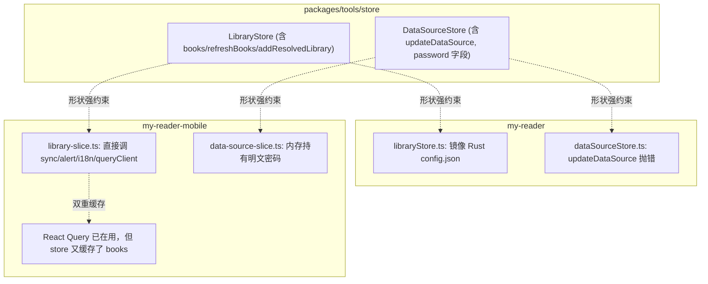

# 状态管理重构计划

## 现状摘要

核心问题：跨端共享的是接口形状而不是行为；桌面端用 Zustand 重复实现了 React Query 的功能；移动端 slice 变成业务编排器。

---

## Phase 0 — 拆共享 Store 接口（基础，约束后续阶段）

目标：[`packages/tools/src/store`](packages/tools/src/store) 只保留纯领域类型，不再约束 store 实现。

- 删除 [packages/tools/src/store/library.ts](packages/tools/src/store/library.ts) 的 `LibraryStore` 类型，保留 `Library` 类型并迁移到 `packages/tools/src/types/library.ts`。
- 删除 [packages/tools/src/store/data-source.ts](packages/tools/src/store/data-source.ts) 的 `DataSourceStore` 类型；保留 `DataSource`、`DataSourceConnectionTestResult`，迁到 `packages/tools/src/types/data-source.ts`。
- 同步删除 `DataSourceWebdav.password` 字段（敏感数据不应在领域类型出现），只保留 `hasPassword: boolean`。
- 更新两端引用：
  - 桌面：[my-reader/src/stores/dataSourceStore.ts:5](my-reader/src/stores/dataSourceStore.ts)、[libraryStore.ts:2](my-reader/src/stores/libraryStore.ts)
  - 移动：[data-source-slice.ts:1](my-reader-mobile/src/store/data-source-slice.ts)、[library-slice.ts:1](my-reader-mobile/src/store/library-slice.ts)、[app-store.types.ts:3-4](my-reader-mobile/src/store/app-store.types.ts)

完成后两端 store 实现完全自由。

---

## Phase 1 — 桌面端：Zustand → React Query

目标：[my-reader](my-reader) 把数据源/书库列表从 Zustand 迁到 React Query，Zustand 只保留客户端 UI 状态。

- 安装 `@tanstack/react-query`，在根组件加 `QueryClientProvider`（参考移动端 [queryClient.ts](my-reader-mobile/src/hooks/queries/queryClient.ts)）。
- 新建 `my-reader/src/hooks/queries/`：
  - `useDataSourcesQuery` 替代 `dataSources` + `hydrated` + `loading`，queryFn 调 `api.listDataSources`。
  - `useDataSourceMutations` 提供 `create / delete / testConnection`，成功后 `invalidateQueries(['dataSources'])`。
  - `useLibrariesQuery` 替代 `libraries`，queryFn 调 `api.listLibraries`。
  - `useLibraryMutations` 提供 `add / addWebdav / remove / refresh / refreshWebdav / switch`，成功后失效。
- 新建 [my-reader/src/stores/libraryUiStore.ts](my-reader/src/stores/libraryUiStore.ts)：仅保存 `activeLibraryId`，提供 `switchLibrary`（内部 mutation + setState）。
- 删除：
  - [my-reader/src/stores/libraryStore.ts](my-reader/src/stores/libraryStore.ts) 中 `books / loadingBooks / refreshBooks / addResolvedLibrary / error / clearError` 字段（桌面端从未实现）。
  - 整个 `useLibraryStore` / `useDataSourceStore` 文件最终删除，`LibrarySync` 组件删除（React Query 自动 fetch）。
- 重写以下消费点：
  - [DataSourcesSection.tsx](my-reader/src/components/settings/sections/DataSourcesSection.tsx)
  - [AddDataSourcePanel.tsx](my-reader/src/components/settings/forms/AddDataSourcePanel.tsx)
  - [AddLibraryPanel.tsx](my-reader/src/components/settings/forms/AddLibraryPanel.tsx)
  - [LibrariesSection.tsx](my-reader/src/components/settings/sections/LibrariesSection.tsx)
  - [SyncSection.tsx](my-reader/src/components/settings/sections/SyncSection.tsx)
  - [AppSidebar.tsx](my-reader/src/components/library/AppSidebar.tsx)
  - [_layout/index.tsx](my-reader/src/routes/_layout/index.tsx)
  - [_layout/book.$bookId.tsx](my-reader/src/routes/_layout/book.%24bookId.tsx)
  - [ReadBookPage.tsx](my-reader/src/components/reader/ReadBookPage.tsx)
- 重写或删除 [stores/__tests__/dataSourceStore.test.ts](my-reader/src/stores/__tests__/dataSourceStore.test.ts) → 改成 mutation hooks 的单元测试。

---

## Phase 2 — 移动端：解耦 slice 与业务编排

目标：[my-reader-mobile/src/store](my-reader-mobile/src/store) slice 只做状态转换；网络、同步、UI 副作用上移到 hooks/services。

- 把 [library-slice.ts](my-reader-mobile/src/store/library-slice.ts) 中以下副作用搬出：
  - `pickCalibreLibrary` / `ensureLibraryMetadataCached` / `resolveSyncTarget` / `checkConnectivity` / `syncRefreshLibrary` / `clearLocalCopyCacheByLibrary` / `clearAllReaderCaches` → 移到新文件 `my-reader-mobile/src/hooks/use-library-actions.ts`。
  - `showAlertWithStatusBarRestore` / `i18n.t` 调用 → 放在 hook 层，让组件接收返回值自己弹 Alert。
  - 删除 `books / loadingBooks / refreshBooks`（slice 内部不缓存 books），统一走 [useLibraryQuery.ts](my-reader-mobile/src/hooks/queries/useLibraryQuery.ts) 的 `useBooks`。
- slice 留下纯状态：`libraries`, `activeLibraryId`, `refreshingLibraryId`, `error`, set/remove/switch（不含副作用）。
- 同理重构 [data-source-slice.ts](my-reader-mobile/src/store/data-source-slice.ts)：
  - `createDataSource / updateDataSource / deleteDataSource / testDataSourceConnection` 改为 `use-data-source-actions.ts` 中的函数（编排 SecureStore + 调 slice 的 setter）。
  - slice 仅暴露 `setDataSources / upsertDataSource / removeDataSource`。
- 更新 [app-store.ts](my-reader-mobile/src/store/app-store.ts) 的 `hydrateFromBackend`：仅做状态恢复，不再做网络请求；`refreshBooks` 调用从 hydrate 流程移除。
- 更新所有消费点（约 22 处，主要在 features/library、features/webdav、features/onedrive、sync/*）从 hooks 而非 slice 拿动作。
- 由于选了 `break_ok`，store 的 `STORE_NAME` 命名升级为 `myreader-mobile-app-state-v2`，老数据自然丢弃。

---

## Phase 3 — 安全：明文密码彻底离开内存

目标：`DataSource` 内存模型永不含 `password`。

- 桌面端：[dataSourceStore.ts:74-86](my-reader/src/stores/dataSourceStore.ts) 的 `createWebdavDataSource` 改为接收单独的 `password` 参数，不挂在 `DataSource` 对象上；表单 → mutation 直接传参。
- 移动端：[data-source-slice.ts](my-reader-mobile/src/store/data-source-slice.ts) 的 `createDataSource/updateDataSource` 入参拆为 `(record: DataSource, secrets?: { password?: string })`；slice 内永不读 `record.password`。
- [credentials.ts](my-reader-mobile/src/services/storage/credentials.ts) 的 `hydrateDataSourcesFromSecureCredentials` 简化为只读 `hasPassword`，不再回写明文。
- 删除 `stripSensitiveDataSources` 这种"事后剥离"的兜底逻辑。

---

## 验收标准

- `packages/tools/src/store` 目录被清空或仅留 re-export；两端 store 文件互不依赖共享接口。
- 桌面端 `grep -r "useLibraryStore\|useDataSourceStore" my-reader/src` 无结果。
- 桌面端任意 CUD 后只触发一次精确失效，不再有 `await refreshLibraries()` 全量重拉。
- 移动端 `library-slice.ts` 与 `data-source-slice.ts` 不再 import：`i18n`、`sync/*`、`hooks/queries/*`、`constants/alert-with-status-bar`。
- 任何路径下 `DataSource.password` 类型字段不存在；运行时 store 树通过 React DevTools 检查无明文。
- 现有 unit/e2e 测试通过或被等价替换。

---

## 风险与缓解

- 桌面端 React Query 与 TanStack Router 共存：两者来自同一团队，无冲突；`QueryClient` 在路由根注入。
- 移动端持久化结构变更：因选了 `break_ok`，通过 `STORE_NAME` 加版本号让 zustand persist 自动忽略旧数据。
- 改动面大：每个 Phase 独立可合并，建议按 Phase 0 → 1 → 2 → 3 分 PR 提交。
