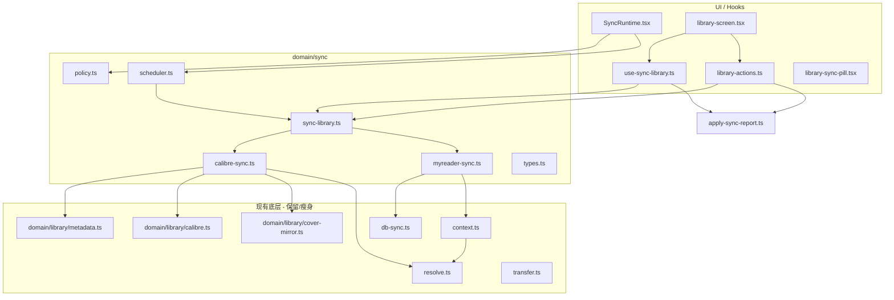

# Mobile 同步体系重构实施计划

**范围**：仅 [`my-reader-mobile/`](my-reader-mobile/)。桌面 [`my-reader/src-tauri/src/sync/`](my-reader/src-tauri/src/sync/) 不动。

**目标**：
- 术语统一为「同步」；书库同步分两阶段：**Calibre 同步**（metadata.db + 书目 + 封面）与 **MyReader 数据**；添加书库 = `trigger: "add"` 的 Calibre 全量同步。
- 单一 domain 入口 `syncLibrary` / `syncLibraries`，行为由 `SyncLibraryOptions` + `SyncTriggerPolicy` 控制；**本地 / 远程同一编排**，差异仅在 `SyncBackend` 实现（§3.3）。
- 移除 manifest 及基于 manifest 的 reconcile（mobile 侧 dead code + 副作用）。

---

## 一、目标架构



**依赖规则**（沿用 [`.agents/rules/mobile.md`](.agents/rules/mobile.md)）：
- UI → `domain/sync` → `repos` | `services` | `domain/library`
- `domain/sync` 不 import `hooks/`、`features/`、`stores/`（书列表缓存写入通过 **回调接口** 或 **返回值** 交给 hook 层）

---

## 二、模块与文件位置

### 2.1 新增 / 保留的 `domain/sync/` 结构

| 文件 | 职责 |
|------|------|
| [`types.ts`](my-reader-mobile/src/domain/sync/types.ts) | **公共类型与接口**（全模块唯一对外契约源） |
| [`sync-library.ts`](my-reader-mobile/src/domain/sync/sync-library.ts) | **主入口**：`syncLibrary`、`syncLibraries` |
| [`policy.ts`](my-reader-mobile/src/domain/sync/policy.ts) | 触发源 → `SyncLibraryOptions` 的默认策略；`startup` 读 `settings.syncOnStartup`，`scheduled.*` 读 `settings.enableAutoSync` |
| [`calibre-sync.ts`](my-reader-mobile/src/domain/sync/calibre-sync.ts) | **Phase A — Calibre 同步**：经 `SyncBackend` 对源 `metadata.db` stat → materialize 到 app cache → 书目 diff → 封面；本地/远程同一编排 |
| [`myreader-sync.ts`](my-reader-mobile/src/domain/sync/myreader-sync.ts) | **Phase B — MyReader 同步**：经同一 `SyncBackend` push/pull `.myreader/changes/`（[`db-sync.ts`](my-reader-mobile/src/domain/sync/db-sync.ts)）；本地 `LocalDirectBackend` 与远程同等对待 |
| [`scheduler.ts`](my-reader-mobile/src/domain/sync/scheduler.ts) | 保留 inflight 合并、30s 节流、`useSyncExternalStore` 状态；内部改调 `syncLibraries` |
| [`index.ts`](my-reader-mobile/src/domain/sync/index.ts) | **对外 re-export**（UI/hooks 只 import 此 barrel） |
| 保留 | `resolve.ts`, `connectivity.ts`, `device.ts`, `local.ts`, `book-diff.ts`, `db-sync.ts`, `transfer.ts` |
| 瘦身 | [`context.ts`](my-reader-mobile/src/domain/sync/context.ts) — 去掉 `manifest` |
| 瘦身 | [`actions.ts`](my-reader-mobile/src/domain/sync/actions.ts) — barrel：transfer + file_state；新增 [`file-actions.ts`](my-reader-mobile/src/domain/sync/file-actions.ts) 供 UI 调用的薄封装 |
| 删除（Phase 3） | `manifest.ts`, `reconcile.ts`, `refresh-library.ts` |

### 2.2 新增 `domain/library/` 辅助

| 文件 | 职责 |
|------|------|
| [`books-list.ts`](my-reader-mobile/src/domain/library/books-list.ts) | 从 Calibre DB 读取书目：`fetchBooksForLibrary(library, dataSources)` — 从 [`useLibraryQuery.ts`](my-reader-mobile/src/features/library/hooks/useLibraryQuery.ts) 下沉 |

### 2.3 UI / Hooks 层（按职责拆分，UI 按需组合）

**问题**：原计划 `use-sync-lifecycle` + `use-sync-library` + `use-sync-actions` 三个 hook，其中 `use-sync-actions` 混入了「书库同步」与「单文件 evict/delete」，命名都叫 sync，职责重叠。

**关键澄清（回应「library-actions 是否够用、UI 能否按需用」）**：

1. **`library-actions` 不应包含「同步」**——同步是独立能力，会被多处复用（手动按钮、添加书库后、后台 lifecycle），不应绑进 CRUD 模块。
2. **plain 具名导出 vs `useLibraryActions()` 工厂**：对「按需使用」**等价**——各 screen 本来就可以只解构 `removeLibrary` / `switchLibrary`。改 plain 函数的理由是**命名诚实**（不是 React Hook），不是 composability 本身。
3. **真正要拆的是模块边界**，不是「能不能 import 单个函数」。

#### 2.3.1 书库相关操作全景（现有 → 新 API）

| 操作 | 现有 | 调用方 | 新归属 | 说明 |
|------|------|--------|--------|------|
| 启动 hydrate | `hydrateFromBackend` | `tokens.tsx` | `hydrateLibraries()` | 只写 store，不 sync |
| 本地 picker 添加 | `addLibrary` | `add-library-data-source-screen` | screen 调 `pickCalibreLibrary()` → `registerLibrary()` | **picker 留在 screen**，不进 library-actions |
| 远程/已解析添加 | `addResolvedLibrary` | `use-remote-directory-browser` | `registerLibrary(library)` | 去重 + 写 store + sync(add) + apply |
| 种子库添加 | 内联 `setState` | `seed-library.tsx` | 同上 `registerLibrary()` | 消除重复逻辑 |
| 删除 | `removeLibrary` | `library-detail-screen` | `removeLibrary(id)` | 清 cache + invalidate books query |
| 切换活跃库 | `switchLibrary` | `library-screen`, `library-detail` | `switchActiveLibrary(id)` | 仅 `setActiveLibraryId` |
| 刷新书目 cache | `refreshBooks` | add/remove 内部 | **删除独立 export** | 改由 `applySyncReport` 或 remove 后 `invalidateQueries` |
| 手动同步 | `useRefreshLibraryMutation` + `triggerSync` | `library-screen`, `library-detail` | 见 2.3.2 同步三层 | 合并为一次 sync |
| 后台同步 | `useSyncLifecycle` | `_layout` | `<SyncRuntime />` | 直接调 domain `syncLibraries` |
| 单文件 evict/delete | `useSyncActions` | `DownloadButton`, `book-detail`, `useBookActions` | `file-actions.ts` | 与书库 CRUD 无关 |

**`library-actions.ts` 完整导出清单**（仅书库列表 membership + hydrate，**不含 sync UI hook**）：

```typescript
export async function hydrateLibraries(): Promise<void>;
export async function registerLibrary(library: Library): Promise<Library | null>; // 去重、写 store、sync(add)、apply
export async function removeLibrary(id: string): Promise<void>;
export function switchActiveLibrary(id: string): void;
// 可选内部 helper，不对外 export：assertNotDuplicate(library)
```

#### 2.3.2 同步能力三层（多处 UI 按需选用）

| 层 | 形态 | 职责 | 典型调用方 |
|----|------|------|------------|
| Domain | `syncLibrary` / `syncLibraries` | 纯业务，返回 `LibrarySyncReport` | SyncRuntime、测试 |
| UI 写回 | `applySyncReport(report)` plain | `setLibraries` + `queryClient.setQueryData` | 任意路径在 domain sync 之后 |
| UI 组合 | `runLibrarySync(input)` plain | `getState()` → `syncLibrary` → `applySyncReport` → 可选 alert | registerLibrary、未来任意非 React 入口 |
| React 绑定 | `useSyncLibrary()` hook | **`syncNow(libraryId)`** + `isSyncing`；内部 `runLibrarySync({ trigger: "manual" })` | library-screen、library-detail、sync pill |

**原则**：
- 需要 **loading / pill / 禁用按钮** → `useSyncLibrary().syncNow(libraryId)`（**不要**与 domain `syncLibrary` 同名，避免撞名）。
- 只需 **fire-and-forget**（如 registerLibrary 内部、SyncRuntime）→ 直接 `syncLibrary` + `applySyncReport`，不必经过 hook。
- **禁止**把 sync 塞进 `library-actions` 的唯一 export；registerLibrary **内部调用** domain sync 是 orchestration，不是把 sync API 暴露为 CRUD 的一部分。

#### 2.3.3 模块一览

| 层级 | 形态 | 职责 |
|------|------|------|
| Root 被动同步 | **`SyncRuntime` 组件** | startup 全量；**scheduled 仅 myreader**（阅读 push / 书库 full，双定时器）；OneDrive token 预热 |
| 同步 React 绑定 | **`useSyncLibrary()`** | **`syncNow(libraryId)`** + `isSyncing`（不含后台 scheduler） |
| 同步 plain 组合 | **`run-library-sync.ts`** | `runLibrarySync({ libraryId, trigger, options })` |
| 同步结果写回 | **`apply-sync-report.ts`** | store + React Query |
| 书库 CRUD | **`library-actions.ts`** | hydrate / register / remove / switch |
| 单文件操作 | **`file-actions.ts`** (domain) | evict / deleteEverywhere |

**删除 / 不再保留**：
- ~~`use-sync-lifecycle.ts`~~ → `SyncRuntime`
- ~~`use-sync-actions.ts`~~ → `file-actions.ts` + `run-library-sync.ts`
- ~~`use-library-actions.ts`~~（hook 工厂）→ `library-actions.ts` 具名导出

[`features/library/hooks/useLibraryQuery.ts`](my-reader-mobile/src/features/library/hooks/useLibraryQuery.ts) 仍只管 `useBooks` + query keys。  
[`library-refresh-pill.tsx`](my-reader-mobile/src/features/library/components/library-refresh-pill.tsx) → `library-sync-pill.tsx`，只读 `useSyncLibrary().isSyncing`（**不**绑 scheduler.running）。

**layer 说明**：`library-actions` / `apply-sync-report` / `run-library-sync` 放在 `hooks/` 是因为要写 Zustand + React Query（违反 domain 分层），但均为 **plain 函数**；仅 `useSyncLibrary` 是真 Hook。

**命名约定（消费方舒适度）**：
- **domain** [`syncLibrary`](my-reader-mobile/src/domain/sync/sync-library.ts) — 业务入口；SyncRuntime、测试、`runLibrarySync` 内部使用；**feature screen 不 import**。
- **hook** `syncNow(libraryId)` — UI 手动同步唯一入口；固定 `trigger: "manual"` + policy + apply + alert；与 domain 函数**不同名、不同签名**，避免撞名。
- **plain** `runLibrarySync({ libraryId, trigger, ... })` — 非 UI 编排（`registerLibrary` 的 `add`、未来脚本）；需显式 `trigger`。


---

## 三、两阶段命名：Calibre 同步 vs MyReader 数据

### 3.1 Phase A = Calibre 同步（不是「metadata 同步」）

**产品语义**：与 Calibre 书库绑定的内容侧数据，一次阶段内包含：

| 子步骤 | 内容 | 现有模块 |
|--------|------|----------|
| metadata.db | 源 stat（`backend.statRemote("metadata.db")`）→ materialize 到 app cache | [`metadata.ts`](my-reader-mobile/src/domain/library/metadata.ts)、[`calibre.ts`](my-reader-mobile/src/domain/library/calibre.ts)、[`local.ts`](my-reader-mobile/src/domain/sync/local.ts) |
| 书目 | diff、清理 orphan、读列表 | [`refresh-library.ts`](my-reader-mobile/src/domain/sync/refresh-library.ts)、[`books-list.ts`](my-reader-mobile/src/domain/library/books-list.ts) |
| 封面 | `mirrorMissingCovers` | [`cover-mirror.ts`](my-reader-mobile/src/domain/library/cover-mirror.ts) |

`metadata` 只是 Calibre 同步里的**一个文件/子步骤**；模块名、scope、报告字段统一用 **`calibre`**，避免让人以为 Phase A 只同步 `metadata.db`。

**对外命名**：

| 层级 | 名称 |
|------|------|
| SyncScope | `"calibre"`（非 `"metadata"`） |
| 模块 | `calibre-sync.ts` |
| 函数 | `syncCalibre()` |
| 结果 | `CalibreSyncResult`；`LibrarySyncReport.calibre` |
| 选项 | `forceCalibre`（跳过 etag，强制跑完整 Calibre 阶段含封面） |

底层 [`metadata.ts`](my-reader-mobile/src/domain/library/metadata.ts) **文件名不变**——逻辑扩为对 **任意 `SyncBackend`** 做 metadata.db stat（远程 etag / 本地 mtime-size），由 `calibre-sync` 调用。

### 3.3 Backend 统一模型（本地 / 远程，实现层差异）

**产品语义**：本地书库与远程书库都是「同步书库」——Calibre 侧检测源目录 metadata.db 变更；MyReader 侧 push/pull 书库根下 `.myreader/changes/`。**编排层不分叉**，仅 `openSyncContext` → `SyncBackend` 实现不同。

| 能力 | 远程（WebDAV / OneDrive） | 本地（`LocalDirectBackend`） | 统一 API |
|------|---------------------------|------------------------------|----------|
| 解析书库根 | `resolveSyncTarget` → RemoteBackend | 同 → `LocalDirectBackend(libraryRootUri)` | `openSyncContext` |
| Calibre：检测 metadata 变更 | `statRemote("metadata.db")` + etag | **同** `statRemote("metadata.db")`，etag=`mtime-size` | `detectMetadataChange(ctx)` |
| Calibre：写入 app cache | `downloadToCache` | `copyMetadataToCache` / scoped refresh | `materializeMetadata(ctx)` |
| MyReader：push 进度 | `writeBytes(.myreader/changes/…)` | **同路径**，写到 Calibre 目录旁 | `pushDbChanges(backend, …)` |
| MyReader：pull 其它设备 | `listRemote` + `readBytes` | **同** | `pullDbChanges(backend, …)` |
| 门禁 | `checkConnectivity` | 跳过；iOS 本地库经 `withSecurityScopedLibraryAccess`（现 `db-sync` 已有） | 仅 remote |

```typescript
// sync-library.ts — 编排不变；本地/远程走同一函数
async function syncLibrary(library, dataSources, options) {
  const ctx = await openSyncContext(library, dataSources);
  if (isRemoteBackend(ctx.backend)) await checkConnectivity(ctx.backend);

  const calibre = scopeHasCalibre(options)
    ? await syncCalibre(ctx, options)
    : skippedCalibre(library);
  const myreader = scopeHasMyreader(options)
    ? await syncMyReader(ctx, options)
    : skippedMyreader();

  return { libraryId: library.id, calibre, myreader, durationMs };
}
```

**删除现网错误行为**：[`scheduler.ts`](my-reader-mobile/src/domain/sync/scheduler.ts) 对 `localDirect` **整库 skip**（导致本地库从不 MyReader push/pull、startup 也不 Calibre refresh）——重构后 **不再 skip**；`openSyncContext` 失败才写入 report.error。

**与 hydrate 边界**：`hydrateLibraries` / `ensureLibraryMetadataCached` 仍是首次 cache 预热；**检测外部变更**（Calibre 桌面改书、共享文件夹里其它设备的 jsonl）走 `syncLibrary`，不是单独概念。

### 3.2 Phase B = MyReader 附属数据（非 Calibre 书目）

- 阅读进度（现有 `.myreader/changes/` JSONL）
- 收藏（规划中）
- 后续：标签、笔记、书架排序等

**不推荐 `progress`**：名称过窄，无法涵盖收藏等扩展。

| 方案 | SyncScope | 模块文件 | 函数 | 优点 | 缺点 |
|------|-----------|----------|------|------|------|
| **myreader**（推荐） | `"myreader"` | `myreader-sync.ts` | `syncMyReader` | 与 `calibre-sync` 对称；scope `"myreader"` 已足够 | — |
| sidecar | `"sidecar"` | `sidecar-sync.ts` | `syncSidecar` | 架构隐喻准确（Calibre 旁车数据） | 术语偏内部，新人不直观 |
| app-data | `"appData"` | `app-data-sync.ts` | `syncAppData` | 业界常见「内容 vs 应用状态」 | 泛化，未体现 per-library |
| user-state | `"userState"` | `user-state-sync.ts` | `syncUserState` | 强调用户产生的可变状态 | 易与账号级 settings 混淆 |
| changes | `"changes"` | `changes-sync.ts` | `syncChanges` | 贴合现有 JSONL 传输 | 绑死 transport，收藏若走别路径则不合适 |

**计划采用：`myreader`**（模块 `myreader-sync.ts` / 函数 `syncMyReader()` / `SyncScope: "myreader"` 统一）。内部可再拆 **provider** 接口，便于按数据类型扩展：

```typescript
/** 单类 MyReader 数据的同步单元（progress、favorites…） */
export type MyReaderSyncProvider = {
  id: string;  // e.g. "reading_progress" | "favorites"
  push(ctx: SyncTargetContext): Promise<number>;
  pull(ctx: SyncTargetContext): Promise<number>;
};

/** myreader 阶段方向；scheduled 按 UI 场景区分 */
export type MyReaderSyncMode = "push_only" | "full";
// push_only：仅 push（阅读中持续上传进度，不 pull）
// full：push + pull（书库界面拉取远端变更并上传本地脏数据）
```

首期仅注册 `reading_progress` provider（现有 db-sync）；`syncMyReader` 按 `mode` 决定是否调用各 provider 的 `pull`。

---

## 四、接口设计（`domain/sync/types.ts`）

### 4.1 选项与触发

```typescript
/** 同步范围 */
export type SyncScope = "all" | "calibre" | "myreader";

/** 触发来源（v1 仅四种；`foreground` 暂不实现，见 §4.1.1） */
export type SyncTrigger = "manual" | "startup" | "add" | "scheduled";

/** 单库同步参数 */
export type SyncLibraryOptions = {
  scope?: SyncScope;           // default: "all"
  /** 跳过 metadata.db etag 检测，强制跑完整 Calibre 阶段（DB + 书目 + 封面） */
  forceCalibre?: boolean;      // default: false
  /**
   * 同步失败（含连通性失败）时是否 **throw** 给调用方。
   * true：manual/add — UI 层 catch 后弹 alert（见 runLibrarySync）。
   * false：startup/scheduled — 写入 report.error，正常 return，不打扰用户。
   */
  throwOnFailure?: boolean;    // default: false；policy 按 trigger 覆盖
  /**
   * 仅 scope 含 myreader 时有效。scheduled 阅读/书库两种 tick 靠此区分。
   * push_only：只 push，不 pull。
   * full：push + pull（全量 myreader 同步）。
   */
  myreaderMode?: MyReaderSyncMode;  // default: "full"
};
```

**连通性检查（非 option，固定流程）**：

- 远程书库：**每次** `syncLibrary` 在任意 phase 之前，`resolveSyncTarget` 后立即 [`checkConnectivity`](my-reader-mobile/src/domain/sync/connectivity.ts)（与现 download / refresh 一致）。
- 本地 direct 书库：跳过。
- 不通 → **短路**，不进入 calibre / myreader；结果写入 `LibrarySyncReport`；若 `throwOnFailure === true` 则 **throw `SyncConnectivityError`**（携带 report），否则静默 return report。
- **不存在**「不做连通性检查仍继续 sync」的路径——原 `checkConnectivity` 选项删除。

```typescript
/** 某触发源下的策略条目 */
export type SyncPolicyEntry = {
  enabled: boolean;
  options: SyncLibraryOptions;
};

/** 全局触发策略（可后续扩展到 settings） */
export type SyncTriggerPolicy = {
  manual: SyncPolicyEntry;
  add: SyncPolicyEntry;
  startup: SyncPolicyEntry;
  /** scheduled 只做 myreader；按 UI 场景区分两条策略（见 §4.1.2） */
  scheduled: {
    reading: SyncPolicyEntry & { intervalMs: number };
    library: SyncPolicyEntry & { intervalMs: number };
  };
};

/** scheduled 调用 syncLibraries 时的库范围 */
export type ScheduledSyncTarget = "reading" | "library";
// reading：仅 activeLibraryId（阅读 modal 打开时）
// library：store 内全部书库（书库 tab / 浏览态；含本地与远程）
```

#### 4.1.1 触发器范围（v1 刻意保持简单）

**v1 保留**（用户确认必须）：

| Trigger | 场景 | 价值 |
|---------|------|------|
| `manual` | 用户点同步 | 高，显式意图 |
| `startup` | 冷/热启动 hydrate 后一次 | 高，补离线期间变更 |
| `add` | 注册新书库后 | 高，首次 Calibre 全量（含 metadata.db + 封面） |
| `scheduled` | 前台定时，**仅 MyReader**（见 §4.1.2） | 阅读 push 进度；书库 pull+push |

**v1 不实现**：`foreground`（AppState 回前台）。理由见下。

**`foreground` 价值评估**（保留类型扩展位即可，首期不写监听）：

- **独覆盖场景**：App **未被系统杀掉**、在后台挂很久再切回来——此时没有第二次 `startup`，若也没有定时器 tick，才会靠 foreground 补 sync。
- **实际权重偏低**：多数用户会杀进程或很快被系统回收 → 下次打开走 `startup`；短时间去后台再回来，30s 节流常跳过，收益小；与 `scheduled` 在长会话前台重叠。
- **成本**：多一条 AppState 订阅、与 startup/scheduled 共享节流逻辑、切回瞬间可能与用户操作抢 JS。
- **结论**：**有用但不是 must-have**；v1 用 `startup` + `scheduled` + `manual` 已覆盖主要路径；若后续 telemetry 显示「长后台 resume  stale 数据」再补 foreground。

**默认策略**（[`policy.ts`](my-reader-mobile/src/domain/sync/policy.ts)）：

| Trigger | enabled | options |
|---------|---------|---------|
| `manual` | always | `{ scope: "all", forceCalibre: false, throwOnFailure: true }` |
| `add` | always | `{ scope: "calibre", forceCalibre: true, throwOnFailure: true }` |
| `startup` | `settings.syncOnStartup` | `{ scope: "all", forceCalibre: false, throwOnFailure: false }` |
| `scheduled.reading` | 阅读器打开 + `settings.enableAutoSync` | `{ scope: "myreader", myreaderMode: "push_only", throwOnFailure: false }`；`intervalMs: 60_000` |
| `scheduled.library` | 书库浏览态 + `settings.enableAutoSync` | `{ scope: "myreader", myreaderMode: "full", throwOnFailure: false }`；`intervalMs: 180_000` |

**设置项**（替代现有单一 `settings.syncEnabled`）：

| 设置 | 控制范围 | 不影响 |
|------|----------|--------|
| `syncOnStartup` | 冷/热启动后 `startup` 全量 sync | manual、add、scheduled |
| `enableAutoSync` | `scheduled.reading` / `scheduled.library` 定时 tick | manual、add、startup |

- 重构时自 `syncEnabled` 迁移：二者均设为原 `syncEnabled` 值（关闭自动同步时 startup 与 scheduled 同时关，行为与现网一致）。
- `app-store.types` / `settings-slice` / `app-store.constants`：`syncEnabled` 删除；新增 `syncOnStartup`、`enableAutoSync` 及对应 setter。

#### 4.1.2 `scheduled`：仅 MyReader，按 UI 场景区分

**原则**：
- **不涉及 Calibre** — 不做 metadata.db、书目 diff、封面；Calibre 留给 `startup` / `manual` / `add`。
- **间隔较短** — 阅读 push 60s；书库 full 3min（常量，后续可进 settings）。
- **阅读 vs 书库行为不同**：

| 场景 | 路由/条件 | scope | myreaderMode | 库范围 | 行为 |
|------|-----------|-------|--------------|--------|------|
| **阅读中** | `reader` modal 可见 | `myreader` | `push_only` | 仅 `activeLibraryId` | 持续 **push** 进度；**不 pull** |
| **书库界面** | library tab / 书库 stack | `myreader` | `full` | **全部书库** | **push + pull** |
| **其它** | settings 等 | — | — | — | 不跑 scheduled |

**SyncRuntime v1 wiring**：
- `storeReady` → `scheduleIdleWork` → 若 `settings.syncOnStartup` 则 `syncLibraries(..., "startup")`（calibre + myreader）；否则 skip startup run
- **两个互斥 `setInterval`**（仅当 `settings.enableAutoSync`；按 `ScheduledSyncTarget` 只启用其一）：
  - **reading tick**：reader 路由 + `enableAutoSync` → 单库 `syncLibrary(activeLibrary, ..., policy.scheduled.reading.options)`
  - **library tick**：书库浏览态 + `enableAutoSync` → `syncLibraries(..., "scheduled", { target: "library" })`
- 与 scheduler 全局 `minIntervalMs`（30s）去重
- ~~AppState foreground~~ — 不实现

**与本地进度保存**：[`use-reader-progress-saver`](my-reader-mobile/src/hooks/use-reader-progress-saver.ts) debounce 写本地（~1.6s）；reading tick 负责把已落盘 changes **上传到远端**（~60s）。

**`syncLibraries` 库范围**（编排不变，仅 filter 修正）：
- `startup` / `manual` / `add` / scheduled **library tick**：`deps.libraries` **全部**（含本地 direct）；逐库 `syncLibrary`；`openSyncContext` 失败则该库 report.error，继续下一库。
- scheduled **reading tick**：仅 `activeLibraryId` 单库。

**`applySyncReport` 契约**（[`apply-sync-report.ts`](my-reader-mobile/src/hooks/apply-sync-report.ts)）：
- **始终**：`calibre.library` 有更新时 `setLibraries` merge（含 `metadataEtag` / `bookCount`）。
- **书目列表**：
  - `manual` / `add` / calibre `changed`：若有 `report.calibre.books` → `queryClient.setQueryData(["books", libraryId], books)`。
  - **passive**（`startup` / `scheduled`）：**禁止** `invalidateQueries(["books"])`；仅当 `calibre.changed && books` 时 `setQueryData`；myreader-only tick 通常不写 books cache。
- **进度/收藏**：myreader pull 后由 provider 指示最小 patch（`setQueryData` 单书或 narrow invalidate），避免全表 refetch。

### 4.2 结果报告

```typescript
export type CalibreSyncResult = {
  skipped: boolean;
  skipReason?: "unchanged" | "not_applicable" | "connectivity" | "error";
  changed: boolean;              // metadata.db 或书目有实质变更
  library: Library;              // 始终返回最新 snapshot（含 metadataEtag / bookCount）
  books?: BookItem[];            // changed 时填充，供 UI 写 cache
  diff?: BookDiff;
  coversMirrored?: number;       // mirrorMissingCovers 计数（可选）
  error?: string;
};

export type MyReaderSyncResult = {
  skipped: boolean;
  skipReason?: "not_applicable" | "error";
  mode: MyReaderSyncMode;        // 实际执行的 mode（便于日志）
  /** 按 provider 汇总；push_only 时 pulled 恒为 0 */
  providers: Record<string, { pushed: number; pulled: number; error?: string }>;
  error?: string;
};

export type LibrarySyncReport = {
  libraryId: string;
  libraryName: string;
  calibre: CalibreSyncResult;
  myreader: MyReaderSyncResult;
  durationMs: number;
};

export type SyncRunReport = {
  trigger: SyncTrigger;
  startedAt: number;
  finishedAt: number;
  durationMs: number;
  results: LibrarySyncReport[];
  aborted?: boolean;
};
```

### 4.3 主 Facade 接口

```typescript
export type SyncLibrariesDeps = {
  libraries: Library[];
  dataSources: DataSource[];
  /** 仅 `trigger === "startup"` 时检查；false 则 skip 整个 startup run */
  syncOnStartup: boolean;
  /** 仅 `trigger === "scheduled"` 时检查；false 则 skip scheduled run */
  enableAutoSync: boolean;
  /** Calibre 书目变更后补封面等；myreader 阶段可选 */
  getBooksForLibrary?: (libraryId: string) => BookItem[];
};

/** 同步单个书库 — 所有业务路径的唯一 domain 入口 */
export function syncLibrary(
  library: Library,
  dataSources: DataSource[],
  options?: SyncLibraryOptions,
): Promise<LibrarySyncReport>;

/** 同步多个书库 — lifecycle / scheduler 用 */
export function syncLibraries(
  deps: SyncLibrariesDeps,
  trigger: SyncTrigger,
  policy?: SyncTriggerPolicy,
  /** scheduled 书库 tick 传 "library"；reading tick 优先单库 syncLibrary */
  scheduledTarget?: ScheduledSyncTarget,
): Promise<SyncRunReport>;
```

### 4.4 Phase 内部接口（同文件或各 module 导出，供 `sync-library.ts` 组合）

```typescript
// calibre-sync.ts — ctx 由 syncLibrary 在 openSyncContext 后传入
export function syncCalibre(
  ctx: SyncTargetContext,
  options: Pick<SyncLibraryOptions, "forceCalibre">,
): Promise<CalibreSyncResult>;

// myreader-sync.ts — 本地/远程共用 db-sync；不 skip localDirect
export function syncMyReader(
  ctx: SyncTargetContext,
  options?: {
    mode?: MyReaderSyncMode;
    getBooksForLibrary?: (id: string) => BookItem[];
  },
): Promise<MyReaderSyncResult>;
```

**Phase 编排规则**（写在 `sync-library.ts` docstring）：
0. `ctx = openSyncContext(library, dataSources)`；**远程** → `checkConnectivity`；失败则写 report 并按 `throwOnFailure` 决定是否 throw，**不进入后续 phase**。
1. `scope` 含 `calibre` → `syncCalibre(ctx, …)`：**统一** `detectMetadataChange`（`ctx.backend.statRemote("metadata.db")`）→ 变更或 `forceCalibre` 时 `materializeMetadata` → 书目 diff + 封面镜像。
2. `scope` 含 `myreader` → `syncMyReader(ctx, …)`：`push_only` 只 push；`full` push 后 pull；**本地 / 远程同一套** [`db-sync.ts`](my-reader-mobile/src/domain/sync/db-sync.ts)（`.myreader/changes/` 相对书库根）。
3. **不再**因 `localDirect` 跳过整库或跳过 MyReader phase；仅 `openSyncContext` 失败时该库 report 记 error/skip。

### 4.5 文件传输接口（与书库同步分离）

保留在 [`transfer.ts`](my-reader-mobile/src/domain/sync/transfer.ts)，类型可迁至 `types.ts`：

```typescript
export type FileTransferActions = {
  evictLocal(ctx: SyncTargetContext, relativePath: string): Promise<void>;
  deleteEverywhere(ctx: SyncTargetContext, relativePath: string): Promise<void>;
};
```

`SyncTargetContext` 瘦身后仅含：`ResolvedSyncTarget` + `deviceId` + `library`（无 manifest）。

### 4.6 UI 侧适配接口（hook 层，非 domain）

```typescript
// hooks/run-library-sync.ts — plain；内部 / registerLibrary 用，screen 手动同步不直接调
export type RunLibrarySyncInput = {
  libraryId: string;
  trigger: SyncTrigger;           // 必填；manual / add / …
  options?: Partial<SyncLibraryOptions>;  // 一般省略，由 policy[trigger] 补全
};
export async function runLibrarySync(input: RunLibrarySyncInput): Promise<LibrarySyncReport>;

// hooks/apply-sync-report.ts
export function applySyncReport(report: LibrarySyncReport): void;

// hooks/use-sync-library.ts — feature screen 手动同步唯一 Hook
export function useSyncLibrary(): {
  /** 用户手动同步当前书库；等价 runLibrarySync({ libraryId, trigger: "manual" }) */
  syncNow: (libraryId: string) => Promise<LibrarySyncReport>;
  isSyncing: boolean;
};
```

**消费示例**（library-screen / library-detail）：

```tsx
const { syncNow, isSyncing } = useSyncLibrary();

void syncNow(selectedLibrary.id)
  .then(() => notifyDone())
  .catch((e) => notifyError(e.message));
```

`runLibrarySync` 职责（**alert 在 hook / runLibrarySync 层**，domain 只 throw）：
- merge `policy[trigger].options`（含 `throwOnFailure`）→ domain `syncLibrary` → `applySyncReport`
- `throwOnFailure === true` 时 catch 并弹 unreachable alert，再 rethrow
- **SyncRuntime**：直接 domain + apply，`throwOnFailure: false`
- **registerLibrary**：`runLibrarySync({ libraryId, trigger: "add" })`（共用 alert helper）

`useSyncLibrary`：`useMutation({ mutationFn: (libraryId) => runLibrarySync({ libraryId, trigger: "manual" }), mutationKey: ["library","sync"] })`。

---

## 五、`syncCalibre` 实现要点（Backend 统一，吸收旧逻辑）

**编排步骤**（本地 / 远程共用；分支仅藏在 helper 内）：

1. **`detectMetadataChange(ctx)`** — `ctx.backend.statRemote("metadata.db")`；etag 远程用 server etag，本地用 `` `${mtimeMs}-${size}` ``；与 `library.metadataEtag` 比较。
2. **`materializeMetadata(ctx)`** — 有变或 `forceCalibre`：远程 `downloadToCache` / 本地 `forceRefreshLibraryMetadata` + scoped copy（收进单函数，对外不可见）。
3. **书目 diff + orphan 清理** — 读 app cache metadata（[`refresh-library.ts`](my-reader-mobile/src/domain/sync/refresh-library.ts) 逻辑）。
4. **`mirrorMissingCovers`** — DB/书目变更后（[`cover-mirror.ts`](my-reader-mobile/src/domain/library/cover-mirror.ts)）。

将以下文件逻辑**合并进** [`calibre-sync.ts`](my-reader-mobile/src/domain/sync/calibre-sync.ts)，不保留重复路径：

| 旧来源 | 新归属（Calibre 阶段内） |
|--------|--------|
| [`metadata.ts`](my-reader-mobile/src/domain/library/metadata.ts) `refreshMetadataIfStale` | 扩为 **SyncBackend** stat → `detectMetadataChange` |
| [`refresh-library.ts`](my-reader-mobile/src/domain/sync/refresh-library.ts) | 子步骤：DB 变更后的 diff + 清理 |
| [`calibre.ts`](my-reader-mobile/src/domain/library/calibre.ts) `forceRefreshLibraryMetadata` | `materializeMetadata` **本地分支** |
| [`remote-library-shared.ts`](my-reader-mobile/src/domain/library/remote-library-shared.ts) `forceRefreshMetadata` | `materializeMetadata` **远程分支** |
| [`books-list.ts`](my-reader-mobile/src/domain/library/books-list.ts)（新） | DB 变更后读列表 |
| [`cover-mirror.ts`](my-reader-mobile/src/domain/library/cover-mirror.ts) | DB/书目变更后 `mirrorMissingCovers` |

**消除旧 bug**：etag 检测成功后必须把 `metadataEtag` / `metadataUri` 写入返回的 `library`，lifecycle 不再单独 `invalidateQueries` 却不写 store。

---

## 六、`syncMyReader` 实现要点（Backend 统一）

从 [`scheduler.ts`](my-reader-mobile/src/domain/sync/scheduler.ts) 现有 loop 抽出，改为 **provider 注册表**；**删除** `isLocalDirect` 整库 skip。

```
openSyncContext → SyncTargetContext（含 LocalDirectBackend 或 RemoteBackend）
→ for each MyReaderSyncProvider:
     push(ctx)   // db-sync.pushDbChanges(ctx.backend, …) — 本地写入书库根 .myreader/changes/
     pull(ctx)   // 仅 mode === "full"；读同目录其它 device 的 jsonl
```

iOS 带 `securityScopedBookmark` 的本地库：provider 内复用 [`withSecurityScopedLibraryAccess`](my-reader-mobile/src/services/fs/bookmarks.ts)（与现 [`syncDbFromContext`](my-reader-mobile/src/domain/sync/db-sync.ts) 一致）。

收藏等后续类型：新增 provider + repo，**不扩展** `SyncScope` 枚举。

**删除**：`reconcileFileStates`、`loadManifest`、manifest 相关 transfer 分支。

## 七、分阶段实施（先接口，后替换，后删除）

### Phase 1 — 定义接口与骨架（不改行为）

1. 新增 `types.ts`、`policy.ts`、`sync-library.ts`（暂 delegating 到旧逻辑）、`calibre-sync.ts` / `myreader-sync.ts` 空壳 + 类型。
2. 新增 `domain/library/books-list.ts`（从 `useLibraryQuery` 复制 `fetchBooksWithMeta`）。
3. 新增 `index.ts` 导出公共 API。
4. 新增 `hooks/use-sync-library.ts`（mutation key: `["library","sync"]`），旧 mutation 并存。

**验证**：TypeScript 编译通过；无调用方切换。

### Phase 2 — 实现 Phase 模块并单元测试

1. 实现 `syncCalibre`（Backend 统一 stat/materialize + diff + cover；含 `forceCalibre`）。
2. 实现 `syncMyReader`（reading_progress provider + db-sync；**含 LocalDirectBackend**；无 reconcile）。
3. `sync-library.ts`：`openSyncContext` 一次 → 两 phase；返回完整 `LibrarySyncReport`。
4. 重写 `scheduler.ts` 调用 `syncLibraries`（**不再** skip localDirect）。
5. 瘦身 `context.ts` / `transfer.ts`（移除 manifest）；**暂不删** manifest.ts 文件以免 break import。

**验证**：为 `syncLibrary` 写 Jest 测试；`scope` 分支 + **mock LocalDirectBackend / RemoteBackend** 各一例。

### Phase 3 — 替换调用方

| 旧调用 | 新调用 |
|--------|--------|
| `useRefreshLibraryMutation` | `useSyncLibrary().syncNow(libraryId)` |
| `library-screen` refresh + `triggerSync` 双调用 | 单次 `syncNow(libraryId)` |
| `library-detail-screen` refresh button | 同上 |
| `use-sync-lifecycle` + 分散 calibre/myreader sync | `<SyncRuntime />` in `_layout`（内部 `syncLibraries` + apply） |
| `use-sync-actions`（triggerSync + file ops） | 删除；书库 → `runLibrarySync` / `useSyncLibrary`；文件 → `file-actions.ts` |
| `useLibraryActions()` 工厂 | 删除；改为 `library-actions.ts` 具名导出，各 screen 按需 import |
| `addLibrary` picker 逻辑 | 留在 `add-library-data-source-screen`；成功后 `registerLibrary` |
| `addResolvedLibrary` / `seed-library` 内联 | 统一 `registerLibrary` |
| `refreshBooks` 独立 export | 删除；register/remove 走 apply / invalidate |
| `LibraryRefreshPill` + `useIsLibraryRefreshing` | `useSyncLibrary().isSyncing` |
| `useBookActions` 注入 `SyncActions` | 直接调 `file-actions`，不再注入 |

**i18n**：UI 文案统一「同步」；key 可新增 `librarySyncing`，旧 `libraryRefreshing` 暂 alias。

**验证**：手动 — 添加远程/**本地**书库、菜单同步、startup 全量、阅读中 push-only tick、书库 tab full myreader tick、**本地共享目录多设备**进度、Calibre 改 metadata 后 manual/startup 反映；Maestro 如有覆盖则跑一遍。

### Phase 4 — 删除旧代码

删除文件：
- `manifest.ts`, `reconcile.ts`, `refresh-library.ts`
- `hooks/use-sync-lifecycle.ts`, `hooks/use-sync-actions.ts`, `hooks/use-library-actions.ts`（hook 工厂形态）

删除符号 / 清理：
- `useLibraryQuery` 中 `refreshBooks`, `useRefreshLibraryMutation`, `libraryRefreshMutationKey`
- `scheduler.ts` 旧 `SyncDeps` / `runSync` 对外 export（若已完全被 `syncLibraries` 替代）
- `transfer.ts` 中 `downloadFile`, `downloadFileManifest`, `pushFile`
- i18n `manifestNotRegistered`（若无引用）
- 更新 [`mobile.md`](.agents/rules/mobile.md) domain/sync 目录说明

**验证**：`rg "manifest|refresh-library|reconcileFileStates|refreshBooks|useRefreshLibraryMutation" my-reader-mobile` 无业务引用（Android debug manifest plugin 除外）。

---

## 八、风险与约束

- **桌面不动**：不改 `.myreader/` 云端格式约定；mobile 停止读写 manifest 即可。
- **layer 边界**：domain 返回 `books` 数组，React Query 写入仅在 hook。
- **失败隔离**：calibre 失败仍跑 myreader 阶段（用户可读到旧书目但进度/收藏仍同步）。
- **本地 / 远程**：同一 `syncLibrary` 编排；差异仅在 `SyncBackend` 与 `checkConnectivity`（§3.3）；**不改变** UI/hooks 分层。
- **添加书库**：`registerLibrary()` 内 `runLibrarySync({ libraryId, trigger: "add" })`；重复检测保留在同函数内。

### SyncRuntime 与 UI 阻塞

**结论**：不会「卡死」UI（无异步死锁），但大书库/弱网下可能造成 **JS 线程卡顿（掉帧）**；按当前/计划策略 **多数场景影响很小，可忽略**，需在实现时守住几条约束。

| 因素 | 影响 | 说明 |
|------|------|------|
| 执行线程 | 低~中 | RN 同步逻辑跑在 **JS 线程**；I/O 虽 `await` 不阻塞 native UI，但解析 JSON/SQLite、大循环仍占 JS 时间 |
| 启动时机 | 小 | `scheduleIdleWork` 推迟 startup sync，**不抢首屏** |
| 定时 tick | 小 | scheduled **仅 myreader**；阅读 60s push 单库；书库 3min full 多库；**不跑 calibre** |
| 被动 sync 工作量 | 小 | reading tick 通常仅 push 少量 JSONL；library tick push+pull |
| 多库串行 | 小 | `for await` 逐库执行，不会并发打爆网络，但总时长随库数量线性增 |
| React 重渲染 | 很小 | scheduler `running` 仅触发 `useSyncExternalStore` 订阅者（如同步 pill）**2 次**；若 pill 仅绑手动 mutation、不绑后台 running，则 **零额外渲染** |
| 封面镜像 | 中（边缘） | 属于 **Calibre 阶段**；仅在 DB/书目变更时触发；应用层 `void` 不阻塞 sync 返回 |

**建议在 `SyncRuntime` / `policy.ts` 中明确**：

1. **startup**：`scope: "all"`, `throwOnFailure: false`；受 `settings.syncOnStartup` 控制。
2. **scheduled**：`scope: "myreader"` only；阅读/书库互斥 tick（§4.1.2）；`throwOnFailure: false`；受 `settings.enableAutoSync` 控制（与 `syncOnStartup` 独立）。
3. **同步 pill**：只反映 **manual** 的 `useSyncLibrary().isSyncing`（`syncNow` pending）。
4. **myreader pull 大循环**：batch `yieldToEventLoop()`。
5. **去掉** startup 里与 `runSync` **重复的** `refreshMetadataIfStale` 循环。
6. **不实现 foreground** v1；类型系统可预留 `"foreground"` 为 future union member（或文档注释），避免 SyncRuntime 膨胀。

### 秒开 / 秒切性能不变量

| 不变量 | 手段 |
|--------|------|
| 冷启动首屏 | Query persist `["books", libraryId]` + `staleTime`；startup sync 走 `scheduleIdleWork` |
| 切库 | `switchActiveLibrary` 只改 `activeLibraryId`；不阻塞 sync |
| 被动 sync 不抖 UI | `applySyncReport` 对 startup/scheduled **不用 invalidate books**（见 §4.1.2） |
| 去掉重复 Calibre | 删除 startup 内 per-library `refreshMetadataIfStale` 循环（统一进 `syncLibraries(..., "startup")`） |

**Phase 3 验收**（合并前手动）：冷启动 → 书库列表立即可见 → idle 后后台 sync；A/B 两库切换无白屏；**本地书库** manual sync + MyReader push/pull；远程书库 manual + scheduled tick。

**何时需要再优化**：单库数千书且 metadata.db etag 频繁变化、或 pull 积压大量 jsonl 时，再考虑分片 sync 或 calibre 与 myreader 分时段执行。首期不必过度设计。

---

## 九、建议 PR 拆分

1. **PR1**：types + policy + books-list + skeleton exports（Phase 1）
2. **PR2**：calibre-sync + myreader-sync + sync-library + scheduler + context/transfer 瘦身（Phase 2）
3. **PR3**：hooks/UI 切换 + pill 重命名（Phase 3）
4. **PR4**：删除 dead code + 测试 + 文档（Phase 4）
