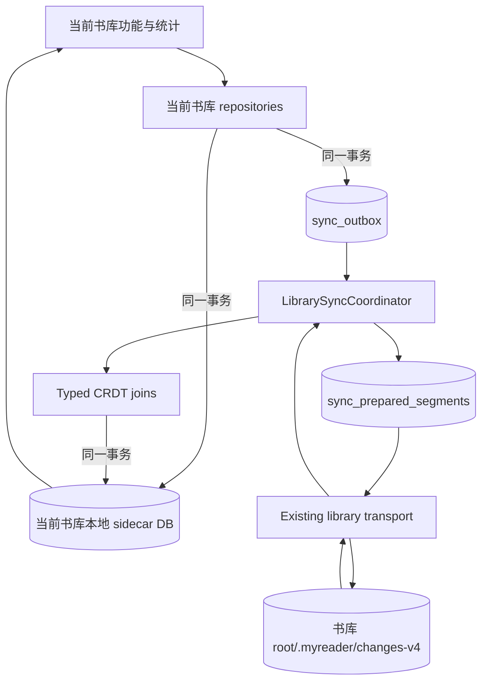

# 将书库 sidecar 升级为类型化 CRDT 阅读数据同步

## 结论

采用以下目标架构：

1. **每个 Calibre 书库自己的 sidecar 是该书库阅读数据的唯一同步边界。** 添加书库即确定
   阅读数据的同步位置，不再要求用户额外配置中央 Profile 或同步目录。
2. **每台设备继续使用该书库的本地 SQLite 镜像作为读写库。** 多台设备不得直接打开远端
   SQLite；远端只交换按 replica 排列的普通 JSON segment。
3. **使用 MyReader 类型化 CRDT delta，而不是通用文档 CRDT 或同步数据库。** 每个 domain
   显式声明稳定身份、合并和删除语义。
4. **同步传输与业务合并分离。** v4 只定义书库内文件布局和业务合并；现有书库基础设施负责
   访问数据源，其接口和错误模型不属于本提案。
5. **主页阅读统计暂时只显示当前书库。** 阅读会话和完成记录参与同步，但跨书库统计聚合不属于
   本提案；后续如有需要，应单独决定展示范围、移除书库后的统计语义和本地索引方案。

本决策升级 [ADR-0004](./0004-library-sidecar-jsonl-sync.md) 的同步协议，保留其
书库 sidecar 所有权和按 replica 追加变更的方向，取代其中 `updated_at + table/key/value` 的 v3
协议实现。它不引入 ADR-0014 曾设想的中央用户域。

### Breaking change 边界

v4 是全新协议，不兼容或迁移 sidecar v3：

- v4 只读取 `.myreader/changes-v4/`，完全忽略 v3 `.myreader/changes/`。
- 不解析 v3 JSONL，不 backfill 旧业务行，不双读、不双写，也不提供协议切换窗口。
- v4 只支持全新初始化的 sidecar 状态；已有 v3 本地阅读数据不会进入 v4。
- 遗留 v3 文件不自动删除，避免协议上线过程隐式执行破坏性操作；需要时由开发或用户显式清理。

这是一项有意接受的数据断代。它避免为尚未发布稳定协议的历史测试数据维护身份映射、兼容读取和
迁移状态机。

## 为什么需要升级现有协议

当前实现不能满足六类现有阅读数据的可靠跨端同步：

- v3 JSONL 只注册 `reading_progress` 和 `bookmarks`；批注、收藏、阅读会话和完成记录尚未进入
  同步流。
- 当前变更记录只有 `table/key/value`，没有显式协议版本、change ID、HLC 或 domain 版本。
- 未知表、损坏行和缺失序号可能被忽略后仍推进 cursor，升级后的客户端无法重新读取。
- `updated_at` 增量枚举不能可靠覆盖墙上时钟回拨，不能替代与业务写同事务的 outbox。
- 收藏仍使用物理删除，无法向其他设备传播取消收藏。
- 阅读时长当前通过 SQL 加法累计；同一变更重放会重复增加，不能直接同步。
- desktop、iOS 和 Android 尚未通过同一协议完成真实三端收敛验证。

这些问题要求升级协议，但不要求改变书库 sidecar 的数据所有权。路径本身已经限定书库 scope，
将同一批数据再迁移到中央 Profile 只会增加第二个配置入口和跨库身份映射。

## 为什么继续使用书库 sidecar

### MyReader 的产品边界与中心式阅读器不同

很多中心式阅读产品先有账户和服务器，再由账户拥有一个统一书库。MyReader 相反：用户可以添加
多个彼此独立的 Calibre 书库，每个书库可能来自不同 WebDAV、OneDrive 或本地目录，并且拥有不同
的凭据、可用性、共享对象和备份方式。书库是用户已经选择并理解的数据源，不只是数据库中的一个
过滤条件。

因此中央 Profile 并不会消除同步配置，而是要求用户在已有多个书库之外再选择第三类位置，并让
所有书库的阅读数据依赖它。若不配置中央目录，阅读数据不能跨端；若中央目录与某个书库不可用，
内容和阅读状态又会出现不同的可用性。这与当前“添加书库即可使用”的产品模型不一致。

### 决策驱动因素

1. **单一用户动作。** 添加书库同时确定内容和阅读数据的同步目标，不重复选择同步目录。
2. **权限一致。** 能访问某书库的设备才能读取其阅读数据；无需复制凭据或另建账户权限模型。
3. **生命周期一致。** 复制、备份或迁移完整书库时，阅读状态随 sidecar 一起移动；从应用移除注册
   不删除源数据。
4. **故障隔离。** 一个书库或其后端不可用，不阻塞其他书库的阅读数据同步，也不存在全局 stream
   被单个错误卡住的问题。
5. **身份简单。** 书库路径已经限定 scope，可以继续使用 Calibre 书库内 `book_id`；中央方案则
   必须引入 Profile、跨书库 `book_ref`、重复书籍识别和缺失书库引用。
6. **无账户依赖。** WebDAV、OneDrive 和本地目录仍是用户自己的数据源，不要求 MyReader 建立
   中心服务或用户身份系统。
7. **实现连续。** 现有数据库、同步入口和添加书库后的 full sync 已经按书库组织；问题集中在 v3
   的变更枚举、线路版本和合并语义，而不是存储边界本身。
8. **范围诚实。** 当前需要同步的数据都能归属于一本书和一个书库；跨书库统计只是读取模型，
   不应为了未来查询便利改变写入权威。

### 方案比较

| 方案 | 添加书库体验 | 多数据源权限与故障隔离 | 当前六个 domain | 跨书库统计 | 结论 |
|---|---|---|---|---|---|
| 每书库 sidecar | 添加即同步，无第二目录 | 与书库天然一致 | 自然归属书库 | 后续本地读取多个书库 | **采用** |
| 中央 Profile 目录 | 还需配置或连接中央根 | 所有书库依赖第三个位置 | 需要跨书库身份和迁移 | 查询直接 | 不为当前需求采用 |
| 中心服务器账户 | 登录后统一 | 由服务端控制 | 可统一管理 | 查询直接 | 不符合当前自有数据源和无服务端范围 |
| sidecar 与 Profile 双写 | 配置和状态最复杂 | 两个权威可能分叉 | 冲突与迁移无法清晰解释 | 查询直接 | 禁止 |

中央方案真正解决的是“设备没有添加某书库时仍能发现并展示该书库历史”和“账户级数据脱离所有
书库存在”。当前没有这些要求。未来若明确需要，应以新的 ADR 重新评估，而不是在本协议中预留
Profile 结构。

## 调研结论

调研快照日期为 2026-07-22；实施前应按锁定版本复核快速演进的项目。

| 项目 | 可吸收的实践 | 不直接采用的原因 |
|---|---|---|
| [Readest CRDT](https://github.com/readest/readest/blob/4c2d802239e81055947d9628bd7759028f79ef4b/apps/readest-app/src/libs/crdt.README.md) | HLC、字段级 LWW、确定性决胜和 tombstone；验证交换律、结合律和幂等律 | 只复用合并原则，不复制其服务、schema 或中央目录布局 |
| [Readium Locator 最佳实践](https://readium.org/architecture/models/locators/best-practices/format.html) | 使用 progression、position 和 text 等可组合锚点 | Locator 不负责持久化或冲突合并 |
| [Readium Annotations](https://github.com/readium/annotations/blob/main/README.md) | 稳定 UUID、selector 和 progression fallback | 不定义应用数据库和多端同步协议 |
| [KOReader KOSync](https://github.com/koreader/koreader/blob/master/plugins/kosync.koplugin/main.lua) | 失败重试、设备来源和简单进度互操作 | 只保留最新进度，不覆盖本提案的六个 domain |
| [KOReader Statistics](https://github.com/koreader/koreader/blob/master/plugins/statistics.koplugin/main.lua) | 原始阅读活动与派生展示分离 | 本地统计模型本身不是离线多主同步协议 |
| [Audiobookshelf API](https://api.audiobookshelf.org/) | 当前进度与 listening sessions 分离 | 中央服务器串行化，不适用于对象存储多主同步 |
| [Thorium Reader](https://github.com/edrlab/thorium-reader/releases) | 标注和书签使用专用本地持久化，并支持导入导出 | 交换格式不是多设备 CRDT 协议 |

共同结论：

- Readium 负责表达阅读位置，不负责选择数据目录或解决冲突。
- 当前状态与阅读会话必须使用不同合并规则；时长不能同步累计总数或增量。
- 对象存储适合每个 replica 只写自己的不可变文件，不适合共享活动 SQLite。
- CRDT 库不能替 MyReader 决定进度回退、删除、会话时长和最早完成记录的业务语义。

因此采用直接映射现有 SQLite domain 的类型化 CRDT join，不引入 Yjs、Automerge、CR-SQLite、
RxDB、PowerSync 或中心服务器。

## Sidecar v4 规范

本节是 sidecar v4 的唯一规范来源，定义 scope、身份、domain state、合并、线路格式和验证语义。
仓库中不再维护第二份独立协议描述。破坏本节兼容性的修改必须使用新的协议版本。

### 数据所有权

#### 书库 sidecar domain

以下六类现有数据由当前书库 sidecar 拥有并参与 v4 同步：

| Domain | 现有产品数据 |
|---|---|
| `book_favorite.v1` | 收藏与取消收藏 |
| `reading_position.v1` | MyReader canonical `ReaderLocator` 和显示进度 |
| `bookmark.v1` | 书签及其删除状态 |
| `annotation.v1` | 高亮、颜色、可选笔记及其删除状态 |
| `reading_session.v1` | 日期、开始时间和累计阅读时长 |
| `reading_completion.v1` | 每书最早完成记录 |

书库 root 已经限定同步 scope，业务键继续使用该 Calibre 书库内稳定的 `book_id`，不得加入每台
设备各自生成的本机 `library_id`。`replica_id`、outbox、cursor 和文件摘要是同步基础设施，不是
额外业务 domain。

#### Calibre 内容

Calibre 书库继续拥有 `metadata.db`、封面、书籍文件及其 `library_uuid`。Segment envelope 携带
`library_uuid` 只用于防止把变更应用到错误书库；业务实体不再使用跨书库 `book_ref`。

#### 设备本地数据

以下数据不参与同步：

- 密码、OAuth token、数据源凭据和设备本地路径；
- 字体、主题、布局、翻页方式等阅读偏好和其他应用设置；
- 当前设备选择使用的书籍格式；
- 下载状态、`file_state`、缩略图、封面缓存、搜索索引和渲染缓存；
- 性能日志、临时任务和可安全重建的查询缓存；
- 本地 outbox、prepared segment、cursor、HLC allocator state 和错误记录。

#### 阅读统计展示边界

本提案同步 `reading_session.v1` 和 `reading_completion.v1` 的可合并原始状态，不同步累计时长、
连续阅读、热力图或已读本数等派生值。

当前产品只从**当前书库**的本地 sidecar DB 计算并展示这些统计。跨已添加书库聚合、已移除书库
是否继续计入、跨书库去重和应用级统计索引均不属于本提案，也不在 v4 中预留字段。

### 术语与稳定身份

| 术语 | 含义 |
|---|---|
| Library scope | 一个 Calibre 书库及其 `.myreader` sidecar |
| Replica | 当前应用安装针对一个书库生成的同步写入者身份 |
| Domain | 一类具有独立 schema 和合并规则的业务数据 |
| Change | 一次可幂等合并的 domain 变更 |
| Segment | 一个 replica 发布的有序 change 批次，对应一个 JSON 文件 |
| Projection | 当前书库本地 SQLite 中从合并状态得到的业务查询结果 |
| HLC | 混合逻辑时钟，用于 LWW 合并，不充当拉取 cursor |

v3 将变更目录的写入者称为 `device_id`，但该身份并不表示一台物理设备。它真正标识的是一份
彼此配套的本地 sequence、outbox、cursor 和 HLC state，也就是一个独立同步写入者。v4 因此将其
改名为 `replica_id`，避免误以为它应从操作系统硬件标识获取或跨卸载永久不变。

一次卸载重装、应用数据清除或备份恢复可能丢失原有 sequence 和 outbox；新实例如果继续使用旧
ID 写同一个远端目录，可能从已存在的 sequence 重新发布，形成覆盖或 replica fork。因此新实例
必须生成新的 `replica_id`，旧 replica 的 segment 保留为只读历史并继续参与重放。

协议需要稳定区分的是**写入者生命周期**，不是物理硬件。系统设备标识即使能够获取，也不能证明
旧实例已经停止运行；同一设备上的恢复副本也可能与原实例并存，所以不得将系统设备标识用作
segment 目录或 CRDT 决胜身份。未来如果产品需要展示或管理设备，可以另存设备名称等 UI 元数据，
但它不参与同步正确性。

| 身份 | 规则 |
|---|---|
| `library_uuid` | Calibre `library_id.uuid`；用于校验 segment 属于当前书库 |
| `replica_id` | 当前安装针对该书库生成的 UUIDv4，保存在设备本地 sidecar 元数据中 |
| `book_id` | 当前 Calibre 书库内的书籍 ID；由 sidecar 路径限定作用域 |
| `entity_id` | 新书签、批注和阅读会话使用项目现有 UUIDv4 |
| `change_id` | 一次本地业务 mutation 的 UUIDv4，只用于追踪和 outbox |

线路中 `library_uuid` 使用小写、带连字符的 UUID 文本，`replica_id` 使用小写、带连字符的
UUIDv4；现有业务表中的 `entity_id` 以及新生成的 `change_id` 沿用项目当前的小写 32 位
compact UUIDv4。HLC 的第三段同样使用去掉连字符的 `replica_id`，以保持固定宽度。

路径、文件名、可变内容哈希和本机 `library_id` 不得作为跨设备身份。复制完整 Calibre 书库及其
sidecar 时，仍表示同一个书库副本；同时运行的恢复设备必须生成新的 `replica_id`。

### CRDT 合并规则

每个 domain 必须冻结 state、合法 change、合并函数、删除语义和非法输入。其 join 必须满足：

```text
merge(a, b) = merge(b, a)
merge(merge(a, b), c) = merge(a, merge(b, c))
merge(a, a) = a
```

因此重复拉取或不同接收顺序不会改变最终状态。Segment sequence 只用于发现传输缺口，不参与业务
冲突裁决。

#### HLC

HLC 值为 `(physical_ms: u64, counter: u64, replica_id)`，依次比较三个分量。JSON 使用固定字符串
编码，避免 JavaScript 整数精度差异：

```text
0000019c89abcdef-000000000000002a-018f2f8d980b70efb72ec6e86cb7cc29
```

本地业务写时，若墙钟大于已持久化的 physical，则使用 `(now, 0)`；否则保持 physical 并增加
counter。接收远端 HLC 后按标准 HLC 规则推进本地状态。HLC 更新、业务 projection 与
outbox/cursor 必须在对应 SQLite 事务中提交。future-skew 上限固定为 5 分钟；任一远端 HLC
比接收端当前墙钟快超过 5 分钟时隔离该 segment，避免错误设备时钟长期压制其他写入。

#### Domain registry

v4 只注册以下六个业务 domain：

| Domain | Entity key 与 state | 合并规则 |
|---|---|---|
| `book_favorite.v1` | `bookId`；`{isFavorite, addedAt?}` | 完整值按 HLC-LWW 合并 |
| `reading_position.v1` | `bookId + format`；`{locator, displayProgression}` | 完整值按 HLC-LWW；允许回读，禁止取最大百分比 |
| `bookmark.v1` | `bookId + format + locatorKey`；`{present, id, locator, createdAt, deletedAt?}` | 完整 presence 状态按 HLC-LWW；较新的添加可恢复 |
| `annotation.v1` | UUID；固定 `{bookId, format, kind, locator, createdAt}`；独立 `color`、`note` register 与删除 tombstone | 固定字段必须一致；color/note 分别按 HLC-LWW，tombstone remove-wins |
| `reading_session.v1` | UUID；固定 `{bookId, format, originReplicaId, localDay, startedAt}` + `durationSeconds` | 仅 origin 可写；duration 取 max |
| `reading_completion.v1` | `bookId`；`{id, format, localDay, completedAt}` | 取最早完成记录；相同时间按记录 ID 决胜 |

书签的添加与删除都是用户可重复执行的状态切换：删除写 `present=false`，之后显式重新添加写
`present=true`，两者按完整 HLC 决胜。自然键保证同一位置不会产生多个可见书签。

批注以 UUID 标识一个逻辑实体。UUID、`bookId`、format、kind、Locator 和 `createdAt` 是
immutable header；同一 UUID 出现不同 header 时属于 `invalid_change`。可变 state 是三个独立
join 分量：

```text
color      = HLC-LWW<Color>
note       = HLC-LWW<string | null>
tombstone  = max(existingDeletedHlc, incomingDeletedHlc)
```

颜色与笔记分别选择 HLC 较大的值，避免一个设备修改颜色、另一个设备补充笔记时互相覆盖。
Tombstone 只增长且不被字段写入清除；即使删除之后收到更大的 color/note HLC，批注仍保持不可见。
v4 不定义批注恢复操作；再次创建相同高亮必须使用新的 UUID。

未知 domain 或版本不能静默跳过后推进 cursor。增加业务数据或改变合并规则必须另行决策并使用
新的协议版本。

#### Canonical ReaderLocator

线路只使用当前 MyReader `ReaderLocator` JSON 类型：

1. Locator schema 由引用它的 domain `.v1` 共同版本化，不增加第二个 `locatorVersion` 字段；
   缺少 `href`、`type` 等当前必填字段的 Locator 属于 `invalid_change`。
2. 规范化当前已有的 href、fragments、progression、position、totalProgression 和 text fields。
3. 使用 `readerBookmarkLocatorKey(locator)` 生成书签自然键。
4. 通过 TypeScript、Rust、Swift 和 Kotlin 语义 round-trip fixtures。

v4 不增加新的格式锚点变体。Readium Annotation 只作为导入/导出映射，不成为内部第二套锚点模型。

#### 阅读会话与完成记录

`reading_session.v1` 映射当前书库的 `reading_sessions` 行：

```json
{
  "sessionId": "019...",
  "originReplicaId": "018...",
  "bookId": 42,
  "format": "EPUB",
  "localDay": "2026-07-22",
  "startedAtMs": 1784688000000,
  "durationSeconds": 300
}
```

- `sessionId`、`originReplicaId`、`bookId`、`format`、`localDay` 和 `startedAtMs` 创建后不可变。
- 阅读时长使用平台 monotonic clock 累积，并按当前行为跨本地午夜切成不同 session。
- Change 携带 session 当前累计总秒数，不携带增量；同一 session 合并取 origin 发布的最大合法值。
- `durationSeconds` 是非负整数；单个 local-day session 的线路上限为 90,000 秒，以覆盖夏令时
  回拨形成的 25 小时自然日，超过上限属于 `invalid_change`。
- v4 不定义 session 删除、替换或手工修正。

`reading_completion.v1` 映射当前书库 `reading_completions` 的每书最早完成记录。两个合法记录按
`(completedAtMs, id)` 取较小者。v4 不提供完成记录的修改或删除。

协议只保证这些原始状态可幂等同步。当前主页从当前书库的本地 projection 计算累计时长、连续
阅读、年度热力图和已读本数；算法和跨书库聚合不属于同步协议。

### 目标架构



业务写和 outbox 必须在同一 SQLite 事务中提交。网络上传前，发布器必须持久化 sequence、change
顺序、完整 JSON bytes 和文件 hash；重试只能发送相同 bytes。远端 segment 只有通过文件 hash、
JSON schema、书库身份、replica、sequence 和 domain 验证后，才能在同一事务中更新业务状态与
cursor。

### 远端存储

每个书库直接承载自己的 v4 变更流：

```text
<library-root>/.myreader/changes-v4/
├── <replica_id-a>/
│   ├── replica.json
│   ├── 1-<sha256-prefix-128>.json
│   └── 2-<sha256-prefix-128>.json
└── <replica_id-b>/
    ├── replica.json
    └── 1-<sha256-prefix-128>.json
```

- 不增加 `<configured-root>/MyReader/profiles/` 或 `profile_id`。
- 每个 replica 只写自己的目录；已发布 segment 不得静默覆盖。
- 文件名使用不补零的十进制 `<sequence>` 和 SHA-256 前 128 位；接收端按数值解析、排序 sequence，
  不依赖对象存储返回的字典序。
- `sequence` 从 1 连续递增；同 sequence 不同 hash 前缀视为 replica fork，缺号时停止该 stream。
- 远端使用普通 UTF-8 JSON。发布器保存完整 SHA-256，文件名只放前 32 个十六进制字符；接收端
  重新计算完整 SHA-256 并比较其前 128 位，用于发现损坏、误改和 fork。
- v4 不定义快照、垃圾回收、应用层加密、签名、设备授权或密钥管理。
- 本地活动 SQLite 可以存放在应用容器中，但逻辑上仍属于该书库；远端只交换变更文件。

#### Replica 元数据

`replica.json` 描述该 replica 最近一次成功同步时的运行环境：

```json
{
  "schemaVersion": 1,
  "replicaId": "...",
  "updatedAt": "2026-07-23T10:30:00Z",
  "device": {
    "model": "iPhone 15 Pro"
  },
  "system": {
    "name": "iOS",
    "version": "18.5"
  },
  "app": {
    "version": "1.4.0",
    "buildNumber": "217"
  }
}
```

- `schemaVersion`、`replicaId`、`updatedAt`、`system.name` 和 `app.version` 必填；
  `device.model`、`system.version` 和 `app.buildNumber` 在平台能够可靠提供时写入。
- `device.model` 是 `iPhone 15 Pro`、`Pixel 9 Pro` 等可读产品型号，由应用从平台信息解析，不要求
  用户设置，也不作为稳定设备身份。
- 默认不上传用户为设备设置的名称、用户名、主机名、序列号、IMEI、MAC、系统设备 ID、IDFV
  或 Android ID。
- 一个 replica 只有一个合法写入者，因此可以完整覆盖自己的 `replica.json`。更新失败不得阻断
  segment 发布；接收端把文件视为可能缺失、损坏或过期的辅助信息。
- `updatedAt` 是展示信息，不是同步时钟。未知 `schemaVersion` 只使元数据不可展示，不得阻断
  有效 segment。

#### 普通 JSON 线路格式

所有远端文件都是 UTF-8 JSON：

- 使用标准 JSON object、array、string、number、boolean 和 null。
- Object key 顺序和空白不参与协议语义，不要求规范化 JSON。
- `sequence` 等可能超过 JavaScript 安全整数的值使用十进制字符串。
- 接收端按解析后的字段值验证和合并，不比较重新序列化后的 bytes。
- 发布端保存首次生成的完整 JSON bytes；网络重试只能重传这份 bytes。

单个 change 必须能独立合并，不能依赖同 segment 的上一条 change 才能解释：

```json
{
  "changeId": "019...",
  "clock": "0000019c...",
  "state": {
    "domain": "annotation.v1",
    "id": "019...",
    "header": {},
    "color": {},
    "note": {},
    "tombstone": null
  }
}
```

`state` 是该 entity 可直接参与 join 的完整当前 CRDT state，不是依赖历史操作才能解释的命令。
`clock` 是产生本 change 的 HLC；对于 LWW 字段，各 register 还保存自己的 HLC，使 annotation
的颜色、笔记和 tombstone 可以独立收敛。接收端同时校验 change clock 与 state 内所有 HLC。

Segment envelope：

```json
{
  "protocol": "library-sidecar-v4",
  "libraryUuid": "...",
  "replicaId": "...",
  "sequence": "42",
  "changes": []
}
```

Segment 文件名为：

```text
<sequence>-<first-32-hex-of-sha256>.json

1-a1b2c3d4e5f678901234567890abcdef.json
42-08f73a4c86e54821bd8a7d93a31421ee.json
```

`sequence` 是不补零的十进制正整数。SHA-256 计算首次生成的完整 JSON bytes；本地 prepared row
保存完整 256 位摘要，文件名只使用前 128 位，即前 32 个小写十六进制字符。接收端先重新计算完整
SHA-256 并比较文件名前缀，再解析 JSON。

其余整数边界固定如下：

- `bookId` 使用 JSON number，必须是 `1..Number.MAX_SAFE_INTEGER` 的整数。
- 毫秒时间戳和秒数使用非负 JSON safe integer；只有可能超过 JavaScript safe integer 的
  `sequence` 使用十进制字符串。
- format 在线路写入前转为非空大写 Calibre format 标识；同一 entity key 的 format 必须完全一致。

session 采集沿用当前移动端语义：reader ready 且应用处于前台时开始；进入后台、reader 卸载或
切书时立即 pause；心跳为 30 秒，小于 5 秒的片段不计入；同一阅读位置最多连续计入 120 秒，
位置变化后重新获得 120 秒额度；跨本地午夜拆成两个 local-day session。有效时长由 monotonic
clock 计算，墙钟仅用于 `startedAtMs` 和 local-day 切分。

### 本地 sidecar 数据库与发布

每个书库的本地 sidecar DB 至少包含：

| 表/表组 | 职责 |
|---|---|
| `sync_local_meta` | 当前协议、`library_uuid`、replica 和 next sequence |
| `sync_hlc_state` | 当前 replica 已持久化的最大 HLC |
| `sync_outbox` | 与业务 mutation 同事务写入、尚未装入 segment 的 change |
| `sync_prepared_segments` | sequence、原始 JSON bytes、文件 hash、路径和发布状态 |
| `sync_cursors` | 每个远端 replica 已连续应用的 sequence 与文件 hash |
| `sync_errors` | 损坏、版本、身份、时钟和同步错误 |
| domain state tables | 六个 domain 的业务 projection 与必要 HLC metadata |

同步表沿用现有共享 schema 的主键约定：所有表均使用 32 字符 compact UUIDv4 `id` 作为代理
主键，单例表也不复用 `id` 表达 `local` 等业务语义；protocol identity 继续由独立 `UNIQUE`
约束保护。代理主键不进入 segment，也不参与 CRDT identity 或 merge。

CRDT merge 本身必须幂等，不永久保存完整的 `change_id -> digest` 审计表。共享表结构继续以
`packages/db` Drizzle schema 和有序 migration 为权威，再生成移动端模型和桌面 SeaORM entity。

所有参与同步的本地业务写在一个 SQLite 事务中：

1. 验证当前书库、`bookId`、format、domain schema 和 replica identity。
2. 推进并持久化 HLC。
3. 使用相同 domain merge 更新本地 state/projection。
4. 将完整 change 写入 `sync_outbox`。
5. 提交事务。

业务 mutation 不要求远端在线。不得继续通过扫描 `updated_at` 推断未推送行。

#### 崩溃安全推送

同一书库的单个 replica publisher 串行运行。网络请求前，一个 SQLite 事务必须：

1. 选择尚未分配 segment 的 outbox changes 并固定顺序。
2. 分配 next sequence。
3. 生成一次 JSON bytes，计算 SHA-256，并得到最终文件名。
4. 将完整 bytes、hash、路径和 change IDs 写入 `sync_prepared_segments`。
5. 提交事务。

发布器写入预定路径和完整 bytes。失败后保留 prepared row，重启继续发布相同 path 和 bytes。
确认发布成功后再事务性标记 segment 与 outbox rows 已发布；较小 sequence 未确认前不发布后续
sequence。恢复出来的重复 replica 若并发产生相同 sequence，通常会形成不同 hash 文件；接收端
将其识别为 fork，不静默选择其中一个。

#### 拉取与 apply

对当前书库列出的每个 replica 目录独立执行：

1. 列举 cursor 之后的文件，按 sequence 数值排序。
2. 同 sequence 不同 hash 前缀时报告 `replica_fork`；缺少预期 sequence 时停止该 stream。
3. 校验文件名 hash 前缀、JSON schema、protocol、library、replica、sequence、HLC、domain 和
   身份。
4. 在一个 SQLite 事务中 observe 每个 HLC、执行 domain merge、更新 projection、cursor、文件
   hash 和本地 HLC state。
5. 提交后使当前书库受影响的 UI query 失效。

损坏或未知 change 不允许跳过后仍推进 cursor；错误信息保存到本机，cursor 停在该 sequence
之前。`replica.json` 不属于连续 sequence stream，其列举或解析失败只记录非阻断诊断。

### 同步入口

产品层继续以书库为入口：

```text
syncLibrary(library)
├── refreshCalibreMetadataAndFiles
└── syncLibraryReadingData
    ├── publishPreparedSegments
    ├── pullReplicaSegments
    └── applyCrdtChanges
```

添加书库后自动执行一次 `syncLibrary(library)`，因此不需要第二次选择阅读数据同步目录。Calibre
内容刷新与阅读数据同步可以由同一用户动作触发，但两者的游标和错误必须独立；一方失败不能回滚
另一方已经安全提交的数据。

添加书库成功后，应用创建该设备用于此书库的本地 sidecar DB 和新 `replica_id`，再运行一次完整
`syncLibrary(library)`，列举并重放该书库全部 v4 replica stream。从应用移除书库只删除本机注册、
凭据引用和缓存，不删除书库 root 下的 v4 segment；重新添加时可以重放恢复。

### 协议错误与可观察性

协议校验至少区分：

- `replica_fork`
- `future_clock`
- `missing_sequence`
- `file_hash_mismatch`
- `invalid_json`
- `unsupported_protocol`
- `unsupported_domain`
- `library_mismatch`
- `invalid_change`
- `projection_failed`

desktop 和 mobile 必须对相同协议错误给出一致分类。错误不得折叠成“同步 0 条且成功”。诊断记录
可以保留 library、replica、sequence、domain 和文件 hash，不记录明文笔记或数据源凭据。数据源
自身的认证、网络和文件操作错误不由本协议枚举。

## 实施阶段

### Phase 0：冻结协议与合并语义

状态：已于 2026-07-23 完成。TypeScript 可执行合同位于
`my-reader-mobile/src/domain/sync/library-sidecar/`，Rust 可执行合同位于
`my-reader/src-tauri/src/sync/{contract,hlc,merge}.rs`。共享 fixture 的唯一实体位于
`fixtures/library-sidecar-v4/contract.json`；移动端与桌面端各自在合同目录中通过相对软链接读取
该文件。Swift/Kotlin 使用 Readium 模块的共享 Locator fixture 做 round-trip。

- 冻结 `library_uuid` 校验、书库内 `book_id`、format、六个业务 domain 的 state/schema/merge/delete
  语义、HLC 编码、future skew 和事务边界。
- 冻结普通 JSON schema、字符串整数规则、不补零 sequence 文件名、SHA-256 前 128 位编码和完整
  摘要计算范围。
- 为 merge primitive、六个 domain 及当前 `ReaderLocator` 编写 TypeScript/Rust 共享语义
  fixtures，并增加 Swift/Kotlin Locator round-trip fixtures。
- 使用 property-based tests 证明每个 domain 的交换律、结合律和幂等律。
- 冻结错误分类、未知版本行为以及 session 空闲/暂停边界、duration 上限和跨午夜规则。
- v3 `table/key/value` 流保持冻结；v4 不读取或迁移它。

### Phase 1：每书库同步内核

状态：已于 2026-07-23 完成。共享 sidecar schema 通过 migration
`0008_add_library_sidecar_sync_kernel.sql` 增加本地 identity、HLC state、事务 outbox、prepared
segment、per-replica cursor 和协议错误表；移动端与桌面端分别在
`library-sidecar/kernel.ts` 和 `sync/kernel.rs` 实现相同的崩溃恢复及连续 sequence 规则。

- 在共享 sidecar schema 中增加事务 `sync_outbox`、`sync_prepared_segments`、per-replica cursor 和
  HLC state；继续使用 `packages/db` schema 和 migration 生成链。
- 在移动 TypeScript 与桌面 Rust 中实现相同的 segment codec、验证器和 CRDT join。
- 复用现有书库传输能力；本提案不新增或冻结数据源适配器接口。
- desktop 不得再吞掉阅读数据同步错误并返回成功。

本阶段只建立可由业务 repository 在同一事务中调用的内核，不把任何现有业务表接入 v4，也不产生
v3/v4 双写。Phase 2 接入首个 `reading_position.v1` 纵向切片时再切换产品同步入口。

### Phase 2：阅读进度纵向切片

- 先接入 `reading_position.v1`，以 `book_id + format` 为作用域，将 canonical `ReaderLocator` 与
  display progression 作为原子 register 合并。
- 跑通 desktop、iOS、Android 三设备及 WebDAV、OneDrive。
- 验证回读、离线并发、时钟回拨、重复 segment、乱序和崩溃恢复。

### Phase 3：其他现有实体

- 接入收藏、书签、高亮、短笔记和颜色。
- 内部锚点只使用当前 MyReader canonical `ReaderLocator` 及现有数据库字段，不扩展新定位变体。

### Phase 4：阅读会话与完成记录

- session 身份固定到 origin replica、`book_id` 和 format；只有 origin replica 能增加累计时长。
- 保持当前 tracker 的前后台、位置活动上限和跨本地午夜切分语义；有效时长继续使用 monotonic
  clock 采集。
- 每个 `book_id` 的完成记录使用 min register，跨设备保留最早合法完成时间。
- 当前书库统计在同步应用后失效并从当前 sidecar DB 重算；不引入跨书库聚合。
- desktop 补齐与移动端相同的阅读会话采集语义。

## 验收门禁

### 合并正确性

- 每种 CRDT join 均有 TypeScript/Rust 共享 fixtures 和属性测试。
- 三个 replica 以任意顺序和重复次数应用同一变更集合，当前书库最终状态一致。
- 进度允许向前或向后；书签删除后可以由较新的显式添加恢复。
- 批注颜色和笔记独立收敛；批注删除后，普通颜色或笔记更新不能复活该批注。
- 同一阅读会话重复应用不会重复累计；多个设备的完成记录收敛到最早合法时间。

### 可靠性与产品行为

- 业务事务提交后崩溃不遗失 outbox；上传失败或崩溃后可以重传相同 JSON bytes。
- 缺失 sequence、损坏 segment、未知协议或未知 domain 均停止该 replica 且不推进 cursor。
- 新设备添加同一书库后自动拉取 sidecar 数据，不要求配置第二个同步位置。
- 移除书库注册不删除书库中的 v4 变更；重新添加可以恢复阅读数据。
- v4 客户端不会读取或发布 v3 数据；全新初始化时不会产生兼容、迁移或双写路径。
- 可以从 `replica.json` 查看最近同步的设备、系统及 MyReader 版本与构建号，但其异常不影响有效
  segment。
- 同步完成后，主页当前书库的阅读时长、连续阅读、热力图和已读本数由当前书库数据重建。
- 不实现或验证跨书库统计聚合。

测试描述遵循 `it("should ... when ...")`，至少覆盖：

```text
it("should converge when three replicas apply the same changes in different orders")
it("should remove a favorite when a newer favorite value is false")
it("should allow progress to move backwards when the newer HLC wins")
it("should restore a bookmark when a newer add follows a delete")
it("should preserve both changes when annotation color and note are edited concurrently")
it("should keep an annotation deleted when a field update is concurrent with its tombstone")
it("should keep the maximum session duration when updates arrive in either order")
it("should keep the earliest completion when replicas complete the same book")
it("should resend identical JSON bytes when upload is retried after a crash")
it("should order unpadded sequence filenames by numeric value when filenames arrive out of order")
it("should stop a replica stream when a sequence is missing")
it("should report a replica fork when one sequence has two segment files")
it("should reject a segment when its library UUID does not match the current library")
it("should restore reading data when the same library is added on another device")
it("should update replica metadata when the app build changes without changing the replica id")
it("should continue applying valid segments when replica metadata is missing or invalid")
```

同 HLC 不同 value、同 entity ID 不同 immutable header 必须拒绝且不推进 cursor。desktop、iOS 和
Android 必须完成多 replica、离线、乱序、重复和崩溃恢复验证。

## 不在本提案范围

- 跨书库阅读统计聚合、应用级统计索引、已移除书库的统计保留和跨书库书籍去重；
- 中央 Profile、账户、独立阅读数据同步目录和未添加书库的历史发现；
- 阅读偏好、阅读目标、应用设置、当前格式选择、凭据、路径和缓存同步；
- 六个已冻结业务 domain 之外的产品数据；
- sidecar v3 的远端兼容、本地数据 backfill、双读、双写和自动清理；
- EPUB、PDF、CBZ、封面和 Calibre `metadata.db` 文件本身的同步；
- 快照、远端历史压缩、segment 垃圾回收、端到端加密和设备授权。

## 取代本提案

如果未来产品要求在未添加书库时仍同步和展示全部历史，或要求跨书库共享同一业务实体，应另立
ADR，明确中央用户域、书库发现、迁移和删除语义；不得在 sidecar v4 中静默增加第二个可写权威。
