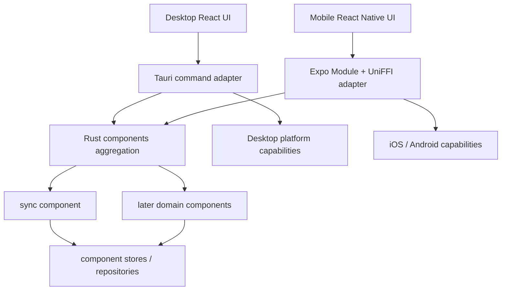

# 使用分域 Rust Components 和聚合原生产物统一桌面与移动后端

## 结论

提议采用以下长期架构：

1. **跨端稳定的后端逻辑按 domain 收敛为多个共享 Rust component。** 业务不变量、用例编排、
   应用自有 SQLite 数据访问、Calibre 只读查询、同步和可跨端复用的网络/文件逻辑逐步从
   desktop/mobile 各自实现收敛到对应 component，而不是堆进一个巨型 `myreader-core` crate。
2. **Tauri Commands 和 Expo Native Module/UniFFI 只是传输适配器。** 两者负责接收平台请求、
   取得平台能力、调用同一 Rust component use case、转换 DTO/错误和发送事件，不复制业务流程。
3. **源码按 component 分离，移动原生代码按应用聚合交付。** 每个 component 有独立 Rust API、
   测试和依赖边界；当前应用所需 components 由一个 aggregation crate 编译进一个 iOS
   XCFramework 和一个 Android native library。移动端只维护一个承载这些 API 的 Expo Module，
   TypeScript 再按 domain 提供 facade。
4. **React 与 React Native 前端继续拥有 UI。** 路由、组件、手势、动画、表单临时状态、
   React Query cache、Zustand UI state、i18n 和展示格式不迁入 Rust。
5. **平台原生能力继续由 Tauri 插件或 Swift/Kotlin 提供。** Readium navigator、系统目录授权、
   Android content URI、iOS security-scoped bookmark、凭据、OAuth UI、通知、后台执行机会和应用
   生命周期不伪装成平台无关逻辑。
6. **先迁移 sync domain 作为架构试点。** 试点必须同时穿过 Automerge、SQLite、远端对象存储、
   异步任务、取消、事件、日志、Tauri、iOS 和 Android，证明共享 component 可在真实业务链路
   中运行。
7. **试点通过后才逐个迁移其他现有 domain。** 每次只迁移一个明确所有权边界，完成后删除旧实现；
   不长期双轨，不进行整个移动端后端的一次性重写。
8. **UI 可以变薄，但不能成为无状态模板。** UI 只调用 use-case API 并响应结果/事件；交互状态和
   乐观反馈仍留在前端，避免把每次手势、渲染和字段读取变成 FFI 调用。
9. **接受更高的构建与系统理解成本。** 业务行为将更集中、更容易局部推理；代价是 Rust
   cross-compilation、UniFFI、Swift/Kotlin wrapper、原生重建、二进制发布和跨边界调试成为必须
   长期维护的工程能力。

本提案先定义目标架构和试点门禁，不表示当前移动端 TypeScript 后端已经迁移，也不授权在试点通过
前批量搬迁其他 domain。

## 背景

### 当前 desktop

ADR-0006 已确立桌面端的分层 Rust 后端：

```text
React UI
  ↓ generated typed IPC
Tauri Commands
  ↓
services
  ↓
repositories
  ↓
SQLite / Calibre / storage / network
```

当前桌面端已经通过约 55 个 Tauri command 对外提供书库、书目、阅读进度、收藏、书签、批注、
阅读统计、下载和同步能力。command 大多只是入口，主要实现位于 Rust service/repository/sync。

### 当前 mobile

ADR-0011 与 ADR-0012 已把移动端整理为：

```text
React Native UI
  ↓
domain
  ↓
repos / services
  ↓
OP-SQLite / filesystem / remote backend / native module
```

该分层在单一移动应用内是合理的，但与桌面端形成了第二套后端实现。Calibre 查询、应用数据库、
阅读数据、存储 backend、同步编排和调度语义需要在 TypeScript 与 Rust 之间保持一致。

ADR-0015 的自研 CRDT 和 ADR-0016 的 Automerge 接入已经实际暴露这种双实现的代价：

- TypeScript 与 Rust 要分别实现同一 canonical schema 和 projection；
- 移动端 Hermes 不能直接运行 Automerge WASM；
- 为兼容 Automerge JavaScript Proxy 而维护通用 native adapter，迫使项目追踪内部 API；
- 一个设备写入、另一设备读取时，问题可能发生在业务规则、SQLite、CRDT、bridge、远端存储或
  UI cache 任一层；
- 单元测试可以分别通过，但跨端真实语义仍可能漂移。

问题的根源不只在 Automerge，而在跨端稳定后端逻辑没有唯一所有者。

## 决策驱动因素

按优先级排序：

1. desktop、iOS 和 Android 对同一数据、冲突和事务必须执行相同语义。
2. 同步、数据库和阅读数据的关键规则只维护、测试一次。
3. Tauri 与 React Native UI 都应消费稳定、粗粒度、可生成检查的 use-case API。
4. 本地优先写入、SQLite projection、durable outbox 和同步 change 保持同一事务事实。
5. 平台差异必须显式留在 adapter，不污染 Rust component，也不能被虚假的统一抽象掩盖。
6. 迁移必须可逐 domain 切换、可验证、可删除旧路径，不接受长期双写或双实现。
7. UI 交互和渲染继续享受 TypeScript/React 的开发效率与 Fast Refresh。
8. 原生构建、包体、启动、桥接和发布成本必须在试点中被真实测量，而不是预先假定可以接受。

## 业界经验

### Firefox / Mozilla Application Services

本提案主要借鉴 Firefox 的 Shared Rust Components，而不是笼统地把“Rust 后端”移植到移动端。
Firefox 最初也因为各平台分别实现同步协议而面临重复逻辑、维护困难和跨实现错误，随后先从 sync
采用共享 Rust component，再扩展到其他能力。其经验与 MyReader 当前问题高度同构：

- 一个 component 是可独立理解、测试和暴露 API 的 Rust library；
- component 应是由应用主动调用的 **library，而不是反向控制应用的 framework**；
- component 通常以 `Store` 或等价对象作为入口，管理本组件的数据库、migration 和 singleton，
  不把 raw SQLite connection 暴露给调用方；
- 业务与同步 metadata 放在同一数据库事实边界，SQLite 使用单 writer，写入事务边界由 Rust
  类型和 API 约束；
- Swift/Kotlin binding 由 UniFFI 生成，平台侧仍保留必要的集成 glue；
- Rust FFI 不天然带来性能优势，价值主要是语义一致与单一实现；API 应避免大量细粒度调用；
- Firefox 没有把所有源码写成一个 component。Application Services 按 Places、Logins、Tabs、
  Web Extension Storage 等能力维护独立 component；
- 但 Android/iOS 交付时会把多个 component 的 Rust crate 聚合进一个 native library
  （Mozilla 称为 megazord），以便只携带一份 Rust runtime/公共依赖、允许 Rust 内部直接互调并
  避免组件二进制版本错配；每个 component 仍保留独立的 Kotlin/Swift API；
- Firefox 也没有为了理论统一一次性迁移所有稳定实现，而是按 component 渐进采用，并承认有些
  平台实现可能长期不值得迁移。

MyReader 采用其中的边界和交付原则，不照搬 Mozilla 的发布基础设施、独立仓库、Maven nightly
流程或全量 megazord。MyReader 是同一 monorepo 内的应用，不需要把内部 component 设计成面向
第三方的通用 SDK。Firefox 的 component 往往拥有独立数据库，而 MyReader 已有一个共享应用
数据库；因此 MyReader 借鉴的是 Store 入口、单 writer 和事务所有权，不为了模仿 Firefox 强制
拆分数据库文件。

### Matrix Rust SDK 与 Signal libsignal

另外两个成熟项目提供了相同方向的交叉验证：

- Matrix Rust SDK 由多层、多职责 crate 组成，仅少数高层 crate 被建议直接消费；Swift/Kotlin
  通过专门的 FFI crate 暴露高层 API，而不是让 UI 直接调用所有内部 crate。
- Signal libsignal 将平台无关实现放在多个 Rust crate 中，再分别提供 Java、Swift 和
  TypeScript library；其构建说明也显示，跨平台 Rust 的主要长期成本在 bridge、目标工具链和
  原生产物，而不是业务代码本身。

这些项目共同支持“内部模块化、外部窄 API、原生产物聚合”的方向，不支持“每个 UI 功能一个
native module”，也不支持“所有 domain 放进一个无边界的巨型 crate”。

## 方案比较

| 方案 | 跨端语义 | UI 迭代 | 构建复杂度 | 长期维护 | 结论 |
|---|---|---|---|---|---|
| 保持 desktop Rust 与 mobile TypeScript 双后端 | 依赖合同和重复测试 | 最快 | 当前水平 | 同一规则长期双实现 | 不作为长期方向 |
| 只共享 Automerge 底层，其他 domain 继续双实现 | 只解决 CRDT runtime | 快 | 中 | SQLite、同步编排和 projection 仍重复 | 只能作为过渡 |
| 一个巨型 Rust core crate，双平台薄 adapter | 后端语义单一 | UI 仍快，后端需原生重建 | 高 | 边界易腐化、测试和依赖持续膨胀 | 不采用 |
| 每个 domain 独立 crate、独立 native library/module | 后端语义单一 | UI 仍快，后端需原生重建 | 很高 | 边界清楚但重复 runtime、发布和版本协调 | 不采用 |
| 分域 Rust components、单一聚合原生产物 | 后端语义单一 | UI 仍快，后端需原生重建 | 高 | 源码边界清楚，运行版本一致 | **提议采用** |
| 移动端改用 Tauri Mobile | 可以直接复用部分 Tauri | 需要重做现有 Expo/Readium 集成 | 很高 | 改变整个移动技术栈 | 不采用 |
| 在应用内启动本地 HTTP/RPC 服务 | API 工具成熟 | 一般 | 增加端口、鉴权和生命周期 | 对本地进程内调用过重 | 不采用 |

## 术语和边界

### Rust component

component 是围绕一个稳定一致性边界组织的平台无关 Rust library，不是 Tauri 后端源码的直接
复制，也不等同于一个页面、一张表或一个 command。它可以拥有：

- 当前存在的 domain model 和业务不变量；
- use case/application service；
- Automerge 文档、change、projection 和同步算法；
- 应用自有 SQLite repository 与 migration 执行；
- Calibre `metadata.db` 只读查询；
- 可在所有目标平台编译的 WebDAV、OneDrive、local-direct 和下载逻辑；
- 结构化 DTO、错误码、日志字段和事件 payload。

component 不得依赖：

- `tauri::AppHandle`、Tauri window/plugin/state；
- Expo、React Native、React、Zustand 或 React Query；
- UIKit、SwiftUI、Android Activity/Context；
- Readium navigator 对象；
- 只有一个平台存在的 URI、权限或凭据对象。

component 的粒度以以下问题判断：

1. 数据是否需要在同一事务中保持不变量；
2. 能否通过少量稳定 use case 与其他 domain 交互；
3. 是否可以独立测试、替换和迁移；
4. 是否会因为拆分而产生高频跨 component/FFI 往返；
5. 依赖是否主要单向流动。

答案指向同一一致性边界时保留在一个 component 内部模块，不为了目录整齐把每张表拆成 crate；
答案指向独立所有权时拆 component，不把所有 service 塞进一个 core。

### Aggregation crate 与原生产物

aggregation crate 是唯一面向原生构建的组合根：

- 依赖当前应用实际使用的 Rust components；
- 统一固定依赖版本、初始化日志/runtime/database 和 component 实例；
- 为移动端汇集各 component 的 UniFFI symbols，并生成一个 XCFramework 和一个 Android native
  library；
- 不包含业务规则，不成为第二个 application service；
- desktop 在 Rust 内使用同一组合根和 component 公共 use case，不经过 FFI。

逻辑 component 边界和物理二进制边界必须分开理解。新增 component 不自动新增 `.so`、
XCFramework、Expo Module 或 JS package。

### 平台 adapter

adapter 负责把平台运行环境转换为 Rust component 所需的输入：

| Desktop adapter | Mobile adapter |
|---|---|
| Tauri Commands / State / Events | Expo Native Module / Swift / Kotlin events |
| Tauri path、dialog、window、protocol | iOS bookmark、Android URI/SAF |
| 桌面 keyring 与 OAuth window | Keychain/Keystore 与移动 OAuth UI |
| 桌面前后台/窗口焦点 | AppState 与系统后台任务入口 |

平台 adapter 不包含 domain 决策。需要系统能力时优先由 adapter 先取得值或句柄，再调用 Rust；
只有确有反向调用需要时才定义受控的 platform port，避免大量跨 FFI callback。

### 前端

前端负责：

- 页面、组件、路由和可访问性；
- 手势、动画和 reader chrome；
- 表单未提交状态、弹窗和错误文案；
- React Query/Zustand 中的查询 cache 与 UI state；
- 调用 API 后失效查询、更新乐观状态和响应后端事件；
- 把后端 DTO 转换成展示文案和布局模型。

前端不得重新实现已经迁入 component 的业务合并、SQLite 写入、同步重试或 canonical 数据规则。

## 目标依赖方向



目标结构采用“多个逻辑 component + 一个聚合产物”：

```text
crates/
  myreader-sync/                    # 首个 component：sync domain
    src/
      application/
      domain/
      repository/
      transport/
      error.rs
      lib.rs
  myreader-rust-components/         # aggregation/composition root
    src/lib.rs
  # 后续只在对应 domain 获准迁移时新增 component

my-reader/src-tauri/
  src/commands/                      # thin Tauri adapter
  src/platform/                      # desktop capabilities

my-reader-mobile/modules/myreader-rust-components/
  ios/                               # generated bindings → Expo Module
  android/                           # generated bindings → Expo Module
  src/                               # TS facade，按 domain 分文件
```

试点只创建 `myreader-sync` 和 aggregation crate，不提前创建书库、进度、批注等空 crate。后续
component 的名称和边界在迁移该 domain 时根据实际表、事务和调用方确定。

移动端初期只使用一个 Expo Module，避免每个 domain 重复维护 Podspec、Gradle、ABI、加载和
生命周期。该 Module 的 Swift/Kotlin/TypeScript 源码可以按 component 分文件或 namespace，
物理模块数量不承担领域建模职责。

## API 设计原则

### 以 use case 为边界

允许：

```text
getBooksPage
getBookDetail
setFavorite
saveReadingPosition
addAnnotation
syncLibrary
```

禁止把 component API 设计成细粒度对象 getter 或 ORM RPC：

```text
getBookTitle
getBookAuthors
getBookProgress
readTableRow
executeSql
putAutomergeScalar
```

一个用户动作应尽量经过一次 API 调用完成验证、业务写入、同步 change、projection 和 outbox，
返回 UI 需要的完整 DTO 或明确的 query invalidation 信息。

### 契约

- Rust 输入、输出、错误和事件是后端合同源。
- Tauri 继续使用生成式 TypeScript IPC。
- Mobile 的 UniFFI Swift/Kotlin binding 按 component API 生成并汇集到同一原生产物；不创建一个
  无命名空间的巨型 FFI API。
- Expo TypeScript facade 按 domain 组织，不手写重复的业务 DTO；一个 Expo Module 只是物理
  承载层，不是一个新的业务边界。
- 试点必须选定一种可复现的 Rust → TypeScript 合同生成/检查方式，避免 Tauri 与 Mobile wrapper
  分别维护不一致类型。
- API 使用结构化错误码和可展示的原始 cause，不把所有错误降级为字符串。
- 传输 contract 需要版本或 runtime compatibility 检查，防止 OTA JavaScript 调用不兼容的
  native API。

### 异步、取消和事件

- 数据库、网络、文件和同步 API 默认异步，不阻塞 UI/main thread。
- 长任务必须有明确 task ID 或 cancel API；不能假设 JavaScript Promise 取消会自动取消 Rust
  future。
- 状态变化和长任务进度使用 Tauri event/channel 与 Expo event 对齐，不通过高频轮询查询。
- 事件只是 UI 通知，不取代 SQLite/outbox 等持久化事实源。
- 高频 reader position/gesture 先在前端合并或 debounce，再调用粗粒度后端 API。

## 数据库所有权

长期目标是应用自有 SQLite 的 schema、migration、事务和 repository 由对应 Rust component
执行，以便 desktop/mobile 使用同一数据语义。

迁移期间必须遵守：

1. **同一张表同时只能有一个写入实现。** 不允许 TypeScript 和 Rust 对同一表双写。
2. **按 domain/table 迁移所有权。** 一个阶段内先建立 Rust read/write 和回归测试，再一次切换
   调用方并删除该表的 TypeScript writer。
3. **当前 ADR-0008 继续有效。** sync 试点复用现有 SQL migration 与 schema 合同；本提案不顺手
   改变数据库 schema 权威。若试点证明需要改变 Drizzle/SQL/SeaORM 的权威关系，必须另提 ADR。
4. **Calibre 数据库保持只读。** 共享 Rust 查询不能向 `metadata.db` 写入 MyReader 字段。
5. **UI cache 不是数据库权威。** Rust 写入成功后由返回 DTO 或事件驱动 React Query/Zustand
   更新。
6. **crate 边界不等于数据库文件边界。** 后续 components 可以继续使用同一个应用数据库，由
   应用级 database coordinator 串行化 writer；不得为追求 component 形式而复制数据库或制造
   分布式事务。
7. **跨 component 事务必须有单一所有者。** 需要同时维护多个 domain 不变量时，由拥有该用例的
   application service 在 Rust 内编排；不把 raw connection 暴露到 Tauri、Swift、Kotlin 或
   TypeScript。

## Sync domain 试点

### 为什么选择 sync

sync 是最严格也最有代表性的试点：

- 已经存在 desktop Rust 与 mobile TypeScript 双实现；
- 同时涉及 Automerge、SQLite、事务、WebDAV、OneDrive、local-direct、文件发布和恢复；
- 包含前后台触发、single-flight、debounce、retry/backoff、取消和事件；
- 需要真实跨设备互操作，而不是只通过同语言单元测试；
- ADR-0016 已暴露 Hermes/WASM 和通用 Automerge adapter 的维护问题；
- 试点成功即可删除一块高复杂度重复代码，并为其他 domain 建立模板。

### 试点保留的产品语义

试点不得重新设计以下已接受决策：

- ADR-0012 的 `all`、`calibre`、`myreader` 同步范围和手动同步语义；
- ADR-0016 的每书库 sidecar、Automerge、六个现有 domain、SQLite projection 和远端对象格式；
- ADR-0017 的 durable outbox、事件驱动 push、上下文/兜底 pull、single-flight 与退避语义；
- Calibre 数据库只读；
- 本地、WebDAV、OneDrive 使用同一产品同步入口和不同 storage capability。

本提案只改变这些语义的实现所有权和跨端调用边界。

### 试点目标范围

`myreader-sync` component 最终拥有：

- canonical Automerge document/genesis/schema；
- create/load/save、heads、changes、missing dependencies 和 apply；
- 当前六个 domain 的 CRDT 编码、冲突 projection 与 schema validation；
- snapshot、change、outbox、receipt、cursor 和 projection 的 SQLite 事务；
- sidecar push/pull、重复/乱序/缺失依赖、崩溃恢复；
- WebDAV、OneDrive 与 local-direct 可跨端共享的列举、下载、上传和错误分类；
- ADR-0017 的调度状态机、pending work、single-flight、debounce 和 backoff；
- 统一日志事件、stage、error code 和同步报告。

平台 adapter 继续拥有：

- 应用启动、前台、网络恢复和书库切换等触发器；
- iOS/Android 提供的后台执行机会；
- 平台凭据读取与 OAuth UI；
- 受系统授权目录、URI 或文件句柄的取得；
- 将同步进度/完成事件发给 UI。

### 试点实施阶段

#### Phase 0：冻结合同和基线

- 记录 desktop/mobile 当前同步 API、SQLite 表所有权、事件、错误和日志。
- 为同一 sidecar fixture 建立 Rust、desktop adapter、mobile adapter 合同测试。
- 记录 iOS、Android、desktop 的原生构建时间、产物大小和同步基线。
- 任何迁移不得改变 ADR-0016/0017 的远端格式和合并语义。

#### Phase 1：建立 sync component、aggregation 与双 adapter

- 建立 Cargo workspace、平台无关的 `myreader-sync` component 和
  `myreader-rust-components` aggregation crate。
- 从 desktop 抽取可复用 sync 代码，不让 component 依赖 Tauri。
- Tauri command 改为调用同一 component use case，行为和生成 bindings 保持不变。
- 建立 UniFFI、Swift/Kotlin 和 Expo Module wrapper，只暴露试点 API。
- 同一 aggregation crate 从源码生成 iOS/Android 原生产物；不为 sync 单独建立第二个长期
  Expo Module 或独立发布版本。
- 生成的中间产物写入构建目录；不把预编译 `.a`、`.so` 或个人机器路径提交到 Git。

#### Phase 2：迁移 Automerge 和本地事务

- 用 `myreader-sync` 取代 mobile 的 Automerge JavaScript `UseApi` adapter。
- 把 sync state/change/outbox/projection 的所有权按表切到 Rust。
- 在一次 Rust 事务中提交产品 projection、Automerge change 和 outbox。
- 删除被取代的 TypeScript writer；禁止保留隐式 fallback。

#### Phase 3：迁移传输和调度

- 让 desktop/mobile 通过同一 Rust use case 执行 sidecar push/pull。
- 接入 WebDAV、OneDrive、local-direct 能力和统一错误分类。
- 将 ADR-0017 调度状态机迁入 sync component；平台生命周期只发送 trigger。
- 提供 task 取消、进度事件和前台恢复。

#### Phase 4：跨端闭环和旧实现删除

- desktop 写入并同步，iOS/Android 拉取后列表、详情和 reader 初始位置立即更新。
- iOS/Android 写入并同步，desktop 拉取后得到相同 projection。
- 验证收藏、进度、书签、批注、阅读会话和完成记录。
- 验证真正并发、重复、乱序、依赖缺口、离线、凭据错误、临时网络错误和崩溃恢复。
- 删除 mobile TypeScript sync engine、通用 Automerge adapter 和不再使用的 patch/build 产物。
- 文档化构建、单元测试、iOS/Android adapter 测试和固定跨端手工回归流程。

#### Phase 5：架构门禁

完成试点后单独评审：

- 业务与同步代码是否确实减少重复并更容易理解；
- bridge API 是否保持 use-case 粒度；
- 原生构建时间、包体、启动和运行性能是否可接受；
- iOS/Android 构建与调试是否可复现；
- 错误是否保留完整 cause，日志是否能定位 component/adapter/platform stage；
- 是否仍存在同一表或同一语义的双实现。

任一核心门禁未通过时，停止其他 domain 迁移并修正架构；不得以“已经投入很多”为由继续扩张。

## 试点验收标准

### Component 与聚合层

- Rust component 不依赖 Tauri、Expo、React Native 或平台 UI 类型。
- desktop、iOS、Android 使用同一 component source 和同一 Automerge 版本。
- component 单元测试覆盖现有同步不变量、事务失败和 CRDT 并发语义。
- 同一 fixture 在三端生成/读取相同 heads、changes 和 projection。
- sync 的 Rust API、UniFFI binding 和 TS facade 保持独立命名边界，但移动端只加载一个聚合
  native library。

### Adapter

- Tauri/Expo adapter 只做 DTO、错误、事件和平台能力转换。
- TypeScript 不直接执行 SQL、Automerge object 操作或同步合并。
- 合同生成/检查能在 Rust API 变更时使不兼容 wrapper 的 CI 失败。
- 长任务不阻塞 UI thread，并支持显式取消或可解释的不可取消阶段。

### 真实运行

- Tauri、iOS 和 Android 可从干净 checkout 构建，不依赖提交的本机二进制。
- WebDAV 与 local-direct 完成双向自动 push/pull；OneDrive 至少完成自动化 storage contract，
  并在可用真实凭据环境执行一次闭环。
- 同步完成后，列表、详情和 reader 不需要重新打开书籍或重启应用才看到 projection。
- 应用被杀、网络中断和下次前台恢复时 pending outbox 不丢失。
- full package unit suites、Rust workspace tests、native adapter tests 和固定跨端回归全部通过。

### 工程成本

- 记录 clean/incremental 原生构建时间、各平台二进制增量、启动时间和典型同步耗时。
- 形成一个命令入口生成 UniFFI、构建 iOS/Android Rust artifact 并检查生成物。
- 生成文件有明确 source of truth；构建目录和个人路径不会进入 Git。
- 新开发者可以从文档理解一次 API 修改需要更新和验证哪些层。

## 其他 domain 的后续迁移

sync 试点通过后，按依赖和风险逐个迁移当前已有 domain。建议顺序：

1. **阅读进度。** 已与 sync/Automerge 紧密相连，验证一个完整产品写用例。
2. **收藏、书签、批注。** 共用阅读数据事务模式，迁移后删除对应 TypeScript repository writer。
3. **阅读统计。** 迁移 session、completion 和查询聚合，保留 heatmap/UI 格式化在前端。
4. **书库与 Calibre 书目。** 统一书库注册、只读查询、分页、详情和格式选择。
5. **文件状态与下载。** 共享状态机和持久化；平台通知、后台任务和 URI 继续由 adapter 提供。

每个 domain 都必须：

- 先列出现有行为、表、调用方和平台差异；
- 定义一个粗粒度 API；
- 在对应 Rust component 建立行为与事务测试；
- 切换 desktop/mobile 调用方；
- 删除旧实现和旧测试替身；
- 通过完整 package 测试与真实平台回归；
- 证明收益后再进入下一个 domain。

应用 UI 设置、阅读器临时偏好和纯展示逻辑不因本提案自动进入迁移列表。

## 结果

### 预期收益

- 后端业务与同步语义只有一个实现。
- desktop/mobile 不再分别修复同一数据或冲突问题。
- Rust 单元测试可以直接覆盖核心业务，不需要先启动 Tauri 或 React Native。
- UI 依赖 use-case API，组件、hooks 和状态层更薄、更接近产品交互。
- SQLite 事务、projection、outbox 和同步 change 可以由同一服务原子提交。
- Automerge 不再受 Hermes/WASM 和 JavaScript 内部 adapter 限制。
- 后续平台可以复用同一组 components。

### 已接受的代价

- 修改 Rust 后端需要重新构建移动原生开发客户端，Fast Refresh 只覆盖 UI/TS。
- Rust 修复不能只通过 EAS JavaScript OTA 发布，需要新的原生版本和 runtime compatibility。
- 需要维护 Cargo cross-compilation、UniFFI、Swift/Kotlin、Expo Module、XCFramework/Android ABI 和
  原生 CI。
- FFI 增加 DTO、错误、对象生命周期、async、取消和事件合同。
- 原生二进制、编译时间、包体和调试链路增大。
- 平台能力仍需 adapter，无法通过 Rust 完全消除 Swift/Kotlin/Tauri 代码。
- Rust panic 或 FFI 错误可能直接影响移动进程，错误边界和真实设备测试比纯 TypeScript 更重要。
- 开发者理解单个业务规则会更容易，但理解整个构建、绑定和运行系统会更难。

## 风险与缓解

| 风险 | 缓解 |
|---|---|
| aggregation crate 变成新的巨型业务模块 | aggregation 只组合、初始化和导出；业务必须落在 component |
| component 拆得过细 | 按一致性和事务边界拆分；不按页面、command 或单表建 crate |
| 多个 component 各自生成原生库 | 所有移动 components 聚合为一个 XCFramework/.so；每个 component 只保留逻辑 API |
| Tauri 细节泄漏进 component | component 禁止依赖 Tauri；command 只在 adapter crate |
| Expo wrapper 复制业务 DTO | Rust 合同生成/检查；wrapper 只转换平台类型 |
| 大量细粒度 FFI 使 UI 卡顿 | use-case 粒度 API、批量 DTO、事件和前端 debounce |
| TypeScript/Rust 同时写 SQLite | 按表切换所有权；门禁检查旧 writer 已删除 |
| 移动原生构建不稳定 | 从源码构建脚本、iOS/Android CI、干净 checkout 验证 |
| OTA JS 与 native API 不兼容 | runtime version + API contract/version 检查 |
| 后台同步被系统挂起 | durable outbox；平台获得执行机会时调用 sync component，前台恢复继续 |
| Rust async 无法随 Promise 自动取消 | 明确 task/cancel API 和安全提交边界 |
| 包体与构建时间增长不可接受 | Phase 0/5 测量；试点未通过则停止扩张 |
| 迁移借机改变产品语义 | 试点冻结 ADR-0012/0016/0017；行为变化单独提案 |

## 与既有 ADR 的关系

- **扩展 ADR-0006。** 把“桌面端分层 Rust 后端”推广为“跨端共享 Rust components”；保留
  Tauri typed IPC。
- **遵守 ADR-0007。** 跨端共享从只共享 TypeScript 类型/工具扩展到共享稳定后端语义；UI 与
  browser-only 工具仍可留在 pnpm packages。
- **保留 ADR-0008。** 试点不改变现有 SQL migration/schema 权威；如需调整另提 ADR。
- **逐步取代 ADR-0011 的 mobile TypeScript domain/repo/service 实现。** ADR-0011 在对应
  domain 完成迁移前仍描述当前实现，UI 分层原则继续有效。
- **保留 ADR-0012 的同步产品语义。** 本提案只迁移实现所有权。
- **修正 ADR-0016 的跨端执行路线。** 若本提案被接受并完成 sync 试点，共享 native
  `myreader-sync` component 取代 Expo WASM/JavaScript `UseApi` adapter；Automerge 数据模型和
  sidecar 设计不变。
- **保留 ADR-0017 的调度语义。** 调度状态机进入 sync component，平台 trigger 和执行机会留在
  adapter。

## 非目标

- 不把 React/React Native UI 改写成 Rust UI。
- 不用 Tauri Mobile 替换 Expo。
- 不把 Readium Toolkit 或 navigator 重写为 Rust。
- 不让 UI 每次渲染通过 FFI 读取字段。
- 不在 sync 试点中新增业务 domain、评分、书架、标签或其他尚不存在的功能。
- 不改变 sidecar 远端格式、CRDT 合并语义、当前书库统计口径或同步目录决策。
- 不在一个阶段迁移全部 SQLite 表。
- 不提交预编译 Rust 静态库或包含个人路径的二进制。
- 不因为“统一 Rust”而强制迁移纯 UI 设置、临时状态和简单展示函数。

## 参考

- [UniFFI User Guide](https://mozilla.github.io/uniffi-rs/latest/)
- [Firefox Shared Rust Components](https://firefox-source-docs.mozilla.org/rust-components/developing-rust-components/)
- [Mozilla Application Services](https://mozilla.github.io/application-services/)
- [Mozilla：Guide to Building a Syncable Rust Component](https://mozilla.github.io/application-services/book/howtos/building-a-rust-component.html)
- [Mozilla：Megazords](https://mozilla.github.io/application-services/book/design/megazords.html)
- [Mozilla：Shipping Rust Components as Swift Packages](https://mozilla.github.io/application-services/book/design/swift-package-manager.html)
- [Matrix Rust SDK](https://github.com/matrix-org/matrix-rust-sdk)
- [Signal libsignal](https://github.com/signalapp/libsignal)
- [Expo Modules API](https://docs.expo.dev/modules/module-api/)
- [Expo development builds](https://docs.expo.dev/develop/development-builds/use-development-builds/)
- [Tauri：Calling Rust from the Frontend](https://v2.tauri.app/develop/calling-rust/)
- [Tauri IPC](https://v2.tauri.app/concept/inter-process-communication/)
- [ADR-0006：桌面端使用生成式类型 IPC 和分层 Rust 后端](./0006-desktop-typed-ipc-and-layered-backend.md)
- [ADR-0008：以 Drizzle schema 和 SQL migrations 作为跨端数据库权威](./0008-shared-database-schema-authority.md)
- [ADR-0011：移动端分层重构](./0011-mobile-layer-refactor.md)
- [ADR-0012：Mobile 同步体系重构实施计划](./0012-mobile-sync-refactor.md)
- [ADR-0016：采用 Automerge 作为书库 sidecar 的 CRDT 核心](./0016-adopt-automerge-for-library-sidecar-sync.md)
- [ADR-0017：使用事件驱动调度自动同步书库 sidecar](./0017-event-driven-library-sidecar-sync-scheduling.md)
