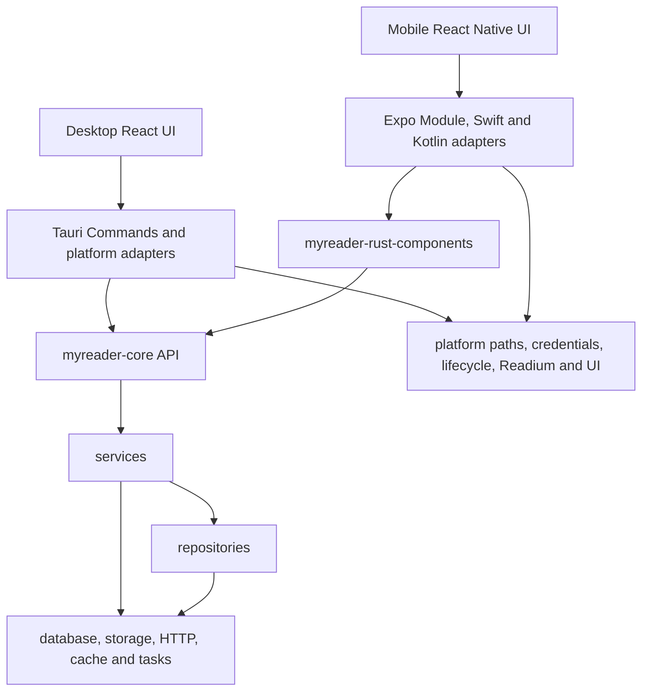

# 采用模块化 myreader-core 统一跨端后端业务

## 状态说明

本提案已于 2026-07-28 接受。2026-07-28 的实施审计确认 Phase 0–4 主体已完成，Phase 5–6
仍有同步 coordinator、下载状态机、binding 边界和运行时门禁未收口，因此状态为“部分实施”。
它部分取代
[ADR-0018](./0018-shared-rust-components.md) 关于“每个业务边界建立独立 Rust component crate”
的长期源码组织决策，但保留 ADR-0018 已验证的共享 Rust、薄平台 adapter、UniFFI 和单一移动
原生产物方向；在数据库迁移执行权切换到 `myreader-core` 后，本提案还将取代
[ADR-0008](./0008-shared-database-schema-authority.md) 以 Drizzle 为跨端数据库权威的长期约束。
ADR-0008 继续保留为当时双后端架构下的历史决策。

### 实施记录

- `myreader-core` 已成为 desktop/mobile 共用的书库、书目、内容状态、阅读数据和同步业务实现。
- `myreader-rust-components` 已不承载业务规则，但 UniFFI DTO、Expo wrapper 与运行时生命周期
  仍需继续收口。
- Tauri Commands 与移动 `services/core` 已切换为平台 adapter；移动 UI 不再直接访问数据库。
- Automerge 引擎、sidecar 持久化和同步调度 reducer 已并入 `myreader-core`，迁移期
  `myreader-sync` crate 已删除；完整 coordinator 仍分别存在于 desktop/mobile。
- MyReader 数据库由 core SeaORM Migrator 接管；旧移动 Drizzle 状态只在首次打开时完成一次
  handoff。
- `packages/db`、Drizzle、OP-SQLite、移动 `repos/`/`services/db/` 和无调用兼容层已删除。
- Core 已复用移动端 Tokio runtime 和每书库数据库连接；完整 `LibraryStore` 生命周期、下载与
  同步 coordinator 仍按下表继续实施。

### 阶段状态

| 阶段 | 状态 | 已落地事实与剩余工作 |
|---|---|---|
| Phase 0 | 完成 | 已冻结现有能力、数据所有权与非目标 |
| Phase 1 | 完成 | Core、Rust migration、registry 与本地书库纵向切片已接入两端 |
| Phase 2 | 完成 | WebDAV、OneDrive 数据源和远程书库用例已进入 Core |
| Phase 3 | 部分完成 | 书目和文件 projection 已进入 Core；下载队列、取消和状态机仍是双实现 |
| Phase 4 | 完成 | 收藏、进度、书签、批注、阅读 session 与统计由 Core 原子写入 |
| Phase 5 | 部分完成 | 同步引擎和 reducer 已统一；完整 coordinator 仍在两端各有执行壳 |
| Phase 6 | 部分完成 | TypeScript 数据库后端已删除；typed FFI、原生 smoke test 和性能基线未完成 |

## 结论

决定采用以下长期架构：

1. **使用一个 `myreader-core` Cargo crate 承载跨端共享后端业务。** 数据源、书库、Calibre
   书目、图书内容、阅读数据和同步等现有业务按内部模块组织，不为每个业务领域预先建立独立
   crate。
2. **采用模块化单体，不采用无边界的巨型 core。** crate 根只暴露粗粒度 use-case API；内部
   保持 `api → services → repositories/infrastructure` 的单向依赖，并通过 Rust 可见性阻止
   平台 adapter 绕过 service 直接访问 repository。
3. **不预设独立顶层 `domain/` 层。** 纯业务类型放入 `models/`；只被某个 service 使用的规则
   与该 service 就近组织；只有未来出现复杂、稳定、可独立测试且被多个用例共享的业务模型时，
   才根据实际需要提取 domain 模块。
4. **业务范围以现有后端能力为基线，而不是以 Sidecar 的六种同步数据为基线。** 当前 Tauri
   command/service 已体现数据源管理、书库管理、书目查询、图书文件、阅读准备、阅读数据和同步
   等真实业务；六种 CRDT 数据只定义同步范围，不定义 `myreader-core` 的全部范围。
5. **Tauri Commands 与 Expo Native Module/UniFFI 继续作为薄 adapter。** adapter 负责平台
   state、生命周期、授权、凭据、目录句柄、窗口、Readium、事件和 DTO 转换，不复制已经迁入
   core 的业务流程。
6. **保留一个 `myreader-rust-components` 技术外壳。** 它只负责 UniFFI 导出、移动原生产物、
   runtime 初始化和平台 binding，不成为第二个业务 service。
7. **先迁移基础设施和核心业务，再清理同步。** 先让 core 拥有数据源、书库、书目、内容和阅读
   use case 的实际数据来源与事务边界；待需要同步的 mutation 都由 core 产生后，再统一同步
   coordinator 并删除旧的 TypeScript/Tauri 编排。
8. **由 Rust migrations 和 SeaORM 统一拥有 MyReader 自有数据库。** 有序 Rust migration
   是 schema 与升级历史的唯一权威；SeaORM entities 是运行时查询模型，不使用 Entity-First
   schema sync 改写用户数据库。移动端完成 core 接入后不再保留 TypeScript/Drizzle 数据库后端。
9. **`myreader-sync` 作为迁移期依赖暂时保留，最终并入 `myreader-core::sync`。** 不为了目录迁移
   提前重写已经工作的同步引擎，也不长期维持两个业务 crate。

本提案改变的是共享 Rust 后端的源码边界、业务范围、数据库 schema 权威和迁移顺序，不改变
现有产品功能、Sidecar 协议、CRDT 合并规则、书库数据所有权或同步范围。

## 背景

### ADR-0018 已证明的部分

ADR-0018 以 sync 作为纵向试点，已经证明以下路线可行：

- 同一 Rust 源码可以被 desktop、iOS 和 Android adapter 消费；
- UniFFI 与一个聚合原生产物可以接入现有 Expo 应用；
- Automerge、SQLite、Sidecar 交换和部分调度状态可以进入共享 Rust；
- Tauri 和 React Native 可以继续保留各自 UI 与平台能力；
- 移动端不需要在 Hermes 中运行 Automerge WASM；
- 预编译本机 Rust 静态库不需要进入 Git 历史。

这些结论继续有效。

### ADR-0018 未解决的问题

试点实现也暴露了两个需要修正的问题。

第一，多个业务 crate 的长期拆分是根据 Firefox 等大型共享组件体系预先推导的，并不是 MyReader
当前业务依赖图自然形成的边界。MyReader 是同一 monorepo、同一个产品、同一套数据库 schema 和
同一发布节奏。数据源、书库、书目、下载、阅读与同步之间存在稳定的单向协作，也存在需要在一个
Rust 事务或一个 use case 中编排的场景。此时为每个领域建立独立 crate 会引入：

- 大量跨 crate 公共类型和可见性设计；
- repository、database coordinator、错误、任务与 storage 基础设施的重复包装；
- 为保持原子事务而暴露内部 connection 或建立额外协调层；
- 业务边界尚未稳定时频繁移动 crate 和公共 API；
- 与一个应用内部模块不相称的版本、feature 和构建理解成本。

第二，sync 试点迁移的是同步引擎与状态转换，但平台仍保留部分同步 coordinator：

- mobile 仍决定 pull freshness、安全扫描、错误分类、retry/suspend 持久化时机和 pending 恢复；
- mobile 同时存在 startup/manual scheduler 与 automatic sidecar scheduler；
- desktop 与 mobile 分别维护 coordinator glue，仍可能产生恢复与错误语义漂移；
- 旧的 mobile background sidecar upload 路径已无现行上传调用方，但恢复入口仍存在。

这说明“共享 Rust 可行”的架构结论成立，但不能把 sync 试点误写成全部后端业务已经迁移完成。
同时，先删除 sync glue 也不是合理的下一步：只要收藏、进度、书签、批注和统计等 mutation 仍由
平台业务代码产生，提前重写 coordinator 只会造成第二次迁移。

### 数据库权威需要随运行时所有权收敛

ADR-0008 在 desktop Rust 与 mobile TypeScript 分别直接访问数据库时，使用了以下权威链路：

```text
packages/db/src/schema
  → drizzle-kit
  → packages/db/drizzle/*.sql
  ├── mobile Drizzle migrator and repositories
  └── desktop SeaORM Migrator
        → generated SeaORM entities
```

这条链路解决了两个独立后端之间的 schema 漂移，当时是合理的。但本提案的目标是让
desktop/mobile 都通过 `myreader-core` 访问 MyReader 自有数据库。迁移完成后，TypeScript 不再
拥有数据库连接、repository 或 migration 执行职责，继续保留 Drizzle 作为初始来源只会产生：

- Rust schema 变更必须先写 TypeScript，再经脚本转换回实际运行的 Rust 后端；
- `packages/db`、Drizzle journal、SQL 包装、SeaORM codegen 和两套 migration metadata 的额外
  耦合；
- TypeScript schema 即使已经没有运行时消费者，仍被错误保留为架构权威；
- 数据库所有权已经统一，schema 所有权却仍跨语言绕行。

因此，`packages/db/src/schema` 是迁移期输入，不是新架构的长期组成。目标状态由 Rust migration
保存升级历史，SeaORM entities 负责查询映射，TypeScript 只消费 FFI DTO。

### 真实业务范围

当前桌面端约 55 个 Tauri command 分布在以下模块：

- `source`
- `library`
- `book`
- `book_reading_format`
- `download`
- `reader`
- `favorite`
- `progress`
- `bookmark`
- `annotation`
- `reading_statistics`
- `sync`

command 是跨进程入口，不等于一对一的业务边界，但它与现有 service/repository 调用关系共同构成
当前最可靠的后端能力清单。`myreader-core` 的范围必须从这份清单出发，不能只根据 Sidecar 当前
同步的六种数据推导。

## 决策驱动因素

按优先级排序：

1. desktop、iOS 和 Android 对同一业务用例只维护一份稳定实现。
2. 数据源、书库、书目、内容、阅读和同步的职责必须可在一个代码库内沿调用链理解。
3. 应用自有数据库写入、Automerge change、projection 和 outbox 可以由同一 use case 原子提交。
4. Calibre `metadata.db` 永远保持外部只读数据源。
5. MyReader 自有数据库 schema 和 migration 只有一个 Rust 权威来源。
6. 平台 adapter 保留真实的平台差异，不把 Tauri、Expo、Readium 或系统授权伪装成通用业务。
7. 迁移必须可以按 use case 纵向切换；同一张表、同一行为不允许长期双写或双实现。
8. 代码结构应帮助理解当前产品，而不是为未来可能出现的独立组件提前建立发布边界。
9. 只有真实复杂度需要时才增加层级、trait 或 crate。

## 业务边界与同步边界

“属于共享 core”与“需要多端同步”是两个独立判断。

| 能力 | core 业务所有权 | 主要数据位置 | 是否进入 Sidecar CRDT |
|---|---|---|---|
| 数据源管理 | 是 | 设备本地 registry；凭据在系统安全存储 | 否 |
| 书库注册、移除、刷新与切换 | 是 | 设备本地 registry 和远程元数据缓存 | 否 |
| Calibre 书目、详情、系列与封面查询 | 是 | 外部只读 `metadata.db` | 否 |
| 图书文件状态、下载、取消、删除与缓存 | 是 | 设备本地文件和缓存状态 | 否 |
| 每书格式选择与阅读源准备 | 是 | 应用本地数据和文件缓存 | 当前不进入 |
| 收藏、阅读位置、书签与批注 | 是 | 每书库 MyReader SQLite | 是 |
| 阅读 session 与完成记录 | 是 | 每书库 MyReader SQLite | 是 |
| Sidecar 交换、冲突合并与调度 | 是 | 每书库 SQLite、远端对象和内存任务 | 不适用；它负责复制 |
| Reader UI 偏好、窗口和临时交互状态 | 默认否 | 平台本地配置或 UI state | 否 |

数据源和书库管理进入 `myreader-core`，不表示它们要跨设备同步。Reader UI 偏好不参与同步，也
不因为统一 Rust 后端而自动进入 core；只有存在跨端一致业务规则时才迁移。

## 业务模块

### 数据源

core 拥有：

- local、WebDAV 和 OneDrive 数据源模型及校验；
- 添加、列出和移除；
- WebDAV 连接测试与远端目录语义；
- 数据源配置与书库关联规则；
- 构建通用 storage backend 所需的稳定配置。

平台保留：

- OAuth 浏览器和回调；
- Keychain、Keystore、桌面 keyring；
- 用户选择目录及系统授权句柄；
- 将安全存储中的 secret 转换为短生命周期调用输入。

数据源 registry 是设备本地业务数据，不进入书库 Sidecar。registry 物理格式的迁移不得与用户
设置同步混为一谈；本提案不引入中心 Profile 或账户。

### 书库

core 拥有：

- 书库注册、去重、删除、刷新和活动书库选择；
- local/remote 书库与数据源的关联；
- 书库 ID、源路径、本地容器和数据库上下文；
- 下载并验证远程 `metadata.db`；
- `LibraryStore` 的连接和资源生命周期。

平台保留 security-scoped bookmark、Android URI/SAF、Tauri asset scope 等授权能力。adapter
取得可用路径或句柄后交给 core，不让 core 依赖 UI 或窗口对象。

### 书目

core 通过只读 Calibre repository 提供：

- 书目列表、分页、搜索和排序；
- 图书详情、标识符、格式大小和系列；
- 封面定位与读取；
- 最近阅读等需要组合 Calibre 与应用数据的查询。

Calibre entity 只用于查询，任何 MyReader 字段都不得写入 `metadata.db`。

### 图书内容与阅读准备

core 拥有：

- 图书格式选择与格式可用性；
- 远端相对路径和本地缓存状态；
- 下载、去重、取消、删除及任务状态机；
- 为 EPUB、PDF、CBZ 准备稳定的 publication source 描述；
- 可跨平台共享的 archive、文件和缓存规则。

平台保留：

- 系统后台执行机会和通知；
- 平台 URI、文件句柄和授权续期；
- Tauri protocol/window/streamer glue；
- Readium Navigator、WebView 和 Reader Surface。

### 阅读

reading service 包含当前已有能力：

- 每书阅读格式；
- 收藏；
- 阅读位置和候选位置选择；
- 书签；
- 高亮与笔记；
- 阅读 session；
- 阅读完成记录和统计查询。

不为以上每项建立独立 crate。它们可以按内部文件或子模块组织；只有共享事务和业务规则需要时才
互相协作。需要同步的 mutation 在同一 core use case 中提交产品数据、Automerge change、
projection 和 outbox。

### 同步

sync 是 core 内部的复杂子系统，拥有：

- Automerge document、change、heads、projection 和合并；
- durable outbox、receipt、cursor 和恢复；
- local-direct、WebDAV、OneDrive Sidecar 交换；
- manual/startup/automatic 的统一 single-flight；
- debounce、pull freshness、retry/backoff、挂起和恢复；
- task progress、cancel、结构化 stage/error 和完成事件。

平台只发送生命周期、网络恢复、书库切换和后台执行机会等 trigger。同步范围继续由
ADR-0016/0017 定义，不因本提案增加新数据类型。

## 目标源码结构

```text
crates/
  myreader-core/
    src/
      api/
        datasource.rs
        library.rs
        catalog.rs
        content.rs
        reading.rs
        sync.rs
      services/
        datasource/
        library/
        catalog/
        content/
        reading/
        sync/
      repositories/
        app/
        calibre/
        library/
      models/
      infrastructure/
        database/
        storage/
        http/
        cache/
        tasks/
      error.rs
      lib.rs

  myreader-rust-components/
    src/lib.rs
```

结构规则：

- `api/`：面向 Tauri 与 UniFFI 的粗粒度用例、DTO 和事件合同。
- `services/`：业务规则、用例编排、事务与跨 repository/storage 协作。
- `repositories/`：SeaORM 和 Calibre 查询；不调用 service。
- `models/`：共享业务类型和值，不包含数据库和平台调用。
- `infrastructure/`：数据库连接、对象存储、HTTP、缓存和任务等跨端实现。
- `sync/` 作为 service 子系统组织，不允许绕过其他业务 use case 直接篡改产品表。
- 不建立通用 `utils/` 垃圾目录；工具与其所有者就近放置，只有稳定多处复用后才提升。

`myreader-rust-components` 只依赖并导出 `myreader-core`，不包含业务规则。desktop 在 Rust 内直接
调用 core，不经过 UniFFI；mobile 通过同一个 Expo Module 和 UniFFI 调用。

### 为什么没有独立 `domain/`

本提案中的 domain 是业务边界概念，不强制对应一个顶层目录。

可以直接放在 service 或 models 中的内容包括：

- 数据源名称和路径校验；
- 书库去重和活动书库规则；
- 阅读位置选择；
- 下载状态转换；
- sync scheduler 状态机。

如果为每个类型建立 entity/value-object/aggregate/repository interface，但实际规则仍只在一个
service 中使用，会形成空洞 wrapper。只有出现以下情况才提取独立 domain 模块：

- 规则不依赖数据库、网络或平台；
- 被多个 use case 稳定复用；
- 自身具有明显不变量和生命周期；
- 提取后能减少依赖，而不是增加转调。

### 为什么一个 crate 不等于巨型 core

物理 crate 边界只解决编译、发布和依赖可见性，不自动产生正确业务边界。`myreader-core` 使用以下
门禁防止退化：

1. crate root 只公开 `api` 和必要的初始化入口；
2. repository、database connection 和内部 entity 不跨 crate 暴露；
3. 平台 adapter 不直接调用 repository 或 sync persistence；
4. service 之间通过明确用例协作，不直接修改对方表；
5. 跨领域事务由拥有用户动作的 service 编排；
6. 新增依赖必须有实际消费者，不为未来功能预置；
7. 模块过大时先按内部职责拆分，不自动创建新 crate。

只有满足以下至少一项时才考虑从 core 拆出 crate：

- 需要独立发布或被其他产品单独消费；
- 具有独立数据库、生命周期和稳定公共 API；
- 重型依赖只应在部分编译目标出现，feature 仍无法合理隔离；
- 安全或故障边界要求独立进程或独立产物；
- 内部模块边界经过实践仍无法阻止不可接受的耦合。

当前现有业务不满足这些拆分条件。

## 依赖与平台边界



允许 adapter 负责：

- 获取 app data path、授权目录或平台句柄；
- 读取短生命周期 credential/token；
- 接收 AppState、网络和后台执行事件；
- 映射 DTO、错误和 UI 事件；
- React Query cache invalidation 和用户提示。

不允许 adapter 负责：

- 书库去重、路径归属或数据源关联规则；
- Calibre 与应用数据组合查询；
- 阅读 mutation、冲突选择或 outbox 生成；
- sync freshness、错误重试分类或恢复状态；
- 下载状态机和跨 repository 编排。

## 数据与 ORM

### 目标 Schema 权威

MyReader 自有数据库的目标权威链路是：

```text
myreader-core/migration
  → SeaORM Migrator
  → migrated SQLite schema
  → SeaORM generated entities for queries
```

- 有序 Rust migrations 描述当前 schema 以及从旧版本升级的唯一合法路径。
- migration 优先使用 SeaORM Migration/SeaQuery；历史 SQL 或 ORM 不适合表达的变更可以在对应
  migration 内使用受测试的 raw SQL。
- SeaORM entities 是生成的运行时查询模型，不是 migration 历史，也不得通过运行时
  Entity-First schema sync 自动修正用户数据库。
- entity codegen 必须从完整重放 Rust migration 后的临时 SQLite 生成，不能只根据最新 entity
  快照猜测历史 schema。
- `myreader-core` 的 repository 默认使用 SeaORM/SeaQuery。
- ORM 无法自然表达的少数查询可以在 repository 内部使用受测试的语句，但不得在 service、
  adapter 或 UI 中散落 raw SQL。
- 迁移完成后，TypeScript 不持有数据库 schema、migration、ORM model 或推导数据库类型；
  desktop/mobile API 类型由 core DTO 和 binding 合同提供。

### 为什么不使用 Entity-First schema sync

当前 entity 只能描述最终表结构，不能完整表达：

- 已发布数据库必须按什么顺序升级；
- 数据回填、字段转换和约束收紧；
- 删除、重命名与合并表或列；
- 某个历史 migration 是否已经成功应用。

因此，entity 可以帮助生成初始化 schema，但不能取代有序 migration。运行时 schema sync 会
重新引入 ADR-0008 已经消除过的“双重建表权威”问题。

### 既有 Drizzle 历史的接管

`packages/db` 不能在 core 建立之初直接删除。切换数据库权威时必须：

1. 将现有有序 SQL migration 作为不可变历史移入 `myreader-core` 的 migration 目录，保留原始
   顺序、版本名称和 SQL 语义；可以由 SeaORM migration 模块嵌入执行，不为代码风格重写历史。
2. desktop 已记录在 `seaql_migrations` 中的版本必须继续被同名 migration 识别，不能重复执行。
3. mobile 需要一次明确的 migration ownership handoff：校验现有 Drizzle migration 记录和实际
   schema，建立等价的 SeaORM migration state，再停止 Drizzle migrator；不能对已有表直接重放
   全部建表语句。
4. 自权威切换点起，所有新 migration 只在 Rust 中定义。迁移期仍被 TypeScript repository 使用的
   Drizzle schema 只作为临时查询映射，不再生成 migration。
5. 当 mobile 的数据库 repository 和类型消费者全部改为 core API 后，删除 `packages/db`、
   Drizzle 依赖、journal、SQL 生成脚本和 SeaORM 跨语言转换脚本。

这允许保留用户数据库升级历史，同时消除目标架构中的 TypeScript schema 绕行。

### Calibre 外部数据库

Calibre `metadata.db` 不属于以上 migration：

- `myreader-core` 只用 SeaORM entities/repository 映射和查询 Calibre schema；
- Calibre entities 可以从受支持版本的真实 schema 或 fixture 生成；
- MyReader migrator 永远不创建、修改或补全 Calibre 表；
- 连接必须保持只读，不能因为统一 ORM 而改变数据所有权。

### Schema 方案比较

| 方案 | 优点 | 主要问题 | 结论 |
|---|---|---|---|
| 继续以 TypeScript/Drizzle 为初始来源 | 沿用当前生成链 | 统一 Rust 后端后没有独立消费者，schema 所有权仍跨语言绕行 | 仅迁移期保留 |
| SeaORM entities + 运行时 schema sync | 初始代码少 | 最终快照不能表达有序升级、数据变换和破坏性变更 | 不采用 |
| Rust migrations 为权威 + 从最终 schema 生成 SeaORM entities | 历史与运行时所有权一致；无需 TS 转换 | 需要一次接管既有 Drizzle migration state | **采用** |

### 数据库生命周期

- 每个书库由一个 `LibraryStore` 或等价 core 对象拥有 MyReader 数据库连接和写事务。
- 同一张表迁移后只有 core writer；TypeScript、Tauri 旧 service 和 core 不得双写。
- 迁移期未切换的表继续由原实现拥有，不做隐式 fallback。
- 跨业务写入由一个 core service 取得事务并提交，不向 FFI 暴露 connection。
- Calibre repository 单独打开 `metadata.db`，始终只读。

### 设备本地 registry

数据源、书库注册和活动书库属于设备本地业务 registry，不属于每书库 Sidecar，也不与用户设置
同步。本提案要求 core 拥有 registry 的模型、校验和 use case，但不借机引入中心 Profile。

迁移时应保持现有用户配置可读，并由一个 core registry store 逐步取代 desktop/mobile 各自的
业务写入。凭据只保存安全存储引用，不写入普通 JSON、SQLite、日志或 DTO。若需要改变 registry
的物理文件格式或引入独立 app database，应在实施阶段明确迁移与回滚，不把格式选择隐藏在业务
迁移中。

## API 原则

API 以用户用例为粒度：

```text
listDataSources
addWebdavDataSource
addLibrary
refreshLibrary
getBooksPage
getBookDetail
downloadBookFile
prepareBookSource
setFavorite
saveReadingPosition
addAnnotation
recordReadingSession
syncLibrary
```

禁止：

```text
executeSql
readTable
putAutomergeScalar
getBookTitle
openRawConnection
```

一次 API 应尽量完成校验、业务写入、同步 change、projection 和 outbox，并返回完整 DTO 或明确的
失效事件。Rust API 是共享后端合同源；Tauri 与 UniFFI 的生成或检查必须能暴露不兼容变更。

## 迁移计划

迁移按完整纵向用例进行，不先创建空目录、空 trait 或未被调用的通用框架。

### Phase 0：冻结能力与所有权

- 以现有 Tauri command/service/repository 和 mobile 调用路径建立能力清单。
- 对每个能力记录输入输出、数据位置、平台差异、当前 writer 和测试。
- 冻结现有产品行为；迁移不顺手增加数据源类型、书架、评分、标签或账户。
- 明确每个阶段切换的表和调用方，禁止双写。

### Phase 1：建立 core 与本地数据源/书库纵向切片

- 创建 `myreader-core` 和最小 `api/services/repositories/models/infrastructure` 骨架。
- 建立 core error、初始化、registry store、`LibraryStore` 和数据库连接生命周期。
- 将既有 migration 历史移入 core，并以原版本名称接入 SeaORM Migrator。
- 为 mobile 现有 Drizzle 数据库实现并测试一次性 migration ownership handoff。
- desktop/mobile 都切换为由 core 执行 MyReader 数据库 migration；后续只新增 Rust migration。
- 先迁移 local 数据源的添加、列出、删除和路径校验。
- 迁移 local 书库的添加、列出、删除、切换和 Calibre 验证。
- desktop/mobile 调用同一 core use case 后删除对应旧业务 writer。

本阶段通过一个真实业务切片验证基础设施，不先完成一个无人使用的“通用基础设施层”。

### Phase 2：远程数据源与远程书库

- 接入 WebDAV、OneDrive storage 配置、连接测试和目录浏览。
- 保留 OAuth 与 credential store 在平台 adapter；core 只消费受控配置和 credential 引用/值。
- 迁移远程书库添加、`metadata.db` 下载、刷新、缓存和错误语义。
- 验证 local、WebDAV、OneDrive 使用同一 library use case 和不同平台能力。

### Phase 3：书目、图书内容与阅读准备

- 迁移 Calibre 只读 repository、分页、搜索、详情、系列和封面。
- 迁移每书格式选择、文件状态、下载、取消、删除和缓存状态。
- 迁移可共享的 publication source 准备、archive 和路径规则。
- 保留 Readium Navigator、窗口、protocol、系统后台任务和平台 URI 在 adapter。

### Phase 4：阅读业务

按依赖逐项迁移当前已有能力：

1. 收藏；
2. 阅读位置和候选位置选择；
3. 书签；
4. 高亮与笔记；
5. 阅读 session；
6. 阅读完成记录和统计查询。

每项迁移都必须：

- 暴露 use-case API；
- 使用 core repository 和 `LibraryStore`；
- 对需要同步的 mutation 原子提交产品数据、Automerge change、projection 和 outbox；
- 切换 desktop/mobile 调用方；
- 删除该能力的旧 writer；
- 完成 Rust、adapter 和真实跨端回归后再进入下一项。

### Phase 5：统一同步 coordinator

在所有需要同步的业务 mutation 已由 core 产生后：

- 合并 manual、startup 和 automatic 的 single-flight；
- 把 pull freshness、effective mode、错误分类、retry/backoff、挂起和恢复收入 core；
- 统一 schedule persistence、pending work 恢复和同步完成事件；
- mobile/desktop 只发送生命周期、网络、书库切换和手动操作 trigger；
- 删除 mobile `automatic-sidecar-sync`、`sidecar-scheduler`、旧 background sidecar upload 和
  Tauri 重复 coordinator；
- 将 `myreader-sync` 实现并入 `myreader-core::sync`。

### Phase 6：收口与架构门禁

- `myreader-rust-components` 只剩 binding、初始化和原生产物职责。
- Tauri Commands 与 Expo facade 不再包含已迁移业务流程。
- 清理旧 service/repository、测试替身和兼容 fallback。
- 确认 TypeScript 已无数据库消费者后删除 `packages/db`、Drizzle 依赖和跨语言 entity 生成链。
- 更新 `ARCHITECTURE.md` 描述已经实施的事实。
- 审核依赖方向、数据库 writer、FFI 粒度、构建成本和真实平台运行。

## 每阶段验证

- 先用 core 单元测试保护纯规则。
- repository 使用临时真实 SQLite 或只读 Calibre fixture，不只 mock ORM。
- migration 测试覆盖空数据库完整重放、desktop 已有 SeaORM 版本继续升级、mobile Drizzle 状态
  接管和接管后继续执行新 Rust migration。
- entity codegen 门禁从完整 migration 链构建临时数据库，并检查生成输出没有漂移。
- service 测试覆盖成功、事务失败、重复操作和资源恢复。
- Tauri/UniFFI adapter 合同测试保护 DTO、错误和事件。
- 每个被触及的 package 运行完整 unit suite。
- 涉及移动原生 API 时验证 iOS 和 Android 从源码构建；涉及桌面时验证 Tauri IPC。
- 跨端数据行为使用固定 desktop/mobile 回归流程验证，不以单端 mock 代替。

测试名称继续遵守项目约定：TypeScript 使用 `it("should ... when ...")`；Rust/Kotlin/Swift 使用
可读的 `should_xxx_when_xxx`。

## 方案比较

| 方案 | 优点 | 主要问题 | 结论 |
|---|---|---|---|
| 保持 desktop Rust 与 mobile TypeScript 双后端 | 平台局部修改快 | 业务和数据语义长期双实现 | 不采用 |
| 延续 ADR-0018，为每个业务领域建立独立 crate | 编译边界明确 | 当前单产品、共享事务和基础设施下拆分成本高，边界尚未稳定 | 不作为当前长期结构 |
| 一个无内部约束的巨型 core | 文件集中 | repository、平台与业务容易互相穿透 | 不采用 |
| 一个模块化 `myreader-core` + 薄绑定外壳 | 单一实现、事务直接、迁移简单、内部仍可分层 | 需要用可见性和审查维护模块边界 | **采用** |
| 将整个应用改成 Tauri Mobile | 最大化 Rust 复用 | 需要替换 Expo 与现有 Readium 集成 | 不采用 |

## 预期结果

### 收益

- 可以沿一个 crate 内的调用链理解数据源、书库、书目、内容、阅读和同步。
- desktop/mobile 共享同一业务、repository 和基础设施实现。
- 跨业务事务不需要跨 crate 暴露 connection 或公共内部类型。
- 业务 API 可以从现有 Tauri service 渐进迁移，不需要先设计所有组件公共接口。
- Rust 内部直接调用，FFI 只存在于移动应用边界。
- 最终同步 coordinator 可以在业务 mutation 已集中后自然收敛。

### 代价

- `myreader-core` 的编译单元和依赖集合会扩大。
- 内部模块边界不像 crate 边界一样自动强制，需要 Rust 可见性、测试和评审门禁。
- 修改共享后端需要重新构建移动原生开发客户端。
- UniFFI、Swift/Kotlin wrapper、cross-compilation 和原生 CI 仍是长期成本。
- 迁移期会同时存在 core 和未迁移平台实现，需要严格表级/用例级所有权清单。

## 风险与缓解

| 风险 | 缓解 |
|---|---|
| core 退化成巨型文件或无边界 service | 按 api/service/repository/infrastructure 分层；crate root 只公开 API |
| 为每个 command 机械创建 service/repository | 以真实用例和数据所有权分组，不追求一文件一层 |
| 提前建设无人使用的基础设施 | 每个基础设施能力必须随一个纵向业务切片进入 |
| 平台能力泄漏到 core | Tauri/Expo/Readium/系统授权留在 adapter；core 只接收稳定 DTO 或 port |
| 数据源、书库进入 core 后被误同步 | 明确业务所有权与同步范围是两个维度；registry 设备本地 |
| Calibre 被误当作应用数据库迁移 | repository 强制只读；Calibre entities 不注册到应用 migrator |
| mobile 切换迁移器后重复建表或漏记版本 | 校验 Drizzle 记录与实际 schema，一次性建立等价 SeaORM migration state 后再禁用旧 migrator |
| 新旧 schema 权威在迁移期继续分叉 | 权威切换后只允许新增 Rust migration；TypeScript schema 只作临时查询映射 |
| TypeScript/Rust 双写同一表 | 阶段所有权清单、一次切换调用方、删除旧 writer |
| sync 过早清理导致重复迁移 | 将 coordinator 收敛放在核心业务 mutation 迁移之后 |
| `myreader-sync` 成为永久第二业务 crate | Phase 5 明确并入 core，最终门禁检查 workspace |
| Reader UI 或设置被无意义迁入 Rust | 只迁移存在共享后端规则的能力；UI state 和平台偏好默认保留 |

## 与既有 ADR 的关系

- **扩展 ADR-0006。** 保留 `commands → services → repositories → infrastructure` 的成熟分层，
  将其从 desktop 后端推广到共享 `myreader-core`；Tauri Commands 继续使用生成式 IPC。
- **遵守 ADR-0007。** 共享仍按真实语义决定；React/React Native UI、Readium Surface 和平台
  生命周期不进入 core。
- **在数据库 migration ownership 切换后取代 ADR-0008。** ADR-0008 记录双后端时期为什么必须
  以 Drizzle 统一 schema；本提案在数据库运行时统一进入 core 后，把权威改为 Rust migrations。
  切换完成前当前 Drizzle 链仍是已实施事实，不能提前删除。
- **逐步取代 ADR-0011 中已经迁移能力的 mobile TypeScript 后端。** 未迁移能力继续遵守现有
  mobile 分层，不能提前绕过。
- **保留 ADR-0012 的产品同步范围。** Calibre 与 MyReader 阶段仍可独立执行；本提案只改变
  长期实现所有权。
- **保留 ADR-0016 的 Automerge 与 Sidecar 数据模型。**
- **保留 ADR-0017 的事件驱动调度语义。** Phase 5 统一 coordinator，不重新设计调度产品规则。
- **部分取代 ADR-0018。** 保留共享 Rust、薄 adapter、UniFFI、一个移动原生产物和 sync 试点
  结果；取代多个长期业务 component crate 与 aggregation 的源码组织，改为一个模块化业务 core
  和一个纯技术绑定外壳。

ADR-0018 已验证的共享 Rust 与绑定方向继续有效；本决策开始取代其多业务 crate 长期组织方式，
具体取代范围随本决策各阶段完成而落地。

## 非目标

- 不新增任何当前不存在的业务功能或同步 domain。
- 不增加评分、书架、合集、标签、账户、中心 Profile 或跨书库统计。
- 不改变 Sidecar 目录、远端对象格式、Automerge schema 或冲突合并规则。
- 不同步数据源配置、书库 registry、用户设置或 Reader UI 偏好。
- 不修改 Calibre `metadata.db`。
- 不把 React/React Native UI、Readium Navigator、窗口或手势迁入 Rust。
- 不用 Tauri Mobile 替换 Expo。
- 不一次性重写 desktop/mobile 后端。
- 不为未来功能建立空 trait、空 service、空 repository 或空 crate。
- 不在 Git 中提交预编译 Rust 二进制或个人机器路径。

## 实施约束

实施必须持续满足：

1. `myreader-core` 的业务范围采用现有 command/service 清单，而不是六种同步数据。
2. 顶层不预设独立 `domain/`，按实际规则需要再提取。
3. 数据源与书库 registry 保持设备本地，不进入 Sidecar。
4. MyReader 自有数据库由有序 Rust migrations 持有 schema 与升级历史；SeaORM entities 只负责
   运行时查询映射。
5. `myreader-rust-components` 只作为技术绑定外壳。
6. 迁移先从基础设施与数据源/书库纵向切片开始，不先清理 sync。
7. `myreader-sync` 只作为迁移期依赖，最终并入 core。

## 参考

- [ADR-0006：桌面端使用生成式类型 IPC 和分层 Rust 后端](./0006-desktop-typed-ipc-and-layered-backend.md)
- [ADR-0007：采用 pnpm monorepo 并按语义共享跨端代码](./0007-pnpm-monorepo-and-shared-code-ownership.md)
- [ADR-0008：以 Drizzle schema 和 SQL migrations 作为跨端数据库权威](./0008-shared-database-schema-authority.md)
- [ADR-0011：移动端分层重构](./0011-mobile-layer-refactor.md)
- [ADR-0012：Mobile Sync Refactor](./0012-mobile-sync-refactor.md)
- [ADR-0016：采用 Automerge 作为书库 sidecar 的 CRDT 核心](./0016-adopt-automerge-for-library-sidecar-sync.md)
- [ADR-0017：使用事件驱动调度自动同步书库 sidecar](./0017-event-driven-library-sidecar-sync-scheduling.md)
- [ADR-0018：使用分域 Rust Components 和聚合原生产物统一桌面与移动后端](./0018-shared-rust-components.md)
- [SeaORM：Writing Migration](https://www.sea-ql.org/SeaORM/docs/migration/writing-migration/)
- [SeaORM：Generate Entity from Database](https://www.sea-ql.org/SeaORM/docs/generate-entity/sea-orm-cli/)
