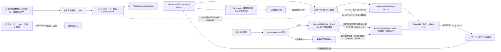

# 采用 Readium TTS 会话与 MyReaderCore 推理供应商架构

## 状态说明

本 ADR 于 2026-08-22 接受。目标架构和分阶段边界均生效；首个前台朗读纵向切片已经实施，后续阶段
仍以本文的能力门禁为准。

2026-08-23 范围修订：第一阶段产品入口只开放 System 与 OpenAI-compatible。

2026-09-29 扩展：增加 Qwen 原生 DashScope adapter；三端共享 Core 的模型能力、音色发现与合成协议。

当前已实施：

- 桌面、iOS 和 Android 的文本 EPUB Readium 朗读会话、句子 Decoration、Locator 跟随与
  “回到朗读位置”。
- 播放、暂停、停止、上一句、下一句，以及从当前位置或 Selection Locator 起播。
- System 与 OpenAI-compatible 两种第一阶段引擎；网络引擎使用同一 Core profile、voice
  discovery、合成、缓存、错误和凭据引用合同。
- Qwen-Audio-TTS Plus、Qwen3-TTS Flash / Instruct、Qwen3-TTS VC / VD 的 HTTP 合成与已有音色选择。
- 网络引擎为当前句显示生成/缓冲状态，并预取后续两句；停止、选文跳转及切换 provider/voice
  会取消旧请求并切换 generation，晚到结果不得改变当前播放位置。
- 移动端预取窗口由 Readium 当前 utterance Locator 锚定的一次性内容投影生成；不维护按文本或语言
  自行推进的第二个 utterance 游标。
- 朗读自然推进到下一页时，Readium 按当前 utterance Locator 自动翻页；用户主动翻页只让视口暂时
  脱离朗读位置，原朗读会话继续运行。用户翻回朗读页或朗读推进到当前页面后，视口自动恢复跟随；
  用户可“返回播放位置”而不改变会话，也可点击“从当前位置播放”，从新页第一句完整可见句子重新起播。
- 桌面 keyring 与移动 SecureStore 保存密钥，Core 配置和日志不持有 secret。

当前尚未完成：

- 不依赖 JS runtime 的移动远端后台 worker、完整锁屏媒体控制、音频焦点与中断验收。
- PDF、CBZ、纯图片内容，以及慢响应、断网、401、429 等完整运行时异常矩阵。
- cache 管理 UI、更多供应商和本文 Phase 3/4 的增强能力。

本文延续以下已接受决策：

- [ADR-0005](./0005-adopt-readium-reader-architecture.md)：Publication、Navigator、Locator 和
  Decoration 属于 Readium 阅读架构，MyReader 拥有产品状态与持久化。
- [ADR-0013](./0013-maintain-mobile-readium-integration.md)：移动端在仓库内维护薄 Readium 集成层，
  但不把 MyReader 数据库与产品逻辑写入 Toolkit。
- [ADR-0019](./0019-adopt-modular-my-reader-core.md)：跨端后端业务、设备本地配置和可共享的网络
  推理逻辑进入模块化 `my-reader-core`，平台能力留在 adapter。

## 结论

决定采用以下目标架构：

1. **Readium 是朗读会话的唯一正文权威。** iOS 使用
   `PublicationSpeechSynthesizer`，Android 使用 `TtsNavigator` / `TextAwareMediaNavigator`，
   桌面 EPUB 使用 `@readium/speech` 与现有 Readium Navigator 组合。它们负责 Publication
   内容遍历、语言上下文、句子切分、当前 utterance、上一句/下一句和 Locator 推进。
2. **视觉阅读与 TTS 只通过完整 Readium `Locator` 对齐。** 当前句使用独立 Decoration group
   高亮；引擎能提供可靠 token 边界时才显示词级下划线。TTS 不维护第二套 CFI、DOM offset、页码
   或纯文本进度。
3. **统一产品合同为 `TtsSession`，不统一 Toolkit 内部实现。** 三端暴露相同的状态、命令、当前
   utterance、能力和错误语义，各端内部仍使用各自官方 Readium API。
4. **正文单击不用于朗读定位。** 中间区域单击保留给阅读 Chrome，边缘单击和水平滑动保留给翻页，
   长按保留给原生文字选择。任意位置起播通过选择菜单的“从这里朗读”使用完整 Selection Locator；
   相邻句子跳转使用播放器的上一句/下一句。
5. **MyReaderCore 拥有推理供应商业务。** 它负责供应商 profile 的 CRUD、默认选择、配置迁移、
   能力探测、语音列表、试听、合成请求、缓存、去重、取消、输入切分、响应校验、时间戳归一化和
   统一错误；不拥有 Navigator、系统 TTS、音频焦点或 TTS UI。
6. **系统引擎是默认且无需上传正文的路径。** iOS/Android 使用系统语音，桌面使用运行时可用的
   Web Speech/system speech。任何网络供应商必须由用户主动选择，并明确告知正文片段会发送到
   对应服务。
7. **推理供应商采用能力驱动的 adapter，而不是供应商条件分支。** 每个 voice 必须由
   `(providerProfileId, voiceId)` 唯一标识；不能把不同供应商的 voice ID 展平成一个全局字符串。
   对 `voiceDiscovery = false` 的 OpenAI-compatible，profile 必须由用户填写声音 ID 列表并指定
   默认声音；MyReader 不内置、猜测或把 OpenAI 官方声音名套用到其他兼容供应商。
8. **第一阶段引擎只包括 System 和 OpenAI-compatible。** System 先验证 Readium 会话和平台
   媒体生命周期，随后在同一阶段接入 OpenAI-compatible 网络 adapter。MiniMax、火山引擎、
   Azure Speech、ElevenLabs 和 Google Gemini TTS 后续接入；GPT-SoVITS、CosyVoice、
   AllTalk/XTTS、TTS-WebUI 等本地服务在统一 custom endpoint 基础成熟后接入。
9. **密钥永不进入 Core 配置、数据库、日志或同步。** Core 只保存逻辑 credential reference；
    桌面使用系统 keyring，移动端使用 SecureStore。平台在单次调用时把临时凭据注入 Core。
10. **网络音频以设备本地 artifact 交付，不跨 IPC 传 base64 大对象。** Core 将完整且已校验的
    音频原子写入显式注入的 cache 目录，Readium 自定义引擎只接收文件路径、MIME、时长和可选词级
    timing。
11. **缓存、供应商配置和活动会话都不进入书库 sidecar。** provider profile、默认引擎和语音偏好
    是设备本地配置；音频是可清理缓存；播放状态是内存状态。阅读位置继续复用现有 Locator
    progress，阅读统计只累计真正播放的时间。
12. **第一版只支持运行时可朗读的文本 EPUB。** reflowable EPUB 和含可访问 XHTML 文本的 FXL
    EPUB 通过 Toolkit 的 `canSpeak` / factory 创建结果判定；PDF、CBZ、OCR、纯图片 FXL 和整书
    有声书导出不在首版范围。
13. **系统 TTS 与远端 TTS 分阶段交付。** 先验证三端 Readium 会话、Locator、高亮与系统媒体
    生命周期，再接入 Core 推理协议。远端后台连续播放只有在原生 worker 不依赖可能被挂起的 JS
    runtime 后才能标记支持。

一句话概括：

> Readium 决定“读哪里、哪一句、如何定位”；MyReaderCore 决定“向哪个推理服务请求、如何安全
> 得到可播放音频”；平台 adapter 决定“如何说话、播放和接管系统媒体会话”。

## 决策时背景与基线

本 ADR 提出时，仓库已有若干 TTS 基础，但没有可用的端到端功能：

- 移动 `@my-reader/readium` 可以从 `Publication.content()` 迭代 `{ text, locator, language }`，
  并存在 `TTSEngine` / `Utterance` TypeScript 接口；README 明确它仍是 interface-only。
- 现有移动注释写着“Android Toolkit 没有 TTS”，这与当前 Readium Kotlin Toolkit 不符。
  官方已经提供独立的 `readium-navigator-media-tts`、`TtsNavigator` 和 Android 系统 TTS provider；
  实施本 ADR 时应删除该过时假设并加入所需模块依赖。
- 桌面 `reader_ui_prefs` 和 `appUiStore` 已保存占位的 `ttsConfigId = "default"` 与
  `ttsSpeed = 1`，Reader CSS 也有 TTS 高亮 token，但没有真实 provider、会话或播放器。
- 桌面 EPUB 使用 Readium Web Navigator；桌面 PDF.js、Divina，以及移动 PDF/CBZ Navigator
  不共享文本朗读能力。
- 当前移动 `onTap` 只暴露视图坐标，不返回 Locator；Decoration activation 和 Selection Locator
  已有独立合同。因此“正文任意点起播”不能仅靠现有事件可靠实现。

继续让每个平台直接请求供应商会造成 profile、密钥、错误、缓存、限流和隐私语义漂移；完全把
TTS 放进 Core 又会复制 Readium 已提供的内容切分、Locator、Navigation 和媒体生命周期。需要按
真实所有权拆分这两类职责。

## 目标与非目标

### 目标

- 三端拥有一致的播放/暂停/停止、上一句/下一句、定位起播、句子高亮与阅读跟随语义。
- 系统 TTS、云端 TTS 和用户自托管推理服务使用同一个产品入口和能力模型。
- 语音、语言、语速、跳读和错误可以在不泄漏供应商细节的情况下呈现。
- 网络请求可取消、可限额、可去重，密钥和正文不会进入不应进入的持久化或日志。
- Provider adapter 可独立测试；未来添加供应商无需修改 Readium bridge 或 TTS UI 状态机。
- 保留以后支持 Readium Guided Navigation、SSML、媒体覆盖层和更多格式的演进空间，但不提前
  承诺实现。

### 非目标

- PDF、CBZ 或扫描版图书 OCR 后朗读。
- EPUB Media Overlays、有声书和 TTS 的统一媒体模型。
- 语音克隆、训练、样本上传或模型管理。
- 把整本书预合成为音频、导出有声书或跨设备同步音频缓存。
- 自动把本地系统引擎降级到网络服务，或在供应商失败时静默切换到另一家。
- 兼容酒馆的前端插件 API、设置页 HTML 或所有历史 provider；酒馆只作为供应商覆盖和 adapter
  设计的社区参考。

## Readium 官方能力与约束

### 平台映射

| 平台 | Readium 会话 | 默认引擎 | 自定义引擎接点 | MyReader 集成 |
|---|---|---|---|---|
| iOS | `PublicationSpeechSynthesizer` | Apple Speech Synthesis | `TTSEngine` | `@my-reader/readium` 原生模块 |
| Android | `TtsNavigator` / `TextAwareMediaNavigator` | Android `TextToSpeech` | `TtsEngineProvider` | 增加 `readium-navigator-media-tts` |
| Desktop EPUB | `ReadiumSpeechNavigator` | `WebSpeechEngine` | Readium Speech provider/playback engine | 现有 Readium Web Navigator adapter |

三端名称和事件模型不同，但官方能力的交集包括：

- 从初始 Locator 创建或启动朗读；
- play、pause、resume、stop；
- previous/next utterance；
- 当前 utterance Locator 与可选 token/range Locator；
- language、voice、rate、pitch 等引擎相关偏好；
- 通过 Locator 驱动 Decoration、自动翻页和恢复位置；
- 用平台媒体组件承载后台播放与系统控制。

`PublicationSpeechSynthesizer` 和 `TtsNavigator` 都是独立于 Visual Navigator 的媒体会话；UI
同步是 MyReader 通过 Locator 显式完成的，不应假设 TTS 会自动操作当前 Reader View。

### 格式能力矩阵

| 格式 | 首版状态 | 判定方式 | 说明 |
|---|---|---|---|
| Reflowable EPUB | 支持 | Readium runtime capability | 主要目标格式 |
| Fixed-layout EPUB | 条件支持 | Publication 有可提取文本且 factory 可创建 | 纯图片页不支持 |
| PDF | 延后 | 始终关闭 TTS capability | Toolkit 的文本切分/TTS 尚不能作为跨端稳定合同 |
| CBZ/图片 | 不支持 | 始终关闭 | 没有文本来源；不隐式 OCR |
| Audiobook | 不属于 TTS | 走 AudioNavigator | 不把已有音频重新送去合成 |

能力必须在打开 Publication 后动态判定，不能只检查扩展名。受 DRM、缺失语言、损坏内容、纯图片
章节或平台 voice 安装状态影响时，UI 应显示具体不可用原因。

### Locator 与 Decoration

Readium 官方指南推荐：

- 用 `firstVisibleElementLocator()` 从当前可见正文起播；
- 用 utterance 的 Locator 添加 sentence Decoration；
- 用播放状态中的 range/token Locator 做词级指示或跨页跟随；
- 用 `Navigator.go(to:)` 跳转，但不要每个单词都导航，否则会显著影响性能。

因此 MyReader 固定两个临时 Decoration group：

```text
tts-utterance   当前句高亮，始终至多一个
tts-token       当前词下划线，只有可靠 timing/range 时存在
```

这些 Decoration 不保存、不同步，也不复用 annotation/search group。停止会话或 Reader 销毁时必须
清空；书签、批注和搜索高亮继续存在。视觉层使用现有语义颜色 token，不把颜色写进 Locator 或 Core。

词级 timing 是增强能力，不是句子朗读的前置条件。供应商没有可靠边界时，只高亮整句；禁止按估算
字符速度伪造“逐词同步”。自动跟随优先使用 token Locator，但最多约每秒触发一次视觉跳转；没有
token 时在 utterance 变化时跳转。

### 语义化文本

Readium Speech 正在把正文抽取收敛为 Guided Navigation、utterance、跳过/上下文化语义角色、
语言处理以及 plain text / SSML 输出。MyReader 首版只发送经过 Readium tokenizer 得到的 plain
text，不把原始 HTML 或脚本发送给供应商。

朗读设置预留：

- 跳过 `pagebreak`；
- 可选跳过脚注、尾注、aside；
- 可选播报章节、列表、链接、图片替代文本等上下文；
- 长句按语义边界拆分，而不是按固定字节硬切。

三端只有在 Readium 官方抽取结果可对齐时才开放这些选项，避免各自维护三套 DOM 规则。

## 产品合同

### `TtsSession`

产品层只依赖以下语义合同；具体语言绑定可以不同：

```ts
type TtsSessionState =
  | { kind: "idle" }
  | { kind: "preparing" }
  | { kind: "buffering"; locator?: Locator }
  | { kind: "playing"; utterance: TtsUtterance; tokenLocator?: Locator }
  | { kind: "paused"; utterance?: TtsUtterance }
  | { kind: "ended" }
  | { kind: "failed"; error: TtsError }

type TtsUtterance = {
  id: string
  text: string
  language?: string
  locator: Locator
}

interface TtsSession {
  capabilities(): TtsSessionCapabilities
  start(from?: Locator, autoplay?: boolean): Promise<void>
  play(): Promise<void>
  pause(): Promise<void>
  stop(): Promise<void>
  previousUtterance(): Promise<void>
  nextUtterance(): Promise<void>
  seek(locator: Locator, autoplay?: boolean): Promise<void>
  applyPreferences(preferences: TtsPlaybackPreferences): Promise<void>
}
```

`id` 只用于当前会话和丢弃过期回调，不是可同步身份。完整 Locator 是句子身份和跳转权威。

### 操作与行为

| 操作 | 产品行为 |
|---|---|
| 从当前页朗读 | 取 `firstVisibleElementLocator()`，失败时回退当前 Navigator Locator |
| 播放/暂停 | 保留当前 utterance；恢复时不重复已完成句子 |
| 停止 | 释放媒体会话、取消未用请求、清空 TTS Decoration |
| 上一句/下一句 | 调用 Readium utterance navigation，并同步视觉 Navigator |
| 重读当前句 | seek 当前 utterance Locator 后播放 |
| 点击朗读队列句子 | seek 该句完整 Locator；默认立即播放 |
| 选择“从这里朗读” | 使用 Selection 返回的完整 Locator 起播 |
| 目录/搜索/书签/批注跳转 | 暂停并 rebase 到目标 Locator；不继续播放旧位置 |
| 手动翻页 | 翻页成功后只让视口脱离，原会话继续；可返回当前 utterance Locator 或从新视口起播；当前 utterance Locator 再次可见时自动恢复跟随，翻页失败保持附着 |
| 链接、脚注、批注点击 | 原有交互优先，不改变朗读位置 |
| 音频中断 | 来电/其他音频焦点丢失时暂停；按平台规则决定是否允许恢复 |

### 语言、voice 与参数

语言解析顺序固定为：

```text
元素 lang
  → Publication manifest language
  → 本次会话的用户覆盖
  → 应用语言/引擎 fallback
```

用户语音选择按语言保存为 `TtsVoiceRef { engine, providerProfileId?, voiceId }`。系统 voice 以及声明
`voiceDiscovery = true` 的供应商 voice 列表来自运行时或短期 cache，不是配置权威。第一阶段的
OpenAI-compatible 声明 `voiceDiscovery = false`，其 profile 中由用户填写的 `voices` 与
`defaultVoice` 是配置权威；Core 只返回这些声音，不附加任何内置名称。持久化的语言覆盖消失时：

1. OpenAI-compatible 回退到该 profile 的用户指定默认 voice；支持发现的引擎选择同 provider、
   同语言的确定性默认 voice；
2. UI 显示“原语音不可用”的非阻塞提示；
3. 不静默换 provider，不把正文从系统引擎发送到网络。

speed 是统一用户语义，实际应用点由 capability 决定：优先在播放层做 time-stretch；只有供应商把
speed/pitch 烘焙进音频时才放入合成请求和 cache key。参数更新从下一 utterance 生效，不中途
撕裂当前音频。

### 后台、锁屏与无障碍

- iOS 使用 audio background mode 与 Now Playing/Remote Command；Android 使用 Media3 media
  session/foreground service 和媒体通知；桌面使用平台可用的 media session。
- 锁屏至少支持 play/pause、stop、previous/next sentence；无法提供的动作通过 capability 隐藏。
- VoiceOver/TalkBack 已启用时，启动 TTS 前提示可能的双重朗读，但不强制关闭辅助功能。
- TTS 控件提供可访问名称、当前状态与快捷键；桌面至少支持 play/pause、previous、next、stop。
- 系统引擎可以先支持后台。网络引擎若仍依赖 JS 逐句请求，则必须声明
  `backgroundPlayback = false`；只有原生 worker 能继续预取并调用 Core 后才打开该能力。

## 所有权边界

```text
Reader UI / product coordinator
  ├─ TtsSession state、控制栏、选择菜单、隐私确认、能力呈现
  ├─ Readium Locator ↔ 阅读进度/统计
  └─ 组合 Readium engine 与 Core inference port
        │
        ├──────────────────────┐
        ▼                      ▼
Readium integration        MyReaderCore
  Publication/Content        profile CRUD / defaults
  tokenizer/utterance        provider adapters / HTTP
  Locator/Decoration         cache / dedupe / cancel
  native audio playback      response/timing normalization
  media session/focus        normalized errors
        │                      │
        ▼                      ▼
system TTS or audio file    cloud / LAN / local TTS service
```

| 能力 | Readium / 平台 adapter | MyReaderCore | 产品层 |
|---|---:|---:|---:|
| Publication 内容与 tokenizer | 是 | 否 | 否 |
| utterance / token Locator | 是 | 否 | 观察 |
| Navigator、Decoration、Selection Locator | 是 | 否 | 发命令 |
| 系统 voice 枚举与系统 TTS | 是 | 否 | 展示 |
| 音频解码、焦点、后台 media session | 是 | 否 | 展示状态 |
| provider profile CRUD/默认值 | 否 | 是 | UI |
| 供应商 HTTP、鉴权注入、响应校验 | 否 | 是 | 否 |
| 语音发现、试听、合成、cache | 播放 artifact | 是 | 发命令 |
| secure secret bytes | secure store adapter | 仅单次借用 | 输入 |
| 当前 TTS 会话状态 | 产生平台事件 | 否 | 是，内存 |
| 阅读进度与统计业务 | 产生 Locator/播放事件 | 是 | 编排 |

桌面端和移动端产品层共同使用 `@my-reader/tools/reader-tts-session` 的纯会话状态机。平台 hook 只把
Readium/原生事件转换为 `begin`、`playback`、`stop`，再执行状态机返回的暂停或错误反馈效果。该状态机
只持有 `sessionId`、`generation`、播放状态和导航事务去重信息，不持有 Locator、utterance 或音频队列；
Swift/Kotlin/Web Readium adapter 仍负责产生导航来源和执行真实媒体命令。

`Publication.getContent()` 继续可用于诊断、预览或桌面抽取适配，但不能演变成绕过 Readium
`PublicationSpeechSynthesizer` / `TtsNavigator` 的第二套移动会话编排。

### 会话导航与生成拓扑

视觉 Navigator 的位置变化不能直接驱动 speech seek，否则 TTS 自己的 follow-text 回调会再次
触发 seek，形成复读或回跳。朗读自然推进时，当前 utterance Locator 在视口仍附着时驱动 Readium
自动跟页，跨页也不建立新朗读会话。用户主动翻页只在视觉导航确认成功后把视口标记为脱离，并显示
“从当前位置播放”和“返回播放位置”；原 session、generation、当前音频与预取保持不变。“返回播放位置”
使用当前 utterance 的完整 Locator 导航视觉 Navigator，恢复自动跟随，不 seek、不更换 session 或 generation。
用户翻回朗读所在页面，或朗读自然推进到用户停留的页面，使当前 utterance 的完整 Locator 再次可见时，
视口自动恢复附着并隐藏两个按钮，不建立新会话。只有用户点击“从当前位置播放”、从选文
起播或执行其他明确的朗读跳转时，才捕获目标 Locator、增加 generation 并建立新播放队列。边界翻页
没有产生位置变化时不脱离视口。



必须保持以下不变量：

- 每次起播、seek、显式 rebase 或引擎替换建立新的 `sessionId`；旧 session 的播放、合成和导航回调
  必须被共享状态机拒绝，同一个 `navigationId` 只能建立一次替换会话。
- `source = tts` 的视觉跟随只更新页面和阅读进度，绝不反向调用 speech seek。
- 朗读自然推进时，只要视口没有脱离，当前 utterance Locator 就必须继续驱动页内滚动和跨页导航。
- 用户主动翻页仅在位置确实改变后标记视口脱离，不得 seek、切换 generation、取消当前音频或预取；
  边界翻页不得改变视口附着状态。
- 脱离后必须使用 Readium 当前 utterance 的完整 Locator 判断可见性；用户翻回朗读页或朗读抵达当前页时
  自动恢复附着；异步检查还必须匹配最新一次翻页的 `navigationId`，不得让旧结果覆盖新视口，不得按 href
  或文本猜测页面，也不得重建 session、generation 或音频队列。
- “返回播放位置”只导航视觉 Navigator 到当前 utterance 的完整 Locator 并恢复 TTS follow 所有权，不得
  seek、重建 session、改变播放/暂停状态或接受旧 `navigationId` 的返回结果。
- “从当前位置播放”以新视口第一句完整可见句子的 Locator 作废旧 generation；若页首只显示上一页
  被截断句子的后半段，则跳过该残句。“从这里朗读”使用 Selection Locator 立即作废旧 generation。
- Locator 未匹配到当前 Publication resource 时返回“不可定位”，绝不回退到全书 utterance 0。
- 预取候选必须匹配 Readium 当前 utterance 的完整 Locator；匹配失败时放弃该窗口，不得按
  `text + language` 猜测位置或让缓存迭代器自行消费句子。
- loading/preparing 表示配置或会话准备，buffering 表示当前远端音频尚未可播；二者均给用户可见反馈。
- provider、voice 或影响音频 bytes 的参数变更是 replace transaction；保留播放/暂停意图，但不复用
  旧 generation 的音频或回调。

## MyReaderCore 设计

### 模块位置

在现有模块化单体内新增同一个 TTS 纵向切片：

```text
my-reader-core/src/
  models/tts.rs
  api/tts.rs
  services/tts.rs
  infrastructure/inference/
    http.rs
    endpoint.rs
    request_policy.rs
  infrastructure/tts/
    providers/
    cache.rs
```

依赖继续保持 `api → services → repositories/infrastructure`。不新增 `my-reader-tts-core` crate，
也不让 Tauri command、Expo module 或 UI 绕过 `TtsService` 直接操作 provider adapter。

### 通用推理基础设施边界

TTS 是 MyReader 当前第一个需要统一调用多家 AI 推理服务的真实用例。Core 可以同时沉淀以下与
模态无关的基础能力：

- endpoint 规范化、HTTPS/LAN 策略、连接池、代理、超时和 response size limit；
- 逻辑 credential reference、临时鉴权注入和日志脱敏；
- cancellation、request ID、并发预算、限流信号和有界 retry policy；
- 二进制 artifact 的临时写入、校验、原子提交和清理；
- provider diagnostic、latency 与统一网络错误的内部结构。

voice discovery、utterance 拆分约束、SSML、音频格式和 word timings 仍是 TTS 专属合同。首版不
建立一个同时假装支持 LLM、embedding、OCR、图像和 TTS 的巨型 `AiProvider`，也不把所有 profile
预先改成无类型 JSON。未来出现第二个真实推理模态时，再把已经被两个 use case 证明相同的 profile
字段和 service 提升到通用模块；这避免为了“AI 基础层”提前冻结错误抽象。

### 设备本地配置

在 Core 管理、原子写入的 `config.json` 顶层增加版本化 `tts`：

```ts
type TtsConfig = {
  schemaVersion: 1
  defaultEngine: { kind: "system" } | { kind: "provider"; profileId: string }
  profiles: TtsProviderProfile[]
  voiceByLanguage: Record<string, TtsVoiceRef>
  playback: {
    speed: number
    pitch: number
    skipPageBreaks: boolean
    skipFootnotes: boolean
    announceContext: boolean
  }
}

type TtsProviderProfile = {
  id: string
  name: string
  kind: TtsProviderKind
  enabled: boolean
  endpoint?: string
  model?: string
  credentialRef?: string
  options: TtsProviderOptions
  revision: number
}

type OpenAiCompatibleOptions = {
  kind: "openAiCompatible"
  responseFormat: "mp3" | "opus" | "aac" | "flac" | "wav"
  instructions?: string
  voices: string[]
  defaultVoice: string
}
```

- `kind` 与 `options` 使用 tagged enum 和逐 provider 校验，不保存任意可执行模板。
- `id` 是设备本地稳定 UUID；`revision` 在影响合成结果的 profile 变化时递增，用于 cache 失效。
- endpoint、model、region、voice 参数可保存；OpenAI-compatible 的 `voices` 至少包含一个去重后的
  用户输入 ID，`defaultVoice` 必须属于该列表。API key、cookie、token、client secret 不可保存。
- 默认系统 engine 不创建伪造的 provider profile；UI 将平台 system descriptor 与 Core profile
  列表合并展示。
- profile、voice 与 playback 偏好不进入 Automerge/sidecar，因为系统 voice、endpoint、密钥和
  成本策略都具有设备差异。

实施时把桌面的占位 `ttsSpeed` 迁移到 `tts.playback.speed`；`ttsConfigId = "default"` 解释为
system engine，而不是创建名为 `default` 的假供应商。旧字段在一次兼容读取周期后删除。移动端若
尚无旧字段则直接使用默认配置。

### Provider 合同

Core 的每个 adapter 实现相同能力：

```ts
type TtsProviderCapabilities = {
  voiceDiscovery: boolean
  preview: boolean
  plainText: boolean
  ssml: boolean
  streaming: boolean
  wordTimings: boolean
  synthesisRate: boolean
  synthesisPitch: boolean
  maxInputChars?: number
  outputMimeTypes: string[]
}

interface TtsProviderAdapter {
  probe(profile, credentials): Promise<TtsProviderCapabilities>
  listVoices(profile, credentials): Promise<TtsVoice[]>
  preview(profile, voice, credentials): Promise<TtsAudioArtifact>
  synthesize(request, credentials, cancellation): Promise<TtsAudioArtifact>
}
```

`probe` 的 runtime 结果与 adapter 静态能力合并后才是 UI 可用能力。一次成功的 voice list 不等于
合成一定可用；试听和正式合成都要返回同一错误分类。provider 原始消息只能作为已脱敏诊断，不能
直接成为稳定产品逻辑。

### 合成请求与结果

```ts
type TtsSynthesisRequest = {
  profileId: string
  text: string
  language?: string
  voiceId: string
  speed?: number
  pitch?: number
  acceptedMimeTypes: string[]
  cachePolicy: "use" | "refresh" | "bypass"
}

type TtsAudioArtifact = {
  path: string
  mimeType: string
  durationMs?: number
  timings?: Array<{
    startUtf16: number
    endUtf16: number
    startMs: number
    endMs: number
  }>
  cacheKey?: string
}
```

Core 只接收当前 utterance 的纯文本和语言，不接收 Publication、Locator、书库路径或整章 HTML。
跨 Swift `NSRange`、Java/Kotlin `String` 与 JavaScript 对齐的边界统一为 UTF-16 code unit；Rust
在 API 边界校验并转换，provider 若返回 UTF-8 byte/code point offset 必须在 adapter 内归一化，
无法无损匹配时丢弃 timings 而不是错高亮。

首版 artifact 必须是完整可解码音频。支持流式响应的 provider 可以在 Core 内写临时文件，但在
校验成功并原子 rename 前不得把路径交给播放器。真正边下边播需要单独的流式 transport ADR 或
后续修订，不能用不断增长的普通文件冒充可靠 streaming。

### Readium 自定义引擎与 Core 的握手

系统引擎由 Readium 直接调用。网络/本地推理使用以下 typed pull protocol：

```text
Readium custom engine 得到 utterance(text, language, Locator)
  → 只把 text/language/voice 发给 TtsInferencePort
  → Core 选择 profile、查 cache、发出合成请求
  → Core 返回 audio artifact(path + MIME + optional timings)
  → native/Web playback engine 播放并报告 boundary/completion
  → Readium 会话推进 utterance，产品层用原 Locator 更新高亮与进度
```

移动 foreground 的初始 bridge 可以使用：

```text
onTtsAudioRequested(sessionId, generation, requestId, synthesisRequest)
provideTtsAudio(requestId, artifact)
failTtsAudio(requestId, normalizedError)
cancelTtsAudio(requestId)
```

`sessionId + generation` 防止 stop/seek/切书后旧响应串入新会话。音频只传 cache path，不通过
Expo event/JSI 传 byte array 或 base64。Core cache 目录由平台在初始化时显式注入，Core 只能写
该目录。

当前句与预取句使用独立 `requestId`，但共享 session generation。完成事件必须同时满足：会话仍
存在、generation 仍匹配、requestId 仍在 pending 集合中。任一条件不满足即静默丢弃；不能因为
旧音频已生成成功就恢复旧 Locator、清除新高亮或发出 playing。用户导航开始时原生层也要先停止
旧播放器，避免 JS/Core 的取消尚未传达时继续播放。

该 foreground 协议是 app composition，不让 Readium module 直接依赖 Core 数据库或业务类型。
但 JS runtime 在后台可能被挂起，因此远端持续后台播放必须增加平台 native worker/host，让
Readium engine 在不经过 React 状态树的情况下调用同一个 Core service。完成前只允许已缓冲音频
继续播放，并把 `remoteBackgroundPlayback` 标为 false。

### 并发、预取与缓存

- 每个 TTS session 同时最多一个实际 provider 请求；当前句之后默认排队预取 2 句。
- seek、stop、切换 provider/voice 或更改影响合成的参数时取消未开始任务，并使旧 generation
  结果失效。远端已经接受的请求可能仍计费，UI 不承诺取消必然退款。
- 相同 cache key 的并发请求 single-flight；失败不写入正 cache。
- system TTS 不做音频 cache；网络和本地推理 artifact 使用有容量上限的 LRU/TTL cache，可在
  设置中清理。
- 不预生成整章或整本书。网络差、provider latency 高时通过短前瞻与 buffering 状态诚实呈现。

cache key 至少包含：

```text
provider kind + profile id + profile revision + endpoint identity
+ model + voice + language + normalized text hash
+ 所有会改变合成 bytes 的 provider 参数 + output format version
```

只在本地播放器应用、不会改变合成 bytes 的 speed 不进入 cache key。cache 目录不进入备份、
书库导出、sidecar 或 Automerge。

### 错误模型

Core 将 provider 差异归一为：

```text
unauthorized
unavailable
rate_limited
quota_exceeded
invalid_model
invalid_voice
unsupported_language
payload_too_large
timeout
cancelled
invalid_audio
decode_failed
network
unknown
```

HTTP 4xx 不自动重试。对可能已经被服务端接受的付费请求不自动重试；仅在 adapter 能证明请求未
送达或供应商支持幂等 key 时允许一次有界重试。429/配额错误等待用户操作，不无限轮询。错误日志
记录 provider kind、profile ID、状态码、request ID 和耗时，但必须脱敏 Authorization、cookie、
API key、敏感 query、完整正文和响应音频。

## 供应商范围

SillyTavern 的 TTS 扩展证明了一组实用 adapter 能力：provider readiness、settings、voice
discovery、voice lookup、试听、文本预处理、合成和 dispose；其现有实现覆盖 System、Azure、
ElevenLabs、OpenAI/OpenAI-compatible、MiniMax、Volcengine、Kokoro、GPT-SoVITS、
CosyVoice、AllTalk、XTTS、TTS-WebUI 等。MyReader 借鉴的是能力拆分和覆盖面，不复制其浏览器
插件设置合同。

### 分阶段接入

阶段 A、B 共同构成第一阶段，只包含 System 和 OpenAI-compatible；A 先于 B
实施是为了先固定 Readium 会话，不表示另外增加一批供应商。

| 阶段 | Adapter | 原因与边界 |
|---|---|---|
| A | System | 零服务配置、正文不出设备；先验证 Readium 会话和平台媒体生命周期 |
| B | OpenAI-compatible | 一个 typed adapter 覆盖 OpenAI `/v1/audio/speech` 与大量兼容网关；preset 只提供 endpoint/model 起点，声音 ID 与默认声音始终由用户配置 |
| C | MiniMax | 中文场景常见，能力和错误独立建 adapter |
| C | Volcengine | 中文场景常见，按官方鉴权与 voice 模型实现 |
| C | Azure Speech | Microsoft 的稳定官方云服务，支持 region/voice 管理 |
| C | ElevenLabs | 高质量多语言 voice，成本与额度提示必须完整 |
| C | Google Gemini TTS | 使用官方模型与鉴权；不接 Google Translate 非官方朗读接口 |
| D | GPT-SoVITS / CosyVoice | 本地/自托管中文模型；端点版本差异由独立 adapter 吸收 |
| D | AllTalk / XTTS / TTS-WebUI | 常见本地聚合服务；先固定 profile/version probe |

Kokoro、Silero、StyleTTS 等可以在有真实用户需求且存在稳定服务协议时增加。Coqui Extras 的旧
路径、Google Translate 非官方接口、依赖特定订阅应用的 Novel provider、任意公共代理和上传
声纹的 voice cloning 不进入首批计划。

### Qwen 原生接入

沿用既有 provider flow：桌面 Dialog、移动设置页与阅读器 Sheet 均提供模型、音色、默认音色、
端点与密钥；格式和指令字段由 Core 返回的模型能力决定，不伪装成 OpenAI-compatible。

创建入口区分三种来源，选择后直接进入预填好的表单：

| 创建预设 | 默认地址 | 凭据 |
|---|---|---|
| Qwen · Token Plan | `wss://token-plan.maas.qianwenaiapi.com/api-ws/v1/inference` | 千问套餐专用 Key |
| Qwen · 按需计费 | `https://maas.qianwenaiapi.com/api/v1` | 千问 AI 平台 API Key |
| Qwen · DashScope（百炼） | `https://dashscope.aliyuncs.com/api/v1` | 阿里云百炼对应地域的 API Key，默认北京 |

三者是 **Core 管理的创建预设，不是三套供应商实现**。`qwen_presets` 提供来源 ID、默认端点与
默认模型的完整能力；两端只负责来源名称、说明和凭据提示的本地化。保存后仍是独立的 `kind: qwen`
profile，持久化实际端点、模型、声音、格式及独立凭据引用，不额外保存会与端点冲突的来源或协议标记。
现有配置不改写；编辑时按已保存的端点恢复配置。返回来源选择页会丢弃未保存草稿，避免串用凭据。
传输层按实际端点复用 HTTP 或 WebSocket；鉴权、模型校验、缓存、取消和错误处理不按计费来源复制，
不引入继承关系，不自动切换来源、密钥或计费方式。

| 模型 | 合成协议 | 音色来源 |
|---|---|---|
| Token Plan：`qwen-audio-3.0-tts-plus`（默认） | `wss://token-plan.maas.qianwenaiapi.com/api-ws/v1/inference`，MP3 / WAV / Opus，可指定朗读指令与语速 | 官方示例与音色目录 + 手动音色 ID；套餐入口不调用账户音色查询 |
| 普通 API：`qwen-audio-3.0-tts-plus` | `/services/audio/tts/SpeechSynthesizer`，MP3 / WAV / Opus | 官方内置目录 + `voice-enrollment` 的 `list_voice`，仅保留匹配模型且状态为 `OK` 的账户音色 |
| `qwen3-tts-flash`、`qwen3-tts-instruct-flash` | `/services/aigc/multimodal-generation/generation`，WAV；仅 Instruct 开放指令 | 官方内置目录 + 手动音色 ID |
| `qwen3-tts-vc-2026-01-22`、`qwen3-tts-vd-2026-01-26` | 同上，WAV | `qwen-voice-enrollment` / `qwen-voice-design` 的 `list`，按 `target_model` 精确筛选 |

- Token Plan 预设按千问套餐文档接入，使用套餐 `sk-sp-` Key 与专用 WebSocket 入口。
  模型目录由 Core 按服务地址返回；套餐只展示当前文档明确支持的 Audio Plus。
  按需计费与 DashScope 预设自动填入各自 HTTP 地址，不将套餐 Key 发送到普通 HTTP 语音接口。
- WebSocket 沿用官方 DashScope `tts_v2` SDK 协议：`run-task` → `task-started` →
  `continue-task` / `finish-task` → 二进制音频帧 → `task-finished`。每条句子独立任务与连接，
  收到成功结束事件后才校验并发布完整音频 artifact。失败、断连、超时、取消均不缓存半成品；
  取消释放连接，不留后台接收任务。沿用 45 秒总超时、32 MiB 音频上限及格式校验。
- **普通 API 的动态获取范围是账户复刻 / 设计音色**，调用 `/services/audio/tts/customization` 并遍历分页。
  切换模型、端点或凭据后重新获取，旧响应不能覆盖新选择；失败时展示反馈并保留手动输入入口。
  Token Plan 的同名查询接口实测返回 404，因此其模型能力明确关闭账户查询，仍支持指定音色 ID。
- 截至本次核验，官方没有公开内置音色目录查询 API。内置目录由 Core 统一提供，但不是请求
  allowlist：新增音色可直接填写 ID，用户无需等待应用更新；有效性最终由供应商校验。
- 本阶段只选择已有音色，不上传录音或创建复刻 / 设计音色；这些操作在所选来源的平台中完成。
- 普通 HTTP 合成先获得签名音频 URL，再不带 API Key 下载为本地 artifact；两种协议均复用既有缓存、取消和 generation
  防护。Qwen3 使用 `language_type: Auto` 支持混合语言，每次最多 600 字符，超长明确报错。
- Qwen3 没有合成语速参数，使用平台音频播放速率；移动端按播放器能力限制在 0.5–2×，
  不改变其他引擎已保存的语速偏好。不增加 PCM 封装、SSE 或独立播放状态机。

协议参考：[Token Plan 多模态接入（语音合成示例）](https://platform.qianwenai.com/docs/token-plan/best-practices/multimodal-generation)、
[千问平台普通 API](https://platform.qianwenai.com/docs/developer-guides/speech/tts)、
[官方 DashScope tts_v2 SDK](https://github.com/dashscope/dashscope-sdk-python/blob/main/dashscope/audio/tts_v2/speech_synthesizer.py)、
[Qwen Audio HTTP API](https://help.aliyun.com/zh/model-studio/qwen-audio-tts-http-api)、
[Qwen3 HTTP API](https://help.aliyun.com/zh/model-studio/qwen-tts-api)、
[复刻音色管理](https://help.aliyun.com/zh/model-studio/voice-clone-design-http-api)、
[设计音色管理](https://help.aliyun.com/zh/model-studio/voice-design-api-references)。

### Custom endpoint 约束

“自定义服务”不是任意 HTTP 模板执行器。每个 endpoint 必须选择已知 adapter kind，由该 adapter
固定 method、path、headers、body schema 和响应验证。配置只开放 adapter 明确声明的字段。

- 只接受 `https`，或带显式风险提示的 loopback/LAN `http`；拒绝 `file:`、`data:`、自定义 scheme。
- 限制 redirect、DNS/连接/首字节/总超时、响应大小和允许 MIME。
- 对 localhost/LAN 地址显示“本地服务”，但不据此跳过音频校验。
- 不允许 profile 注入任意 header 名、JavaScript、Mustache、shell command 或读取本地文件。
- provider 探测不能发送书籍正文，使用固定短试听句或供应商的 metadata endpoint。

## 隐私、密钥与成本

### 凭据

Core 配置只保存类似 `tts:<profile-id>:api-key` 的逻辑 reference。实际 secret：

- Desktop：写入现有系统 keyring 基础设施，使用独立的 `com.myreader.tts` service namespace；
- iOS/Android：写入 SecureStore，以 profile ID 和字段名区分；
- Core：只在 `probe/listVoices/preview/synthesize` 调用期间借用，不能 serialize、clone 到长期任务、
  回传 UI 或写入 error message。

删除 profile 时，产品层必须同时删除对应 secure-store entries 与其 cache；删除失败要提示残留，
不能把 profile CRUD 成功误报为 secret 已清理。

### 正文外发

首次选择网络 provider 时必须显示：供应商名称/endpoint、会发送当前朗读句子及语言/voice 参数、
可能产生费用、数据保留取决于供应商。确认按 profile + endpoint revision 记录在设备本地；endpoint
改变后重新确认。

- system 为默认，不做 silent network fallback。
- provider 失败时保留 paused/error，用户可以明确重试或切换。
- debug/telemetry 默认不记录正文；需要诊断时仅记录长度和本地 hash。
- 预取窗口保持小且可取消，避免用户停止后继续上传大量章节。
- voice list/metadata 可以刷新；只有正式 preview/synthesis 才允许消耗配额。

## 阅读进度、统计与同步

TTS 不创建独立的“音频进度”表：

- 当前句开始播放时，产品层用 Readium utterance Locator 更新现有 Reader location flow；
- 前台跟随时沿用现有 Navigator progress；后台在句子变化、spine 变化、固定时间间隔以及 stop 时
  粗粒度保存，不按每词写数据库；
- 恢复图书时仍从同一个完整 Locator 起步，TTS 和视觉阅读不会产生两个冲突位置；
- reading session 只累计 `playing` 的实际时长，`preparing/buffering/paused` 不计；
- TTS live state、当前 provider、音频 cache 和播放队列不写入 Automerge；
- 阅读位置如果按现有规则同步，另一设备只恢复 Locator，不自动恢复 TTS 或发送网络请求。

## 实施计划

### Phase 0：能力 spike 与合同纠偏

- 固定 iOS/Android/Desktop 当前依赖版本的官方 TTS API 和 capability matrix。
- Android 加入 `readium-navigator-media-tts`，删除“Toolkit 没有 TTS”的过时接口说明。
- 用最小样例验证 reflow EPUB、文本 FXL、CJK、RTL、跨 spine、DRM content service 和缺失 lang。
- 验证 Swift/Kotlin 自定义 engine 能否完整接管音频 artifact 与 boundary 回调。
- 验证 React Native foreground handshake；明确原生 background worker 所需边界。

若自定义 engine 无法在不 fork Toolkit 的情况下维持 Locator/utterance 状态，先提交上游扩展点；
不得回退为 JS 自己切整本书的长期架构。

### Phase 1：系统 TTS 纵向闭环

- 落地三端 `TtsSession` 与 runtime capability。
- 支持当前页/Selection Locator 起播、play/pause/stop、previous/next/replay。
- 落地 sentence Decoration、可用时的 token Decoration、自动跟随和“回到朗读位置”。
- 接入 language/voice/speed/pitch 的 capability-aware UI。
- 接入 iOS/Android background media session、锁屏控制、音频焦点和 interruption。
- 用实际 EPUB 和真机/桌面 runtime 验证，而不只验证 TypeScript/Rust 状态。

### Phase 2：Core profile 与首批推理服务

- 增加 `TtsConfig` migration、profile CRUD、secure-store composition 和 provider test harness。
- 实现 Core cache、single-flight、cancellation、artifact 校验与 normalized errors。
- 完成第一阶段 OpenAI-compatible adapter。
- 完成 foreground typed pull protocol、短前瞻和切换/seek 的 stale-response 防护。
- 增加网络隐私确认、成本提示、用户管理的 voice/default voice、preview 和 cache 管理页；只有声明
  `voiceDiscovery = true` 的后续 adapter 才显示声音发现/刷新。

### Phase 3：交互与远端后台

- 增加跳过语义角色、上下文播报以及多语言 voice mapping。
- 建立不依赖 JS runtime 的移动 native worker，再启用远端 background playback。
- 后续接入 MiniMax、Volcengine、Azure Speech、ElevenLabs 和 Google Gemini TTS。

### Phase 4：本地模型生态

- 按真实版本 probe 接入 GPT-SoVITS、CosyVoice、AllTalk/XTTS、TTS-WebUI。
- 评估局域网发现、模型/voice 列表缓存和 provider-specific advanced settings。
- 根据 Readium Speech 稳定度评估 Guided Navigation/SSML；不得让 pre-1.0 Web 类型成为 MyReader
  持久化 schema。

## 验收与测试门禁

### Durable contract tests

- Core profile 创建、更新、删除、默认选择、revision 和旧桌面偏好 migration。
- config JSON 不包含 secret；keyring/SecureStore 删除和缺失凭据错误。
- 每个 provider 的 HTTP golden request/response、voice mapping、错误映射、日志脱敏与 endpoint 校验。
- cache key、single-flight、LRU/TTL、seek/stop cancellation 和 generation 丢弃。
- UTF-8/code point 到 UTF-16 timing 转换；无法对齐时安全降级为 sentence-only。
- fake engine 下的 `idle → preparing → buffering → playing → paused/ended/failed` 状态转换。

### Reader integration tests

- 从当前可见 Locator、Selection Locator、朗读队列 Locator 起播。
- previous/next/replay/seek 后声音、sentence Decoration 和 reading progress 指向同一句。
- CJK、拉丁文、多语言 `lang` 切换、跨 spine 长句、RTL 与 FXL textual content。
- 搜索/目录/书签/链接/脚注/批注与长按选文菜单的手势优先级。
- 自动跟随、前翻/后翻、边界翻页、切书、Reader 销毁、app background/foreground 和音频中断。
- 朗读自然跨页时自动跟随到新页；用户前翻/后翻成功后保持当前句和播放/暂停意图，并显示
  “从当前位置播放”和“返回播放位置”；返回播放位置不重启会话，翻回朗读页或朗读抵达用户停留页时
  自动隐藏；边界翻页保持视口附着状态。
- TTS follow-text 的延迟 Locator 不能反向 seek；无法匹配 resource 的 Locator 不能回退到第一句。
- 连续跨多段/跨页播放后仍保持单调向前；选文跳转、翻页、provider/voice 切换后旧 generation 的音频、
  Locator 和播放状态回调全部被丢弃。
- PDF、CBZ、纯图片 FXL 明确显示不支持，不错误启动 provider 请求。

### Runtime gate

系统 TTS、media session、audio focus、Web Speech voice 和后台行为无法由普通单元测试证明。每个
平台至少使用一台真机/真实桌面环境验证：

1. 连续朗读跨页/跨章；
2. 锁屏或后台 play/pause/previous/next；
3. 来电/其他媒体中断；
4. provider 慢响应、断网、401、429、无效音频；
5. stop/seek 后不播放过期音频；
6. 阅读位置和实际播放时间正确落库。

实施代码后，仍必须遵守仓库 Verification Gate：对每个 touched package 运行完整 unit suite。
像素级高亮视觉和 Reader 跟随需要 rendered app/runtime 验证，不写脆弱的 padding/color 精确断言。

## 风险与缓解

### Readium Web Speech 仍在快速演进

截至本提案，`@readium/speech` 仍是 pre-1.0 包。桌面通过 MyReader adapter 封装它，不在数据库、
Core DTO 或同步 schema 中持久化上游具体 class/enum；升级破坏只限于桌面集成层。

### 三端 utterance 切分可能不同

不同 Toolkit 与系统 tokenizer 对 CJK、缩写和标点的切分可能不完全一致。跨设备同步只保存 Locator，
不保存 utterance index；恢复时由当前设备重新切分。验收关注“能从相同正文附近恢复”，不要求三端
句子编号相同。

### 远端延迟与成本

完整 artifact 会增加首句等待；短前瞻、single-flight 与 cache 降低重复等待。产品必须显示
buffering，不以整章预生成掩盖延迟。取消可能不能撤销已计费请求，因此默认窗口保持 2 句且不无限
重试。

### Provider 协议漂移

自托管服务尤其容易因版本变化改变 endpoint 和响应。profile 保存 adapter kind 和可选版本，
`probe` 返回实际能力；不认识的版本拒绝合成并给出升级提示，不用宽松 JSON 猜测成功。

### 后台调用 Core 的工程复杂度

foreground JS handshake 能快速验证架构，但不是可靠后台 transport。ADR 明确把远端后台标为后续
capability，避免系统 TTS 已支持后台就错误推导所有 provider 也支持。

## 考虑过的方案

### 方案 A：全部使用系统 TTS

优点是实现最小、隐私好、平台后台能力成熟。放弃作为唯一方案，因为 voice 质量、语言、可配置性
和设备安装情况差异大，无法满足云端高质量语音与用户自托管模型需求。系统 TTS 仍作为默认
和用户可明确选择的离线路径，但不作为网络供应商失败后的静默 fallback。

### 方案 B：在 JavaScript 中抽取整书文本并自行维护队列

可以快速接各种 HTTP provider，但会复制 Readium tokenizer、Locator、跨 spine、语言、语义角色
和页面同步，并让 iOS/Android 后台会话依赖 JS runtime。放弃作为长期架构；现有
`Publication.getContent()` 只保留为桥接/诊断能力。

### 方案 C：把 Publication、Locator 和播放状态放进 MyReaderCore

会迫使 Rust 复制 Readium 原生/Web 内容模型和 Navigator 生命周期，也违反 ADR-0005、0013、
0019 的平台边界。放弃。Core 只处理与书籍格式无关的 provider/inference/audio artifact。

### 方案 D：每个平台分别实现供应商请求

初期 adapter 距离播放器近，但 profile schema、鉴权、重试、cache、日志和错误会三份漂移。放弃；
平台只实现系统引擎、播放与 secure-store adapter，网络推理统一在 Core。

### 方案 E：直接复用 SillyTavern provider 前端代码

其插件合同依赖浏览器 settings HTML、应用 secret 管理和特定后端 route，不符合 Rust Core、移动
后台和 MyReader 安全边界。放弃代码复用，只借鉴 provider 范围、voice discovery 与 readiness
合同。

## 后果

正面影响：

- Readium Locator 继续作为所有阅读跳转、进度与高亮的唯一语义坐标。
- 系统、云端和本地模型可共享一套供应商管理、安全、缓存和错误基础设施。
- 三端保留各自成熟的系统媒体能力，又避免三份推理业务实现。
- 新 provider 是可测试的 Core adapter，不要求修改 Reader UI 状态机或 Publication 抽取。

代价：

- 移动远端 TTS 需要 Readium custom engine、Core artifact 和平台播放之间的新异步协议。
- 完整 artifact 首版不是真 streaming，需要依赖小窗口预取降低停顿。
- 系统 voice 和 provider voice 本质不同，UI 必须能力驱动，不能假装所有参数都可用。
- Readium Web Speech pre-1.0 需要 adapter 隔离和持续升级审计。

## 参考资料

### Readium 官方资料

- [Readium Swift Toolkit：Text-to-Speech 指南](https://github.com/readium/swift-toolkit/blob/develop/docs/Guides/TTS.md)
- [Readium Kotlin Toolkit：Text-to-Speech 指南](https://github.com/readium/kotlin-toolkit/blob/develop/docs/guides/tts.md)
- [Readium Kotlin Toolkit：Navigator 与 TtsNavigator](https://github.com/readium/kotlin-toolkit/blob/develop/docs/guides/navigator/navigator.md)
- [Readium Kotlin Toolkit：功能矩阵](https://github.com/readium/kotlin-toolkit)
- [Readium Speech：Web read-aloud 架构](https://github.com/readium/speech)
- [Readium Speech：Provider Registry](https://readium.org/speech/docs/ProviderRegistry.html)
- [Readium Speech：Speech Server Engine](https://readium.org/speech/docs/SpeechServerEngine.html)
- [Readium Architecture：Decorator API](https://readium.org/architecture/proposals/008-decorator-api.html)
- [Readium Architecture：Preferences API](https://readium.org/architecture/proposals/009-preferences-api.html)
- [Readium Swift：点按位置到 Locator 的官方讨论](https://github.com/readium/swift-toolkit/discussions/272)
- [Readium Swift：未合并的 `findElementLocator` PR](https://github.com/readium/swift-toolkit/pull/273)
- [Thorium Reader：TTS 用户操作](https://thorium.edrlab.org/en/docs/210_reading/230_tts/)
- [Thorium Reader：键盘快捷键](https://github.com/edrlab/thorium-reader/wiki/Keyboard-shortcuts)

### 供应商生态参考

- [SillyTavern：TTS 扩展文档](https://github.com/SillyTavern/SillyTavern-Docs/blob/main/extensions/TTS.md)
- [SillyTavern：TTS Provider 接口](https://github.com/SillyTavern/SillyTavern/blob/release/public/scripts/extensions/tts/readme.md)
- [SillyTavern：现有 provider 实现目录](https://github.com/SillyTavern/SillyTavern/tree/release/public/scripts/extensions/tts)
